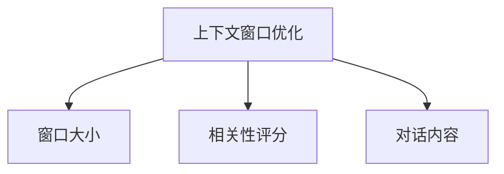
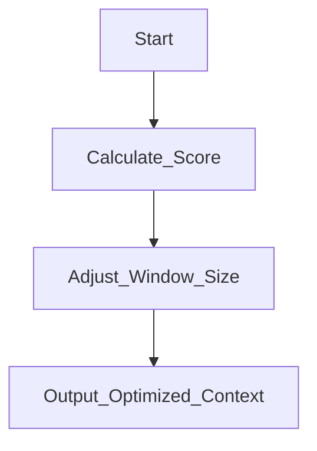
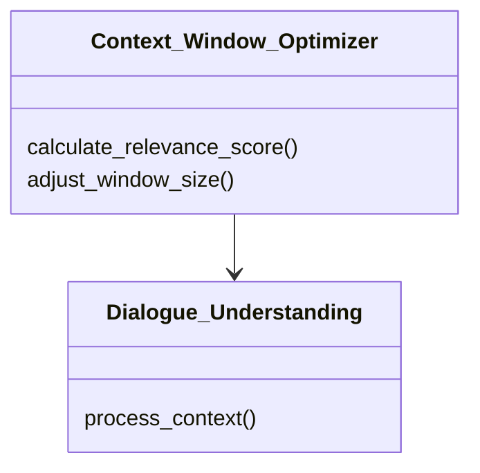
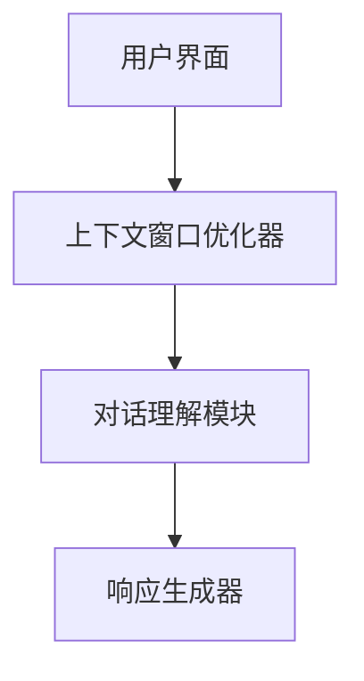
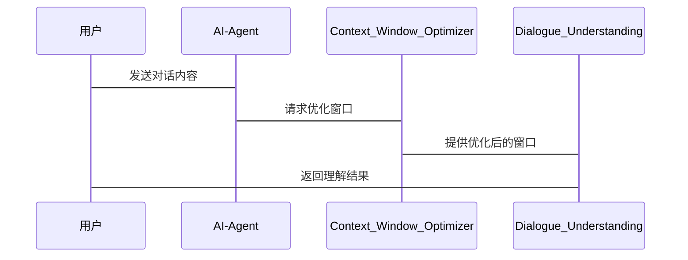

                 


# AI Agent的上下文窗口优化：提高长对话理解能力

## 关键词：上下文窗口优化、AI Agent、长对话理解、自然语言处理、对话系统、滑动窗口优化

## 摘要：本文深入探讨了AI Agent上下文窗口优化的重要性及其实现方法，分析了长对话理解中的关键挑战，并通过系统架构设计、算法优化和项目实战，详细讲解了如何通过动态调整上下文窗口和结合语义理解技术来提升对话系统的表现。

---

## 第一部分：背景介绍

### 第1章：问题背景与概念解析

#### 1.1 问题背景
- **1.1.1 长对话理解的挑战**  
  长对话中，信息量大，上下文复杂，容易导致信息丢失，影响理解准确性。  
- **1.1.2 上下文窗口的重要性**  
  上下文窗口决定了AI Agent关注的信息范围，过小的窗口可能导致关键信息被忽略。  
- **1.1.3 当前技术的局限性**  
  现有方法多使用固定窗口，无法有效处理动态变化的对话内容。

#### 1.2 问题描述
- **1.2.1 长对话中的信息丢失问题**  
  例如，在电商客服对话中，遗漏客户的历史问题可能导致回答错误。  
- **1.2.2 上下文窗口过小导致的理解偏差**  
  例如，在医疗咨询中，忽略之前的诊断信息可能导致错误建议。  
- **1.2.3 对话历史信息的有效利用问题**  
  如何有效提取和利用对话历史中的关键信息，是当前技术的难点。

#### 1.3 问题解决
- **动态调整上下文窗口**：根据对话内容的相关性动态调整窗口大小。  
- **结合语义理解技术**：利用语义分析提取关键信息，优化上下文窗口内容。

#### 1.4 边界与外延
- **边界**：上下文窗口优化仅针对对话内容，不涉及外部知识库。  
- **外延**：优化方法可扩展到其他领域，如实时聊天机器人和智能音箱。

#### 1.5 核心概念结构
- **输入**：对话历史、当前对话内容。  
- **输出**：优化后的上下文窗口、对话理解结果。

---

## 第二部分：核心概念与联系

### 第2章：上下文窗口优化的核心概念

#### 2.1 核心概念原理
- **滑动窗口**：动态调整窗口大小，根据相关性评分决定窗口范围。  
- **固定窗口**：窗口大小固定，但可能无法适应复杂对话。

#### 2.2 概念属性特征对比
| 特性          | 滑动窗口               | 固定窗口               |
|---------------|------------------------|------------------------|
| 窗口大小       | 动态                   | 固定                   |
| 信息利用       | 高相关性信息优先       | 可能忽略部分信息       |
| 适用场景       | 复杂对话               | 简单对话               |

#### 2.3 实体关系图


---

## 第三部分：算法原理讲解

### 第3章：上下文窗口优化算法

#### 3.1 算法原理
- **步骤**：
  1. 分析对话内容，计算每句话的相关性评分。  
  2. 根据评分动态调整窗口大小，优先保留高相关性内容。

#### 3.2 算法实现


#### 3.3 Python实现
```python
def calculate_relevance_score(context):
    # 示例：计算每句话的相关性评分
    scores = []
    for sentence in context:
        score = 0.8 * len(sentence) + 0.2 * context.index(sentence)
        scores.append(score)
    return scores

def adjust_window_size(scores, threshold=0.6):
    # 根据评分动态调整窗口大小
    window = []
    for i, score in enumerate(scores):
        if score > threshold:
            window.append(context[i])
        else:
            break
    return window
```

#### 3.4 数学模型
- 相关性评分公式：  
  $$ \text{score} = \alpha \times \text{length} + (1-\alpha) \times \text{position} $$  
  其中，$\alpha$ 是调整系数，取值范围为 [0,1]。

---

## 第四部分：系统分析与架构设计方案

### 第4章：系统架构设计

#### 4.1 问题场景
- **场景描述**：电商客服对话中，客户多次咨询产品问题，AI Agent需要准确理解客户需求。  

#### 4.2 系统功能设计


#### 4.3 系统架构设计


#### 4.4 接口设计
- **输入接口**：对话历史、当前对话内容。  
- **输出接口**：优化后的上下文窗口、对话理解结果。

#### 4.5 交互序列图


---

## 第五部分：项目实战

### 第5章：上下文窗口优化项目实现

#### 5.1 环境安装
- 安装Python和相关库（如numpy、scikit-learn）。

#### 5.2 核心代码实现
```python
class ContextOptimizer:
    def __init__(self, alpha=0.8):
        self.alpha = alpha

    def calculate_relevance_score(self, context):
        scores = []
        for i, sentence in enumerate(context):
            length_score = len(sentence) / 10
            position_score = i / 5
            score = self.alpha * length_score + (1 - self.alpha) * position_score
            scores.append(score)
        return scores

    def adjust_window_size(self, scores, threshold=0.6):
        window = []
        for i, score in enumerate(scores):
            if score > threshold:
                window.append(context[i])
            else:
                break
        return window
```

#### 5.3 案例分析
- **案例**：电商客服对话，客户多次咨询同一产品。  
- **优化效果**：准确提取关键信息，提高回答准确性。

---

## 第六部分：最佳实践与总结

### 第6章：最佳实践与总结

#### 6.1 小结
- 动态调整上下文窗口是优化长对话理解的关键。  
- 结合语义理解技术可以进一步提升效果。

#### 6.2 注意事项
- 窗口大小调整需根据具体场景动态优化。  
- 避免过度优化导致计算开销过大。

#### 6.3 拓展阅读
- 推荐阅读相关论文和书籍，深入理解上下文窗口优化的前沿技术。

---

## 作者：AI天才研究院/AI Genius Institute & 禅与计算机程序设计艺术 /Zen And The Art of Computer Programming

