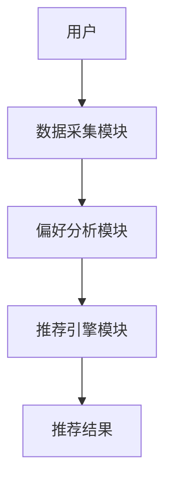

                 


# AI Agent的个性化定制：用户偏好学习与应用

> 关键词：AI Agent, 个性化定制, 用户偏好, 推荐系统, 机器学习, 算法实现

> 摘要：本文将深入探讨AI Agent在用户偏好学习与个性化定制中的应用，结合实际案例和算法实现，全面解析如何通过用户偏好分析提升AI Agent的智能化水平。

---

# 第一部分：引言

## 第1章：AI Agent的基本概念与背景

### 1.1 AI Agent的定义与特点

- **1.1.1 AI Agent的定义**
  AI Agent（人工智能代理）是指能够感知环境、自主决策并执行任务的智能实体。它通过数据输入、信息处理和输出结果为用户提供服务。

- **1.1.2 AI Agent的核心特点**
  - **自主性**：无需外部干预，自主完成任务。
  - **反应性**：能够实时感知环境变化并做出响应。
  - **目标导向**：根据目标优化决策和行动。
  - **学习能力**：通过数据和反馈不断优化自身行为。

- **1.1.3 AI Agent与传统软件的区别**
  AI Agent具备学习和自适应能力，能够根据用户行为和环境变化调整输出，而传统软件仅根据预设规则运行。

### 1.2 用户偏好学习的背景与意义

- **1.2.1 用户偏好的定义**
  用户偏好是指用户在使用产品或服务时表现出的特定倾向、喜好或行为模式。

- **1.2.2 个性化定制的重要性**
  个性化定制能够提高用户体验，增强用户满意度和忠诚度，同时帮助企业提高效率和收益。

- **1.2.3 用户偏好学习的应用场景**
  - **推荐系统**：根据用户偏好推荐商品、内容或服务。
  - **智能助手**：根据用户习惯优化服务流程。
  - **教育领域**：根据学生偏好提供个性化学习方案。

---

# 第二部分：AI Agent的用户偏好学习基础

## 第2章：用户偏好数据的采集与处理

### 2.1 数据采集方法

- **行为数据采集**
  - 记录用户的点击、浏览、购买等行为数据。
  - 示例：用户在电商平台上的浏览记录和购买历史。

- **用户反馈采集**
  - 通过问卷、评分等方式获取用户对产品或服务的主观评价。
  - 示例：用户对电影的评分和评论。

- **上下文数据采集**
  - 收集用户的基本信息（如年龄、性别）和环境数据（如时间、地点）。
  - 示例：用户在不同时间段的购物偏好。

### 2.2 数据预处理技术

- **数据清洗**
  - 去除无效数据（如重复记录、空值）。
  - 示例：删除用户无效的点击记录。

- **数据归一化**
  - 将数据标准化，便于后续分析。
  - 示例：将评分从1-5分归一化为0-1范围。

- **特征提取**
  - 从原始数据中提取有意义的特征。
  - 示例：从用户购买历史中提取高频商品类别。

## 第3章：用户偏好分析的数学模型

### 3.1 向量空间模型

- **向量空间模型的定义**
  将用户偏好表示为向量，每个维度对应一个特征，向量的长度表示特征的重要性。

- **偏好向量的构建**
  - 示例：用户A的偏好向量为[0.7, 0.3, 0.5]，分别表示对电影、音乐、书籍的偏好程度。

- **偏好相似度计算公式**
  - 使用余弦相似度计算用户之间的偏好相似度：
    $$ \text{相似度} = \frac{\vec{u} \cdot \vec{v}}{\|\vec{u}\| \|\vec{v}\|} $$

---

# 第三部分：AI Agent的个性化推荐算法

## 第4章：基于用户偏好的推荐算法

### 4.1 协同过滤算法

- **协同过滤的基本原理**
  根据用户之间的相似性推荐相关内容或产品。

- **基于物品的协同过滤**
  - 示例：如果用户A喜欢电影《A》，而用户B也喜欢《A》，则推荐用户B喜欢的其他电影给用户A。

- **基于用户的协同过滤**
  - 示例：根据用户之间的相似性，推荐用户B喜欢的电影给用户A。

### 4.2 基于内容的推荐算法

- **内容推荐的基本原理**
  根据物品的内容特征进行推荐。

- **文本相似度计算**
  - 示例：根据电影的剧情描述计算相似度，推荐相似的电影。

### 4.3 混合推荐算法

- **混合推荐的优势**
  结合协同过滤和内容推荐的优点，提高推荐的准确性和多样性。

- **实现步骤**
  - 示例：先根据用户行为推荐相似用户喜欢的内容，再根据内容特征推荐相关物品。

## 第5章：基于强化学习的推荐系统

### 5.1 强化学习的基本原理

- **强化学习的核心要素**
  - 状态（State）
  - 行动（Action）
  - 奖励（Reward）
  - 策略（Policy）

### 5.2 偏好强化的策略

- **策略网络的构建**
  - 使用深度神经网络（DNN）学习用户的偏好。
  - 示例：通过DNN预测用户对推荐内容的偏好程度。

### 5.3 实例分析

- **案例分析**
  - 示例：通过强化学习优化推荐算法，提升用户满意度。

---

# 第四部分：AI Agent的系统架构设计

## 第6章：AI Agent的系统架构

### 6.1 系统功能模块设计

- **数据采集模块**
  - 负责收集用户的行为数据、反馈数据和上下文数据。

- **偏好分析模块**
  - 对用户数据进行处理和分析，构建用户偏好模型。

- **推荐引擎模块**
  - 根据用户偏好生成个性化推荐结果。

### 6.2 系统架构图



### 6.3 接口设计与交互流程

- **接口设计**
  - API接口用于数据输入和推荐结果输出。

- **交互流程**
  - 示例：用户输入查询，系统返回个性化推荐结果。

---

# 第五部分：项目实战与总结

## 第7章：AI Agent的项目实战

### 7.1 环境安装与配置

- **工具安装**
  - 安装Python、TensorFlow、Keras等开发工具。

- **数据集准备**
  - 示例：使用公开的电影推荐数据集（如MovieLens数据集）。

### 7.2 核心代码实现

- **偏好向量构建代码**
  ```python
  def build_preference_vector(user_data):
      # 输入：user_data 是用户行为数据
      # 输出：偏好向量
      vector = [0.0] * num_features
      for feature, weight in user_data.items():
          vector[feature] = weight
      return vector
  ```

- **协同过滤算法实现**
  ```python
  def collaborative_filtering(user_matrix):
      # 输入：user_matrix 是用户-物品矩阵
      # 输出：推荐结果
      pass
  ```

### 7.3 案例分析与总结

- **案例分析**
  - 示例：通过实际项目展示如何优化推荐算法。

- **总结**
  - 强调用户偏好学习在AI Agent中的重要性。

---

# 第六部分：总结与展望

## 第8章：总结与最佳实践

### 8.1 最佳实践

- **数据质量**
  - 确保数据的准确性和完整性。

- **算法优化**
  - 不断优化推荐算法，提升推荐准确率。

### 8.2 小结

- 本文详细探讨了AI Agent的个性化定制方法，结合用户偏好学习和推荐算法实现，为实际应用提供了理论基础和实践指导。

---

# 作者：AI天才研究院/AI Genius Institute & 禅与计算机程序设计艺术 /Zen And The Art of Computer Programming

