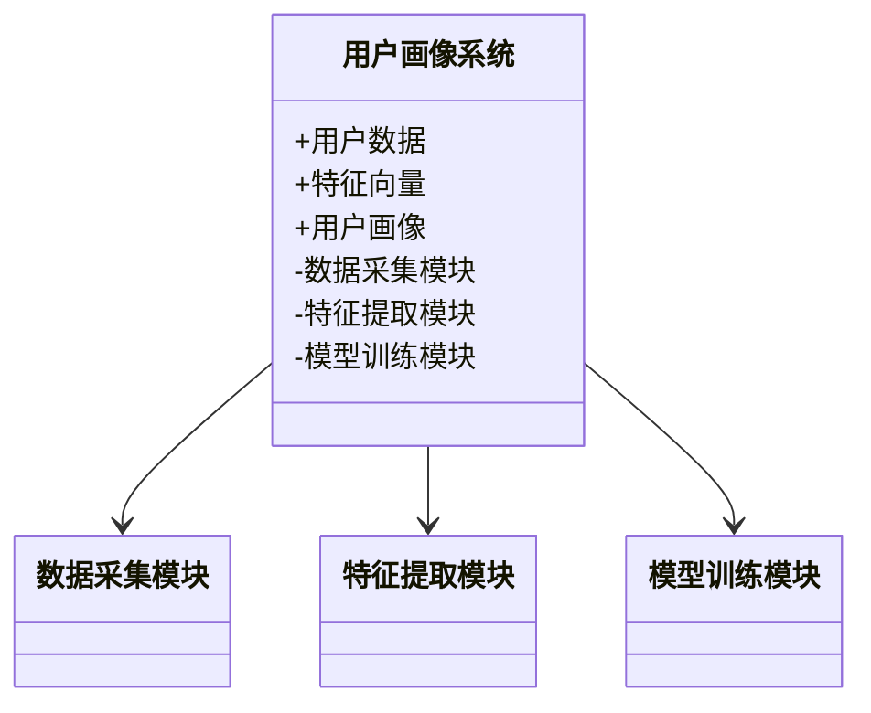
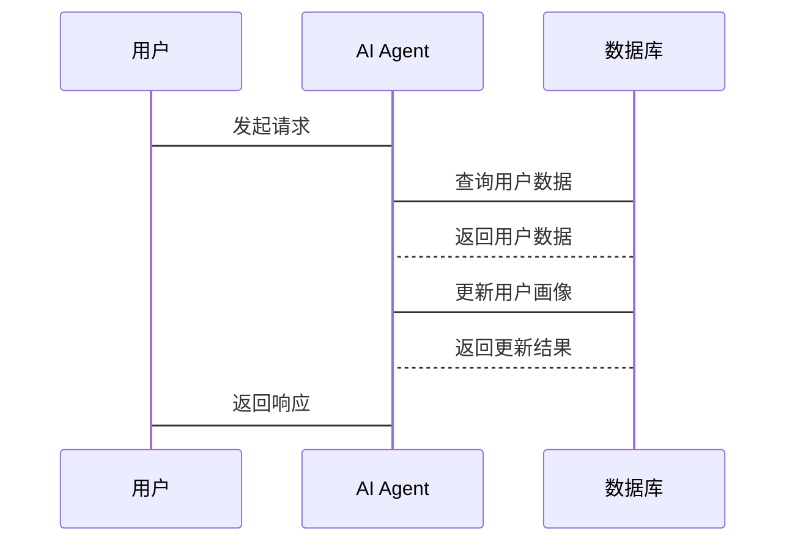

                 


# AI Agent的个性化：基于LLM的用户画像构建

---

## 关键词：
AI Agent，个性化，用户画像，LLM，大语言模型，机器学习，自然语言处理

---

## 摘要：
本文深入探讨了AI Agent个性化构建的核心问题，特别是基于大语言模型（LLM）的用户画像构建方法。文章从AI Agent的基本概念出发，详细分析了用户画像构建的背景、核心概念、算法原理、系统架构及实际应用。通过结合LLM的强大能力，本文提出了一种基于深度学习的用户画像构建方法，并通过实际项目案例展示了如何将理论应用于实践。文章最后总结了当前研究的成果与未来的发展方向。

---

# 第1章: AI Agent与个性化概述

## 1.1 AI Agent的基本概念
### 1.1.1 AI Agent的定义
AI Agent（人工智能代理）是指能够感知环境、自主决策并执行任务的智能实体。它能够通过与用户交互或环境反馈，动态调整其行为以满足用户需求。

### 1.1.2 AI Agent的核心特征
- **自主性**：能够在没有外部干预的情况下独立运行。
- **反应性**：能够实时感知环境变化并做出响应。
- **目标导向**：基于明确的目标或任务进行决策和行动。
- **学习能力**：通过数据和经验不断优化自身的性能。

### 1.1.3 个性化在AI Agent中的重要性
个性化是AI Agent实现高效人机交互的关键。通过个性化，AI Agent能够更好地理解用户需求，提供更精准的服务，从而提升用户体验。

## 1.2 LLM在AI Agent中的应用
### 1.2.1 LLM的基本概念
大语言模型（LLM，Large Language Model）是一种基于深度学习的自然语言处理模型，能够理解和生成人类语言。其核心是Transformer架构，通过自注意力机制捕捉文本中的长距离依赖关系。

### 1.2.2 LLM在用户画像中的作用
- **文本生成**：帮助AI Agent生成自然流畅的回复。
- **上下文理解**：通过上下文理解用户意图。
- **个性化适应**：基于用户数据调整模型输出，实现个性化服务。

### 1.2.3 LLM与AI Agent的结合
通过将LLM嵌入AI Agent中，可以显著提升其自然语言处理能力，使其能够更智能地与用户交互。

## 1.3 用户画像构建的背景与意义
### 1.3.1 用户画像的定义
用户画像是对用户行为、偏好、特征的综合描述，旨在帮助系统更好地理解用户需求。

### 1.3.2 用户画像在AI Agent中的应用
- **需求识别**：通过分析用户历史行为，识别用户潜在需求。
- **行为预测**：预测用户的下一步行为，优化服务流程。
- **偏好匹配**：基于用户画像推荐个性化内容。

### 1.3.3 用户画像构建的挑战
- **数据隐私**：如何在保护用户隐私的前提下构建画像。
- **数据稀疏性**：如何处理小样本数据。
- **动态变化**：用户需求和行为的动态变化对画像的实时性要求。

## 1.4 本章小结
本章介绍了AI Agent的基本概念及其个性化的重要性，重点阐述了LLM在AI Agent中的应用，以及用户画像是如何帮助AI Agent实现个性化服务的。

---

# 第2章: 用户画像构建的核心概念

## 2.1 用户画像的构建过程
### 2.1.1 数据收集与处理
- **数据来源**：用户交互日志、用户属性、行为轨迹等。
- **数据清洗**：去除噪声数据，确保数据质量。

### 2.1.2 特征提取与选择
- **特征提取方法**：基于统计的方法（如TF-IDF）或深度学习方法（如Word2Vec）。
- **特征选择策略**：基于特征重要性评估选择关键特征。

### 2.1.3 用户画像的表示方法
- **向量表示**：将用户特征转化为高维向量。
- **图结构表示**：基于图的表示方法，如知识图谱。

## 2.2 LLM在用户画像中的角色
### 2.2.1 LLM的文本生成能力
- **文本生成**：用于生成用户可能感兴趣的文本内容。
- **对话理解**：通过对话历史理解用户意图。

### 2.2.2 LLM的上下文理解能力
- **上下文感知**：通过上下文理解用户的情感和意图。
- **多轮对话**：通过多轮对话逐步深入用户需求。

### 2.2.3 LLM的个性化适应能力
- **微调模型**：基于特定用户数据微调LLM，使其更适应个性化需求。
- **增量学习**：逐步更新模型参数，使其更适应用户行为变化。

## 2.3 用户画像与AI Agent的关联
### 2.3.1 用户需求的识别
- **需求识别方法**：基于用户画像分析用户需求。
- **需求优先级排序**：根据需求的重要性排序。

### 2.3.2 用户行为的预测
- **行为预测模型**：基于用户历史行为预测未来行为。
- **行为预测精度提升**：通过特征工程和模型优化提升预测精度。

### 2.3.3 用户偏好的匹配
- **偏好匹配算法**：基于用户偏好推荐相关内容。
- **偏好更新机制**：根据用户反馈动态更新偏好。

## 2.4 本章小结
本章详细阐述了用户画像的构建过程及其在AI Agent中的应用，重点分析了LLM在用户画像构建中的独特优势。

---

# 第3章: 基于LLM的用户画像构建算法

## 3.1 LLM的基本原理
### 3.1.1 Transformer模型的结构
- **编码器**：将输入序列编码为高维向量。
- **解码器**：根据编码器输出生成目标序列。

### 3.1.2 注意力机制的实现
- **自注意力机制**：计算序列中每个词与其他词的相关性。
- **多头注意力**：通过多头机制捕捉不同层次的特征。

### 3.1.3 梯度下降与优化算法
- **Adam优化器**：结合动量和自适应学习率的优化算法。

## 3.2 用户画像构建的算法流程
### 3.2.1 数据预处理
- **数据清洗**：去除噪声数据。
- **特征提取**：将文本数据转化为向量表示。

### 3.2.2 模型训练
- **模型选择**：选择适合的模型结构。
- **参数调优**：通过实验调整模型参数。

### 3.2.3 用户画像生成
- **画像生成**：基于训练好的模型生成用户画像。

## 3.3 基于LLM的用户画像优化算法
### 3.3.1 微调LLM模型
- **微调方法**：基于特定任务数据对模型进行微调。
- **微调效果**：提升模型在特定任务上的性能。

### 3.3.2 增量学习方法
- **增量学习**：逐步更新模型参数。
- **增量学习的优势**：适用于数据流场景。

### 3.3.3 迁移学习策略
- **迁移学习**：将预训练模型迁移到新任务。
- **迁移学习的挑战**：目标域与源域的差异性。

## 3.4 本章小结
本章详细介绍了基于LLM的用户画像构建算法，重点分析了模型训练和优化策略。

---

# 第4章: 系统架构与设计方案

## 4.1 系统整体架构
### 4.1.1 系统模块划分
- **数据采集模块**：负责采集用户数据。
- **特征提取模块**：将用户数据转化为特征向量。
- **模型训练模块**：训练用户画像构建模型。
- **用户画像生成模块**：基于训练好的模型生成用户画像。

### 4.1.2 模块之间的关系
- **数据流**：数据采集模块 → 特征提取模块 → 模型训练模块 → 用户画像生成模块。
- **交互流程**：用户与AI Agent交互，生成用户数据，触发用户画像生成。

### 4.1.3 系统的可扩展性设计
- **模块化设计**：各模块相对独立，便于扩展。
- **接口标准化**：模块之间通过标准化接口通信。

## 4.2 系统功能设计
### 4.2.1 领域模型设计


### 4.2.2 系统架构设计
```mermaid
client
    server
        database
```

### 4.2.3 系统接口设计
- **API接口**：RESTful API，支持HTTP请求。
- **接口文档**：详细描述接口功能、输入输出参数。

### 4.2.4 系统交互设计


## 4.3 本章小结
本章详细设计了基于LLM的用户画像构建系统的架构，包括模块划分、功能设计和系统交互流程。

---

# 第5章: 项目实战与案例分析

## 5.1 项目背景与目标
### 5.1.1 项目背景
- **项目名称**：基于LLM的个性化AI Agent开发。
- **项目目标**：构建一个能够基于用户数据生成个性化用户画像的AI Agent。

### 5.1.2 项目需求
- **功能需求**：支持用户数据采集、特征提取、模型训练和用户画像生成。
- **性能需求**：确保系统高效运行，支持高并发请求。

## 5.2 项目环境配置
### 5.2.1 开发环境
- **操作系统**：Linux/Windows/MacOS。
- **编程语言**：Python 3.8+。
- **框架与库**：TensorFlow/PyTorch，Hugging Face的Transformers库。

### 5.2.2 依赖安装
```bash
pip install torch transformers
```

## 5.3 项目核心实现
### 5.3.1 数据预处理
```python
import torch
from transformers import AutoTokenizer, AutoModel

class UserProfile:
    def __init__(self, data):
        self.data = data
        self.features = self.extract_features()

    def extract_features(self):
        # 示例：提取用户的基本特征
        return {
            'age': self.data['age'],
            'gender': self.data['gender'],
            'interests': self.data['interests']
        }
```

### 5.3.2 模型训练
```python
def train_model(train_loader, model, criterion, optimizer, num_epochs):
    for epoch in range(num_epochs):
        for inputs, labels in train_loader:
            outputs = model(inputs)
            loss = criterion(outputs, labels)
            loss.backward()
            optimizer.step()
            optimizer.zero_grad()
```

### 5.3.3 用户画像生成
```python
def generate_user_profile(model, user_data):
    features = extract_features(user_data)
    with torch.no_grad():
        outputs = model(torch.tensor(features))
    return outputs
```

## 5.4 项目小结
本章通过一个实际项目展示了基于LLM的用户画像构建过程，从数据预处理到模型训练再到用户画像生成，详细阐述了实现细节。

---

# 第6章: 总结与展望

## 6.1 本章总结
本文详细探讨了基于LLM的用户画像构建方法，从AI Agent的基本概念到系统架构设计，再到项目实战，全面分析了实现个性化AI Agent的核心问题。

## 6.2 未来研究方向
- **模型优化**：进一步优化LLM模型，提升用户画像的准确性。
- **实时性提升**：研究更高效的算法，提升系统实时性。
- **隐私保护**：探索更有效的隐私保护方法，确保用户数据安全。

## 6.3 最佳实践Tips
- **数据质量**：确保数据质量和完整性。
- **模型选择**：根据具体任务选择合适的模型。
- **持续优化**：定期更新模型，适应用户需求变化。

---

# 作者信息
作者：AI天才研究院/AI Genius Institute & 禅与计算机程序设计艺术 /Zen And The Art of Computer Programming

---

以上是《AI Agent的个性化：基于LLM的用户画像构建》的技术博客文章的完整大纲和部分内容。通过以上结构，文章从理论到实践，系统地介绍了基于LLM的用户画像构建方法，为AI Agent的个性化服务提供了理论支持和实践指导。

