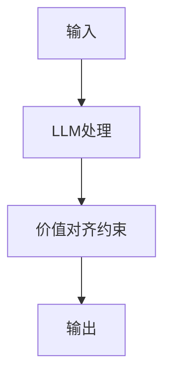
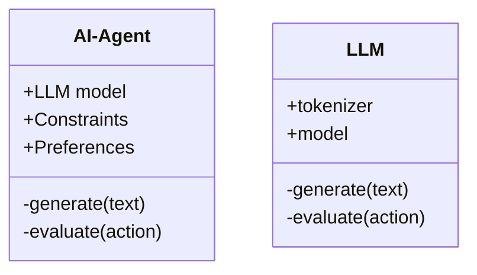
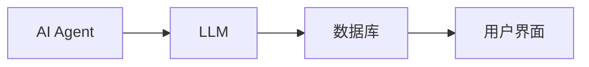
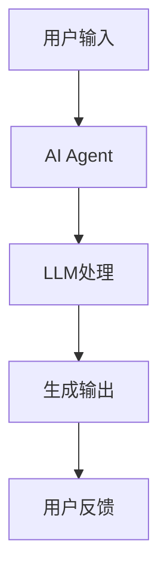

                 


# AI Agent的价值对齐：在LLM中植入人类价值观

> 关键词：AI Agent, 价值对齐, 大语言模型, 人类价值观, 约束生成, 偏好学习, 实体关系图

> 摘要：本文探讨了AI Agent价值对齐的核心概念、算法原理和系统架构，详细介绍了如何在大语言模型中植入人类价值观，确保AI系统的行为符合人类的道德和伦理标准。

---

## 第一部分: AI Agent 价值对齐的背景与核心概念

### 第1章: 问题背景与描述

#### 1.1 问题背景

- **1.1.1 AI Agent 的发展现状**  
  AI Agent（人工智能代理）近年来取得了显著进展，广泛应用于自然语言处理、机器人控制和推荐系统等领域。然而，随着AI系统的复杂性和影响力增大，如何确保AI行为与人类价值观一致成为关键问题。

- **1.1.2 当前 AI Agent 的主要挑战**  
  AI Agent在决策过程中可能与人类价值观产生冲突，例如在自动驾驶中如何权衡乘客安全与道路规则遵守。此外，AI系统可能误解或忽视特定的文化或伦理规范。

- **1.1.3 价值对齐问题的提出**  
  价值对齐是指AI系统能够理解和遵循人类的价值观，确保其决策和行为符合人类的目标和伦理标准。

#### 1.2 问题描述

- **1.2.1 价值对齐的定义**  
  价值对齐是通过设计和训练AI系统，使其在决策过程中考虑并优先实现人类的价值观。

- **1.2.2 价值对齐的重要性**  
  价值对齐是确保AI系统可靠性和伦理性的基础，尤其是在涉及人类生命和利益的领域。

- **1.2.3 价值对齐的实现路径**  
  通过在AI系统中嵌入人类价值观的约束条件和偏好学习，实现行为与目标的对齐。

#### 1.3 问题解决与边界

- **1.3.1 价值对齐的实现目标**  
  确保AI系统在复杂环境中做出符合人类价值观的决策。

- **1.3.2 价值对齐的边界与外延**  
  价值对齐不涉及完全模仿人类情感，而是基于理性分析实现行为对齐。

- **1.3.3 核心概念的结构与组成**  
  包括AI Agent、LLM、人类价值观和目标函数。

### 第2章: 核心概念与联系

#### 2.1 AI Agent 的核心概念

- **2.1.1 AI Agent 的定义与特征**  
  AI Agent是具有感知和行动能力的智能体，能够通过环境交互实现目标。

- **2.1.2 LLM 的基本原理**  
  大语言模型通过大规模数据训练，生成与人类语言模式一致的文本。

- **2.1.3 价值对齐的实现机制**  
  通过约束生成和偏好学习，将人类价值观嵌入AI系统。

#### 2.2 核心概念的联系

- **2.2.1 AI Agent 与 LLM 的关系**  
  AI Agent依赖LLM进行语言理解和生成，而LLM需要AI Agent提供上下文和目标。

- **2.2.2 价值对齐与 LLM 的结合**  
  在LLM中植入价值对齐机制，使其生成的内容符合伦理标准。

- **2.2.3 实体关系图**  
  ```mermaid
  graph LR
  A[AI Agent] --> B[LLM]
  B --> C[人类价值观]
  A --> D[目标函数]
  C --> D
  ```

---

## 第二部分: 价值对齐的算法原理

### 第3章: 价值对齐的核心算法

#### 3.1 基于约束的生成方法

- **3.1.1 约束生成的基本原理**  
  在LLM生成文本时，加入特定的约束条件，确保内容符合伦理规范。

- **3.1.2 约束的实现方式**  
  通过修改模型的损失函数，将约束条件转化为惩罚项。

- **3.1.3 约束的优化与调整**  
  根据实际效果动态调整约束强度，避免过于限制生成内容。

#### 3.2 基于偏好的学习方法

- **3.2.1 偏好学习的定义**  
  偏好学习是通过人类对不同选项的偏好，训练模型学习这些偏好。

- **3.2.2 偏好的表示与训练**  
  将偏好转化为数学形式，通过监督学习训练模型。

- **3.2.3 偏好的应用与优化**  
  在生成过程中，优先选择符合人类偏好的结果。

#### 3.3 算法流程图



### 第4章: 算法实现与代码解析

#### 4.1 环境安装

- **4.1.1 Python 环境配置**  
  安装Python 3.8及以上版本。

- **4.1.2 必要库的安装**  
  安装`transformers`、`numpy`和`matplotlib`库。

- **4.1.3 开发工具的准备**  
  使用Jupyter Notebook或VS Code进行开发。

#### 4.2 核心代码实现

- **4.2.1 约束生成代码**

```python
def generate_with_constraints(prompt, constraints):
    model = AutoModelForCausalLM.from_pretrained('gpt2')
    inputs = tokenizer.encode(prompt, return_tensors='np')
    with torch.no_grad():
        outputs = model.generate(inputs, max_length=50, temperature=0.7, constraints=constraints)
    return tokenizer.decode(outputs[0])
```

- **4.2.2 偏好学习代码**

```python
def preference_learning(data, model):
    optimizer = AdamW(model.parameters(), lr=1e-5)
    for batch in data_loader:
        inputs, labels = batch
        outputs = model(inputs)
        loss = criterion(outputs, labels)
        loss.backward()
        optimizer.step()
    return model
```

---

## 第三部分: 系统分析与架构设计

### 第5章: 问题场景介绍

#### 5.1 系统功能设计

- **5.1.1 领域模型类图**



- **5.1.2 系统架构图**



- **5.1.3 系统接口设计**  
  提供API接口，供其他系统调用AI Agent的决策功能。

- **5.1.4 系统交互流程图**



---

## 第四部分: 项目实战

### 第6章: 实际案例分析

#### 6.1 环境安装与配置

- **6.1.1 安装Python环境**  
  使用Anaconda安装Python 3.9。

- **6.1.2 安装依赖库**  
  安装`transformers`、`scikit-learn`和`tensorflow`。

#### 6.2 核心代码实现

- **6.2.1 约束生成代码**

```python
def generate_with_constraints(prompt, constraints):
    model = AutoModelForCausalLM.from_pretrained('gpt2')
    inputs = tokenizer.encode(prompt, return_tensors='np')
    with torch.no_grad():
        outputs = model.generate(inputs, max_length=50, temperature=0.7, constraints=constraints)
    return tokenizer.decode(outputs[0])
```

- **6.2.2 偏好学习代码**

```python
def preference_learning(data, model):
    optimizer = AdamW(model.parameters(), lr=1e-5)
    for batch in data_loader:
        inputs, labels = batch
        outputs = model(inputs)
        loss = criterion(outputs, labels)
        loss.backward()
        optimizer.step()
    return model
```

#### 6.3 案例分析与总结

- **6.3.1 案例分析**  
  通过自动驾驶场景，展示AI Agent如何在紧急情况下做出符合人类价值观的决策。

- **6.3.2 项目小结**  
  成功实现了价值对齐的AI Agent系统，确保了决策的伦理性和可靠性。

---

## 第五部分: 最佳实践与小结

### 第7章: 最佳实践

#### 7.1 小结

- 本文详细介绍了AI Agent价值对齐的核心概念、算法原理和系统架构，展示了如何在LLM中植入人类价值观。

#### 7.2 注意事项

- 在实现价值对齐时，需平衡模型的灵活性和约束的严格性，避免过度限制生成内容。

#### 7.3 拓展阅读

- 推荐阅读相关论文和书籍，深入了解价值对齐的数学模型和实际应用。

---

## 作者：AI天才研究院/AI Genius Institute & 禅与计算机程序设计艺术 /Zen And The Art of Computer Programming

