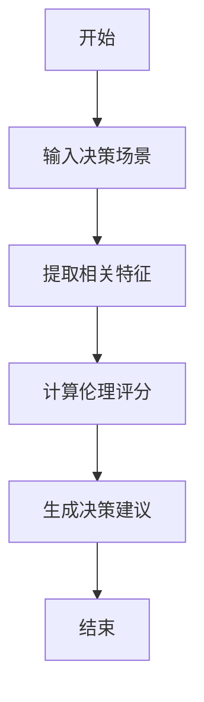
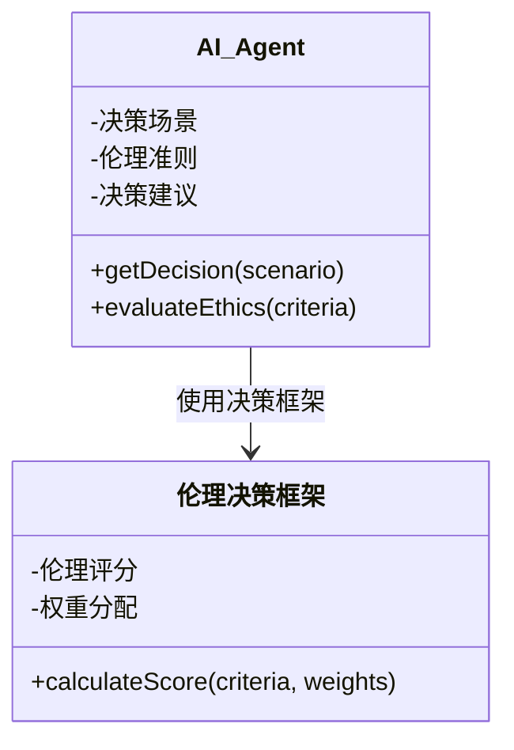
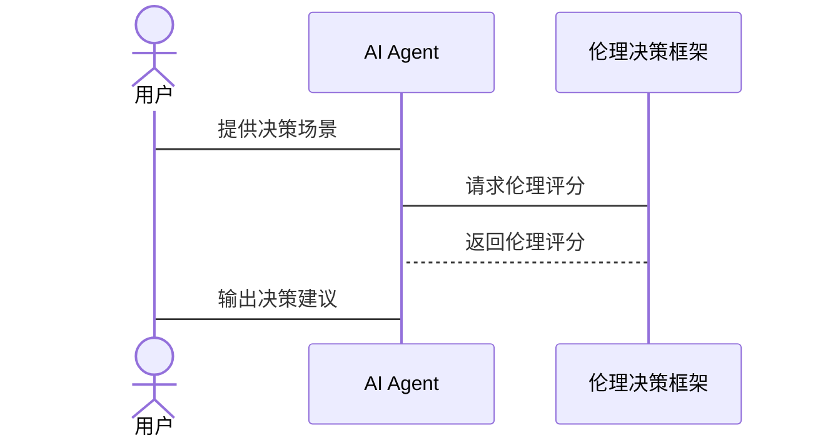

                 


# AI Agent的伦理决策框架：在智能中植入道德考量

> 关键词：AI Agent，伦理决策，道德考量，智能系统，决策框架

> 摘要：本文探讨了在AI Agent中植入伦理决策框架的重要性，分析了伦理决策的核心概念、算法原理和系统架构，并通过实际案例展示了如何在智能系统中实现道德考量。

---

## 第1章: AI Agent与伦理决策的基本概念

### 1.1 AI Agent的基本概念

#### 1.1.1 人工智能代理的定义
人工智能代理（AI Agent）是指能够感知环境、自主决策并执行任务的智能实体。它通过传感器获取信息，利用算法处理信息，并通过执行器与环境交互。

#### 1.1.2 AI Agent的核心特征
- **自主性**：能够在没有外部干预的情况下独立运作。
- **反应性**：能够实时感知环境并做出响应。
- **目标导向**：基于设定的目标进行决策和行动。
- **学习能力**：通过经验改进性能和决策能力。

#### 1.1.3 伦理决策在AI Agent中的重要性
随着AI Agent在医疗、自动驾驶、金融等领域的广泛应用，其决策可能对人类生命、财产和社会秩序产生重大影响。因此，确保AI Agent的决策符合伦理规范至关重要。

---

### 1.2 伦理决策的基本原理

#### 1.2.1 伦理决策的定义
伦理决策是指在考虑道德规范和价值观的基础上，做出合理的选择和行动。在AI Agent中，伦理决策框架确保其行为符合社会 accepted的道德标准。

#### 1.2.2 伦理决策的关键要素
- **道德准则**：如诚实、公正、不伤害他人等。
- **决策情境**：包括环境、任务目标和相关利益方。
- **伦理评分机制**：用于评估不同决策的伦理合规性。

#### 1.2.3 伦理决策与AI Agent的结合
AI Agent通过伦理决策框架将道德考量整合到决策过程中，确保其行为符合伦理规范。例如，在自动驾驶中，AI Agent需要在紧急情况下做出最小化伤害的决策。

---

### 1.3 当前AI Agent伦理决策的挑战

#### 1.3.1 技术层面的挑战
- **复杂性**：不同情境下伦理决策的标准可能不同，难以统一建模。
- **动态性**：环境和任务目标可能动态变化，要求决策框架具备灵活性。

#### 1.3.2 社会层面的挑战
- **文化差异**：不同文化背景下，伦理标准可能有所不同。
- **公众接受度**：用户可能对AI Agent的自主决策持怀疑态度，影响其广泛应用。

#### 1.3.3 法律层面的挑战
- **法律空白**：当前法律体系尚未完全涵盖AI Agent的伦理决策问题。
- **责任归属**：在决策错误时，责任归属尚不明确。

---

## 第2章: 伦理决策框架的背景与问题背景

### 2.1 伦理决策框架的发展历程

#### 2.1.1 伦理决策框架的起源
伦理决策框架的概念可以追溯到伦理学和决策理论的研究。随着AI技术的发展，伦理决策框架逐渐从理论走向实际应用。

#### 2.1.2 伦理决策框架的演进
从最初的简单规则基于系统到复杂的多目标优化模型，伦理决策框架经历了多个阶段的发展，逐步融入更多的伦理考量。

#### 2.1.3 当前伦理决策框架的研究现状
当前，研究主要集中在如何将伦理准则量化，并将其融入AI Agent的决策过程中。然而，如何平衡效率和伦理合规性仍是一个难题。

---

### 2.2 问题背景分析

#### 2.2.1 AI Agent决策中的伦理问题
- **隐私问题**：AI Agent在处理数据时可能涉及个人隐私。
- **公平性问题**：决策可能对某些群体产生不公平影响。
- **透明性问题**：用户难以理解AI Agent的决策过程。

#### 2.2.2 伦理决策框架的必要性
AI Agent的广泛应用要求其决策过程必须符合伦理规范，以避免潜在的负面社会影响。

#### 2.2.3 伦理决策框架的应用场景
- **医疗领域**：AI Agent需要在诊断和治疗方案中做出符合伦理的决策。
- **自动驾驶**：在紧急情况下，AI Agent需要做出最小化伤害的决策。

---

## 第3章: 伦理决策框架的核心概念与联系

### 3.1 核心概念原理

#### 3.1.1 伦理决策框架的构成要素
- **伦理准则**：定义AI Agent必须遵守的道德规范。
- **决策模型**：用于根据伦理准则生成决策。
- **评估机制**：对决策的伦理合规性进行评估和反馈。

#### 3.1.2 伦理决策模型的数学表达
伦理决策模型可以通过数学公式表示，例如：

$$ \text{伦理评分} = \sum_{i=1}^{n} w_i \cdot c_i $$

其中，$w_i$ 是准则 $c_i$ 的权重，$c_i$ 是准则的满足程度。

#### 3.1.3 伦理评分机制的实现方式
伦理评分机制通过量化各伦理准则的满足程度，生成决策的伦理评分。评分越高，决策越符合伦理规范。

---

### 3.2 核心概念对比分析

#### 3.2.1 不同伦理决策框架的对比
| 框架名称       | 基于规则 | 基于效用 | 基于案例 |
|----------------|----------|----------|----------|
| 优点           | 明确性高 | 灵活性好 | 可解释性高 |
| 缺点           | 稳定性差 | 计算复杂 | 可扩展性差 |

#### 3.2.2 各种伦理模型的优缺点
- **规则模型**：优点是简单易懂，缺点是缺乏灵活性。
- **效用模型**：优点是灵活，缺点是计算复杂。
- **案例模型**：优点是可解释性高，缺点是难以扩展。

#### 3.2.3 案例分析与对比
以自动驾驶为例，规则模型可能无法应对所有复杂情境，而效用模型可以通过权衡不同因素生成更优的决策。

---

## 第4章: 伦理决策框架的算法原理

### 4.1 伦理评分模型的数学模型

#### 4.1.1 伦理评分函数的定义
伦理评分函数将各伦理准则的满足程度量化为一个评分。例如：

$$ \text{伦理评分} = \sum_{i=1}^{n} w_i \cdot c_i $$

其中，$w_i$ 是准则 $c_i$ 的权重，$c_i$ 是准则的满足程度。

#### 4.1.2 伦理评分的计算公式
伦理评分的计算需要考虑各准则的权重和满足程度。例如：

$$ \text{伦理评分} = 0.4 \cdot c_1 + 0.3 \cdot c_2 + 0.3 \cdot c_3 $$

#### 4.1.3 伦理评分的权重分配
权重分配需要根据具体应用场景和伦理准则的重要性进行调整。例如，在医疗领域，隐私保护的权重可能高于效率。

---

### 4.2 算法实现步骤

#### 4.2.1 数据预处理
- **特征提取**：从输入数据中提取与伦理决策相关的特征。
- **特征标准化**：将特征归一化，以便模型处理。

#### 4.2.2 模型训练
- **训练数据准备**：收集和标注训练数据。
- **模型参数优化**：通过反向传播等方法优化模型参数。

#### 4.2.3 模型推理
- **输入处理**：将输入数据转换为模型可处理的形式。
- **决策生成**：基于模型生成决策并输出。

---

### 4.3 伦理决策算法的流程图



---

## 第5章: 系统分析与架构设计方案

### 5.1 问题场景介绍

#### 5.1.1 伦理决策框架的应用场景
伦理决策框架可以应用于医疗、教育、金融等多个领域。例如，在医疗领域，AI Agent需要在诊断和治疗方案中做出符合伦理的决策。

#### 5.1.2 系统需求分析
- **功能性需求**：AI Agent需要根据伦理准则生成决策。
- **性能需求**：决策过程需要高效且准确。
- **接口需求**：系统需要与其他模块（如传感器、执行器）交互。

#### 5.1.3 边界与外延
- **边界**：AI Agent的决策范围和权限。
- **外延**：决策框架的适用场景和限制。

---

### 5.2 系统功能设计

#### 5.2.1 领域模型类图


---

### 5.3 系统架构设计

#### 5.3.1 系统架构图


---

### 5.4 系统接口设计

#### 5.4.1 系统交互图


---

## 第6章: 项目实战

### 6.1 环境安装

#### 6.1.1 安装Python
- 下载并安装Python 3.8及以上版本。
- 安装必要的库，例如numpy和scikit-learn。

#### 6.1.2 安装依赖项
- 使用pip安装所需的依赖项：

  ```bash
  pip install numpy scikit-learn
  ```

---

### 6.2 系统核心实现

#### 6.2.1 伦理评分模型实现

```python
import numpy as np

def calculate_ethics_score(criteria, weights):
    return np.dot(weights, criteria)

# 示例权重和准则
weights = np.array([0.4, 0.3, 0.3])
criteria = np.array([0.8, 0.6, 0.7])
score = calculate_ethics_score(criteria, weights)
print(score)
```

---

### 6.2.2 项目小结

通过实际案例的分析和实现，我们可以看到伦理决策框架在AI Agent中的应用潜力。然而，如何在实际项目中平衡伦理合规性和技术实现的复杂性仍是一个挑战。

---

## 第7章: 最佳实践与扩展阅读

### 7.1 小结

伦理决策框架为AI Agent的决策过程提供了道德考量的依据，确保其行为符合社会伦理规范。然而，实现一个完善的伦理决策框架需要综合考虑技术、社会和法律等多个方面的因素。

---

### 7.2 注意事项

- **透明性**：确保AI Agent的决策过程可解释，以便用户理解和信任。
- **可调整性**：框架应具备灵活性，以适应不同场景和伦理准则的变化。
- **责任归属**：明确AI Agent和开发者的责任，以便在决策错误时能够追责。

---

### 7.3 拓展阅读

- **推荐书籍**：
  - 《伦理与人工智能》
  - 《机器学习与伦理决策》
- **推荐阅读文章**：
  - "伦理决策在自动驾驶中的应用"
  - "AI Agent的伦理挑战与解决方案"

---

## 作者：AI天才研究院/AI Genius Institute & 禅与计算机程序设计艺术 /Zen And The Art of Computer Programming

---

**摘要**：本文系统地探讨了AI Agent的伦理决策框架，从基本概念到算法实现，再到实际应用，全面分析了如何在智能系统中植入道德考量。通过丰富的案例和详细的代码实现，读者可以深入了解伦理决策的实现过程，并将其应用于实际项目中。

