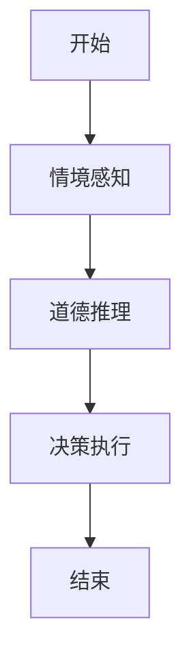
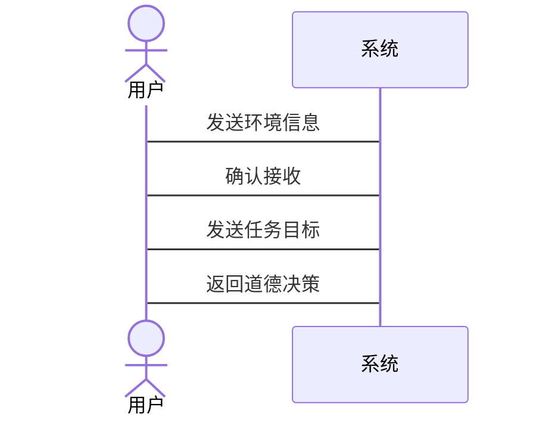

                 


# AI Agent的伦理决策：在LLM中实现道德推理

> 关键词：AI Agent，伦理决策，道德推理，LLM，人工智能，伦理算法

> 摘要：本文深入探讨了AI Agent在LLM中的伦理决策问题，分析了道德推理的核心概念、算法实现以及系统架构，通过具体案例展示了如何在实际项目中实现伦理决策，并总结了最佳实践和未来研究方向。

---

## 第1章: AI Agent与伦理决策概述

### 1.1 AI Agent的基本概念

#### 1.1.1 AI Agent的定义与特点
AI Agent（人工智能代理）是指能够感知环境、自主决策并执行任务的智能实体。其特点包括自主性、反应性、目标导向性和社会性。

#### 1.1.2 AI Agent的分类与应用场景
AI Agent可以分为简单反射型、基于模型的反应型、目标驱动型和实用驱动型。应用场景包括智能助手、自动驾驶、机器人服务等。

#### 1.1.3 伦理决策在AI Agent中的重要性
AI Agent在做出决策时需要考虑伦理因素，例如自动驾驶在紧急情况下的生命优先级选择，这直接影响用户体验和社会接受度。

### 1.2 伦理决策的核心问题

#### 1.2.1 伦理决策的定义与内涵
伦理决策是指在考虑道德准则和价值观的基础上，做出合理的选择。其内涵包括道德判断、利益平衡和责任承担。

#### 1.2.2 伦理决策中的主要挑战
挑战包括动态环境中的不确定性、多利益相关者的冲突、决策的可解释性等。

#### 1.2.3 LLM在伦理决策中的作用
LLM（大语言模型）通过自然语言处理能力，能够帮助AI Agent理解复杂的伦理情境，并生成符合道德规范的决策。

### 1.3 本章小结
本章介绍了AI Agent的基本概念和伦理决策的核心问题，强调了LLM在伦理推理中的重要性。

---

## 第2章: 道德推理的理论框架

### 2.1 道德哲学基础

#### 2.1.1 义务论与效果论
义务论强调行为的义务性，例如康德的道德律令；效果论注重结果的优化，例如功利主义。

#### 2.1.2 美德论与元伦理学
美德论关注个体的品德，元伦理学研究道德判断的结构和意义。

#### 2.1.3 不同道德理论的优缺点对比
| 理论 | 优点 | 缺点 |
|------|------|------|
| 义务论 | 强调行为的规范性 | 忽视结果的重要性 |
| 效果论 | 优化结果 | 可能导致功利主义的极端 |
| 美德论 | 注重个人品德 | 难以量化 |

### 2.2 道德推理的逻辑框架

#### 2.2.1 道德推理的基本步骤
1. 明确情境和目标
2. 分析相关利益和义务
3. 推导可能的决策
4. 评估决策的道德后果
5. 选择最优方案

#### 2.2.2 道德推理的逻辑模型
道德推理模型可以表示为：
$$
\text{道德决策} = f(\text{情境}, \text{目标}, \text{利益}, \text{义务})
$$

#### 2.2.3 道德推理的复杂性与不确定性
道德推理涉及主观判断和多利益相关者，具有高度的复杂性和不确定性。

### 2.3 伦理决策的数学模型

#### 2.3.1 道德评分的数学表达式
$$
\text{道德评分} = \sum_{i=1}^{n} w_i \cdot m_i
$$
其中，\(w_i\)是权重，\(m_i\)是道德因素的评分。

#### 2.3.2 道德决策的优化目标
$$
\max_{\text{决策}} \text{道德评分}
$$

### 2.4 本章小结
本章分析了道德推理的理论基础，提出了道德评分的数学模型，并讨论了道德推理的复杂性。

---

## 第3章: LLM与伦理推理的关系

### 3.1 LLM的基本原理

#### 3.1.1 LLM的定义与特点
LLM是基于深度学习的自然语言处理模型，具有强大的语言理解和生成能力。

#### 3.1.2 LLM的训练过程与挑战
训练过程包括数据预处理、模型训练和参数优化。挑战包括数据偏见和计算资源消耗。

#### 3.1.3 LLM在伦理推理中的优势
LLM能够理解和生成人类语言，适合处理复杂的伦理情境。

### 3.2 伦理推理在LLM中的实现

#### 3.2.1 伦理推理的模块化设计
将伦理推理模块嵌入LLM，使其能够进行道德判断和决策。

#### 3.2.2 伦理推理的算法实现
使用强化学习方法，优化模型的道德评分。

#### 3.2.3 伦理推理的评估指标
包括准确率、公平性和可解释性。

### 3.3 本章小结
本章探讨了LLM与伦理推理的关系，分析了伦理推理在LLM中的实现方法。

---

## 第4章: 伦理决策的算法与实现

### 4.1 道德推理的算法框架

#### 4.1.1 基于规则的伦理推理
通过预定义的规则进行决策，例如交通规则。

#### 4.1.2 基于案例的伦理推理
通过案例库进行类比推理，例如医疗伦理中的案例分析。

#### 4.1.3 基于模型的伦理推理
使用数学模型进行推理，例如道德评分模型。

### 4.2 道德评分的计算方法

#### 4.2.1 基于概率的道德评分
$$
P(\text{道德行为}) = \prod_{i=1}^{n} P(\text{特征}_i)
$$

#### 4.2.2 基于权重的道德评分
$$
\text{道德评分} = \sum_{i=1}^{n} w_i \cdot s_i
$$
其中，\(w_i\)是权重，\(s_i\)是评分。

#### 4.2.3 基于层次分析的道德评分
通过层次分析法（AHP）确定权重，计算综合评分。

### 4.3 道德决策的优化算法

#### 4.3.1 基于梯度的优化方法
使用梯度下降优化道德评分函数。

#### 4.3.2 基于强化学习的优化方法
通过强化学习训练道德决策策略。

#### 4.3.3 基于遗传算法的优化方法
使用遗传算法搜索最优道德决策。

### 4.4 本章小结
本章分析了伦理决策的算法框架，提出了基于概率、权重和层次分析的道德评分方法。

---

## 第5章: 伦理决策的系统架构与实现

### 5.1 系统功能设计

#### 5.1.1 系统输入与输出
输入：环境信息、任务目标；输出：道德决策。

#### 5.1.2 系统功能模块划分
- 情境感知模块
- 道德推理模块
- 决策执行模块

#### 5.1.3 系统功能流程图


### 5.2 系统架构设计

#### 5.2.1 分层架构设计
- 数据层：数据采集和存储
- 逻辑层：道德推理和决策
- 应用层：用户交互和结果展示

#### 5.2.2 微服务架构设计
- 服务1：情境感知
- 服务2：道德推理
- 服务3：决策执行

#### 5.2.3 高可用性设计
使用负载均衡和冗余设计，确保系统稳定运行。

### 5.3 系统接口设计

#### 5.3.1 输入接口设计
- 接口1：环境信息输入
- 接口2：任务目标输入

#### 5.3.2 输出接口设计
- 接口1：道德决策输出
- 接口2：结果反馈输出

#### 5.3.3 系统交互流程图


### 5.4 本章小结
本章设计了伦理决策系统的架构，包括功能模块划分、系统架构和接口设计。

---

## 第6章: 项目实战

### 6.1 环境安装

#### 6.1.1 安装Python
```bash
python --version
pip install --upgrade pip
```

#### 6.1.2 安装LLM框架
```bash
pip install transformers
```

### 6.2 系统核心实现

#### 6.2.1 道德推理模块实现
```python
def道德推理(情境, 目标):
    # 实现道德推理算法
    return 决策
```

#### 6.2.2 决策执行模块实现
```python
def决策执行(决策):
    # 执行决策
    return 结果
```

### 6.3 案例分析

#### 6.3.1 案例1：自动驾驶的伦理决策
在紧急情况下，自动驾驶需要在保护乘客和行人之间做出选择。

#### 6.3.2 案例2：智能助手的隐私问题
智能助手在处理用户隐私信息时需要考虑道德因素。

### 6.4 项目小结
通过具体案例分析，展示了伦理决策在实际项目中的应用。

---

## 第7章: 最佳实践与未来展望

### 7.1 关键点总结

#### 7.1.1 系统设计
- 道德推理模块需要高度可靠
- 系统架构需要灵活扩展

#### 7.1.2 项目实施
- 确保数据的多样性和代表性
- 定期更新和优化道德推理模型

### 7.2 小结
本章总结了伦理决策系统的关键点和最佳实践。

### 7.3 注意事项

#### 7.3.1 数据偏见
避免训练数据中的偏见，确保伦理决策的公平性。

#### 7.3.2 可解释性
确保决策过程的可解释性，方便用户理解和信任。

#### 7.3.3 法律合规
遵守相关法律法规，确保伦理决策的合法性。

### 7.4 拓展阅读

#### 7.4.1 推荐书籍
- 《机器学习实战》
- 《伦理学原理》

#### 7.4.2 推荐论文
- "伦理决策的数学模型与算法优化"
- "基于LLM的道德推理研究"

---

## 作者：AI天才研究院 & 禅与计算机程序设计艺术

---

本文通过系统地分析AI Agent的伦理决策问题，探讨了LLM在道德推理中的应用，为实际项目提供了理论和实践指导。

