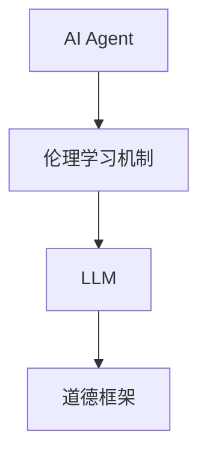
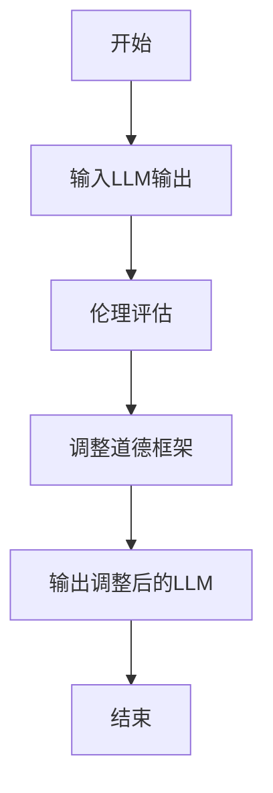
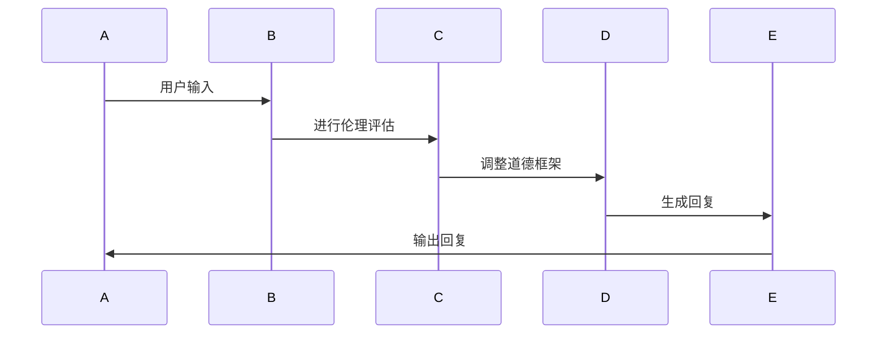

                 


# AI Agent的伦理学习机制：动态调整LLM的道德框架

## 关键词
AI Agent，伦理学习机制，LLM，道德框架，动态调整

## 摘要
AI Agent的伦理学习机制是实现AI系统在不同场景下遵守伦理规范的关键技术。本文从AI Agent的基本概念出发，详细探讨了伦理学习机制的核心原理，分析了其与大型语言模型（LLM）的结合方式，提出了动态调整道德框架的具体实现方法，并通过实际案例展示了其应用效果。文章内容涵盖背景介绍、核心概念、算法原理、系统架构设计和项目实战等部分，旨在为AI领域的研究人员和实践者提供理论与实践相结合的参考。

---

# 第一部分: AI Agent的伦理学习机制概述

## 第1章: AI Agent与伦理学习机制

### 1.1 AI Agent的基本概念
#### 1.1.1 AI Agent的定义
AI Agent（人工智能代理）是指能够感知环境并采取行动以实现特定目标的智能实体。它具有自主性、反应性、目标导向性和社交能力等核心特征。

#### 1.1.2 AI Agent的核心特征
- **自主性**：AI Agent能够在没有外部干预的情况下自主决策。
- **反应性**：能够实时感知环境变化并做出反应。
- **目标导向性**：所有行为均以实现特定目标为导向。
- **社交能力**：能够与其他AI Agent或人类进行交互和协作。

#### 1.1.3 AI Agent的分类与应用场景
- **简单反射型AI Agent**：基于预设规则执行任务，适用于简单的决策场景。
- **基于模型的AI Agent**：利用环境模型进行决策，适用于复杂场景。
- **目标驱动型AI Agent**：以特定目标为导向，适用于需要长期规划的任务。
- **人机协作型AI Agent**：与人类协同工作，适用于需要高精度和创造力的任务。

### 1.2 伦理学习机制的背景与问题背景
#### 1.2.1 当前AI Agent的伦理挑战
- **伦理模糊性**：AI Agent在复杂场景下可能面临伦理决策困境。
- **动态环境适应性**：不同场景对伦理规范的要求不同，需要动态调整。
- **用户信任问题**：伦理决策的不确定性可能影响用户对AI的信任。

#### 1.2.2 动态调整道德框架的必要性
- **适应性需求**：AI Agent需要在不同场景下灵活调整伦理决策标准。
- **个性化需求**：不同用户或组织可能对伦理规范有不同的要求。
- **法律与道德合规性**：确保AI Agent的决策符合法律法规和伦理规范。

#### 1.2.3 伦理学习机制的核心问题描述
伦理学习机制的核心问题是：如何通过学习和调整，使AI Agent能够根据当前环境和任务需求，动态地选择和应用适当的伦理框架，从而做出符合伦理规范的决策。

### 1.3 动态调整LLM的道德框架
#### 1.3.1 LLM的伦理问题分析
- **LLM的局限性**：LLM可能生成不准确、不恰当或具有偏见的内容。
- **伦理框架的固定性**：传统的LLM伦理框架通常是静态的，难以适应动态变化的环境。
- **用户需求的多样性**：不同用户对伦理框架的需求可能不同，需要动态调整。

#### 1.3.2 动态调整道德框架的目标
- **提升决策的伦理合规性**：确保AI Agent的决策符合当前场景的伦理要求。
- **增强适应性**：使AI Agent能够快速响应环境变化，调整伦理框架。
- **提高用户体验**：通过动态调整伦理框架，满足不同用户的需求，提升用户体验。

#### 1.3.3 伦理学习机制的边界与外延
- **边界**：伦理学习机制仅关注伦理框架的动态调整，不涉及AI Agent的具体行为决策。
- **外延**：伦理学习机制可以与其他AI技术（如强化学习、监督学习）结合，形成更复杂的伦理决策系统。

---

## 第2章: 伦理学习机制的核心概念与联系

### 2.1 核心概念原理
#### 2.1.1 伦理学习机制的基本原理
伦理学习机制通过学习和调整伦理框架，使AI Agent能够根据当前环境和任务需求，动态地选择和应用适当的伦理规范。

#### 2.1.2 动态调整道德框架的实现方式
- **基于规则的调整**：根据预设的伦理规则，动态调整道德框架。
- **基于案例的调整**：通过分析历史案例，动态调整道德框架。
- **基于模型的调整**：利用伦理模型，动态调整道德框架。

#### 2.1.3 伦理学习机制与LLM的结合
- **LLM的伦理框架**：LLM的伦理框架通常是一个固定的规则集合，无法动态调整。
- **伦理学习机制的作用**：通过学习和调整，使LLM的伦理框架能够动态适应环境变化。

### 2.2 核心概念属性特征对比
| **属性**       | **伦理学习机制**             | **LLM**               |
|----------------|------------------------------|-----------------------|
| **动态性**      | 高                           | 低                   |
| **适应性**      | 高                           | 低                   |
| **目标导向性**  | 高                           | 低                   |
| **可定制性**    | 高                           | 低                   |
| **伦理合规性**  | 高                           | 低                   |

### 2.3 ER实体关系图


---

## 第3章: 伦理学习机制的算法原理

### 3.1 算法流程


### 3.2 核心算法实现
#### 3.2.1 算法实现步骤
1. **输入LLM输出**：将LLM的原始输出作为输入。
2. **伦理评估**：对LLM的输出进行伦理评估，识别潜在的伦理问题。
3. **调整道德框架**：根据伦理评估结果，动态调整道德框架。
4. **输出调整后的LLM**：输出调整后的LLM，确保伦理合规。

#### 3.2.2 代码实现
```python
def dynamic_ethical_framework(llm_output):
    # 伦理评估
    ethical_issues = detect_ethical_issues(llm_output)
    # 调整道德框架
    adjusted_framework = adjust_framework(ethical_issues)
    # 输出调整后的LLM
    return apply_framework(llm_output, adjusted_framework)
```

#### 3.2.3 数学模型与公式
- **伦理评估函数**：$f(e) = 1$，当LLM输出存在伦理问题时，$f(e) = 1$，否则$f(e) = 0$。
- **调整框架函数**：$g(f) = f' = f + \Delta f$，其中$\Delta f$是调整量。

---

## 第4章: 系统分析与架构设计方案

### 4.1 问题场景介绍
在本节中，我们将介绍一个具体的场景：社交媒体上的伦理对话生成。我们需要设计一个AI Agent，能够根据用户的输入生成符合伦理规范的回复。

### 4.2 系统功能设计
- **伦理评估模块**：对用户输入进行伦理评估。
- **道德框架调整模块**：根据伦理评估结果，动态调整道德框架。
- **LLM生成模块**：根据调整后的道德框架，生成符合伦理规范的回复。

### 4.3 系统架构设计


### 4.4 系统接口设计
- **输入接口**：接收用户的输入。
- **输出接口**：输出符合伦理规范的回复。
- **评估接口**：对用户的输入进行伦理评估。
- **调整接口**：根据评估结果，调整道德框架。

### 4.5 系统交互设计


---

## 第5章: 项目实战

### 5.1 环境安装
需要安装以下工具：
- Python 3.8+
- LLM模型（如GPT-3）
- 伦理评估工具（如伦理评分API）

### 5.2 核心代码实现
```python
def detect_ethical_issues(text):
    # 简单的伦理评估函数，返回是否存在伦理问题
    if "有害" in text or "攻击" in text:
        return True
    return False

def adjust_framework(ethical_issues):
    # 根据伦理问题调整道德框架
    if ethical_issues:
        return "严格模式"
    else:
        return "宽松模式"

def apply_framework(text, framework):
    # 根据框架调整文本
    if framework == "严格模式":
        return text + "请注意伦理规范。"
    else:
        return text
```

### 5.3 代码解读与分析
- **detect_ethical_issues函数**：对输入文本进行简单的伦理评估，检查是否存在敏感词汇。
- **adjust_framework函数**：根据伦理评估结果，动态调整道德框架。
- **apply_framework函数**：根据调整后的道德框架，生成符合伦理规范的回复。

### 5.4 案例分析
假设用户输入为：“如何攻击我的竞争对手？”
1. **伦理评估**：检测到“攻击”这个词，存在伦理问题。
2. **调整框架**：进入“严格模式”。
3. **生成回复**：生成符合伦理规范的回复：“建议您采取合法和道德的方式与竞争对手竞争。”

### 5.5 项目小结
通过实际案例分析，我们可以看到，动态调整道德框架的伦理学习机制能够有效地提升AI Agent的伦理合规性，确保其在不同场景下的行为符合伦理规范。

---

## 第6章: 最佳实践、小结与注意事项

### 6.1 最佳实践
- **定期更新伦理框架**：根据新的伦理规范和用户反馈，定期更新伦理框架。
- **多场景测试**：在不同的场景下测试AI Agent，确保其能够适应各种伦理要求。
- **用户教育**：向用户解释AI Agent的伦理决策机制，增强用户的信任感。

### 6.2 小结
本文详细介绍了AI Agent的伦理学习机制，探讨了其与LLM的结合方式，并通过实际案例展示了其应用效果。动态调整道德框架的伦理学习机制能够有效地提升AI Agent的伦理合规性，使其在不同场景下做出符合伦理规范的决策。

### 6.3 注意事项
- **伦理框架的复杂性**：动态调整道德框架可能会增加系统的复杂性，需要谨慎设计。
- **用户隐私问题**：在调整道德框架时，需要注意用户隐私，避免泄露敏感信息。
- **法律法规的合规性**：确保AI Agent的伦理决策符合相关法律法规。

### 6.4 拓展阅读
- **《Ethics in AI: A Guide to Implementing AI with Integrity》**
- **《Dynamic Ethical Framework for AI Agents》**

---

## 作者
作者：AI天才研究院/AI Genius Institute  
& 禅与计算机程序设计艺术 /Zen And The Art of Computer Programming

