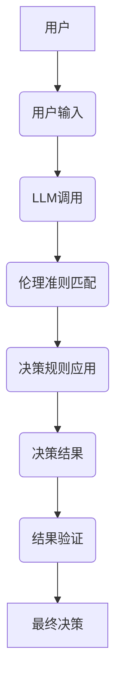
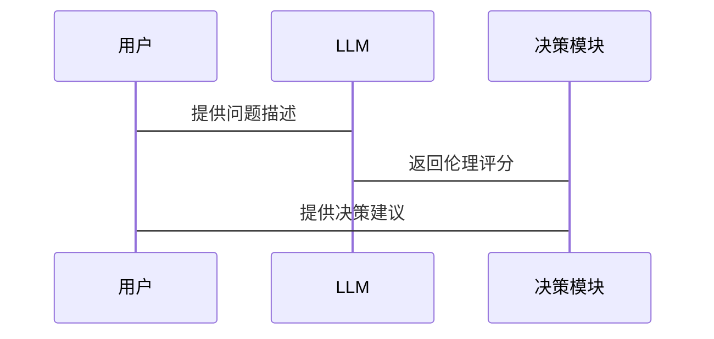

                 


# AI Agent的伦理学习：在LLM中植入道德决策框架

> 关键词：AI Agent，伦理学习，LLM，道德决策框架，伦理决策算法，系统架构设计

> 摘要：本文探讨了在大型语言模型（LLM）中植入道德决策框架的核心原理、算法实现、系统架构设计及实际应用。通过详细分析AI Agent的伦理学习需求，结合LLM的技术特点，提出了一种基于伦理决策框架的算法设计，并通过具体案例展示了如何在实际项目中实现这一框架。本文还讨论了系统架构设计的关键要素，包括功能模型、架构图和交互流程，为读者提供了从理论到实践的全面指导。

---

# 第一部分: AI Agent的伦理学习背景与核心概念

## 第1章: AI Agent与LLM的伦理学习概述

### 1.1 AI Agent的基本概念

#### 1.1.1 AI Agent的定义与特征
AI Agent（人工智能代理）是指能够感知环境并采取行动以实现目标的智能实体。其核心特征包括自主性、反应性、主动性、社会性和学习性。AI Agent可以是软件程序、机器人或其他智能系统。

#### 1.1.2 LLM与AI Agent的关系
LLM（Large Language Model，大型语言模型）通过自然语言处理技术，能够理解并生成人类语言。AI Agent可以利用LLM的能力来实现更复杂的任务，例如对话生成、信息检索和决策支持。

#### 1.1.3 伦理学习的必要性
随着AI Agent的应用越来越广泛，其决策可能对人类社会产生重大影响。伦理学习的目的是确保AI Agent的决策符合人类社会的道德规范，避免潜在的伦理风险。

### 1.2 伦理决策框架的定义与特点

#### 1.2.1 伦理决策框架的核心要素
伦理决策框架是一个用于指导AI Agent在复杂情境中做出符合伦理的决策的系统。其核心要素包括伦理准则、决策规则、冲突解决机制和反馈优化机制。

#### 1.2.2 不同伦理决策框架的对比
常见的伦理决策框架包括基于规则的框架、基于案例的框架和基于效用的框架。本文主要关注基于LLM的伦理决策框架。

#### 1.2.3 伦理决策框架的适用范围
伦理决策框架适用于需要处理伦理问题的所有领域，包括医疗、法律、金融和教育等。

### 1.3 AI Agent伦理学习的背景与挑战

#### 1.3.1 当前AI Agent的应用现状
AI Agent已经在许多领域得到广泛应用，例如智能助手、自动驾驶和智能客服等。

#### 1.3.2 伦理问题在AI Agent中的表现
AI Agent的决策可能引发伦理问题，例如自动驾驶中的生命伦理问题、智能客服中的隐私保护问题等。

#### 1.3.3 伦理学习的技术挑战
伦理学习需要解决数据稀疏性、伦理准则的动态变化以及决策的可解释性等问题。

## 1.4 本章小结
本章介绍了AI Agent和LLM的基本概念，阐述了伦理学习的必要性，并分析了伦理决策框架的核心要素和适用范围。同时，本章还探讨了AI Agent伦理学习的背景与挑战。

---

# 第二部分: 伦理决策框架的核心原理

## 第2章: 伦理决策框架的构建与实现

### 2.1 伦理决策框架的核心原理

#### 2.1.1 伦理决策的基本流程
伦理决策的基本流程包括问题分析、伦理准则匹配、决策规则应用和结果验证。

#### 2.1.2 伦理准则的分类与选择
伦理准则可以分为功利主义准则、义务论准则和混合准则。选择合适的伦理准则需要考虑具体场景和决策目标。

#### 2.1.3 决策冲突的处理机制
在面对多个伦理准则冲突时，需要设计合理的优先级和权衡机制。

### 2.2 基于LLM的伦理决策框架设计

#### 2.2.1 LLM在伦理决策中的角色
LLM可以用于生成伦理相关的文本、分析伦理问题并提供决策建议。

#### 2.2.2 伦理决策框架的模块划分
伦理决策框架可以划分为输入处理模块、伦理准则匹配模块、决策规则应用模块和结果验证模块。

#### 2.2.3 框架的可扩展性与灵活性
伦理决策框架需要具有良好的可扩展性和灵活性，以适应不同场景和决策需求。

### 2.3 伦理决策框架的数学模型

#### 2.3.1 伦理决策的数学表达
伦理决策可以通过数学模型表示为一个优化问题，目标是最小化伦理风险函数。

#### 2.3.2 基于LLM的伦理评分函数
伦理评分函数可以表示为 $f(x) = \sum_{i=1}^n w_i \cdot c_i(x)$，其中 $w_i$ 是准则 $c_i$ 的权重。

#### 2.3.3 决策权重的动态调整
决策权重可以根据具体场景和反馈信息动态调整，以优化伦理决策效果。

---

# 第三部分: 伦理决策框架的算法实现

## 第3章: 基于LLM的伦理决策算法设计

### 3.1 伦理决策算法的基本流程

#### 3.1.1 输入处理与伦理准则匹配
输入处理模块将问题转化为可分析的格式，并匹配相关的伦理准则。

#### 3.1.2 决策树的构建与优化
决策树用于表示可能的决策路径，可以通过强化学习优化决策树的结构。

#### 3.1.3 决策结果的验证与反馈
决策结果需要通过验证模块进行伦理合规性检查，并根据反馈信息优化决策算法。

### 3.2 基于LLM的伦理评分算法

#### 3.2.1 伦理评分的计算方法
伦理评分可以基于LLM生成的文本内容进行计算，例如通过关键词匹配和语义分析。

#### 3.2.2 基于强化学习的评分优化
强化学习可以通过奖励机制优化伦理评分函数，以提高决策的伦理合规性。

#### 3.2.3 算法的收敛性分析
需要分析算法的收敛性，确保伦理评分函数能够在有限的迭代次数内达到稳定状态。

### 3.3 伦理决策算法的实现细节

#### 3.3.1 LLM的调用接口设计
LLM的调用接口需要支持多种输入格式，并返回符合要求的伦理评分和决策建议。

#### 3.3.2 伦理评分的动态更新
伦理评分需要根据新的输入和反馈动态更新，以适应不断变化的伦理环境。

#### 3.3.3 算法的可扩展性设计
算法需要具有良好的可扩展性，能够支持新的伦理准则和决策场景的加入。

---

# 第四部分: 系统分析与架构设计

## 第4章: 基于伦理决策框架的系统设计

### 4.1 问题场景介绍
本章以一个实际案例为例，介绍如何在电商客服系统中植入伦理决策框架。

### 4.2 系统功能设计

#### 4.2.1 领域模型设计
领域模型设计包括用户需求分析、伦理准则定义和决策规则设计。

#### 4.2.2 系统功能模块划分
系统功能模块包括用户交互模块、伦理准则匹配模块、决策规则应用模块和结果验证模块。

### 4.3 系统架构设计

#### 4.3.1 系统架构图
以下是系统架构图的Mermaid代码：



#### 4.3.2 系统接口设计
系统接口包括用户输入接口、LLM调用接口和结果输出接口。

#### 4.3.3 系统交互流程
以下是系统交互流程的Mermaid代码：



---

# 第五部分: 项目实战

## 第5章: 在电商客服中植入伦理决策框架

### 5.1 环境配置
需要安装Python、LLM库（如Hugging Face的Transformers库）和决策框架相关库。

### 5.2 核心代码实现

#### 5.2.1 伦理准则定义
```python
ethics_criteria = {
    "privacy": 0.3,
    "transparency": 0.4,
    "fairness": 0.2,
    "accountability": 0.1
}
```

#### 5.2.2 决策规则应用
```python
def apply_decision_rules(criteria_weights, input_context):
    # 实现具体的决策规则应用逻辑
    pass
```

#### 5.2.3 决策结果验证
```python
def validate_decision(decision, input_context):
    # 实现决策结果的验证逻辑
    pass
```

### 5.3 代码功能解读与分析
通过具体代码实现，详细解读伦理准则定义、决策规则应用和结果验证的实现细节。

### 5.4 案例分析与总结
通过实际案例分析，总结伦理决策框架在电商客服中的应用效果和优化方向。

---

# 第六部分: 最佳实践、小结、注意事项和拓展阅读

## 6.1 最佳实践 tips
- 在实际项目中，建议先从简单的伦理准则开始，逐步引入复杂的决策规则。
- 定期更新伦理准则和决策规则，以适应社会伦理的变化。

## 6.2 小结
本文详细介绍了在LLM中植入道德决策框架的核心原理、算法实现和系统设计。通过实际案例展示了伦理决策框架的应用效果。

## 6.3 注意事项
- 在设计伦理决策框架时，需要充分考虑不同场景下的伦理准则和决策规则。
- 确保决策过程的可解释性和透明性，避免黑箱操作。

## 6.4 拓展阅读
推荐阅读相关领域的经典文献，例如《伦理与人工智能》和《道德决策的算法设计》。

---

# 作者：AI天才研究院/AI Genius Institute & 禅与计算机程序设计艺术 /Zen And The Art of Computer Programming

