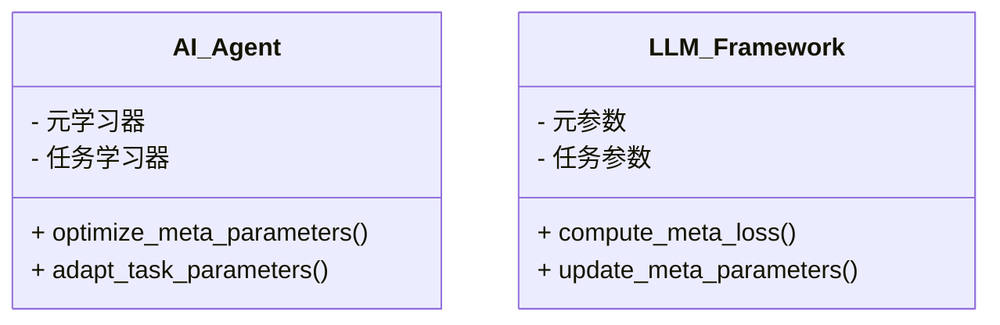
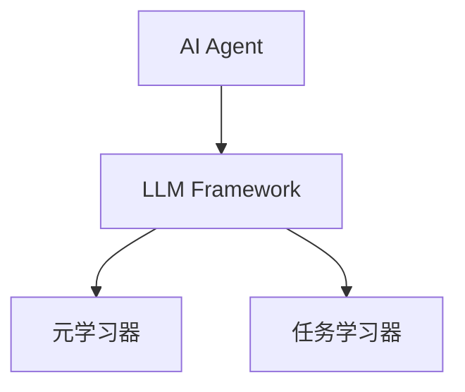
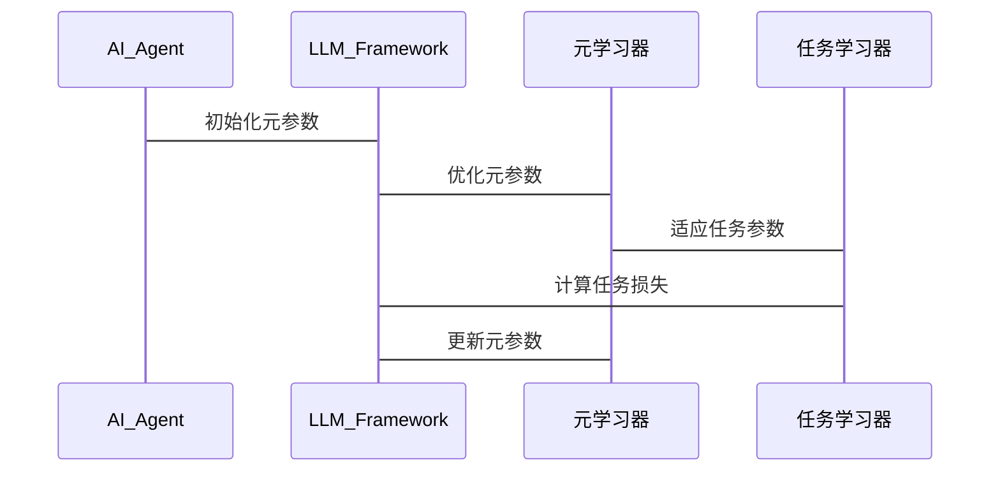

                 


# AI Agent的元学习能力：快速适应新任务的LLM框架

> 关键词：AI Agent, 元学习, LLM, 快速适应, 任务迁移

> 摘要：  
本文探讨AI Agent的元学习能力，重点分析其在大型语言模型（LLM）框架中的应用。通过理论分析、算法实现和系统设计，详细阐述元学习如何帮助AI Agent快速适应新任务，提升任务迁移能力。文章从基本概念、核心原理到实际应用，全面解析元学习在LLM中的作用，并通过具体案例展示其实际效果。

---

# 第一部分：AI Agent的元学习能力概述

## 第1章：AI Agent与元学习的基本概念

### 1.1 AI Agent的定义与特点

#### 1.1.1 AI Agent的基本定义  
AI Agent（人工智能代理）是指能够感知环境、自主决策并执行任务的智能实体。它通过传感器获取信息，利用推理能力做出决策，并通过执行器与环境交互。

#### 1.1.2 AI Agent的核心特点  
- **自主性**：能够自主决策，无需外部干预。  
- **反应性**：实时感知环境并做出反应。  
- **目标导向**：具有明确的目标，驱动行为。  
- **学习能力**：能够通过经验或数据优化自身性能。

#### 1.1.3 AI Agent与传统AI的区别  
AI Agent强调自主性和适应性，而传统AI（如专家系统）依赖于固定的规则和知识库。AI Agent能够动态调整策略，适应复杂环境的变化。

---

### 1.2 元学习的定义与特点

#### 1.2.1 元学习的基本定义  
元学习（Meta-Learning）是机器学习的高级形式，旨在使模型能够快速适应新任务，无需大量数据。它通过优化元参数，使模型在新任务上快速收敛。

#### 1.2.2 元学习的核心特点  
- **快速适应**：在新任务上只需少量数据即可完成任务。  
- **任务迁移**：利用已有知识快速掌握新任务。  
- **通用性**：适用于多种任务和领域。

#### 1.2.3 元学习与传统学习的区别  
传统学习依赖大量数据和任务特定优化，而元学习通过共享参数和优化元参数，实现快速迁移。

---

### 1.3 AI Agent元学习能力的背景与意义

#### 1.3.1 元学习在AI Agent中的作用  
元学习使AI Agent能够快速适应新任务，提升其在动态环境中的生存能力。

#### 1.3.2 元学习能力对AI Agent的重要性  
- 提高任务迁移能力。  
- 减少新任务的数据依赖。  
- 提升应对复杂环境的能力。

#### 1.3.3 元学习能力的应用场景  
- 机器人控制。  
- 自然语言处理中的任务迁移。  
- 动态环境中的决策优化。

---

## 第2章：元学习能力的理论基础

### 2.1 元学习的理论框架

#### 2.1.1 元学习的基本原理  
元学习通过优化元参数，使模型能够快速调整参数以适应新任务。

#### 2.1.2 元学习的核心模型  
- **元学习器**：负责优化元参数。  
- **任务学习器**：基于元参数执行具体任务。

#### 2.1.3 元学习的数学基础  
元学习的目标是最小化元损失，通过梯度计算优化元参数。

---

### 2.2 元学习与迁移学习的关系

#### 2.2.1 迁移学习的基本概念  
迁移学习是通过已有任务的知识，辅助新任务的学习。

#### 2.2.2 元学习与迁移学习的异同  
- **异同**：元学习是迁移学习的高级形式，更注重快速适应新任务。

#### 2.2.3 元学习在迁移学习中的优势  
- 快速适应新任务。  
- 适用于小样本数据。

---

### 2.3 元学习能力的实现机制

#### 2.3.1 元学习的参数共享机制  
通过共享参数，减少新任务的数据需求。

#### 2.3.2 元学习的梯度计算方法  
使用梯度下降优化元参数和任务参数。

#### 2.3.3 元学习的模型更新策略  
在新任务上微调模型参数。

---

# 第二部分：元学习能力的核心概念与联系

## 第3章：元学习的核心概念与原理

### 3.1 元学习的核心概念

#### 3.1.1 元学习的目标函数  
$$ \mathcal{L}_{\text{meta}} = \mathbb{E}_{t \sim \text{Task}} \mathcal{L}_{\text{task}}(f_{\theta}, t) $$

#### 3.1.2 元学习的核心要素  
- 元参数：$ \theta $  
- 任务损失：$ \mathcal{L}_{\text{task}} $  
- 元损失：$ \mathcal{L}_{\text{meta}} $

#### 3.1.3 元学习的模型结构  
- 元学习器：负责优化元参数。  
- 任务学习器：基于元参数执行任务。

---

### 3.2 元学习的原理分析

#### 3.2.1 元学习的参数共享机制  
通过共享参数，减少新任务的数据需求。

#### 3.2.2 元学习的梯度计算方法  
使用梯度下降优化元参数和任务参数。

#### 3.2.3 元学习的模型更新策略  
在新任务上微调模型参数。

---

### 3.3 元学习与其他概念的联系

#### 3.3.1 元学习与深度学习的联系  
元学习是深度学习的高级形式，依赖神经网络结构。

#### 3.3.2 元学习与强化学习的联系  
元学习通过强化学习机制优化元参数。

---

# 第三部分：元学习能力的算法实现

## 第4章：元学习算法的原理与实现

### 4.1 元学习算法的原理

#### 4.1.1 基于MAML的元学习算法  
元学习器通过优化元参数，使任务学习器在新任务上快速收敛。

#### 4.1.2 基于ReMAML的元学习算法  
ReMAML通过调整任务损失函数，优化元参数。

---

### 4.2 元学习算法的实现步骤

#### 4.2.1 算法步骤  
1. 初始化元参数。  
2. 对每个任务，优化任务参数。  
3. 优化元参数以最小化元损失。

---

### 4.3 元学习算法的数学模型

#### 4.3.1 MAML算法的数学模型  
$$ \theta_{\text{meta}} = \theta_{\text{meta}} - \eta \nabla_{\theta_{\text{meta}}} \mathcal{L}_{\text{meta}} $$

#### 4.3.2 ReMAML算法的数学模型  
$$ \theta_{\text{meta}} = \theta_{\text{meta}} - \eta \nabla_{\theta_{\text{meta}}} \mathcal{L}_{\text{meta}} $$

---

### 4.4 元学习算法的Python实现

#### 4.4.1 MAML算法的Python代码示例  
```python
def meta_train():
    for batch in meta_train_batches:
        # 优化任务参数
        task_params = task_optimize()
        # 优化元参数
        meta_optimize(task_params)
```

#### 4.4.2 ReMAML算法的Python代码示例  
```python
def meta_train():
    for batch in meta_train_batches:
        # 调整任务损失函数
        remaml_loss = compute_remaml_loss()
        # 优化元参数
        meta_optimize(remaml_loss)
```

---

# 第四部分：系统分析与架构设计

## 第5章：系统分析与架构设计

### 5.1 问题场景介绍

#### 5.1.1 问题背景  
AI Agent需要快速适应新任务，减少数据需求。

#### 5.1.2 系统目标  
设计一个基于元学习的LLM框架，使AI Agent快速适应新任务。

---

### 5.2 系统功能设计

#### 5.2.1 领域模型类图  


---

### 5.3 系统架构设计

#### 5.3.1 系统架构图  


---

### 5.4 系统接口设计

#### 5.4.1 元学习器接口  
- `get_meta_parameters()`  
- `update_meta_parameters(meta_loss)`  

#### 5.4.2 任务学习器接口  
- `adapt_task_parameters(meta_parameters)`  
- `compute_task_loss()`  

---

### 5.5 系统交互流程

#### 5.5.1 交互序列图  


---

# 第五部分：项目实战与案例分析

## 第6章：项目实战与案例分析

### 6.1 环境安装

#### 6.1.1 安装Python环境  
- 安装Python 3.8及以上版本。  
- 安装TensorFlow或PyTorch框架。

#### 6.1.2 安装依赖库  
- `pip install numpy`  
- `pip install matplotlib`  
- `pip install scikit-learn`

---

### 6.2 系统核心实现

#### 6.2.1 元学习器实现  
```python
class Meta_Learner:
    def __init__(self):
        self.theta_meta = initial_parameters()
    
    def optimize_meta_parameters(self, meta_loss):
        self.theta_meta -= eta * gradients(meta_loss)
```

#### 6.2.2 任务学习器实现  
```python
class Task_Learner:
    def __init__(self, meta_parameters):
        self.theta_task = meta_parameters
    
    def adapt_task_parameters(self, new_task):
        self.theta_task += delta * gradients(task_loss)
```

---

### 6.3 代码应用解读与分析

#### 6.3.1 元学习器代码解读  
- 初始化元参数。  
- 优化元参数以最小化元损失。

#### 6.3.2 任务学习器代码解读  
- 利用元参数初始化任务参数。  
- 微调任务参数以适应新任务。

---

### 6.4 实际案例分析

#### 6.4.1 案例背景  
假设有一个自然语言处理任务，需要快速适应新的分类任务。

#### 6.4.2 案例分析  
1. 初始化元参数。  
2. 对每个新任务，微调任务参数。  
3. 优化元参数以最小化元损失。

---

### 6.5 项目小结

#### 6.5.1 核心实现总结  
- 元学习器负责优化元参数。  
- 任务学习器负责微调任务参数。

#### 6.5.2 实践中的注意事项  
- 元学习的训练数据需要多样化。  
- 元参数的优化需要足够的时间和计算资源。

---

# 第六部分：总结与展望

## 第7章：总结与展望

### 7.1 全文总结

#### 7.1.1 元学习能力的核心价值  
- 快速适应新任务。  
- 减少数据需求。  
- 提升任务迁移能力。

#### 7.1.2 LLM框架在元学习中的作用  
- 提供强大的特征提取能力。  
- 支持快速任务适应。

---

### 7.2 当前技术的局限性

#### 7.2.1 元学习的计算成本高  
- 元学习需要大量的计算资源。  
- 对硬件要求较高。

#### 7.2.2 元学习的泛化能力有限  
- 在某些领域或任务上表现不佳。  
- 对任务的相似性要求较高。

---

### 7.3 未来研究方向

#### 7.3.1 元学习的优化算法  
- 更高效的优化方法。  
- 更低的计算成本。

#### 7.3.2 元学习的应用拓展  
- 更多领域的应用。  
- 更复杂的任务迁移。

---

# 作者：AI天才研究院/AI Genius Institute & 禅与计算机程序设计艺术 /Zen And The Art of Computer Programming

---

**这篇文章从AI Agent的基本概念到元学习的实现，再到系统的架构设计，详细解析了元学习在LLM框架中的应用。通过理论与实践的结合，帮助读者全面理解AI Agent的元学习能力。**

