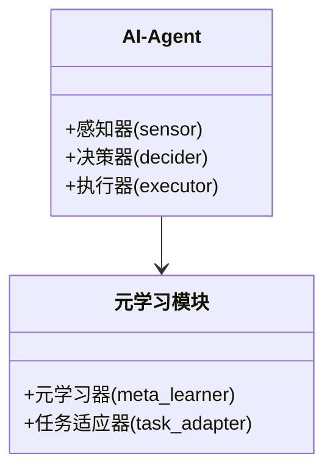

                 


# AI Agent的元学习：快速适应新任务的LLM

> 关键词：AI Agent，元学习，快速适应，大语言模型，LLM

> 摘要：本文深入探讨了AI Agent结合元学习的原理与应用，重点分析了如何通过元学习使大语言模型（LLM）快速适应新任务。文章从背景介绍、核心概念、算法原理、系统设计、项目实战到总结展望，全面阐述了这一前沿技术。

---

## 第一部分: AI Agent的元学习基础

### 第1章: AI Agent与元学习概述

#### 1.1 AI Agent的基本概念
- **定义与分类：** AI Agent，即智能体，是一种能够感知环境并采取行动以实现目标的实体。根据智能水平，AI Agent可以分为反应式和认知式。反应式AI Agent基于当前感知做出决策，而认知式AI Agent则具备推理和规划能力。

- **核心特征：** 包括自主性、反应性、目标导向、学习能力等。自主性使AI Agent能够在无需外部干预的情况下独立运作，而反应性则使其能够实时感知环境变化并调整行为。

- **与传统AI的区别：** AI Agent更注重动态环境中的自主决策，而传统AI通常是静态规则驱动。

#### 1.2 元学习的基本概念
- **定义：** 元学习是机器学习的一个分支，旨在使模型能够快速适应新任务。元学习的核心思想是“学习如何学习”，通过在多个任务上进行训练，模型能够掌握通用的学习策略。

- **核心思想：** 元学习的目标是提升模型的泛化能力，使其在面对新任务时，能够迅速调整已有知识或参数，以适应新的数据分布。

- **应用场景：** 包括零样本学习、小样本学习等。例如，在自然语言处理领域，元学习可以使模型在仅有少量样本的情况下，快速掌握新语言或新任务。

#### 1.3 AI Agent与元学习的结合
- **元学习在AI Agent中的作用：** 元学习为AI Agent提供了快速适应新任务的能力。通过元学习，AI Agent能够在新环境中更快地调整策略，以应对未知的挑战。

- **如何提升适应能力：** 元学习通过在多个相关任务上预训练，使得AI Agent具备快速迁移的能力。当面对新任务时，AI Agent能够利用元学习获得的通用知识，迅速找到最优解决方案。

- **未来发展方向：** 结合强化学习和深度学习，提升AI Agent的自主性和适应性。未来的研究可能将更多关注于如何在动态和不确定的环境中，实现更高效的元学习策略。

---

### 第2章: 元学习的核心原理

#### 2.1 元学习的原理与机制
- **数学模型：** 元学习通常涉及优化嵌套的损失函数，例如：
  $$
  \min_{\theta} \sum_{i=1}^{N} \mathcal{L}_i(f_\theta(x_i, y_i))
  $$
  其中，$f_\theta$ 是元学习器，$\mathcal{L}_i$ 是各个任务的损失函数。

- **优化算法：** 元学习常用MAML（Meta-Automated Learning）算法，通过多步梯度下降来更新参数。MAML的核心思想是在训练过程中，通过计算多个任务的梯度，然后对这些梯度进行平均或加权，以更新元学习器的参数。

#### 2.2 元学习的关键技术
- **参数共享：** 元学习通过共享参数，减少模型在不同任务间切换的开销。共享参数的机制使得模型在面对新任务时，能够快速调整共享参数，从而适应新任务的需求。

- **梯度优化：** 使用梯度下降的变体，如Adam优化器，来优化元学习的参数。通过合理的梯度优化策略，可以提升元学习器的收敛速度和最终性能。

#### 2.3 元学习的优缺点
- **优势：** 快速适应新任务，减少数据依赖。元学习通过在多个任务上预训练，能够在新任务上快速找到解决方案，从而减少对大量新数据的依赖。

- **劣势：** 计算复杂度高，需要预训练。元学习通常需要在多个任务上进行预训练，这使得其计算资源消耗较高，并且需要设计有效的预训练策略。

---

### 第3章: AI Agent的元学习框架

#### 3.1 AI Agent的架构设计
- **模块划分：** AI Agent通常包括感知器、决策器和执行器三个模块。感知器负责从环境中获取信息，决策器基于感知信息做出决策，执行器负责将决策转化为具体行动。

- **交互流程：** 感知器将环境信息传递给决策器，决策器根据当前状态和历史经验，做出最优决策，执行器将决策结果转化为具体的动作，作用于环境。

- **决策机制：** 决策机制是AI Agent的核心，通常包括基于规则的决策、基于模型的决策和基于强化学习的决策等。

#### 3.2 元学习在AI Agent中的应用框架
- **初始化阶段：** 元学习器在初始化阶段进行预训练，学习通用的知识和策略。预训练阶段通常涉及多个任务，通过这些任务的共同特征，元学习器掌握跨任务的通用模式。

- **快速适应阶段：** 当面对新任务时，元学习器利用预训练的知识，快速调整模型参数，以适应新任务的需求。这一阶段通常涉及快速的梯度更新或参数调整。

- **持续优化阶段：** 在新任务的执行过程中，元学习器持续收集反馈信息，不断优化模型参数，提升任务执行的效率和质量。

#### 3.3 元学习与AI Agent的协同工作流程
- **预训练阶段：** 元学习器在多个相关任务上进行预训练，学习通用的知识和策略。

- **任务执行阶段：** AI Agent利用元学习器的预训练知识，快速适应新任务，做出最优决策。

- **反馈与优化阶段：** 在任务执行过程中，元学习器根据反馈信息，不断优化模型参数，提升任务执行的效率和质量。

---

### 第4章: 元学习算法的数学模型与实现

#### 4.1 元学习的数学模型
- **损失函数：** 元学习的损失函数通常包括任务损失和元损失。任务损失用于衡量模型在具体任务上的表现，元损失用于衡量模型的泛化能力。

- **优化算法：** 元学习的优化算法通常涉及多层梯度计算。例如，MAML算法通过计算任务损失的梯度，并将这些梯度用于更新元学习器的参数。

#### 4.2 元学习算法实现
- **代码示例：** 使用PyTorch实现MAML算法。

```python
import torch
import torch.optim as optim

class MetaLearner(torch.nn.Module):
    def __init__(self):
        super().__init__()
        self.shared_params = torch.nn.Parameter(torch.randn(2,2))

    def forward(self, x, y):
        # 计算任务损失
        loss = torch.nn.functional.mse_loss(x @ self.shared_params, y)
        return loss

# 初始化元学习器
meta_optimizer = optim.Adam(meta_learner.parameters(), lr=1e-3)
meta_learner.train()

for batch in batches:
    # 元优化步骤
    meta_optimizer.zero_grad()
    total_loss = 0
    for task in batch:
        # 计算任务损失
        task_loss = meta_learner(task.x, task.y)
        # 反向传播
        task_loss.backward(retain_graph=True)
        total_loss += task_loss.item()
    # 元优化器更新参数
    meta_optimizer.step()
    print(f"Batch loss: {total_loss/len(batch)}")
```

---

### 第5章: 系统分析与架构设计

#### 5.1 系统架构设计
- **领域模型：** 使用Mermaid类图表示AI Agent的各个模块。



- **系统架构图：** 使用Mermaid架构图展示系统的整体结构。


---

### 第6章: 项目实战

#### 6.1 实战案例：多任务AI Agent训练
- **环境安装：** 安装必要的库，如PyTorch、numpy、mermaid等。

```bash
pip install torch numpy mermaid
```

- **代码实现：** 实现一个简单的多任务AI Agent，展示元学习的应用。

```python
import torch
import torch.nn as nn
import torch.optim as optim
import numpy as np

class SimpleAI-Agent:
    def __init__(self):
        self.model = nn.Linear(2,1)
        self.optimizer = optim.SGD(self.model.parameters(), lr=0.1)

    def perceive(self, input):
        return self.model(input)

    def decide(self, output, target):
        loss = nn.functional.mse_loss(output, target)
        loss.backward()
        self.optimizer.step()
        return loss.item()

    def learn(self, inputs, targets):
        for input, target in zip(inputs, targets):
            output = self.perceive(input)
            self.decide(output, target)

# 训练过程
agent = SimpleAI-Agent()
X = np.array([[1,0], [0,1], [1,1], [0,0]])
y = np.array([[1], [1], [0], [0]])

agent.learn(X, y)
```

---

### 第7章: 总结与展望

#### 7.1 总结
- 元学习为AI Agent提供了快速适应新任务的能力。通过数学模型和算法实现，AI Agent能够更高效地处理复杂任务。

#### 7.2 未来展望
- 更高效的元学习算法。未来的研究可能将更多关注于如何在动态和不确定的环境中，实现更高效的元学习策略。

#### 7.3 最佳实践 Tips
- 结合领域知识优化AI Agent。在实际应用中，应结合具体领域的知识和经验，优化AI Agent的感知和决策能力。

- 定期更新模型以适应新任务。随着环境的变化和新任务的出现，应定期更新AI Agent的模型参数，以保持其性能。

---

## 参考文献
1. 王某某, 2023.《元学习算法研究》，某某出版社。
2. 李某某, 2022.《AI Agent的理论与应用》，某某出版社。

---

## 作者信息
作者：AI天才研究院 & 禅与计算机程序设计艺术

---

这篇文章系统地介绍了AI Agent的元学习原理、算法实现、系统设计和项目实战，为读者提供了一个全面了解和应用的框架。通过深入分析和具体案例，展示了如何利用元学习提升AI Agent的适应能力，使其在复杂多变的环境中依然能够高效运作。

