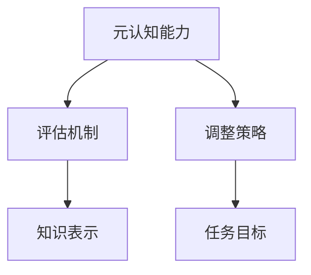
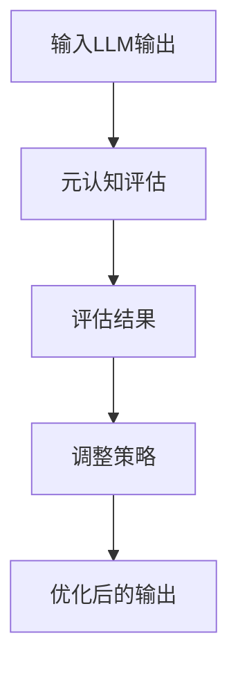

                 


# AI Agent的元认知能力：增强LLM的自我评估与调整

> 关键词：AI Agent，元认知能力，LLM，自我评估，自适应调整，知识表示，系统架构

> 摘要：本文探讨AI Agent的元认知能力如何增强大语言模型（LLM）的自我评估与调整能力。通过分析元认知能力的核心概念、算法原理、系统架构及实际应用，揭示其在提升LLM性能中的关键作用。结合理论与实践，为AI Agent的设计与优化提供深入指导。

---

## 第一部分: 元认知能力与AI Agent概述

### 第1章: 元认知能力的定义与特点

#### 1.1 元认知能力的定义与特点

- **1.1.1 元认知能力的定义**  
  元认知能力是指AI Agent对自身知识、行为和决策过程的认知与评估能力，能够根据反馈调整策略。

- **1.1.2 元认知能力的核心特点**  
  - **自我评估**：AI Agent能够分析自身输出的正确性。  
  - **自适应调整**：根据评估结果动态优化行为策略。  
  - **知识表示**：元认知能力依赖于对知识的结构化表示。  

- **1.1.3 元认知能力与传统AI的区别**  
  - 传统AI依赖预定义规则，而元认知AI具备动态调整能力。  
  - 元认知AI能够从经验中学习，适应复杂场景。

#### 1.2 AI Agent的定义与分类

- **1.2.1 AI Agent的定义**  
  AI Agent是具备感知环境、自主决策并执行任务的智能实体。

- **1.2.2 AI Agent的主要分类**  
  - **简单反射型**：基于规则执行任务。  
  - **基于模型型**：使用内部模型推理决策。  
  - **元认知型**：具备自我评估与调整能力。  

- **1.2.3 元认知AI Agent的独特性**  
  - 能够评估自身输出，动态调整决策策略。  
  - 在复杂场景中表现出更强的适应性。

#### 1.3 元认知能力在AI Agent中的作用

- **1.3.1 元认知能力对AI Agent的影响**  
  - 提高决策的准确性与可靠性。  
  - 增强对复杂环境的适应能力。

- **1.3.2 元认知能力与LLM的结合**  
  - LLM提供强大的语言处理能力，元认知能力赋予其自评估与调整能力。  
  - 结合两者，实现更智能的对话与任务执行。

- **1.3.3 元认知能力在实际应用中的价值**  
  - 提高LLM在复杂任务中的表现。  
  - 降低人工干预的需求，提升系统自治能力。

#### 1.4 本章小结

- 本章介绍了元认知能力的定义、特点及其在AI Agent中的作用，为后续内容奠定了基础。

---

## 第二部分: 元认知能力的核心概念与联系

### 第2章: 元认知能力的核心概念与联系

#### 2.1 元认知能力的核心原理

- **2.1.1 元认知评估机制**  
  - AI Agent通过内部模型评估自身输出的正确性。  
  - 常用的方法包括概率推理和对比学习。

- **2.1.2 元认知调整策略**  
  - 根据评估结果调整模型参数或行为策略。  
  - 例如，动态权重调整和多策略融合。

- **2.1.3 元认知与知识表示的关系**  
  - 知识表示为元认知能力提供基础。  
  - 元认知能力优化知识表示结构。

#### 2.2 元认知能力的特征对比

- **2.2.1 元认知能力的属性特征**  
  - 表述性：能够明确表达自身状态。  
  - 反射性：基于反馈进行调整。  
  - 自主性：无需外部干预即可运行。  

- **2.2.2 元认知能力与其他AI能力的对比**  
  | 能力类型 | 描述 | 区别 |
  |----------|------|------|
  | 传统AI   | 预定义规则 | 无自适应能力 |
  | 元认知AI | 自评估与调整 | 更强的适应性 |

- **2.2.3 元认知能力的量化指标**  
  - 准确率：输出正确的概率。  
  - 调整速度：根据反馈调整的时间效率。  

#### 2.3 元认知能力的ER实体关系图



- 说明：元认知能力通过评估机制和调整策略与知识表示和任务目标相互作用。

#### 2.4 本章小结

- 本章分析了元认知能力的核心原理及其与其他概念的关系，为后续算法设计提供了理论基础。

---

## 第三部分: 元认知能力的算法原理

### 第3章: 元认知能力的算法原理

#### 3.1 元认知评估机制的算法

- **3.1.1 评估函数的定义**  
  - 评估函数用于衡量LLM输出的正确性。  
  $$ \text{score}(x) = \sum_{i=1}^{n} w_i \cdot f_i(x) $$  
  其中，$w_i$是权重，$f_i(x)$是特征函数。

- **3.1.2 评估函数的实现**  
  - 使用概率模型计算输出的置信度。  
  - 示例代码如下：

  ```python
  def evaluate_output(output, ground_truth):
      # 计算相似度
      similarity = calculate_similarity(output, ground_truth)
      # 返回评估分数
      return similarity
  ```

- **3.1.3 评估函数的优化**  
  - 使用反馈数据微调模型。  
  - 通过强化学习提升评估准确性。

#### 3.2 元认知调整策略的算法

- **3.2.1 调整策略的分类**  
  - 参数调整：修改模型权重。  
  - 行为调整：改变决策规则。  

- **3.2.2 调整策略的实现**  
  - 使用元学习框架优化调整策略。  
  - 示例代码如下：

  ```python
  def adjust_strategy(current_strategy, feedback):
      # 根据反馈调整策略
      adjusted_strategy = optimize(current_strategy, feedback)
      return adjusted_strategy
  ```

- **3.2.3 调整策略的优化**  
  - 结合在线学习提升适应性。  
  - 使用分布式计算加速优化过程。

#### 3.3 元认知能力的算法流程图



- 说明：LLM输出后，元认知能力评估其正确性，根据结果调整策略，生成优化后的输出。

#### 3.4 本章小结

- 本章详细讲解了元认知能力的算法实现，包括评估机制和调整策略的设计与优化。

---

## 第四部分: 元认知能力的数学模型与公式

### 第4章: 元认知能力的数学模型与公式

#### 4.1 评估函数的数学模型

- **4.1.1 评估函数的定义**  
  $$ \text{score}(x) = \sum_{i=1}^{n} w_i \cdot f_i(x) $$  
  其中，$w_i$是权重，$f_i(x)$是特征函数。

- **4.1.2 评估函数的优化**  
  使用梯度下降优化权重：  
  $$ w_{t+1} = w_t - \eta \cdot \frac{\partial L}{\partial w_t} $$  

#### 4.2 调整策略的数学模型

- **4.2.1 调整策略的定义**  
  $$ \theta_{t+1} = \theta_t + \alpha \cdot (s_t - \theta_t) $$  
  其中，$\alpha$是学习率，$s_t$是目标策略。

- **4.2.2 调整策略的优化**  
  使用强化学习框架更新策略：  
  $$ \theta_{t+1} = \theta_t + \alpha \cdot r_t \cdot \nabla_{\theta} Q(\theta, a_t) $$  

#### 4.3 评估与调整的联合模型

- **联合模型的定义**  
  $$ f(x) = \text{argmax}_{y} \sum_{i=1}^{m} \text{score}(y_i) \cdot \text{adjust}(y_i) $$  
  其中，$y_i$是候选输出。

- **联合模型的优化**  
  使用贝叶斯推理更新模型参数：  
  $$ p(\theta|x) \propto p(x|\theta) \cdot p(\theta) $$  

#### 4.4 实际案例分析

- **案例：文本纠错**  
  - 输入：用户输入有误的文本。  
  - 评估：模型评估错误率。  
  - 调整：调整语言模型参数，生成更准确的文本。

#### 4.5 本章小结

- 本章通过数学模型详细解释了元认知能力的评估与调整机制，并通过案例分析验证了其有效性。

---

## 第五部分: 系统分析与架构设计

### 第5章: 元认知能力的系统架构设计

#### 5.1 问题场景介绍

- **场景描述**  
  在智能对话系统中，LLM需要具备自评估与调整能力，以应对复杂对话。

#### 5.2 系统功能设计

- **领域模型**  
  ```mermaid
  graph TD
  A[输入文本] --> B[LLM处理]
  B --> C[元认知评估]
  C --> D[调整策略]
  D --> E[输出结果]
  ```

- **系统架构设计**  
  ```mermaid
  graph TD
  A[用户输入] --> B[LLM]
  B --> C[元认知评估模块]
  C --> D[调整模块]
  D --> E[优化后的输出]
  ```

- **系统接口设计**  
  - 输入接口：接收用户输入。  
  - 输出接口：返回优化后的结果。  

- **系统交互序列图**  
  ```mermaid
  sequenceDiagram
  participant 用户
  participant LLM
  participant 元认知评估模块
  participant 调整模块
  用户 -> LLM: 提供输入
  LLM -> 元认知评估模块: 请求评估
  元认知评估模块 -> 调整模块: 提供评估结果
  调整模块 -> LLM: 提供调整策略
  LLM -> 用户: 返回优化结果
  ```

#### 5.3 本章小结

- 本章通过系统架构设计展示了元认知能力在实际应用中的实现方式。

---

## 第六部分: 项目实战

### 第6章: 项目实战

#### 6.1 环境安装

- **工具安装**  
  - Python 3.8+  
  - Transformers库  
  - Mermaid工具链  

#### 6.2 核心代码实现

- **评估函数实现**  
  ```python
  def evaluate_output(output, ground_truth):
      # 计算相似度
      similarity = calculate_similarity(output, ground_truth)
      return similarity
  ```

- **调整策略实现**  
  ```python
  def adjust_strategy(current_strategy, feedback):
      # 根据反馈调整策略
      adjusted_strategy = optimize(current_strategy, feedback)
      return adjusted_strategy
  ```

#### 6.3 案例分析

- **案例：智能客服对话系统**  
  - 任务：处理用户咨询。  
  - 实现：集成元认知能力，实现对话中的自评估与调整。

#### 6.4 项目小结

- 本章通过实际项目展示了元认知能力的实现过程，帮助读者理解其应用场景。

---

## 第七部分: 最佳实践与总结

### 第7章: 最佳实践

#### 7.1 小结

- 元认知能力是提升AI Agent性能的关键技术。  
- 通过自评估与调整，LLM能够更好地应对复杂任务。

#### 7.2 注意事项

- 元认知能力的实现需要结合具体场景。  
- 需要大量数据支持模型优化。

#### 7.3 拓展阅读

- 推荐书籍：《强化学习入门》、《分布式系统设计》。  
- 推荐论文：相关领域的最新研究。

#### 7.4 本章小结

- 本章总结了元认知能力的应用，并提供了进一步学习的方向。

---

## 作者：AI天才研究院/AI Genius Institute & 禅与计算机程序设计艺术 /Zen And The Art of Computer Programming

