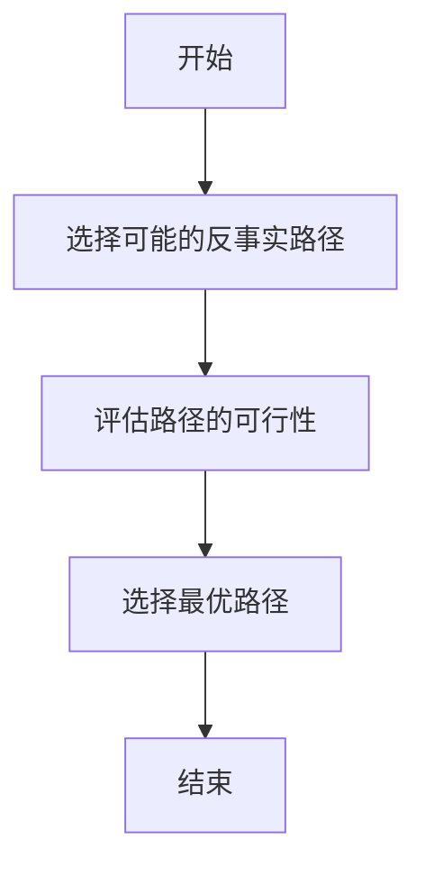
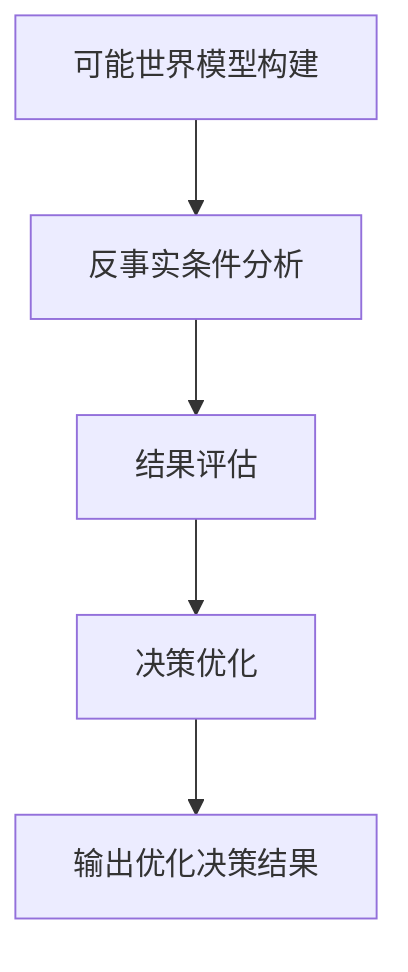
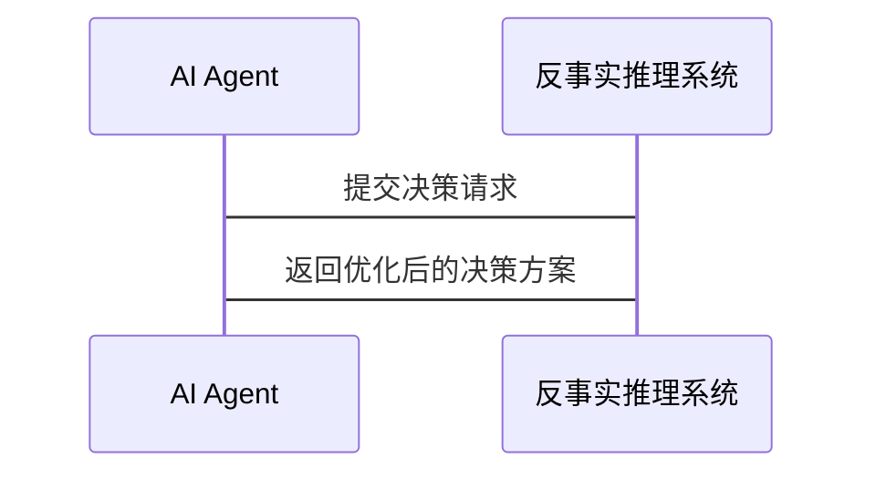

                 


# AI Agent的反事实推理：增强决策的前瞻性

## 关键词：AI Agent，反事实推理，决策优化，风险评估，策略优化

## 摘要：反事实推理是一种基于可能世界模型的推理方法，通过分析“如果采取某种行动，结果会如何”的反事实条件，帮助AI Agent做出更具有前瞻性的决策。本文从反事实推理的背景、核心概念、算法原理、系统架构设计、项目实战等多方面展开，深入探讨反事实推理在AI Agent决策优化中的应用，结合具体案例和代码实现，帮助读者全面理解并掌握反事实推理的核心思想与实践方法。

---

## 第一部分: AI Agent反事实推理的背景与核心概念

### 第1章: 反事实推理的定义与背景

#### 1.1 问题背景
在AI Agent的决策过程中，传统的事实推理方法往往只能基于已有的事实信息进行预测，而无法主动探索“如果采取某种行动，结果会如何”的可能性。这种局限性使得AI Agent在面对复杂决策问题时，难以充分考虑所有可能的后果，导致决策结果的不确定性和风险增加。

#### 1.1.1 从事实推理到反事实推理的演进
- **事实推理**：基于已有的事实信息，通过逻辑推理预测未来的结果。
- **反事实推理**：通过构建可能世界模型，探索不同假设条件下结果的变化，从而帮助AI Agent做出更具有前瞻性的决策。

#### 1.1.2 AI Agent决策中的不确定性与复杂性
- AI Agent在面对复杂决策问题时，需要考虑多种可能的行动方案及其后果。
- 传统的事实推理方法在处理不确定性问题时显得力不从心。

#### 1.1.3 反事实推理在AI Agent中的重要性
- 反事实推理可以帮助AI Agent在决策过程中充分考虑各种可能的后果，从而优化决策结果。
- 通过反事实推理，AI Agent可以更好地应对不确定性，降低风险。

#### 1.2 反事实推理的定义与特点
- **反事实推理**：一种基于可能世界模型的推理方法，通过分析“如果采取某种行动，结果会如何”的反事实条件，帮助AI Agent做出更具有前瞻性的决策。

#### 1.2.1 反事实推理的定义
反事实推理是一种通过构建可能世界模型，分析不同假设条件下结果的变化，从而帮助AI Agent做出更具有前瞻性的决策的推理方法。

#### 1.2.2 反事实推理的核心特点
- **假设性**：反事实推理基于假设的可能世界模型进行分析。
- **前瞻性和预见性**：通过分析不同假设条件下的结果，帮助AI Agent做出更具有前瞻性的决策。
- **不确定性处理**：反事实推理可以帮助AI Agent更好地应对不确定性问题。

#### 1.2.3 反事实推理与事实推理的区别
| 特性 | 事实推理 | 反事实推理 |
|------|----------|------------|
| 数据基础 | 已有的事实信息 | 假设的可能世界模型 |
| 推理方式 | 基于已知事实进行预测 | 通过假设条件探索可能的结果 |
| 应用场景 | 确定性问题 | 不确定性问题 |

#### 1.3 反事实推理的应用场景
- **AI Agent的决策优化**：通过反事实推理，AI Agent可以在决策过程中充分考虑各种可能的后果，从而优化决策结果。
- **风险评估与管理**：通过反事实推理，AI Agent可以评估不同行动方案的风险，从而做出更明智的决策。
- **策略优化**：反事实推理可以帮助AI Agent优化其行动策略，提高决策的效率和效果。

### 第2章: 反事实推理的核心概念与联系

#### 2.1 反事实推理的原理
- **可能世界模型**：反事实推理的核心是构建可能世界模型，通过分析不同假设条件下的结果，帮助AI Agent做出更具有前瞻性的决策。

#### 2.1.1 反事实条件与逻辑关系
- 反事实条件：如果采取某种行动，结果会如何？
- 逻辑关系：通过构建可能世界模型，分析不同假设条件下的结果，从而帮助AI Agent做出更具有前瞻性的决策。

#### 2.1.2 反事实推理与事实推理的对比
- **事实推理**：基于已有的事实信息，通过逻辑推理预测未来的结果。
- **反事实推理**：通过假设的可能世界模型，分析不同假设条件下的结果。

#### 2.2 反事实推理的核心要素
- **反事实推理的逻辑框架**：通过构建可能世界模型，分析不同假设条件下的结果，从而帮助AI Agent做出更具有前瞻性的决策。
- **反事实推理的数学模型**：通过构建可能世界模型，分析不同假设条件下的结果，从而帮助AI Agent做出更具有前瞻性的决策。
- **反事实推理的实体关系图**：通过构建可能世界模型，分析不同假设条件下的结果，从而帮助AI Agent做出更具有前瞻性的决策。

#### 2.3 反事实推理的系统架构
- **反事实推理系统的组成**：包括可能世界模型构建模块、反事实条件分析模块、结果评估模块和决策优化模块。
- **反事实推理系统的功能模块**：包括可能世界模型构建模块、反事实条件分析模块、结果评估模块和决策优化模块。
- **反事实推理系统的交互流程**：从构建可能世界模型开始，通过反事实条件分析模块，分析不同假设条件下的结果，然后通过结果评估模块，评估这些结果的可行性，最后通过决策优化模块，优化决策结果。

---

## 第二部分: 反事实推理的算法原理与数学模型

### 第3章: 反事实推理的算法原理

#### 3.1 反事实推理的典型算法
- **蒙特卡洛反事实推理算法**：通过随机采样的方式，探索可能世界模型中的各种假设条件，评估不同行动方案的结果。
- **反事实树搜索算法**：通过构建决策树，探索可能世界模型中的各种假设条件，评估不同行动方案的结果。
- **基于图的反事实推理算法**：通过构建图模型，探索可能世界模型中的各种假设条件，评估不同行动方案的结果。

#### 3.2 反事实推理算法的流程图


#### 3.3 反事实推理算法的Python实现
```python
def 反事实推理(输入):
    可能世界 = 初始化可能世界集合()
    for 每个可能的反事实路径 in 可能世界:
        if 评估路径的可行性(路径):
            选择最优路径()
            break
    返回 优化后的决策结果
```

#### 3.4 反事实推理的数学模型
反事实推理的数学模型可以通过可能世界模型来表示。假设存在一个可能世界集合W，每个世界w∈W对应一种假设条件下的结果。通过分析不同世界w中的结果，AI Agent可以做出更优化的决策。

#### 3.5 反事实推理的数学公式
$$ P(r | a, w) = \text{在世界} w \text{中采取行动} a \text{的结果概率} $$

---

## 第三部分: 反事实推理的系统架构设计

### 第4章: 反事实推理的系统架构设计

#### 4.1 问题场景介绍
AI Agent需要在复杂环境中做出决策，传统的事实推理方法难以应对不确定性问题。通过反事实推理，AI Agent可以在决策过程中充分考虑各种可能的后果，从而优化决策结果。

#### 4.2 系统功能设计
- **可能世界模型构建模块**：构建可能世界模型，定义不同的假设条件。
- **反事实条件分析模块**：分析不同假设条件下的结果，评估行动方案的可行性。
- **结果评估模块**：评估不同行动方案的结果，选择最优的决策方案。
- **决策优化模块**：根据评估结果，优化AI Agent的决策方案。

#### 4.3 系统架构设计


#### 4.4 系统接口设计
- **输入接口**：接收AI Agent的决策请求和环境信息。
- **输出接口**：输出优化后的决策方案。

#### 4.5 系统交互设计


---

## 第四部分: 项目实战

### 第5章: 项目实战

#### 5.1 项目介绍
选择一个具体的场景，例如电商推荐系统，展示反事实推理在AI Agent中的实际应用。

#### 5.2 环境配置
- **Python版本**：Python 3.8+
- **依赖库**：numpy, pandas, matplotlib

#### 5.3 核心代码实现
```python
def 反事实推理(输入):
    可能世界 = 初始化可能世界集合()
    for 每个可能的反事实路径 in 可能世界:
        if 评估路径的可行性(路径):
            选择最优路径()
            break
    返回 优化后的决策结果
```

#### 5.4 代码应用解读与分析
通过具体的代码实现，展示反事实推理算法在电商推荐系统中的应用，分析其优化效果和实际表现。

#### 5.5 实际案例分析
通过具体的数据和案例，展示反事实推理在电商推荐系统中的实际应用效果，分析其优势和不足。

#### 5.6 项目小结
总结反事实推理在电商推荐系统中的应用效果，提出改进建议和未来发展方向。

---

## 第五部分: 总结与展望

### 第6章: 总结与展望

#### 6.1 全文总结
总结全文内容，重申反事实推理在AI Agent决策优化中的重要性。

#### 6.2 当前研究的前沿
探讨当前反事实推理研究的前沿方向，例如多模态反事实推理、分布式反事实推理等。

#### 6.3 未来研究的方向
展望反事实推理在AI Agent中的未来发展方向，提出一些可能的研究课题和应用领域。

---

## 作者：AI天才研究院/AI Genius Institute & 禅与计算机程序设计艺术 /Zen And The Art of Computer Programming

---

通过以上思考过程，我可以系统地构建一篇关于AI Agent反事实推理的技术博客文章，涵盖从背景到实际应用的各个方面，帮助读者全面理解反事实推理的核心思想和实践方法。

