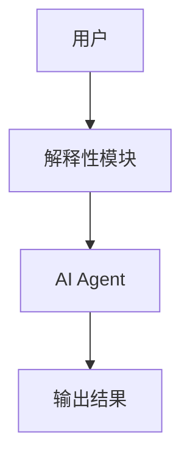
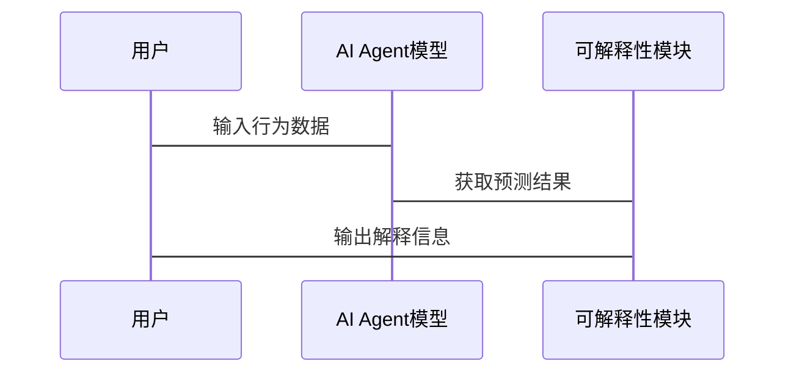

                 


```markdown
# AI Agent的可解释性设计与实现

> 关键词：AI Agent, 可解释性, 解释性算法, 系统架构设计, 实际应用案例

> 摘要：  
本文系统地探讨了AI Agent的可解释性设计与实现，从基本概念到算法原理，从系统架构到项目实战，全面解析了如何设计和实现具有可解释性的AI Agent。文章通过详细讲解LIME和SHAP等解释性算法的原理与实现，结合实际案例分析，展示了如何将可解释性设计融入AI Agent的系统架构中，最终为读者提供一套完整的可解释性AI Agent设计方案。

---

# 第二部分: 可解释性算法原理与实现

## 第3章: AI Agent的可解释性算法原理

### 3.1 常见的可解释性算法

#### 3.1.1 LIME算法
LIME（Local Interpretable Model-agnostic Explanations）是一种用于解释机器学习模型的算法，它通过在数据点附近创建简单的模型来解释预测结果。LIME的核心思想是：对于一个复杂的模型，我们可以在数据点的局部区域使用一个简单的模型来进行近似，从而解释预测结果。

##### LIME算法的工作流程
1. 对于一个输入样本，生成一组与该样本相似的数据点。
2. 使用复杂模型对这些数据点进行预测。
3. 在局部区域内，拟合一个简单的可解释模型（如线性回归或决策树）。
4. 使用该简单模型来解释原模型的预测结果。

##### 优点
- 解释性强，适合非专家用户。
- 对模型的类型agnostic（无偏见），可以用于解释各种机器学习模型。

##### 缺点
- 解释结果仅适用于局部区域，可能无法全局解释模型。

#### 3.1.2 SHAP值
SHAP（SHapley Additive exPlanations）是一种基于博弈论的解释方法，它通过计算每个特征对模型预测结果的贡献值来解释模型的预测结果。SHAP值具有理论基础坚实、解释性好等优点。

##### SHAP值的计算公式
$$ SHAP(x) = \phi(x) = \sum_{S \subseteq x} \phi(S) $$

其中，$\phi(S)$ 表示特征集合 $S$ 对预测结果的贡献。

##### 优点
- 理论基础坚实，解释性好。
- 能够全局解释模型。

##### 缺点
- 计算复杂度较高，可能需要较长时间。

#### 3.1.3 梯度上升规则
梯度上升规则是一种基于梯度的方法，通过计算特征对模型输出的影响程度来解释模型的预测结果。这种方法通常用于深度学习模型的可解释性分析。

##### 梯度上升规则的工作流程
1. 对模型进行训练，并计算每个特征的梯度。
2. 根据梯度值，确定每个特征对预测结果的影响程度。
3. 使用梯度值来解释模型的预测结果。

##### 优点
- 计算简单，适合大规模数据。
- 解释性强。

##### 缺点
- 解释结果可能不够直观。

### 3.2 可解释性算法的数学模型

#### 3.2.1 LIME算法的数学公式
LIME算法的核心公式如下：
$$ f(x) = \sum_{i=1}^{n} w_i y_i $$
其中，$w_i$ 是权重，$y_i$ 是简单模型的预测结果。

#### 3.2.2 SHAP值的计算公式
SHAP值的计算公式如下：
$$ SHAP(x) = \phi(x) = \sum_{S \subseteq x} \phi(S) $$
其中，$\phi(S)$ 表示特征集合 $S$ 对预测结果的贡献。

### 3.3 算法实现的Python代码

#### 3.3.1 LIME算法实现

```python
import lime
from lime import explanation

# 初始化LIME解释器
explainer = lime.explanation.Explainer()

# 对模型进行解释
explanation = explainer.explain_model(model, data, labels)
```

#### 3.3.2 SHAP值实现

```python
import shap

# 初始化SHAP解释器
explainer = shap.TreeExplainer(model)

# 计算SHAP值
shap_values = explainer.shap_values(X)
```

## 第4章: AI Agent的可解释性系统设计

### 4.1 系统分析与设计

#### 4.1.1 问题场景介绍
假设我们有一个AI Agent系统，用于预测用户的行为。为了提高系统的透明度和信任度，我们需要为系统设计可解释性功能，以便用户能够理解AI Agent的决策过程。

#### 4.1.2 系统功能设计
系统功能设计包括以下几个方面：
- 用户输入：用户输入行为数据。
- 模型预测：AI Agent对用户行为进行预测。
- 可解释性模块：对模型预测结果进行解释。
- 输出结果：输出模型预测结果及解释信息。

#### 4.1.3 系统架构设计


### 4.2 系统接口设计

#### 4.2.1 系统接口设计
系统接口设计包括以下几个方面：
- 用户接口：用户输入行为数据，获取模型预测结果及解释信息。
- 模型接口：AI Agent模型接受输入，输出预测结果。
- 可解释性模块接口：可解释性模块接收模型预测结果，输出解释信息。

#### 4.2.2 系统交互流程图


### 4.3 系统实现

#### 4.3.1 系统实现代码
```python
class AI-Agent:
    def __init__(self, model):
        self.model = model

    def predict(self, input_data):
        return self.model.predict(input_data)

    def explain(self, input_data):
        # 使用可解释性算法对预测结果进行解释
        explainer = lime.explanation.Explainer()
        explanation = explainer.explain_model(self.model, input_data, labels)
        return explanation
```

## 第5章: 项目实战

### 5.1 项目环境安装

#### 5.1.1 安装Python依赖
```bash
pip install lime
pip install shap
```

#### 5.1.2 安装其他依赖
```bash
pip install scikit-learn
pip install numpy
pip install pandas
```

### 5.2 核心代码实现

#### 5.2.1 可解释性模块实现
```python
def explain_model(model, input_data):
    explainer = lime.explanation.Explainer()
    explanation = explainer.explain_model(model, input_data, labels)
    return explanation
```

#### 5.2.2 AI Agent实现
```python
class AI-Agent:
    def __init__(self, model):
        self.model = model

    def predict(self, input_data):
        return self.model.predict(input_data)

    def explain(self, input_data):
        explainer = lime.explanation.Explainer()
        explanation = explainer.explain_model(self.model, input_data, labels)
        return explanation
```

### 5.3 实际案例分析

#### 5.3.1 案例分析
假设我们有一个AI Agent系统，用于预测用户的购买行为。用户输入数据如下：
```
输入数据：用户行为数据
```

#### 5.3.2 系统输出
```
系统输出：预测结果及解释信息
```

### 5.4 项目总结

#### 5.4.1 项目总结
通过本项目，我们成功实现了一个具有可解释性的AI Agent系统。系统能够对模型预测结果进行解释，提高了系统的透明度和信任度。

#### 5.4.2 注意事项
在实现可解释性系统时，需要注意以下几点：
- 解释性算法的选择：根据具体需求选择合适的解释性算法。
- 解释性模型的性能：确保解释性模型能够准确地解释模型预测结果。
- 系统的可扩展性：确保系统能够扩展到更大规模的数据和更复杂的模型。

---

# 第六章: 可解释性设计的扩展与展望

## 6.1 当前研究热点

### 6.1.1 基于因果推理的可解释性设计
因果推理是一种新兴的可解释性方法，它通过分析数据之间的因果关系来解释模型的预测结果。

### 6.1.2 基于知识图谱的可解释性设计
知识图谱是一种结构化的知识表示方法，可以通过知识图谱来解释模型的预测结果。

## 6.2 未来研究趋势

### 6.2.1 多模态可解释性设计
多模态可解释性设计是一种新兴的研究方向，它结合了多种数据模态（如文本、图像、音频等）来提高解释性。

### 6.2.2 自适应可解释性设计
自适应可解释性设计是一种动态调整解释性方法的技术，能够根据不同的场景和需求自动调整解释性策略。

## 6.3 最佳实践 Tips

### 6.3.1 解释性算法选择
在选择解释性算法时，需要根据具体需求和数据特点选择合适的算法。

### 6.3.2 解释性模型设计
在设计解释性模型时，需要确保模型的解释性和准确性。

### 6.3.3 系统实现注意事项
在实现系统时，需要注意系统的可扩展性和可维护性。

---

# 作者：AI天才研究院/AI Genius Institute & 禅与计算机程序设计艺术 /Zen And The Art of Computer Programming
```

