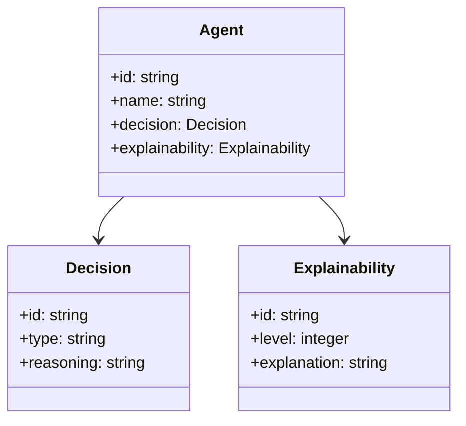
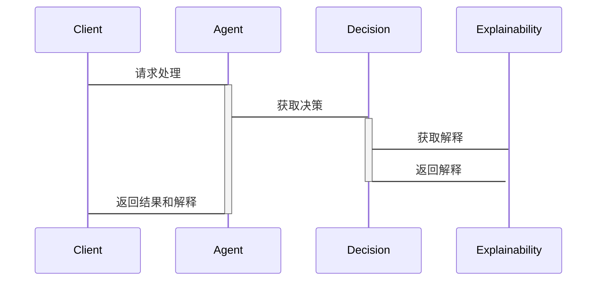

                 


# AI Agent的可解释性：深入理解LLM的决策过程

## 关键词：
AI Agent, 可解释性, LLM, 决策过程, 人工智能, 机器学习

## 摘要：
随着AI Agent在各个领域的广泛应用，其决策过程的可解释性成为一个重要研究方向。本文深入分析了AI Agent的可解释性，详细探讨了LLM的决策机制，并通过数学模型和实际案例展示了如何理解其决策过程。通过系统架构设计和项目实战，本文为实现AI Agent的高透明度决策提供了指导。

---

# 第1章: AI Agent与可解释性概述

## 1.1 问题背景

### 1.1.1 AI Agent的基本概念
AI Agent（智能体）是能够感知环境并采取行动以实现目标的实体。它可以是一个软件程序、机器人或其他智能系统，具备自主决策的能力。

### 1.1.2 可解释性的重要性
可解释性是指AI Agent的决策过程能够被人类理解和解释。高可解释性有助于增强用户对AI系统的信任，同时在出现问题时便于调试和优化。

### 1.1.3 当前AI Agent的挑战
- **复杂性**：AI Agent的决策过程往往涉及复杂的算法和数据，难以直接理解。
- **黑箱问题**：许多AI模型，尤其是深度学习模型，被视为“黑箱”，其内部机制不透明。
- **伦理问题**：决策的不透明性可能导致伦理争议，尤其是在医疗、司法等敏感领域。

## 1.2 LLM的决策过程

### 1.2.1 LLM的基本原理
LLM（Large Language Model）是基于深度学习的自然语言处理模型，通过大量数据训练，能够生成人类可读的文本。

### 1.2.2 LLM的决策机制
LLM通过编码器-解码器架构处理输入文本，编码器将输入转换为向量表示，解码器根据向量生成输出文本。

### 1.2.3 LLM的局限性
- **依赖训练数据**：LLM的输出受限于训练数据，可能包含偏见或错误。
- **缺乏上下文理解**：LLM难以完全理解上下文，可能在复杂场景中出错。

## 1.3 可解释性与决策透明度

### 1.3.1 可解释性的定义
可解释性是指AI系统的决策过程能够被人类理解并解释。

### 1.3.2 决策透明度的内涵
决策透明度强调AI系统的决策过程公开、可追溯，便于用户理解。

### 1.3.3 可解释性与决策透明度的关系
可解释性是决策透明度的基础，高透明度依赖于系统的可解释性。

---

# 第2章: LLM的内部决策机制

## 2.1 LLM的内部结构

### 2.1.1 模型的输入与输出
LLM接受文本输入，生成文本输出。

### 2.1.2 模型的训练过程
通过监督学习和无监督学习，模型学习语言的结构和语义。

### 2.1.3 模型的推理过程
模型根据输入生成输出，涉及编码器和解码器的协同工作。

## 2.2 LLM的注意力机制

### 2.2.1 注意力机制的定义
注意力机制用于计算输入文本中每个词的重要性。

### 2.2.2 注意力机制的作用
通过权重分配，模型聚焦于重要的信息。

### 2.2.3 注意力机制的实现
使用查询、键、值三元组计算注意力权重。

## 2.3 LLM的决策影响因素

### 2.3.1 数据的影响
训练数据的质量和多样性直接影响模型的输出。

### 2.3.2 模型结构的影响
模型的架构和参数数量影响其表达能力。

### 2.3.3 参数的影响
模型参数的调整影响其决策过程。

---

# 第3章: 可解释性的核心概念

## 3.1 可解释性的定义与分类

### 3.1.1 可解释性的定义
可解释性指AI系统的行为能够被人类理解。

### 3.1.2 可解释性的分类
- **可解释性**：系统的行为可以被解释。
- **透明性**：系统的行为过程公开透明。
- **可追溯性**：系统行为可以追溯到决策过程。

## 3.2 可解释性与决策透明度的对比

### 3.2.1 对比分析
可解释性注重理解，透明性注重过程公开。

### 3.2.2 优缺点分析
- 可解释性：优点是理解决策原因，缺点是可能需要更多解释。
- 透明性：优点是过程公开，缺点是可能难以深入理解。

### 3.2.3 应用场景分析
- 医疗：需要理解诊断决策。
- 金融：需要理解贷款决策。

## 3.3 可解释性与不可解释性的ER实体关系图

```mermaid
er
    actor(Agent, id: string, name: string)
    actor(Decision, id: string, type: string)
    actor(Explainability, id: string, level: integer)
```

---

# 第4章: 可解释性的算法原理

## 4.1 可解释性的数学模型

### 4.1.1 概率模型
使用概率分布描述决策过程。

### 4.1.2 评分系统
通过评分解释决策权重。

### 4.1.3 可视化技术
使用热力图显示注意力权重。

## 4.2 可解释性的实现方法

### 4.2.1 层次化分解
将决策过程分解为多个层次，逐一解释。

### 4.2.2 对比分析
通过对比输入和输出的变化，理解决策过程。

### 4.2.3 示例分析
通过具体案例分析，理解决策过程。

## 4.3 本章小结

---

# 第5章: 可解释性的系统架构设计

## 5.1 问题场景介绍

### 5.1.1 系统目标
实现AI Agent决策过程的可解释性。

### 5.1.2 问题描述
系统需要提供决策过程的详细解释。

## 5.2 系统功能设计

### 5.2.1 领域模型


### 5.2.2 系统架构设计


### 5.2.3 系统接口设计
- **输入接口**：接收用户请求。
- **输出接口**：返回决策结果和解释。

## 5.3 系统交互设计

### 5.3.1 序列图


---

# 第6章: 可解释性的项目实战

## 6.1 环境安装

### 6.1.1 安装Python
```bash
python --version
```

### 6.1.2 安装依赖
```bash
pip install numpy
pip install matplotlib
```

## 6.2 核心实现

### 6.2.1 模型训练
使用PyTorch训练LLM模型。

### 6.2.2 可解释性实现
通过注意力权重可视化解释决策过程。

## 6.3 案例分析

### 6.3.1 案例场景
医疗诊断中的决策解释。

### 6.3.2 实现分析
分析模型在医疗诊断中的决策过程。

## 6.4 项目总结

---

# 第7章: 可解释性的未来展望

## 7.1 未来趋势
可解释性将成为AI系统的重要评价标准。

## 7.2 挑战与机遇
技术进步将推动可解释性的发展。

## 7.3 注意事项
开发者需重视可解释性设计。

## 7.4 拓展阅读
推荐相关书籍和论文。

---

# 作者

作者：AI天才研究院/AI Genius Institute & 禅与计算机程序设计艺术 /Zen And The Art of Computer Programming

---

以上是完整的目录大纲和文章结构，涵盖了从基础概念到实际应用的各个方面，详细分析了AI Agent的可解释性问题，并通过实际案例和系统设计展示了如何实现和理解LLM的决策过程。

