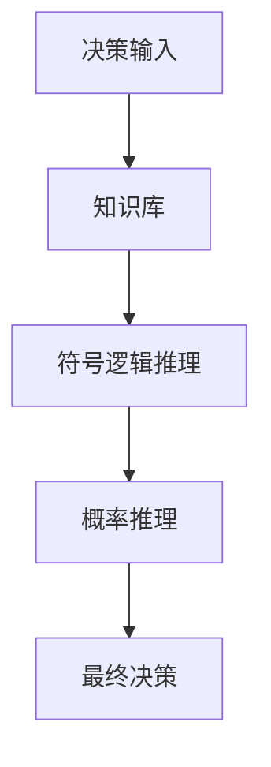
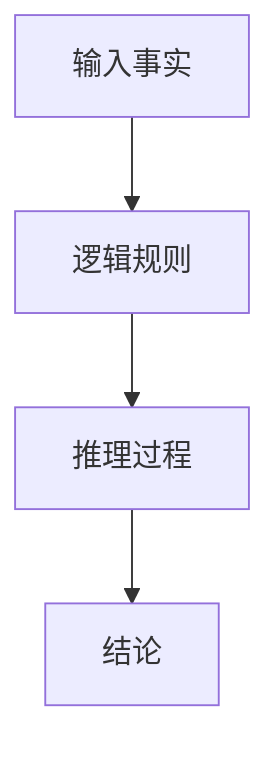
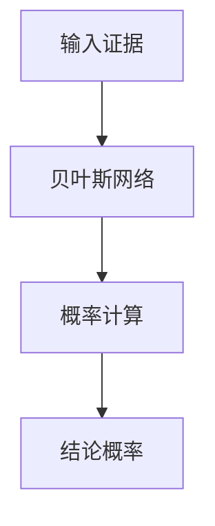
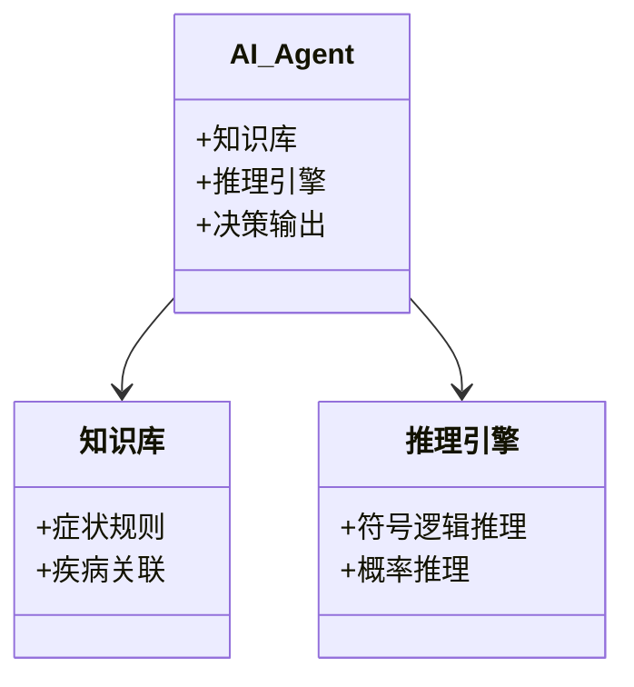
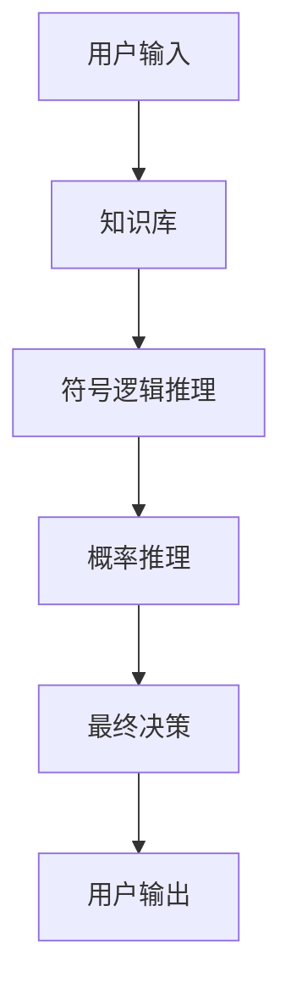

                 


# AI Agent的可解释推理：提高LLM决策的透明度

---

## 关键词：AI Agent, 可解释推理, LLM, 决策透明度, 贝叶斯网络, 符号逻辑, 系统架构

---

## 摘要：  
随着AI Agent和大语言模型（LLM）的广泛应用，决策的透明度和可解释性成为用户信任和系统优化的关键。本文从AI Agent的可解释推理出发，深入分析了如何提高LLM的决策透明度。通过符号逻辑推理和概率推理的对比，结合实际案例，详细阐述了可解释推理的算法原理和系统架构设计。最后，通过项目实战和最佳实践，为读者提供了实现可解释推理的具体方法和优化策略。

---

## 第一部分: AI Agent的可解释推理基础

### 第1章: AI Agent与可解释推理概述

#### 1.1 问题背景与问题描述  
AI Agent作为一种智能体，通过感知环境、推理决策并执行操作来实现目标。然而，其决策过程往往缺乏透明性，导致用户难以理解其背后的逻辑。这种不透明性不仅影响用户信任，还可能引发决策错误。因此，如何提高AI Agent的可解释性，特别是LLM的决策透明度，成为当前研究的热点问题。  

#### 1.2 问题解决与边界定义  
可解释推理的核心目标是通过明确的逻辑规则和清晰的推理过程，使得AI Agent的决策过程可被人类理解和验证。本研究主要关注基于符号逻辑和概率推理的可解释性方法，并将其应用于LLM的决策优化中。研究的边界包括但不限于自然语言处理场景、基于规则的决策系统以及基于知识图谱的推理。  

#### 1.3 核心概念与系统结构  
可解释推理涉及多个核心概念，包括符号逻辑、概率推理、规则系统和知识图谱等。以下是核心概念的对比表和系统架构图：

**核心概念对比表：**

| 概念 | 描述 | 示例 |
|------|------|------|
| 符号逻辑推理 | 基于逻辑规则的推理方法 | $p \rightarrow q$ |
| 概率推理 | 基于概率分布的推理方法 | $P(A|B) = P(B|A)P(A)/P(B)$ |
| 基于规则的系统 | 基于预定义规则的推理方法 | 规则：如果 $p$，则 $q$ |

**系统架构图：**



---

## 第二部分: 可解释推理的核心原理

### 第2章: 可解释推理的算法原理

#### 2.1 符号逻辑推理机制  
符号逻辑推理是基于逻辑规则的推理方法，其核心思想是通过符号表示和逻辑推理来得出结论。以下是符号逻辑推理的流程图：



**Python代码实现：**

```python
def symbol_inference(knowledge_base, query):
    # 知识库：符号逻辑规则
    # 查询：输入事实
    for rule in knowledge_base:
        if rule['premise'] == query:
            return rule['hypothesis']
    return None
```

**数学模型：**  
符号逻辑推理可以表示为：  
$$ p \rightarrow q $$  
其中，$p$ 是前提，$q$ 是结论。

#### 2.2 概率推理与贝叶斯网络  
概率推理基于概率论，通过贝叶斯网络构建条件概率模型。以下是贝叶斯网络的构建与推理流程图：



**数学模型：**  
贝叶斯定理表示为：  
$$ P(A|B) = \frac{P(B|A)P(A)}{P(B)} $$  

**Python代码实现：**

```python
def bayesian_inference(prior, likelihood, evidence):
    # 先验概率 P(A)
    # 似然概率 P(B|A)
    # 证据 B
    posterior = (prior * likelihood) / evidence
    return posterior
```

---

## 第三部分: 可解释推理的系统架构设计

### 第3章: 系统分析与架构设计  

#### 3.1 问题场景与项目介绍  
本研究以医疗诊断AI Agent为场景，设计了一个基于可解释推理的决策系统。该系统旨在通过提高LLM的决策透明度，帮助医生理解和验证AI的诊断过程。  

#### 3.2 系统功能设计  
以下是系统的领域模型设计：  



#### 3.3 系统架构设计  
以下是系统的整体架构图：  



---

## 第四部分: 项目实战与优化

### 第4章: 项目实战  

#### 4.1 环境安装与配置  
安装必要的依赖库，例如Python的`networkx`和`numpy`。  

#### 4.2 核心代码实现  
以下是符号逻辑推理和概率推理的实现代码：  

```python
def symbol_inference(knowledge_base, query):
    for rule in knowledge_base:
        if rule['premise'] == query:
            return rule['hypothesis']
    return None

def bayesian_inference(prior, likelihood, evidence):
    posterior = (prior * likelihood) / evidence
    return posterior
```

#### 4.3 案例分析与优化  
通过实际案例分析，验证系统的可解释性，并根据反馈优化推理算法。  

---

## 第五部分: 最佳实践与总结

### 第5章: 最佳实践  

#### 5.1 小结与总结  
可解释推理是提高AI Agent决策透明度的关键技术。通过符号逻辑推理和概率推理的结合，可以在保证决策准确性的同时，提高系统的可解释性。  

#### 5.2 注意事项  
在实际应用中，需要注意以下几点：  
1. 确保知识库的准确性和完整性。  
2. 合理选择推理方法，避免过度复杂化。  
3. 定期更新和优化推理模型。  

#### 5.3 拓展阅读  
推荐阅读以下内容：  
- 《逻辑推理与人工智能》  
- 《概率图模型与贝叶斯网络》  

---

## 作者：AI天才研究院/AI Genius Institute & 禅与计算机程序设计艺术 /Zen And The Art of Computer Programming

