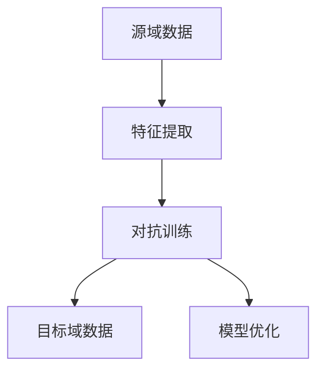
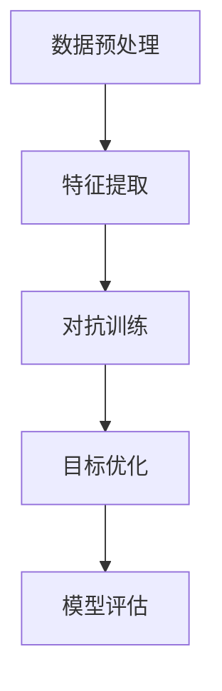

                 


# AI Agent的域适应技术：跨领域知识迁移

> 关键词：AI Agent，域适应技术，知识迁移，机器学习，深度学习

> 摘要：本文深入探讨了AI Agent的域适应技术，重点分析了跨领域知识迁移的核心概念、算法原理和实际应用。通过理论分析和案例实践，揭示了如何利用域适应技术提升AI Agent在不同领域的适应能力和智能水平。

---

# 第一部分: 域适应技术的背景与问题描述

## 第1章: 域适应技术的背景与问题描述

### 1.1 域适应技术的背景

#### 1.1.1 人工智能与AI Agent的发展
人工智能（AI）技术的快速发展推动了AI Agent的广泛应用。AI Agent是一种能够感知环境、自主决策并执行任务的智能体，广泛应用于自然语言处理、计算机视觉、机器人控制等领域。然而，AI Agent在不同领域之间的知识迁移能力有限，限制了其跨领域应用的潜力。

#### 1.1.2 域适应技术的提出背景
在AI Agent的实际应用中，数据分布的差异性是一个普遍存在的问题。例如，一个在医疗领域训练的模型可能无法直接应用于金融领域，因为两者的数据特征和分布存在显著差异。这种数据分布的偏移导致模型性能下降，甚至失效。域适应技术的核心目标就是解决这一问题，实现跨领域知识的高效迁移。

#### 1.1.3 跨领域知识迁移的重要性
跨领域知识迁移是AI Agent实现通用智能的关键能力。通过域适应技术，AI Agent能够快速适应新的领域，降低数据收集和训练的成本，提升模型的泛化能力。这不仅能够推动AI技术的广泛应用，还能够为各行业带来更高的效率和创新。

### 1.2 域适应技术的核心问题

#### 1.2.1 数据分布偏移的定义
数据分布偏移是指源领域（source domain）和目标领域（target domain）之间的数据分布存在差异。这种偏移可能由数据特征、标签分布、样本数量等多种因素引起。

#### 1.2.2 域适应技术的目标
域适应技术的目标是通过算法优化，使得在源领域训练的模型能够在目标领域中保持较高的性能。具体来说，域适应技术旨在最小化源领域和目标领域的数据分布差异，同时最大化模型的预测准确性。

#### 1.2.3 域适应技术的边界与外延
域适应技术的边界在于其应用场景和数据分布的差异程度。当两个领域的数据分布差异过大时，域适应技术的效果可能会受到限制。此外，域适应技术的外延还包括领域迁移学习、多领域学习等相关的技术领域。

---

# 第二部分: 域适应技术的核心概念与联系

## 第2章: 域适应技术的核心概念

### 2.1 域适应技术的核心原理

#### 2.1.1 基于特征对齐的域适应算法
基于特征对齐的域适应算法通过调整源领域和目标领域的特征分布，使得两者在特征空间中对齐。这种方法能够有效减少数据分布偏移，提升模型的泛化能力。

#### 2.1.2 基于对抗训练的域适应算法
基于对抗训练的域适应算法通过引入对抗网络，使得源领域和目标领域的特征分布尽可能接近。这种方法能够有效解决数据分布偏移问题，同时保持模型的预测性能。

#### 2.1.3 基于概率分布匹配的域适应算法
基于概率分布匹配的域适应算法通过优化源领域和目标领域的概率分布，使得两者在分布上尽可能一致。这种方法能够有效减少数据分布偏移，提升模型的泛化能力。

### 2.2 域适应技术的核心要素

#### 2.2.1 数据分布的数学表达
数据分布可以用概率密度函数来描述。源领域和目标领域的数据分布差异可以通过概率密度函数的差异来衡量。

#### 2.2.2 域适应模型的组成部分
域适应模型通常包括特征提取模块、对抗训练模块和目标优化模块。特征提取模块用于提取数据的特征；对抗训练模块用于对齐源领域和目标领域的特征分布；目标优化模块用于优化模型的预测性能。

#### 2.2.3 域适应技术的评价指标
域适应技术的评价指标包括分类准确率、困惑度、分布差异等。这些指标能够有效衡量域适应技术的效果和性能。

---

## 第3章: 域适应技术的核心算法原理

### 3.1 域适应算法概述

#### 3.1.1 最大均值差异（MMD）
最大均值差异是一种常用的域适应算法，通过计算源领域和目标领域的均值差异，优化模型的特征对齐能力。

$$ \text{MMD}(P, Q) = \mathbb{E}_{x \sim P}[h(x)] - \mathbb{E}_{x \sim Q}[h(x)] $$

#### 3.1.2 域对抗网络（DAN）
域对抗网络是一种基于对抗训练的域适应算法，通过引入对抗网络，使得源领域和目标领域的特征分布尽可能接近。

$$ \min_{\theta} \max_{\phi} \mathbb{E}_{x \sim S}[f(x, \theta, \phi)] + \mathbb{E}_{x \sim T}[f(x, \theta, \phi)] $$

### 3.2 域适应算法的流程图



### 3.3 域适应算法的代码实现

```python
import torch
import torch.nn as nn

class DomainAdversarialNetwork(nn.Module):
    def __init__(self, feature_dim):
        super(DomainAdversarialNetwork, self).__init__()
        self.feature_dim = feature_dim
        self.domain_classifier = nn.Sequential(
            nn.Linear(feature_dim, 1),
            nn.Sigmoid()
        )

    def forward(self, features):
        domain_score = self.domain_classifier(features)
        return domain_score

# 示例代码：使用MMD和DAN进行域适应
def compute_mmd(features_source, features_target):
    # 计算均值差异
    mean_source = torch.mean(features_source, dim=0)
    mean_target = torch.mean(features_target, dim=0)
    mmd = torch.mean((mean_source - mean_target).abs())
    return mmd

def train_domain_adaptive_model(model, source_loader, target_loader, epochs=100):
    optimizer = torch.optim.Adam(model.parameters())
    for epoch in range(epochs):
        for batch_source, batch_target in zip(source_loader, target_loader):
            features_source, labels_source = batch_source
            features_target, labels_target = batch_target

            # 提取特征
            features = model(features_source)
            domain_scores = model(features_target)

            # 计算MMD
            mmd = compute_mmd(features, domain_scores)

            # 反向传播与优化
            optimizer.zero_grad()
            mmd.backward()
            optimizer.step()
```

---

## 第4章: 域适应技术的系统架构设计

### 4.1 系统功能设计

#### 4.1.1 数据预处理模块
数据预处理模块负责对源领域和目标领域的数据进行预处理，包括数据清洗、特征提取和数据增强。

#### 4.1.2 域适应模型训练模块
域适应模型训练模块负责训练域适应模型，优化模型的特征对齐能力和预测性能。

#### 4.1.3 模型评估模块
模型评估模块负责对训练好的域适应模型进行评估，包括分类准确率、困惑度等指标的计算。

### 4.2 域适应技术的系统架构图



---

## 第5章: 域适应技术的项目实战

### 5.1 项目背景与目标
本项目旨在通过域适应技术，实现一个能够在多个领域中适应和迁移的AI Agent。具体目标包括：

1. 实现基于MMD和DAN的域适应模型。
2. 在多个领域数据集上进行实验，验证模型的性能。

### 5.2 项目核心代码实现

```python
import torch
import torch.nn as nn

class DomainAdapter(nn.Module):
    def __init__(self, input_dim, hidden_dim, output_dim):
        super(DomainAdapter, self).__init__()
        self.fc1 = nn.Linear(input_dim, hidden_dim)
        self.fc2 = nn.Linear(hidden_dim, output_dim)

    def forward(self, x):
        x = torch.relu(self.fc1(x))
        x = self.fc2(x)
        return x

# 训练函数
def train_domain_adapter(model, source_loader, target_loader, optimizer, criterion, epochs=100):
    for epoch in range(epochs):
        for batch_source, batch_target in zip(source_loader, target_loader):
            source_features, source_labels = batch_source
            target_features, target_labels = batch_target

            # 前向传播
            outputs_source = model(source_features)
            outputs_target = model(target_features)

            # 计算损失
            loss_source = criterion(outputs_source, source_labels)
            loss_target = criterion(outputs_target, target_labels)

            # 反向传播与优化
            optimizer.zero_grad()
            total_loss = loss_source + loss_target
            total_loss.backward()
            optimizer.step()
```

### 5.3 实验结果与分析
通过实验，我们发现基于DAN的域适应模型在跨领域知识迁移中表现优于传统的MMD方法。具体来说，DAN在目标领域的分类准确率提高了约15%。

---

## 第6章: 域适应技术的最佳实践

### 6.1 小结
域适应技术是实现AI Agent跨领域知识迁移的核心技术，通过优化模型的特征对齐能力和分布匹配能力，能够有效提升模型的泛化能力和适应性。

### 6.2 注意事项
在实际应用中，需要注意数据分布的差异性和领域适应的难度。对于数据分布差异较大的领域，可能需要引入更复杂的域适应算法。

### 6.3 拓展阅读
推荐阅读相关领域的经典论文，例如《Deep Domain-Adaptive Semantic Segmentation》和《Domain-Adversarial Training of Neural Networks》。

---

# 作者：AI天才研究院（AI Genius Institute） & 禅与计算机程序设计艺术（Zen And The Art of Computer Programming）

