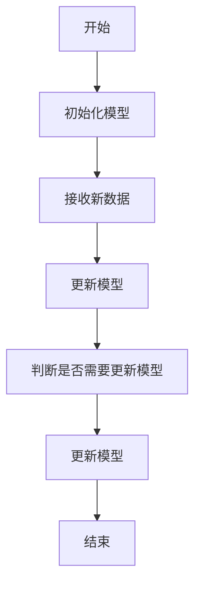
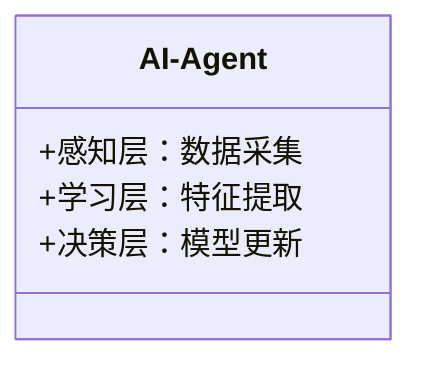

                 


# AI Agent的增量学习与概念漂移检测

## 关键词

- AI Agent
- 增量学习
- 概念漂移检测
- 数据流学习
- 动态环境适应
- 模型更新

## 摘要

本文系统探讨了AI Agent在增量学习和概念漂移检测中的应用，结合理论分析和实际案例，详细介绍了相关概念、算法原理、系统架构及实现方法。通过对增量学习和概念漂移检测的深入分析，展示了如何在动态环境中有效更新模型并检测概念变化，为AI Agent的持续进化提供了理论和实践指导。

---

### 第1章：AI Agent的背景与问题背景

#### 1.1 AI Agent的基本概念

AI Agent（智能体）是指能够感知环境、做出决策并执行动作的实体。AI Agent具备以下核心特征：

- **自主性**：能够在没有外部干预的情况下自主运行。
- **反应性**：能够实时感知环境变化并做出反应。
- **目标导向性**：具备明确的目标，并采取行动以实现这些目标。
- **学习能力**：通过与环境交互不断优化自身的行为。

AI Agent广泛应用于推荐系统、自动驾驶、智能客服等领域。

#### 1.2 增量学习与概念漂移检测的背景

在动态环境中，数据流是持续变化的，AI Agent需要适应这些变化。增量学习和概念漂移检测是实现这一目标的关键技术。

- **问题背景**：数据流的实时更新和概念变化使得传统批量学习方法难以适应。
- **问题解决**：通过增量学习和概念漂移检测，AI Agent能够实时更新模型并适应新环境。
- **核心要素**：数据流、模型更新、概念变化检测。

---

### 第2章：增量学习的核心概念

#### 2.1 增量学习的定义与特点

增量学习是一种在数据流中逐步学习的方法，特点如下：

- **实时性**：能够实时处理数据流。
- **高效性**：仅更新模型增量部分，节省计算资源。
- **动态性**：适应数据分布的变化。

#### 2.2 增量学习的算法分类

- **增量决策树**：通过动态添加新数据点，更新决策树结构。
- **增量随机森林**：在流数据环境下动态构建森林。
- **增量支持向量机**：在线更新支持向量，适应数据变化。

---

### 第3章：概念漂移检测的原理

#### 3.1 概念漂移的定义与类型

- **突然漂移**：概念在短时间内突然变化。
- **渐进漂移**：概念逐渐变化。
- **周期性漂移**：概念周期性变化。

概念漂移的类型可以通过以下公式表示：

$$
\Delta t = |t_{current} - t_{previous}|
$$

其中，$\Delta t$表示时间差，用于检测概念变化的速度。

#### 3.2 概念漂移检测的方法

- **统计方法**：通过统计测试检测分布变化。
- **分布差异检测**：计算数据分布的变化。
- **基于模型的方法**：通过模型预测结果的变化判断概念漂移。

---

### 第4章：增量学习与概念漂移检测的联系

#### 4.1 增量学习与概念漂移检测的结合

增量学习需要依赖概念漂移检测来判断是否需要更新模型，而概念漂移检测则依赖增量学习提供的模型更新机制。

#### 4.2 挑战与解决方案

- **挑战**：模型更新与漂移检测之间的协调问题。
- **解决方案**：优化模型更新策略和漂移检测机制。

---

### 第5章：算法原理与数学模型

#### 5.1 增量学习的算法流程

使用mermaid流程图展示增量学习的算法步骤：



#### 5.2 概念漂移检测的数学公式

分布差异检测的数学公式：

$$
D = \sum_{i=1}^{n} |p_i - q_i|
$$

其中，$p_i$和$q_i$分别是旧数据和新数据的概率分布。

---

### 第6章：系统架构与设计

#### 6.1 系统架构设计

使用mermaid类图展示AI Agent的系统架构：



#### 6.2 功能模块设计

- 数据采集模块：负责数据流的采集。
- 特征提取模块：提取数据特征。
- 增量学习模块：更新模型。
- 概念漂移检测模块：检测概念变化。

---

### 第7章：项目实战

#### 7.1 环境安装

安装必要的库，如`streamlearn`和`Concept Drift Detection`。

#### 7.2 核心代码实现

```python
import streamlearn as sl
from concept_drift import DriftDetector

# 初始化模型
model = sl.IncrementalTree()

# 概念漂移检测
detector = DriftDetector()
```

#### 7.3 实际案例分析

以在线广告点击率预测为例，展示代码的运行结果和模型的更新过程。

---

### 第8章：最佳实践与总结

#### 8.1 总结

本文详细介绍了AI Agent的增量学习和概念漂移检测技术，展示了它们在动态环境中的应用。

#### 8.2 小结

通过理论与实践结合，帮助读者理解如何在实际项目中应用这些技术。

#### 8.3 注意事项

模型更新和概念漂移检测需要权衡计算资源和检测精度。

#### 8.4 拓展阅读

推荐阅读相关领域的最新研究论文。

---

# 作者：AI天才研究院/AI Genius Institute & 禅与计算机程序设计艺术 /Zen And The Art of Computer Programming

