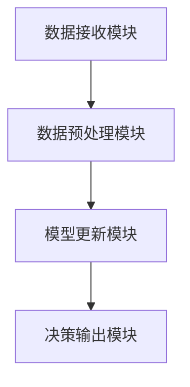
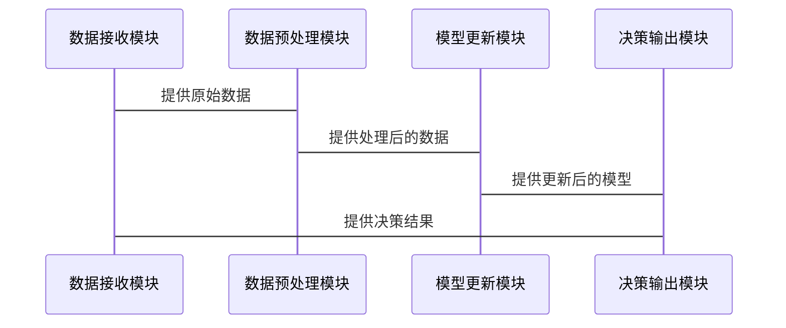

                 


# AI Agent的增量学习：适应动态变化的环境

> 关键词：AI Agent，增量学习，动态环境，机器学习，智能体系统

> 摘要：AI Agent在动态环境中需要不断适应新的变化，增量学习作为一种有效的学习方式，能够帮助AI Agent在数据流不断变化的环境中持续优化性能。本文将从AI Agent的基本概念出发，深入探讨增量学习的核心原理、算法实现、系统架构设计以及实际应用案例，为读者提供全面的增量学习知识体系。

---

## 第1章: AI Agent与增量学习概述

### 1.1 AI Agent的基本概念

#### 1.1.1 AI Agent的定义
AI Agent（人工智能代理）是指能够感知环境并采取行动以实现目标的智能实体。它可以是一个软件程序、机器人或其他智能系统，具备以下核心特征：
- **自主性**：能够在没有外部干预的情况下独立运作。
- **反应性**：能够根据环境变化实时调整行为。
- **目标导向**：所有行为都以实现特定目标为导向。

#### 1.1.2 AI Agent的核心特征
1. **自主性**：AI Agent能够自主决策，无需外部指令。
2. **反应性**：能够实时感知环境并做出反应。
3. **目标导向**：所有行为都以实现目标为核心。

#### 1.1.3 AI Agent的应用场景
- **智能推荐系统**：根据用户行为动态调整推荐内容。
- **自动驾驶**：实时感知环境并做出驾驶决策。
- **智能客服**：根据用户需求动态调整对话内容。

### 1.2 增量学习的背景与意义

#### 1.2.1 动态环境的挑战
动态环境中，数据、任务或目标可能会发生变化，传统的批量学习方法难以适应这种变化。增量学习能够在线处理数据流，实时更新模型，是动态环境下的理想选择。

#### 1.2.2 增量学习的定义
增量学习（Incremental Learning）是指在数据流不断变化的情况下，模型能够在线更新，适应新数据的特性。

#### 1.2.3 增量学习的优势
1. **实时性**：能够快速响应环境变化。
2. **资源效率**：无需存储大量历史数据，节省存储空间。
3. **灵活性**：能够快速适应新任务和数据。

### 1.3 动态环境下的AI Agent

#### 1.3.1 动态环境的特点
- 数据流持续变化。
- 任务目标动态调整。
- 环境条件实时更新。

#### 1.3.2 AI Agent在动态环境中的角色
AI Agent作为动态环境中的主体，需要具备以下能力：
1. **实时感知**：能够快速感知环境变化。
2. **在线学习**：能够根据新数据调整模型。
3. **动态决策**：能够根据最新信息做出决策。

#### 1.3.3 增量学习在动态环境中的应用
- **自动驾驶**：实时调整路径规划。
- **智能推荐系统**：动态调整推荐内容。
- **动态风险评估**：实时更新风险模型。

### 1.4 本章小结
本章介绍了AI Agent的基本概念和增量学习的背景与意义，强调了增量学习在动态环境中的重要性。

---

## 第2章: 增量学习的核心概念与原理

### 2.1 增量学习的基本原理

#### 2.1.1 增量学习的模型
增量学习模型包括以下组成部分：
- **感知器**：负责接收环境中的数据流。
- **学习器**：负责在线更新模型。
- **决策器**：负责根据模型输出采取行动。

#### 2.1.2 增量学习的算法
增量学习算法的核心步骤如下：
1. **数据流接收**：从环境中接收实时数据。
2. **模型更新**：根据新数据更新模型参数。
3. **决策输出**：根据更新后的模型做出决策。

#### 2.1.3 增量学习的特征
- **在线性**：能够实时处理数据流。
- **适应性**：能够快速适应环境变化。
- **轻量性**：对资源消耗较低。

### 2.2 增量学习与传统学习的对比

#### 2.2.1 学习目标的对比
| 学习方式 | 学习目标 |
|----------|----------|
| 批量学习 | 静态数据上的全局最优解 |
| 增量学习 | 动态数据流上的实时更新 |

#### 2.2.2 数据处理方式的对比
| 学习方式 | 数据处理方式 |
|----------|--------------|
| 批量学习 | 一次性处理所有数据 |
| 增量学习 | 逐条处理数据流 |

#### 2.2.3 模型更新机制的对比
| 学习方式 | 模型更新机制 |
|----------|--------------|
| 批量学习 | 定期重新训练整个模型 |
| 增量学习 | 实时更新模型参数 |

### 2.3 增量学习的核心要素

#### 2.3.1 数据流的处理
数据流处理的核心步骤：
1. **数据接收**：从环境中接收实时数据。
2. **数据预处理**：清洗和转换数据。
3. **数据分发**：将数据分发给学习器。

#### 2.3.2 模型更新策略
模型更新策略包括：
1. **在线更新**：实时更新模型参数。
2. **增量优化**：采用优化算法逐步调整模型参数。

#### 2.3.3 适应性评估
适应性评估方法：
1. **性能监控**：监控模型的预测准确率。
2. **反馈机制**：根据环境反馈调整模型。

### 2.4 增量学习的数学模型

#### 2.4.1 基本概念的数学表达
增量学习的目标是最小化损失函数：
$$ L(w) = \frac{1}{n}\sum_{i=1}^{n}l(w;x_i,y_i) $$

#### 2.4.2 增量学习的公式推导
假设损失函数为线性回归的平方损失：
$$ l(w;x_i,y_i) = (y_i - w^T x_i)^2 $$

在线更新权重的公式为：
$$ w_{t+1} = w_t + \eta (y_i - w_t^T x_i)x_i $$

其中，$\eta$ 是学习率，$x_i$ 是输入样本，$y_i$ 是目标值。

#### 2.4.3 模型更新的数学模型
增量学习的模型更新可以表示为：
$$ w_{t+1} = w_t + \eta (y_i - \sigma(w_t^T x_i))x_i $$

其中，$\sigma$ 是sigmoid函数，用于分类任务。

### 2.5 本章小结
本章详细讲解了增量学习的核心概念与原理，包括模型、算法、特征、与传统学习的对比以及数学模型。

---

## 第3章: 增量学习的算法实现与系统架构

### 3.1 增量学习的算法实现

#### 3.1.1 增量学习算法的分类
增量学习算法主要分为以下几类：
1. **在线学习算法**：如感知机算法。
2. **增量树算法**：如非常数树（Very Fast Decision Tree）。
3. **增量聚类算法**：如动态聚类算法。

#### 3.1.2 感知机算法的实现
感知机算法的伪代码如下：

```python
def perceptron(x, y, w, eta):
    while True:
        for i in range(n):
            if sign(w·x_i) != y_i:
                w = w + eta * (y_i - sign(w·x_i)) * x_i
                break
```

其中，$w$ 是权重向量，$x_i$ 是输入样本，$y_i$ 是目标标签，$\eta$ 是学习率。

#### 3.1.3 增量学习算法的实现步骤
1. 初始化模型参数。
2. 逐条接收数据。
3. 更新模型参数。
4. 输出预测结果。

### 3.2 系统架构设计

#### 3.2.1 系统功能设计
系统功能包括：
1. 数据接收模块：接收实时数据流。
2. 数据预处理模块：清洗和转换数据。
3. 模型更新模块：在线更新模型参数。
4. 决策输出模块：根据模型输出采取行动。

#### 3.2.2 系统架构图
以下是系统的架构图：



#### 3.2.3 系统接口设计
系统接口包括：
1. 数据输入接口。
2. 模型更新接口。
3. 决策输出接口。

#### 3.2.4 系统交互序列图
以下是系统的交互序列图：



### 3.3 本章小结
本章详细讲解了增量学习的算法实现和系统架构设计，包括算法分类、实现步骤、系统架构图和交互序列图。

---

## 第4章: 项目实战——动态推荐系统的增量学习应用

### 4.1 项目背景与目标

#### 4.1.1 项目背景
动态推荐系统需要实时更新推荐列表，以满足用户的实时需求。

#### 4.1.2 项目目标
实现一个基于增量学习的动态推荐系统，能够实时更新推荐列表。

### 4.2 项目环境与工具

#### 4.2.1 环境安装
需要安装以下工具：
- Python 3.8+
- NumPy
- scikit-learn
- matplotlib

#### 4.2.2 开发工具
推荐使用Jupyter Notebook进行开发和调试。

### 4.3 核心代码实现

#### 4.3.1 数据流处理
```python
import numpy as np

def data_stream():
    while True:
        x = np.random.rand(100, 2)
        y = np.dot(x, np.array([1, -1])) + 0.5
        yield x, y
```

#### 4.3.2 增量学习模型
```python
class IncrementalModel:
    def __init__(self, input_dim):
        self.weights = np.zeros(input_dim)
    
    def update(self, x, y, eta=0.1):
        prediction = np.dot(x, self.weights)
        error = y - prediction
        self.weights += eta * error * x
```

#### 4.3.3 模型更新与预测
```python
model = IncrementalModel(2)
data_gen = data_stream()

for _ in range(100):
    x, y = next(data_gen)
    model.update(x[0], y[0])
    print(f"Current weights: {model.weights}")
```

### 4.4 代码解读与分析

#### 4.4.1 数据流处理函数
`data_stream()`函数生成一个无限的数据流，每个数据点包括输入特征和目标值。

#### 4.4.2 增量学习模型类
`IncrementalModel`类包含权重更新方法，根据输入数据和目标值逐步更新模型参数。

#### 4.4.3 模型训练与预测
主训练循环不断生成数据点，并调用模型的更新方法，实时更新模型参数。

### 4.5 实际案例分析

#### 4.5.1 动态推荐系统
假设我们有一个动态推荐系统，用户行为数据实时更新。我们需要根据最新的用户行为数据动态调整推荐列表。

#### 4.5.2 模型性能监控
通过监控模型的预测准确率，可以评估模型的适应性。

### 4.6 本章小结
本章通过动态推荐系统的案例，详细讲解了增量学习的实际应用，包括环境安装、核心代码实现和案例分析。

---

## 第5章: 总结与展望

### 5.1 本章总结
本文从AI Agent的基本概念出发，详细讲解了增量学习的核心原理、算法实现和系统架构设计，并通过动态推荐系统的案例展示了增量学习的实际应用。

### 5.2 未来展望
1. **算法优化**：研究更高效的增量学习算法。
2. **系统扩展**：探索增量学习在更多领域的应用。
3. **性能提升**：优化模型的适应性和实时性。

### 5.3 最佳实践 tips
- **数据质量**：确保数据流的质量，避免噪声干扰。
- **模型选择**：根据具体任务选择合适的增量学习算法。
- **性能监控**：定期监控模型的性能，及时调整参数。

### 5.4 小结
增量学习是一种 powerful 的学习方式，能够帮助AI Agent在动态环境中持续优化性能。

### 5.5 注意事项
- 增量学习需要实时处理数据流，对系统的实时性要求较高。
- 模型更新需要考虑计算资源的限制，避免资源消耗过大。

### 5.6 拓展阅读
推荐阅读以下书籍和论文：
- 《Incremental Learning: Theory and Algorithms》
- "Incremental Learning with Incremental Decision Trees" 

---

## 作者：AI天才研究院 & 禅与计算机程序设计艺术

---

**Note:** 如果需要更详细的解释或代码示例，请随时告诉我！

