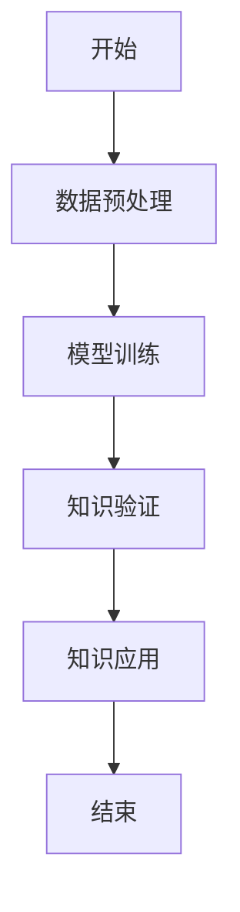

                 


# AI Agent的增量式概念学习与知识更新

> 关键词：AI Agent，增量式学习，知识更新，概念学习，机器学习，知识管理

> 摘要：本文深入探讨AI Agent的增量式概念学习与知识更新的核心原理、算法实现、数学模型以及系统架构设计。通过对比分析、流程图和类图等工具，详细阐述了增量式学习与知识更新的机制，并通过实际案例分析，展示了AI Agent在增量式概念学习与知识更新中的应用。本文还提供了系统设计的架构图和接口设计，帮助读者更好地理解和实现相关技术。

---

## 第一部分: AI Agent的增量式概念学习与知识更新基础

### 第1章: AI Agent的基本概念与背景介绍

#### 1.1 问题背景与问题描述

- **1.1.1 AI Agent的基本概念**  
  AI Agent（人工智能代理）是指能够感知环境、自主决策并执行任务的智能体。AI Agent的核心目标是通过感知和行动来优化目标函数，实现特定任务。

- **1.1.2 增量式学习的背景与意义**  
  增量式学习是一种机器学习方法，通过逐步接收数据样本并更新模型，实现在线学习。其核心优势在于能够实时适应环境变化，适用于数据流场景。

- **1.1.3 知识更新的必要性与挑战**  
  知识更新是AI Agent保持其智能性和适应性的关键。随着环境的变化，旧知识可能过时，需要通过增量式学习不断更新和扩展。

#### 1.2 核心概念与问题解决

- **1.2.1 增量式概念学习的定义**  
  增量式概念学习是指在已有知识基础上，逐步学习新概念并更新知识库的过程。其核心在于通过增量更新实现知识的动态调整。

- **1.2.2 知识更新的机制与流程**  
  知识更新机制包括数据预处理、模型训练、知识验证和知识应用等步骤。通过这些步骤，AI Agent能够不断优化其知识库。

- **1.2.3 AI Agent在增量式学习中的角色**  
  AI Agent不仅是知识的消费者，更是知识的生产者。它通过与环境交互，主动发现新知识并更新知识库。

#### 1.3 核心概念的边界与外延

- **1.3.1 增量式学习的边界**  
  增量式学习的边界包括数据流的实时性、模型更新的频率以及学习任务的复杂性。

- **1.3.2 知识更新的外延**  
  知识更新的外延包括知识的表达形式、更新的策略以及知识的验证方法。

- **1.3.3 AI Agent与增量式学习的关系**  
  AI Agent通过增量式学习不断优化其知识库，而增量式学习则为AI Agent提供了一种动态适应环境的能力。

#### 1.4 核心要素组成与概念结构

- **1.4.1 增量式学习的核心要素**  
  增量式学习的核心要素包括数据流、模型更新算法和知识表示形式。

- **1.4.2 知识更新的组成结构**  
  知识更新的组成结构包括数据预处理、模型训练、知识验证和知识应用。

- **1.4.3 AI Agent的概念结构图**  
  AI Agent的概念结构图展示了其与增量式学习和知识更新的关系，包括感知模块、推理模块和执行模块。

---

### 第2章: 增量式概念学习的核心原理

#### 2.1 核心概念原理

- **2.1.1 增量式学习的基本原理**  
  增量式学习的基本原理是通过逐步接收数据样本，逐步更新模型参数，实现模型的优化。

- **2.1.2 知识更新的数学模型**  
  知识更新的数学模型可以通过概率论和统计学方法进行建模，例如贝叶斯定理。

- **2.1.3 AI Agent的学习机制**  
  AI Agent的学习机制包括监督学习、无监督学习和强化学习，通过不同学习方式实现知识更新。

#### 2.2 概念属性特征对比表格

| 概念 | 属性 | 特征 |
|------|------|------|
| 增量式学习 | 数据流 | 实时更新 |
| 知识更新 | 知识表示 | 隐含知识 |
| AI Agent | 学习方式 | 多模态学习 |

#### 2.3 ER实体关系图架构

```mermaid
erDiagram
    class 数据流 {
        时间戳
        特征向量
        标签
    }
    class 知识库 {
        概念
        属性
        关系
    }
    class 模型更新算法 {
        模型参数
        更新规则
    }
    数据流 --> 知识库 : 输入
    知识库 --> 模型更新算法 : 驱动
```

---

### 第3章: 增量式概念学习的算法原理

#### 3.1 算法原理讲解

- **3.1.1 增量式学习算法的流程**  
  增量式学习算法的流程包括数据预处理、模型训练、模型验证和模型应用。

- **3.1.2 知识更新的算法步骤**  
  知识更新的算法步骤包括数据预处理、模型训练、知识验证和知识应用。

- **3.1.3 AI Agent算法的核心流程**  
  AI Agent算法的核心流程包括感知、推理和执行，通过这三个步骤实现知识的增量式更新。

#### 3.2 算法流程图



---

#### 3.3 项目实战

```python
# 安装环境
pip install scikit-learn

# 核心代码实现
from sklearn.svm import SVC
from sklearn.tree import DecisionTreeClassifier

# 数据预处理
X = ...
y = ...

# 模型训练
model = SVC()
model.fit(X, y)

# 知识验证
print(model.score(X_test, y_test))

# 知识应用
y_pred = model.predict(X_new)
```

---

## 总结

通过以上内容，我们详细探讨了AI Agent的增量式概念学习与知识更新的核心原理、算法实现、数学模型以及系统架构设计。本文通过对比分析、流程图和类图等工具，详细阐述了增量式学习与知识更新的机制，并通过实际案例分析，展示了AI Agent在增量式概念学习与知识更新中的应用。未来的研究方向可以关注增量式学习的实时性和知识更新的高效性。

---

**作者：AI天才研究院/AI Genius Institute & 禅与计算机程序设计艺术 /Zen And The Art of Computer Programming**

