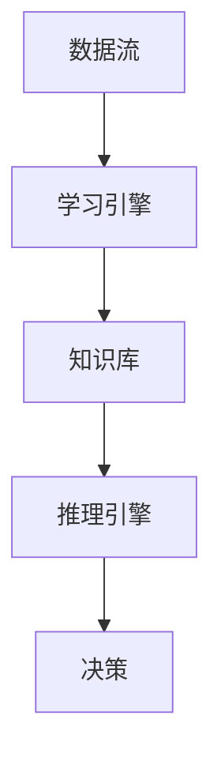
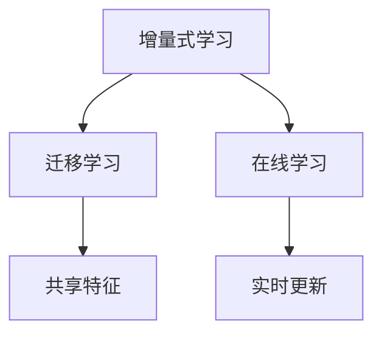
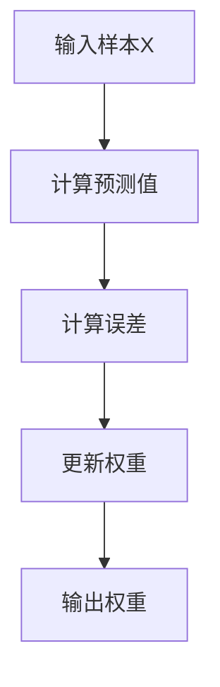
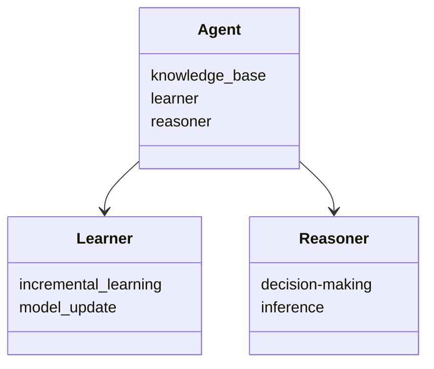
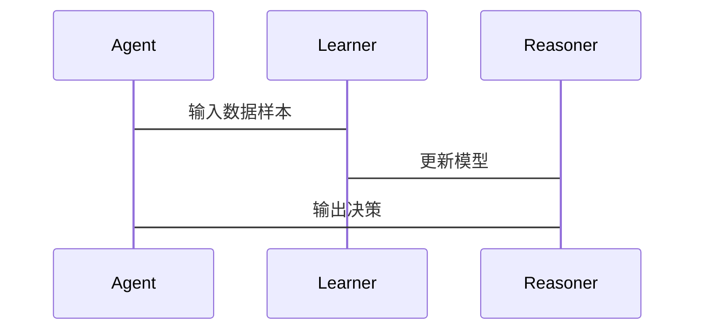

                 


# AI Agent的增量式终身学习框架

> **关键词**：AI Agent, 增量式学习, 终身学习, 迁移学习, 在线学习, 终身学习框架

> **摘要**：本文介绍AI Agent的增量式终身学习框架，涵盖其背景、核心概念、算法原理、系统设计与实现。通过详细分析增量式学习的理论基础、典型算法及其应用场景，结合系统架构设计与项目实战，探讨如何构建高效、灵活的AI Agent学习系统。

---

## 第一章：AI Agent的增量式终身学习框架背景

### 1.1 问题背景与描述

#### 1.1.1 AI Agent的基本概念与特点
- **定义**：AI Agent是具有感知环境、自主决策和执行任务能力的智能体。
- **特点**：实时性、适应性、自主性和学习能力。
- **应用场景**：机器人控制、智能推荐、自动驾驶等领域。

#### 1.1.2 增量式学习的必要性
- **动态环境挑战**：AI Agent需在不断变化的环境中实时适应。
- **数据稀疏性问题**：数据流式到来，传统批量学习难以应对。
- **资源限制**：在线处理需低计算复杂度和存储需求。

#### 1.1.3 终身学习框架的定义与目标
- **定义**：允许AI Agent持续学习新知识，更新模型，适应新任务。
- **目标**：构建动态、高效的学习机制，提升长期任务处理能力。

### 1.2 问题解决与边界

#### 1.2.1 AI Agent学习的核心问题
- **实时性**：需快速适应新数据。
- **连续性**：持续学习，支持长期任务。
- **资源受限**：需在计算和存储限制下运行。

#### 1.2.2 增量式学习的边界与外延
- **边界**：仅处理新数据，不涉及已有数据的重新训练。
- **外延**：结合迁移学习和在线学习，扩展学习能力。

#### 1.2.3 框架设计的约束条件与假设
- **约束条件**：
  1. 学习过程必须在线完成。
  2. 模型更新需高效，避免高计算开销。
  3. 数据流不可中断，保证实时性。
- **假设**：
  1. 新数据与旧数据相关。
  2. 学习任务可分解为增量步骤。

### 1.3 概念结构与核心要素

#### 1.3.1 框架的核心组成
- **数据流**：输入实时数据流。
- **学习引擎**：负责增量式学习算法。
- **知识库**：存储已学知识和模型。
- **推理引擎**：基于新知识做出决策。

#### 1.3.2 各要素之间的关系
- 数据流驱动学习引擎，学习引擎更新知识库，推理引擎利用新知识做出决策。

#### 1.3.3 框架的整体架构图（Mermaid）


---

## 第二章：增量式学习的核心原理

### 2.1 核心概念原理

#### 2.1.1 迁移学习的基本原理
- **定义**：利用已有知识学习新任务，减少数据需求。
- **数学模型**：共享特征表示，减少参数空间。

#### 2.1.2 在线学习的机制
- **实时更新**：每接收到一个样本，立即更新模型。
- **低复杂度**：在线算法需线性或次线性时间复杂度。

#### 2.1.3 增量式学习的数学模型
- **增量梯度下降**：
  $$ w_{t+1} = w_t + \eta (y_t - \hat{y}_t) x_t $$
  其中，$\eta$为学习率，$x_t$为输入样本，$y_t$为真实标签，$\hat{y}_t$为预测值。

### 2.2 核心概念对比分析

#### 2.2.1 迁移学习与在线学习的对比
| 属性          | 迁移学习                | 在线学习                |
|---------------|------------------------|------------------------|
| 数据需求      | 较低，利用已有数据       | 高，实时数据流          |
| 训练时间      | 较长，建立共享表示       | 短，逐样本更新          |
| 适用场景      | 新任务与旧任务相关      | 数据流实时更新          |

#### 2.2.2 增量式学习与其他学习方式的差异
- **批量学习**：一次性处理所有数据，不适合动态环境。
- **离线学习**：不实时更新，适用于静态任务。

### 2.3 实体关系图（Mermaid）



---

## 第三章：增量式学习算法原理

### 3.1 算法原理概述

#### 3.1.1 增量式学习的基本流程
1. 接收实时数据样本。
2. 更新模型参数。
3. 生成预测结果。
4. 输出决策。

### 3.2 典型算法实现

#### 3.2.1 增量梯度下降算法（IGD）
```python
def incremental_gradient_descent(X, y, learning_rate):
    weights = np.zeros(X.shape[1])
    for i in range(len(y)):
        prediction = np.dot(X[i], weights)
        error = y[i] - prediction
        weights += learning_rate * error * X[i]
    return weights
```

#### 3.2.2 增量式支持向量机（ISVM）
```python
def incremental_svm(X, y, C):
    model = SVC(C=C, kernel='linear')
    for i in range(len(y)):
        model.fit(X[:i+1], y[:i+1])
    return model
```

#### 3.2.3 增量式聚类算法（ICA）
```python
def incremental_clustering(X, k):
    from sklearn.cluster import KMeans
    model = KMeans(n_clusters=k)
    for i in range(len(X)):
        model.fit(X[:i+1])
        print(f"Cluster centers after {i+1} samples: {model.cluster_centers_}")
    return model
```

### 3.3 算法流程图（Mermaid）

#### 3.3.1 IGD算法流程


---

## 第四章：系统分析与架构设计

### 4.1 系统功能设计

#### 4.1.1 领域模型（Mermaid类图）


### 4.2 系统架构设计

#### 4.2.1 系统架构（Mermaid架构图）
```mermaid
container AI Agent {
    Agent {
        Knowledge Base
        Learner
        Reasoner
    }
}
container Environment {
    Data Stream
    Decision Output
}
AI Agent --> Environment
```

### 4.3 接口设计与交互（Mermaid序列图）


---

## 第五章：项目实战

### 5.1 环境配置
- **工具**：Python 3.8+, scikit-learn, numpy
- **依赖安装**：
  ```bash
  pip install numpy scikit-learn
  ```

### 5.2 核心实现

#### 5.2.1 IGD算法实现
```python
import numpy as np
from sklearn.linear_model import SGDClassifier

def incremental_gradient_descent(X, y, learning_rate=0.1):
    weights = np.zeros(X.shape[1])
    for i in range(len(y)):
        x = X[i]
        y_pred = np.dot(x, weights)
        error = y[i] - y_pred
        weights += learning_rate * error * x
    return weights

# 示例
X = np.array([[2, 3], [4, 5]])
y = np.array([1, 0])
learning_rate = 0.1
weights = incremental_gradient_descent(X, y, learning_rate)
print("Final weights:", weights)
```

#### 5.2.2 ISVM算法实现
```python
from sklearn.svm import SVC

def incremental_svm(X, y, C=1.0):
    model = SVC(C=C, kernel='linear')
    for i in range(len(y)):
        model.fit(X[:i+1], y[:i+1])
    return model

# 示例
X = np.array([[2, 3], [4, 5]])
y = np.array([1, 0])
model = incremental_svm(X, y)
print("Model support vectors:", model.support_)
```

---

## 第六章：总结与展望

### 6.1 核心知识点总结
- **背景**：AI Agent需应对动态环境，增量式学习是关键。
- **核心概念**：迁移学习与在线学习结合，构建高效框架。
- **算法**：增量梯度下降、ISVM等算法实现在线更新。
- **系统设计**：模块化设计，实时数据处理与模型更新。

### 6.2 挑战与未来展望
- **挑战**：数据稀疏性、模型遗忘、计算资源限制。
- **未来方向**：强化学习与迁移学习结合，分布式计算。

### 6.3 最佳实践 tips
- **模块化设计**：确保各模块独立，便于扩展。
- **实时性优化**：选择低复杂度算法，减少计算开销。
- **模型评估**：定期评估模型性能，及时调整参数。

---

**作者**：AI天才研究院/AI Genius Institute & 禅与计算机程序设计艺术 /Zen And The Art of Computer Programming

