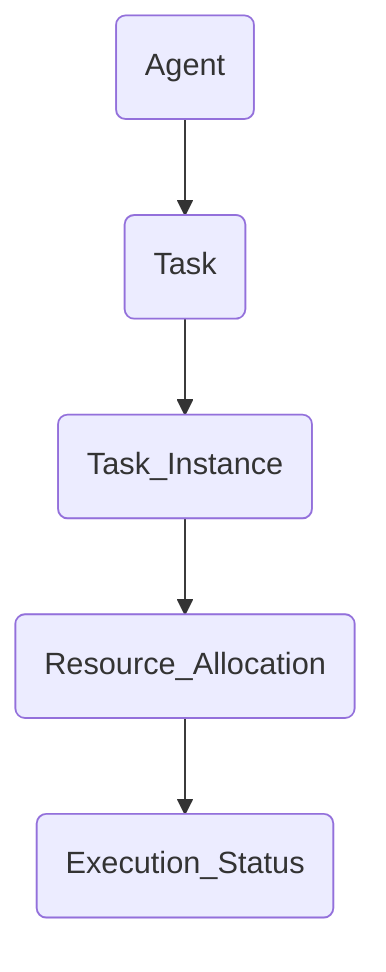
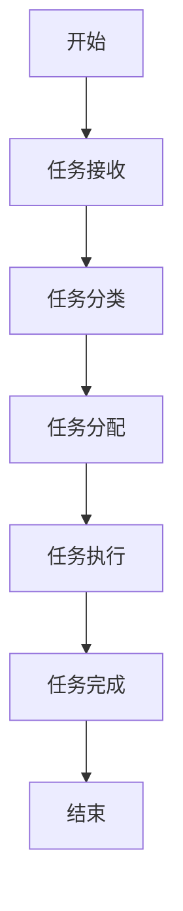
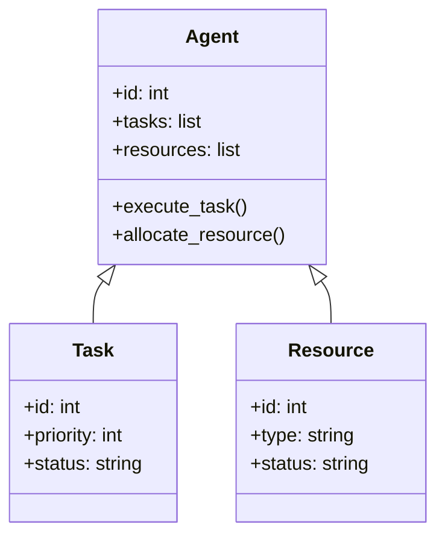
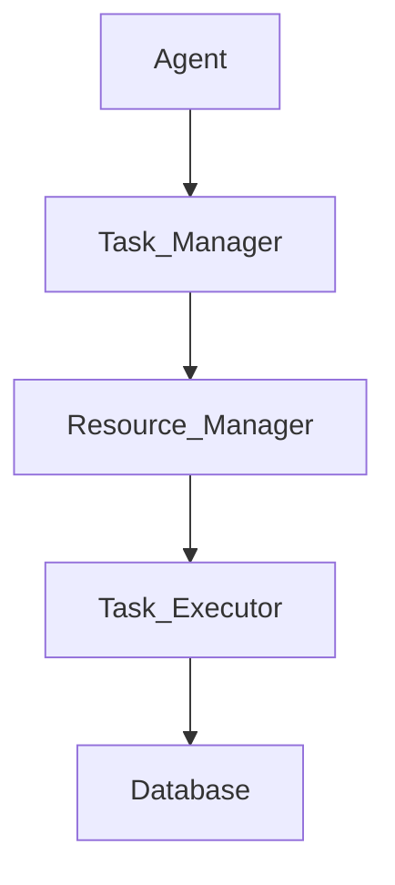
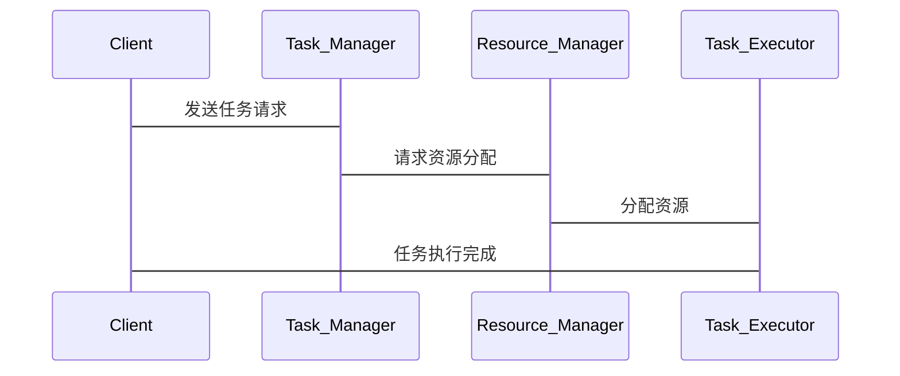

                 


# AI Agent的多任务并行处理能力开发

> 关键词：AI Agent, 多任务并行处理, 系统架构设计, 算法原理, 项目实战

> 摘要：本文详细探讨AI Agent的多任务并行处理能力的开发，从背景介绍、核心概念、算法原理、系统架构设计、项目实战到最佳实践，全面解析AI Agent如何在多任务并行处理中实现高效协作与资源优化。

---

# 第1章: AI Agent的多任务并行处理能力概述

## 1.1 问题背景

### 1.1.1 多任务并行处理的定义
多任务并行处理是指在同一时间段内同时执行多个任务，以提高系统效率和资源利用率。在AI Agent中，多任务并行处理能力是指AI Agent能够同时处理多个任务，每个任务可以独立或协同运行。

### 1.1.2 多任务并行处理的必要性
随着AI技术的快速发展，AI Agent需要在复杂环境中执行多种任务，例如同时进行目标识别、路径规划和决策制定。多任务并行处理能够提高AI Agent的响应速度和处理效率。

### 1.1.3 AI Agent在多任务并行处理中的作用
AI Agent通过多任务并行处理能力，能够同时处理多个任务，优化资源分配，减少任务排队时间，提高系统整体性能。

## 1.2 问题描述

### 1.2.1 多任务并行处理的核心挑战
- **资源分配问题**：如何在有限的资源下合理分配任务。
- **任务优先级管理**：如何确定任务的执行顺序。
- **任务协同问题**：如何实现多个任务之间的协同与通信。

### 1.2.2 AI Agent在多任务并行处理中的局限性
- **任务冲突**：多个任务可能争夺相同的资源。
- **任务依赖**：某些任务之间存在依赖关系，影响并行处理的效率。
- **系统复杂性**：多任务并行处理增加了系统的复杂性。

### 1.2.3 问题解决的思路与方法
- **资源分配优化**：采用动态资源分配算法。
- **任务优先级管理**：基于任务的重要性和紧急性进行优先级排序。
- **任务协同机制**：设计任务间通信机制，确保任务协同。

## 1.3 问题解决

### 1.3.1 多任务并行处理的实现方式
- **基于进程的并行处理**：利用多线程或多进程实现任务并行。
- **基于事件驱动的并行处理**：通过事件驱动的方式处理任务。

### 1.3.2 AI Agent如何优化多任务并行处理
- **任务调度优化**：采用高效的调度算法。
- **资源分配优化**：动态调整资源分配策略。
- **任务协同优化**：设计高效的协同机制。

### 1.3.3 多任务并行处理的边界与外延
- **边界**：任务之间的独立性和依赖性。
- **外延**：任务的并行处理对系统性能的影响。

## 1.4 概念结构与核心要素

### 1.4.1 多任务并行处理的核心要素
- **任务分解**：将复杂任务分解为多个子任务。
- **任务调度**：确定任务的执行顺序。
- **资源分配**：合理分配资源。

### 1.4.2 AI Agent的结构与功能
- **感知层**：感知环境信息。
- **决策层**：制定决策。
- **执行层**：执行任务。

### 1.4.3 多任务并行处理与AI Agent的结合
- **任务分配**：AI Agent根据任务优先级分配资源。
- **任务协同**：AI Agent协调多个任务的执行。

## 1.5 本章小结
本章从背景、问题描述、问题解决、概念结构与核心要素四个方面详细介绍了AI Agent的多任务并行处理能力，为后续章节的深入分析奠定了基础。

---

# 第2章: AI Agent的核心概念与联系

## 2.1 核心概念原理

### 2.1.1 多任务并行处理的原理
多任务并行处理基于并行计算和任务调度原理，通过合理分配资源和任务调度实现多个任务的并行执行。

### 2.1.2 AI Agent的核心算法
AI Agent的核心算法包括任务调度算法、资源分配算法和任务协同算法。

### 2.1.3 多任务并行处理与AI Agent的关系
多任务并行处理是AI Agent实现高效执行的重要手段，AI Agent通过多任务并行处理能力优化系统性能。

## 2.2 概念属性特征对比

### 2.2.1 多任务并行处理的特征
| 特征 | 描述 |
|------|------|
| 并行性 | 同时执行多个任务 |
| 分散性 | 任务之间相对独立 |
| 资源共享 | 多任务共享系统资源 |

### 2.2.2 AI Agent的特征
| 特征 | 描述 |
|------|------|
| 智能性 | 能够感知和决策 |
| 自主性 | 能够自主执行任务 |
| 适应性 | 能够适应环境变化 |

### 2.2.3 两者特征对比分析
多任务并行处理强调任务的并行执行和资源优化，AI Agent强调智能性和自主性，两者结合能够实现高效的任务处理。

## 2.3 ER实体关系图



## 2.4 本章小结
本章通过概念属性特征对比和ER实体关系图，详细分析了多任务并行处理与AI Agent的核心概念及其联系。

---

# 第3章: AI Agent多任务并行处理的算法原理

## 3.1 算法原理

### 3.1.1 并行处理的基本原理
并行处理的基本原理是通过分解任务并行执行，减少任务执行时间。

### 3.1.2 AI Agent的任务分配算法
AI Agent的任务分配算法包括贪心算法、遗传算法和粒子群算法。

### 3.1.3 多任务并行处理的优化算法
优化算法包括动态规划算法和模拟退火算法。

## 3.2 算法流程图



## 3.3 算法实现

### 3.3.1 Python源代码
```python
import threading

def task_function(args):
    print(f"Executing task {args['task_id']} with priority {args['priority']}")

def main():
    tasks = [
        {'task_id': 1, 'priority': 1},
        {'task_id': 2, 'priority': 2},
        {'task_id': 3, 'priority': 3}
    ]
    
    threads = []
    for task in tasks:
        thread = threading.Thread(target=task_function, args=(task,))
        threads.append(thread)
        thread.start()
    
    for thread in threads:
        thread.join()

if __name__ == "__main__":
    main()
```

### 3.3.2 算法原理解读
上述代码实现了多任务并行处理，通过多线程技术同时执行多个任务。每个任务在独立的线程中执行，任务之间通过共享资源进行通信。

## 3.4 数学模型与公式

### 3.4.1 算法优化公式
$$ \text{优化目标} = \min \sum_{i=1}^{n} t_i $$
其中，\( t_i \) 表示任务 \( i \) 的执行时间。

### 3.4.2 资源分配公式
$$ \text{资源分配比例} = \frac{\text{任务优先级}}{\sum_{i=1}^{n} \text{任务优先级}} $$

## 3.5 本章小结
本章通过算法原理、流程图、代码实现和数学公式，详细讲解了AI Agent多任务并行处理的实现方式和优化方法。

---

# 第4章: AI Agent多任务并行处理的系统架构设计

## 4.1 项目介绍
本项目旨在开发一个支持多任务并行处理的AI Agent系统，实现任务的高效调度和资源优化。

## 4.2 系统功能设计

### 4.2.1 领域模型


### 4.2.2 功能模块
- **任务管理模块**：负责任务的接收、分类和分配。
- **资源管理模块**：负责资源的分配和监控。
- **任务执行模块**：负责任务的具体执行。

## 4.3 系统架构设计

### 4.3.1 架构图


### 4.3.2 组件交互
- **任务管理模块**接收任务，分配给资源管理模块。
- **资源管理模块**分配资源，通知任务执行模块。
- **任务执行模块**执行任务，更新数据库状态。

## 4.4 系统接口设计

### 4.4.1 接口描述
- **任务接收接口**：接收外部任务请求。
- **资源分配接口**：分配资源给任务。
- **任务执行接口**：执行具体任务。

### 4.4.2 接口交互流程图


## 4.5 本章小结
本章通过系统架构设计和组件交互，详细描述了AI Agent多任务并行处理的系统实现方式。

---

# 第5章: AI Agent多任务并行处理的项目实战

## 5.1 环境安装
- **操作系统**：Linux/Windows/MacOS
- **开发工具**：Python/PyCharm
- **依赖库**：threading, queue

## 5.2 核心代码实现

### 5.2.1 任务管理模块
```python
import queue

class TaskManager:
    def __init__(self):
        self.task_queue = queue.Queue()

    def add_task(self, task):
        self.task_queue.put(task)

    def get_task(self):
        return self.task_queue.get()
```

### 5.2.2 资源管理模块
```python
class ResourceManager:
    def __init__(self):
        self.resources = []

    def allocate_resource(self, task):
        # 分配资源给任务
        pass
```

### 5.2.3 任务执行模块
```python
class TaskExecutor:
    def execute_task(self, task):
        print(f"Executing task {task['id']}")
```

## 5.3 代码应用解读与分析
上述代码实现了任务管理、资源管理和任务执行模块。任务管理模块负责任务的接收和分配，资源管理模块负责资源的分配，任务执行模块负责任务的具体执行。

## 5.4 实际案例分析

### 5.4.1 案例描述
假设我们有一个AI Agent需要同时执行三个任务：目标识别、路径规划和决策制定。

### 5.4.2 任务分配与执行
```python
task1 = {'id': 1, 'priority': 1}
task2 = {'id': 2, 'priority': 2}
task3 = {'id': 3, 'priority': 3}

task_manager = TaskManager()
task_manager.add_task(task1)
task_manager.add_task(task2)
task_manager.add_task(task3)

# 分配资源并执行任务
```

## 5.5 项目小结
本章通过项目实战，详细讲解了AI Agent多任务并行处理的实现过程，包括环境安装、核心代码实现和案例分析。

---

# 第6章: 最佳实践与注意事项

## 6.1 小结
通过本文的分析和实践，我们掌握了AI Agent多任务并行处理的实现方法和优化技巧。

## 6.2 注意事项
- **任务优先级管理**：合理设置任务优先级，避免任务冲突。
- **资源分配优化**：动态调整资源分配策略，提高资源利用率。
- **任务协同机制**：设计高效的协同机制，确保任务协同。

## 6.3 拓展阅读
- **并行计算**：深入学习并行计算的相关知识。
- **任务调度算法**：研究更多任务调度算法，如负载均衡算法。

---

# 作者

作者：AI天才研究院/AI Genius Institute & 禅与计算机程序设计艺术 /Zen And The Art of Computer Programming

