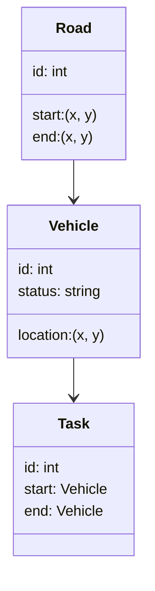
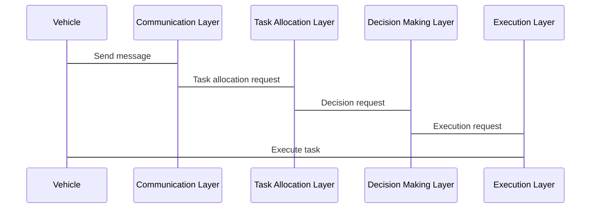

                 


# AI Agent的多智能体协作与竞争机制

---

## 关键词：AI Agent、多智能体系统、协作机制、竞争机制、分布式智能

---

## 摘要：

本文深入探讨了AI Agent在多智能体系统中的协作与竞争机制。首先，我们从多智能体系统的背景出发，介绍了AI Agent的基本概念及其在协作与竞争中的作用。接着，我们详细分析了协作与竞争机制的原理、模型和实现方法，包括基于规则和基于学习的算法。随后，我们通过系统架构设计和实际项目案例，展示了如何在实际场景中实现这些机制。最后，我们总结了协作与竞争机制在多智能体系统中的重要性，并提出了进一步研究的方向。

---

## 第1章: 多智能体系统概述

### 1.1 多智能体系统的基本概念

多智能体系统（Multi-Agent System, MAS）是由多个智能体（Agent）组成的分布式系统，这些智能体能够通过协作与竞争完成复杂的任务。多智能体系统的优点在于，多个智能体可以分工合作，提高系统的整体性能和灵活性。

#### 1.1.1 多智能体系统的定义与特点

- **定义**：多智能体系统是由多个相互作用的智能体组成的系统，这些智能体能够通过通信和协调完成特定任务。
- **特点**：
  - 分布式：智能体独立运行，通过通信协作。
  - 动态性：系统环境和智能体状态动态变化。
  - 协作性：智能体之间需要协作完成共同目标。
  - 竞争性：智能体之间可能为了资源或目标而竞争。

#### 1.1.2 多智能体系统的核心要素

- **智能体**：具备感知和行动能力的实体。
- **通信**：智能体之间的信息交换机制。
- **协作与竞争**：智能体之间的合作与竞争关系。
- **任务分配**：智能体根据自身能力分配任务。

#### 1.1.3 多智能体系统的分类与应用领域

- **分类**：
  - 基于任务的多智能体系统：智能体协作完成特定任务。
  - 基于市场的多智能体系统：智能体通过市场机制分配资源。
- **应用领域**：
  - 自动驾驶：多个车辆协作与竞争。
  - 智能交通系统：智能体协调交通流量。
  - 电子商务：智能体协作完成订单处理。

### 1.2 AI Agent的基本概念

AI Agent是具备人工智能能力的智能体，能够通过感知环境和采取行动来实现目标。

#### 1.2.1 AI Agent的定义与特点

- **定义**：AI Agent是能够感知环境、自主决策并采取行动的智能体。
- **特点**：
  - 自主性：能够自主决策。
  - 反应性：能够实时感知环境并做出反应。
  - 社会性：能够与其他智能体协作或竞争。

#### 1.2.2 AI Agent的分类与功能

- **分类**：
  - 简单反射型Agent：基于当前感知做出反应。
  - 目标驱动型Agent：基于目标驱动行动。
  - 计划驱动型Agent：基于计划采取行动。
- **功能**：
  - 感知环境：通过传感器获取环境信息。
  - 决策：基于感知信息做出决策。
  - 行动：通过执行器采取行动。

#### 1.2.3 AI Agent与传统智能体的区别

- **区别**：
  - AI Agent具备学习和自适应能力。
  - 传统智能体通常基于固定规则执行任务。

### 1.3 多智能体协作与竞争机制的背景与意义

#### 1.3.1 多智能体协作与竞争的背景

随着AI技术的发展，多智能体系统在多个领域得到广泛应用。然而，多智能体系统中的协作与竞争机制是实现高效任务完成的关键。

#### 1.3.2 协作与竞争机制的重要性

- **协作**：通过协作，多个智能体能够共同完成复杂的任务。
- **竞争**：通过竞争，智能体能够优化资源利用和提高系统效率。

#### 1.3.3 多智能体协作与竞争的应用场景

- **自动驾驶**：多个车辆协作与竞争完成交通任务。
- **智能电网**：智能体协作分配能源资源。
- **电子商务**：智能体协作完成订单处理。

## 1.4 本章小结

本章介绍了多智能体系统的基本概念和AI Agent的特点，强调了协作与竞争机制的重要性，并展望了其在多个领域的应用。

---

## 第2章: 多智能体协作机制

### 2.1 协作机制的原理

协作机制是多智能体系统中智能体之间通过合作完成共同目标的过程。

#### 2.1.1 协作的基本原理

- **协作的目标**：通过协作实现共同目标。
- **协作的方式**：通过通信和协调完成任务分配。

#### 2.1.2 协作的目标与约束

- **目标**：提高任务完成效率。
- **约束**：资源有限、任务优先级等。

#### 2.1.3 协作的实现方法

- **基于规则的协作**：智能体根据预定义规则进行协作。
- **基于价值的协作**：智能体根据任务价值进行协作。

### 2.2 协作机制的模型

#### 2.2.1 协作模型的分类

- **基于任务的协作模型**：根据任务需求分配智能体。
- **基于资源的协作模型**：根据资源分配智能体。

#### 2.2.2 协作模型的优缺点对比

| 模型类型 | 优点 | 缺点 |
|----------|------|------|
| 基于任务 | 高效 | 需要明确任务分配 |
| 基于资源 | 灵活 | 需要动态资源管理 |

#### 2.2.3 协作模型的数学描述

协作模型可以用图论中的图表示，节点表示智能体，边表示协作关系。

### 2.3 协作机制的实现

#### 2.3.1 基于规则的协作

智能体根据预定义规则进行协作。

#### 2.3.2 基于价值的协作

智能体根据任务价值进行协作。

#### 2.3.3 基于学习的协作

智能体通过学习优化协作策略。

### 2.4 本章小结

本章详细讲解了协作机制的原理、模型和实现方法，强调了协作在多智能体系统中的重要性。

---

## 第3章: 多智能体竞争机制

### 3.1 竞争机制的原理

竞争机制是多智能体系统中智能体之间为了资源或目标而竞争的过程。

#### 3.1.1 竞争的基本原理

- **竞争的目标**：通过竞争优化资源利用。
- **竞争的方式**：通过竞争规则分配资源。

#### 3.1.2 竞争的目标与约束

- **目标**：提高系统效率。
- **约束**：资源有限、任务优先级等。

#### 3.1.3 竞争的实现方法

- **基于规则的竞争**：智能体根据预定义规则进行竞争。
- **基于价值的竞争**：智能体根据任务价值进行竞争。

### 3.2 竞争机制的模型

#### 3.2.1 竞争模型的分类

- **基于任务的竞争模型**：根据任务需求分配资源。
- **基于资源的竞争模型**：根据资源分配智能体。

#### 3.2.2 竞争模型的优缺点对比

| 模型类型 | 优点 | 缺点 |
|----------|------|------|
| 基于任务 | 高效 | 需要明确任务分配 |
| 基于资源 | 灵活 | 需要动态资源管理 |

#### 3.2.3 竞争模型的数学描述

竞争模型可以用图论中的图表示，节点表示智能体，边表示竞争关系。

### 3.3 竞争机制的实现

#### 3.3.1 基于规则的竞争

智能体根据预定义规则进行竞争。

#### 3.3.2 基于价值的竞争

智能体根据任务价值进行竞争。

#### 3.3.3 基于学习的竞争

智能体通过学习优化竞争策略。

### 3.4 本章小结

本章详细讲解了竞争机制的原理、模型和实现方法，强调了竞争在多智能体系统中的重要性。

---

## 第4章: 协作与竞争的算法原理

### 4.1 协作算法的原理与实现

#### 4.1.1 基于规则的协作算法

智能体根据预定义规则进行协作。

#### 4.1.2 基于价值的协作算法

智能体根据任务价值进行协作。

#### 4.1.3 基于学习的协作算法

智能体通过学习优化协作策略。

### 4.2 竞争算法的原理与实现

#### 4.2.1 基于规则的竞争算法

智能体根据预定义规则进行竞争。

#### 4.2.2 基于价值的竞争算法

智能体根据任务价值进行竞争。

#### 4.2.3 基于学习的竞争算法

智能体通过学习优化竞争策略。

### 4.3 协作与竞争算法的对比分析

#### 4.3.1 协作与竞争算法的优缺点对比

| 算法类型 | 优点 | 缺点 |
|----------|------|------|
| 基于规则 | 简单 | 需要明确规则 |
| 基于价值 | 灵活 | 需要动态评估 |
| 基于学习 | 高效 | 需要大量数据 |

#### 4.3.2 协作与竞争算法的适用场景

- **协作**：适用于任务明确、规则简单的情况。
- **竞争**：适用于资源有限、需要优化的情况。

### 4.4 本章小结

本章详细讲解了协作与竞争算法的原理与实现方法，分析了不同算法的优缺点及其适用场景。

---

## 第5章: 多智能体协作与竞争的系统架构

### 5.1 系统分析

#### 5.1.1 问题场景介绍

假设我们有一个智能交通系统，多个车辆需要协作与竞争完成交通任务。

#### 5.1.2 系统功能设计

- **任务分配**：根据车辆位置分配任务。
- **协作与竞争**：车辆之间协作完成交通任务，竞争有限资源。

### 5.2 系统架构设计

#### 5.2.1 领域模型类图



#### 5.2.2 系统架构图


#### 5.2.3 系统接口设计

- **通信接口**：智能体之间的通信接口。
- **任务分配接口**：任务分配模块的接口。

#### 5.2.4 系统交互序列图



### 5.3 本章小结

本章通过实际问题场景，设计了多智能体协作与竞争的系统架构，展示了系统各部分的交互关系。

---

## 第6章: 项目实战

### 6.1 环境安装

- **编程语言**：Python
- **框架**：使用Python的多智能体模拟框架，如Multi-Agent Framework。

### 6.2 核心代码实现

#### 6.2.1 协作算法实现

```python
class CollaborativeAgent:
    def __init__(self, id):
        self.id = id
        self.location = (x, y)
    
    def collaborate(self, task):
        # 协作逻辑
        pass
```

#### 6.2.2 竞争算法实现

```python
class CompetitiveAgent:
    def __init__(self, id):
        self.id = id
        self.location = (x, y)
    
    def compete(self, resource):
        # 竞争逻辑
        pass
```

### 6.3 案例分析

#### 6.3.1 案例背景

假设我们有一个智能交通系统，多个车辆需要协作与竞争完成交通任务。

#### 6.3.2 案例实现

```python
# 初始化车辆
vehicles = [Vehicle(1, (0,0)), Vehicle(2, (1,1)), ...]

# 任务分配
tasks = [Task(1, Vehicle(1), Vehicle(2)), Task(2, Vehicle(2), Vehicle(3)), ...]

# 协作与竞争
for task in tasks:
    agents = get_agents_in_task(task)
    agents.collaborate(task)
    agents.compete(resource)
```

#### 6.3.3 案例结果

通过协作与竞争，车辆能够高效完成交通任务。

### 6.4 项目总结

本章通过实际项目展示了多智能体协作与竞争机制的实现，验证了其在实际应用中的有效性。

---

## 第7章: 总结与展望

### 7.1 总结

本文详细探讨了AI Agent在多智能体系统中的协作与竞争机制，分析了其原理、算法和系统架构，并通过实际项目展示了其应用。

### 7.2 展望

未来的研究方向包括更复杂的协作与竞争算法、多智能体系统的动态适应性优化等。

---

## 作者：AI天才研究院/AI Genius Institute & 禅与计算机程序设计艺术 /Zen And The Art of Computer Programming

---

