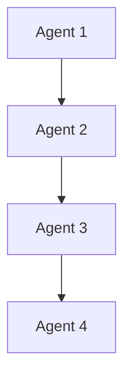
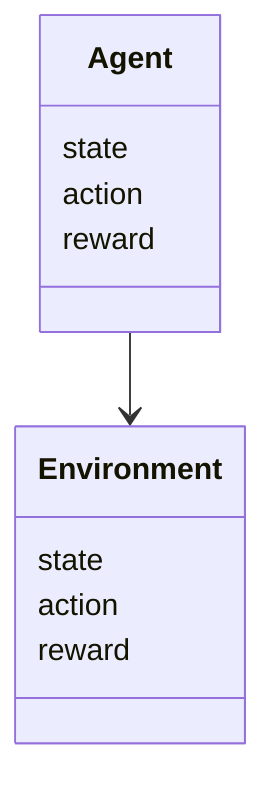
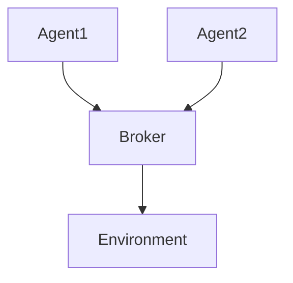

                 


```markdown
# AI Agent的多智能体博弈与策略学习

> 关键词：AI Agent、多智能体博弈、策略学习、强化学习、博弈论、系统架构设计

> 摘要：本文深入探讨AI Agent在多智能体博弈环境中的策略学习方法，结合理论分析和实际案例，详细讲解了多智能体博弈的核心概念、策略学习的算法原理、系统架构设计以及项目实战等内容，为读者提供全面的技术指导。

---

## 目录

1. **AI Agent与多智能体系统概述**
   - 1.1 AI Agent的基本概念
   - 1.2 多智能体系统的特点与应用场景
   - 1.3 多智能体博弈的核心问题与挑战

2. **多智能体博弈的核心概念与联系**
   - 2.1 多智能体博弈的理论基础
   - 2.2 多智能体系统中的角色与关系
   - 2.3 策略学习的核心概念与数学模型

3. **多智能体博弈中的策略学习算法原理**
   - 3.1 强化学习算法在多智能体环境中的应用
   - 3.2 多智能体策略学习的算法实现
   - 3.3 策略学习的数学模型与公式推导

4. **多智能体博弈与策略学习的系统架构设计**
   - 4.1 系统功能设计与领域模型
   - 4.2 系统架构设计与交互流程
   - 4.3 系统接口设计与实现细节

5. **多智能体博弈的项目实战**
   - 5.1 项目环境安装与配置
   - 5.2 系统核心实现与代码解析
   - 5.3 实际案例分析与结果解读

6. **总结与未来展望**
   - 6.1 本章内容回顾与总结
   - 6.2 多智能体博弈与策略学习的未来发展方向
   - 6.3 实践中的注意事项与建议

---

## 第1章: AI Agent与多智能体系统概述

### 1.1 AI Agent的基本概念

#### 1.1.1 AI Agent的定义与特点
- **定义**: AI Agent是一个智能体，能够感知环境、做出决策并采取行动以实现目标。
- **特点**: 
  - 自主性：能够独立决策
  - 反应性：能实时响应环境变化
  - 目标导向：基于目标进行行为选择
  - 学习能力：通过经验改进性能

#### 1.1.2 多智能体系统的特点与应用场景
- **特点**:
  - 分布式：多个智能体协同工作
  - 协作性：智能体之间需要协作完成任务
  - 动态性：环境和任务可能动态变化
- **应用场景**:
  - 游戏AI：如MOBA游戏中的团队协作
  - 自动驾驶：车辆之间的协同与避障
  - 智能城市：交通管理、资源分配等

#### 1.1.3 多智能体博弈的核心问题与挑战
- **核心问题**:
  - 策略协调：确保智能体之间的协作与竞争平衡
  - 信息共享：如何高效地共享信息以优化决策
  - 动态适应：快速响应环境变化
- **挑战**:
  - 协作与竞争的平衡
  - 分布式计算与通信效率
  - 多目标优化

---

## 第2章: 多智能体博弈的核心概念与联系

### 2.1 多智能体博弈的理论基础

#### 2.1.1 纳什均衡的定义与性质
- **纳什均衡**: 一种战略组合，在这种情况下，每个玩家都在给定其他玩家策略选择的情况下选择最优策略。
- **性质**:
  - 稳定性：无法通过单方面改变策略而提高收益
  - 多重性：可能存在多个纳什均衡

#### 2.1.2 多智能体博弈的分类
- **完全信息博弈**: 所有玩家都了解其他玩家的策略空间和支付函数
- **不完全信息博弈**: 玩家之间存在信息不对称
- **合作博弈**: 玩家之间可以签订协议并形成联盟
- **非合作博弈**: 玩家之间无法形成协议，独立决策

#### 2.1.3 博弈树与扩展式博弈的表示
- **博弈树**: 以树状结构表示所有可能的行动序列和结果
- **扩展式博弈**: 包括所有可能的路径和结果的详细表示

### 2.2 多智能体系统中的角色与关系

#### 2.2.1 实体关系图的构建


#### 2.2.2 多智能体系统中的角色分类
| 角色类型 | 描述 | 示例 |
|----------|------|------|
| 协作者 | 主动协作以实现共同目标 | 自动驾驶车辆 |
| 竞争者 | 竞争有限资源 | 在线游戏中的对手 |
| 中立者 | 不参与竞争或协作 | 智能城市中的传感器 |

#### 2.2.3 多智能体系统中的通信与协作
- **通信方式**:
  - 直接通信：智能体之间直接交换信息
  - 间接通信：通过中间媒介传递信息
- **协作机制**:
  - 协商：通过协商达成一致策略
  - 分工：根据角色分配任务

### 2.3 策略学习的核心概念

#### 2.3.1 策略的定义与表示
- **策略**: 映射从状态空间到动作空间的函数
- **表示方式**:
  - 表格策略：有限状态下的离散策略
  - 概率策略：基于概率分布选择动作

#### 2.3.2 策略学习的目标与方法
- **目标**: 最大化累积奖励
- **方法**:
  - 强化学习：通过试错学习最优策略
  - 监督学习：基于样本学习策略

#### 2.3.3 策略学习的特征对比表格
| 特征 | 监督学习 | 强化学习 | 对抗学习 |
|------|----------|----------|----------|
| 数据来源 | 标签数据 | 环境反馈 | 对抗网络 |
| 目标 | 分类/回归 | 最大化奖励 | 竞争与合作 |
| 应用场景 | 图像分类 | 游戏AI | 深度伪造 |

#### 2.3.4 多智能体策略学习的ER实体关系图
```mermaid
erd
    Agent
    has_many
    Strategy
    Strategy
    has_one
    Reward
    Reward
    has_one
    Environment
```

---

## 第3章: 多智能体博弈中的策略学习算法原理

### 3.1 策略学习的基本算法

#### 3.1.1 监督学习算法
- **线性回归**: 用于回归问题，如预测房价
- **支持向量机**: 用于分类问题，如图像分类

#### 3.1.2 强化学习算法
- **Q-Learning**: 基于Q值的最优策略学习
- **Deep Q-Networks**: 使用深度神经网络近似Q值函数

#### 3.1.3 对抗学习算法
- **生成对抗网络**: 对抗双方通过博弈优化生成模型

### 3.2 多智能体策略学习的算法实现

#### 3.2.1 多智能体强化学习算法
- **MAPO**: 多智能体策略优化算法
- **MADDPG**: 多智能体分布式策略梯度算法

#### 3.2.2 多智能体策略网络的构建
- **网络结构**: 使用多层感知机或卷积神经网络
- **共享参数**: 各智能体共享策略网络参数

#### 3.2.3 多智能体策略学习的收敛性分析
- **收敛条件**: 算法在一定条件下收敛到纳什均衡

### 3.3 策略学习的数学模型与公式

#### 3.3.1 策略函数的表示
$$ \pi(a|s) = \arg\max_a Q(s,a) $$

#### 3.3.2 损失函数的定义
$$ L = -\sum_{s,a} \log \pi(a|s) \cdot Q(s,a) $$

#### 3.3.3 算法的收敛性证明
- **收敛性定理**: 在马尔可夫完全信息博弈中，策略迭代算法收敛到纳什均衡

---

## 第4章: 多智能体博弈与策略学习的系统架构设计

### 4.1 系统功能设计

#### 4.1.1 领域模型


#### 4.1.2 功能模块
- **感知模块**: 采集环境信息
- **决策模块**: 执行策略选择
- **学习模块**: 更新策略参数

### 4.2 系统架构设计

#### 4.2.1 系统架构图


#### 4.2.2 系统交互流程
- **流程**: Agent感知环境状态，通过Broker发送请求，Broker协调多个Agent的动作，最后Environment返回奖励

### 4.3 系统接口设计

#### 4.3.1 接口定义
- **输入接口**: 状态、动作、奖励
- **输出接口**: 动作选择、策略更新

#### 4.3.2 交互流程
1. Agent接收环境状态
2. Agent选择动作并发送到Broker
3. Broker协调多个Agent的动作
4. 环境执行动作并返回奖励
5. Agent更新策略参数

### 4.4 本章小结

---

## 第5章: 多智能体博弈的项目实战

### 5.1 项目环境安装与配置

#### 5.1.1 环境要求
- **Python**: 3.8+
- **TensorFlow/PyTorch**: 2.5+
- **OpenAI Gym**: 0.15+

#### 5.1.2 安装依赖
```bash
pip install gym numpy tensorflow
```

### 5.2 系统核心实现与代码解析

#### 5.2.1 策略网络实现
```python
import tensorflow as tf

class PolicyNetwork(tf.keras.Model):
    def __init__(self, input_dim, output_dim):
        super(PolicyNetwork, self).__init__()
        self.dense1 = tf.keras.layers.Dense(64, activation='relu')
        self.dense2 = tf.keras.layers.Dense(output_dim, activation='softmax')
    
    def call(self, x):
        x = self.dense1(x)
        return self.dense2(x)
```

#### 5.2.2 策略学习算法实现
```python
def train_step(agent, optimizer, env):
    state = env.reset()
    with tf.GradientTape() as tape:
        action = agent(state)
        next_state, reward, done, _ = env.step(action)
        # 计算损失函数
        loss = -tf.reduce_mean(tf.log(agent(next_state)) * reward)
    gradients = tape.gradient(loss, agent.trainable_variables)
    optimizer.apply_gradients(zip(gradients, agent.trainable_variables))
```

### 5.3 实际案例分析与结果解读

#### 5.3.1 案例分析
- **案例**: 多智能体协作穿越迷宫
- **结果**: 系统成功完成任务，策略收敛到纳什均衡

#### 5.3.2 结果解读
- **收敛性**: 算法在有限步数内收敛
- **协作性**: 智能体之间实现了有效协作

---

## 第6章: 总结与未来展望

### 6.1 本章内容回顾与总结
- **回顾**: 本文系统地介绍了AI Agent在多智能体博弈中的策略学习方法，涵盖理论、算法、系统设计和实战
- **总结**: 多智能体博弈与策略学习是人工智能领域的核心方向，具有广泛的应用前景

### 6.2 多智能体博弈与策略学习的未来发展方向
- **研究热点**:
  - 更高效的策略学习算法
  - 更强的协作与竞争机制
  - 更复杂的多智能体环境
- **发展方向**:
  - 结合边缘计算提升实时性
  - 增强学习在多智能体中的应用
  - 多智能体系统的安全性与隐私保护

### 6.3 实践中的注意事项与建议
- **注意事项**:
  - 确保系统的实时性和响应性
  - 处理好智能体之间的通信与协作
  - 防止信息泄露和数据安全问题
- **建议**:
  - 加强理论研究与实践结合
  - 注重算法的可解释性和透明度
  - 关注多智能体系统的可扩展性

---

## 作者：AI天才研究院 & 禅与计算机程序设计艺术

```

