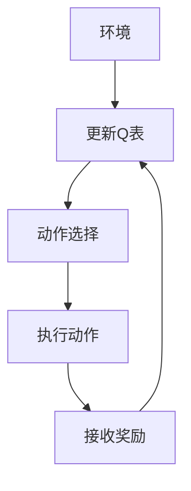
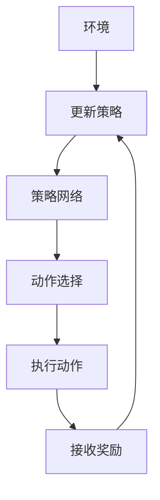
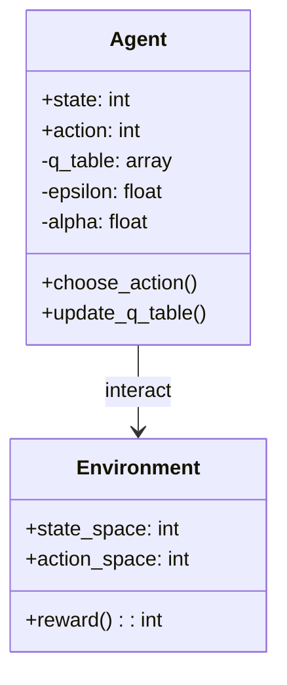
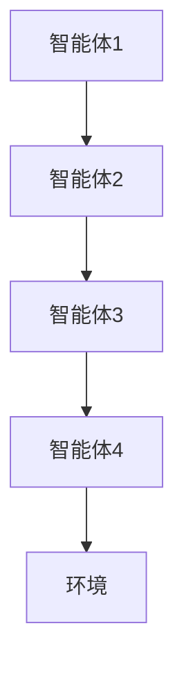
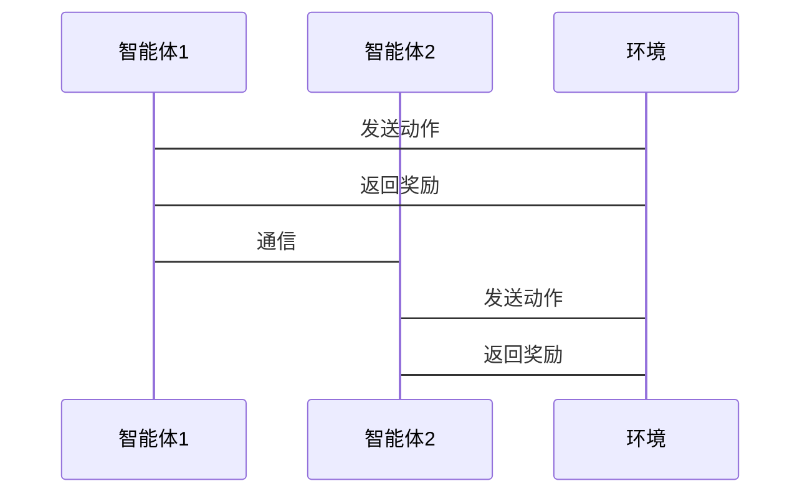

                 


# AI Agent的多智能体强化学习协作机制

## 关键词：
AI Agent, 多智能体系统, 强化学习, 协作机制, 通信机制, 决策机制

## 摘要：
本文系统地探讨了AI Agent在多智能体强化学习中的协作机制，从基本概念、数学模型、算法原理、系统架构到实际应用进行了全面分析。文章首先介绍了AI Agent和多智能体系统的概念，接着详细讲解了协作机制的核心原理，包括通信机制和决策机制。通过数学模型和算法流程图，分析了Q-learning和Actor-Critic算法在多智能体环境中的实现。最后，结合实际案例，探讨了系统设计与实现，并总结了协作机制在实际应用中的注意事项和优化方向。

---

# 第1章: AI Agent与多智能体系统基础

## 1.1 AI Agent的基本概念

### 1.1.1 AI Agent的定义
AI Agent（智能体）是指能够感知环境、做出决策并采取行动的实体。它可以在环境中执行任务，通过与环境的交互来优化自身的行为。

$$
\text{AI Agent的定义：} \quad \text{AI Agent} = \{ \text{感知} \times \text{决策} \times \text{行动} \}
$$

### 1.1.2 AI Agent的核心特征
- **自主性**：能够自主决策和行动。
- **反应性**：能够感知环境并实时调整行为。
- **社会性**：能够与其他智能体或人类进行交互。

### 1.1.3 AI Agent的分类与应用场景
AI Agent可以分为**简单反射型**、**基于模型的反射型**、**目标驱动型**和**效用驱动型**。其应用场景包括自动驾驶、机器人控制、智能助手等。

---

## 1.2 多智能体系统的基本概念

### 1.2.1 多智能体系统的定义
多智能体系统（Multi-Agent System, MAS）是由多个智能体组成的系统，这些智能体通过协作完成复杂任务。

### 1.2.2 多智能体系统的组成要素
- **智能体**：系统的执行单元。
- **环境**：智能体所处的外部世界。
- **通信**：智能体之间的信息交换。
- **协作**：智能体之间的协同行为。

### 1.2.3 多智能体系统的特点与优势
- **分布式计算**：任务分布在多个智能体中。
- **协作性**：智能体之间通过协作完成任务。
- **容错性**：单个智能体故障不会导致整个系统崩溃。

---

## 1.3 强化学习的基本原理

### 1.3.1 强化学习的定义与特点
强化学习（Reinforcement Learning, RL）是一种通过智能体与环境交互来学习策略的方法。其特点是通过试错学习，智能体通过不断尝试动作来最大化累计奖励。

### 1.3.2 强化学习的核心要素
- **状态（State）**：环境的当前情况。
- **动作（Action）**：智能体的行为。
- **奖励（Reward）**：智能体行为的反馈。
- **策略（Policy）**：智能体选择动作的规则。

### 1.3.3 强化学习与监督学习的区别
| **监督学习** | **强化学习** |
|--------------|--------------|
| 数据驱动，基于已知标签进行预测 | 环境驱动，基于奖励进行决策 |
| 适合分类、回归等问题 | 适合需要决策和规划的问题 |

---

## 1.4 多智能体强化学习协作机制的背景

### 1.4.1 多智能体强化学习的背景
随着人工智能技术的发展，多智能体系统在许多领域得到了广泛应用，如自动驾驶、机器人协作、智能城市等。

### 1.4.2 协作机制的重要性
在多智能体系统中，智能体之间的协作是完成任务的关键。有效的协作机制可以提高系统的整体性能。

### 1.4.3 协作机制的应用场景
- **自动驾驶**：车辆之间的协作以避免碰撞。
- **智能交通系统**：交通信号灯的协同控制。
- **游戏AI**：多个游戏角色之间的协作。

---

# 第2章: 多智能体强化学习协作机制的核心概念

## 2.1 多智能体强化学习的协作机制

### 2.1.1 协作机制的定义
协作机制是指智能体之间通过某种方式（如通信或共享信息）来实现协作的方法。

### 2.1.2 协作机制的类型
- **同步协作**：智能体同时进行决策和行动。
- **异步协作**：智能体之间有时间差地进行协作。

### 2.1.3 协作机制的选择依据
| **同步协作** | **异步协作** |
|--------------|--------------|
| 实时性高 | 实时性较低 |
| 通信开销大 | 通信开销较小 |

---

## 2.2 多智能体强化学习中的通信机制

### 2.2.1 通信机制的定义
通信机制是指智能体之间交换信息的方式。

### 2.2.2 通信机制的实现方式
- **直接通信**：智能体之间直接交换信息。
- **间接通信**：通过中间媒介进行信息交换。

### 2.2.3 通信机制的影响因素
- **信息类型**：状态、动作、奖励等。
- **通信频率**：实时通信或周期性通信。

---

## 2.3 多智能体强化学习中的决策机制

### 2.3.1 决策机制的定义
决策机制是指智能体根据环境信息做出决策的方式。

### 2.3.2 常见的决策机制类型
- **集中式决策**：所有智能体共享决策权。
- **分布式决策**：每个智能体独立决策。

### 2.3.3 决策机制的优化方法
- **Q-learning**：通过Q值表进行决策。
- **Actor-Critic**：通过策略和价值函数进行决策。

---

# 第3章: 多智能体强化学习协作机制的数学模型

## 3.1 多智能体强化学习的基本模型

### 3.1.1 状态空间的定义
状态空间是智能体可能处的所有状态的集合。

### 3.1.2 动作空间的定义
动作空间是智能体可以执行的所有动作的集合。

### 3.1.3 奖励函数的设计
奖励函数是用来衡量智能体行为的好坏的标准。

---

## 3.2 协作机制的数学表达

### 3.2.1 协作目标的数学表达
$$
\text{协作目标} = \sum_{i=1}^{n} \text{个体目标}_i
$$

### 3.2.2 协作策略的数学表达
$$
\text{协作策略} = \{\pi_1, \pi_2, \dots, \pi_n\}
$$

### 3.2.3 协作效果的评估指标
- **整体奖励**：系统总奖励。
- **个体奖励**：每个智能体的奖励。

---

## 3.3 多智能体强化学习的算法模型

### 3.3.1 Q-learning算法

#### Q-learning算法流程图



#### Q-learning算法实现代码

```python
import numpy as np

class QLearning:
    def __init__(self, state_space, action_space):
        self.q_table = np.zeros((state_space, action_space))
    
    def choose_action(self, state, epsilon=0.1):
        if np.random.random() < epsilon:
            return np.random.randint(0, action_space)
        return np.argmax(self.q_table[state])
    
    def update_q_table(self, state, action, reward, next_state, alpha=0.1):
        self.q_table[state, action] = (1 - alpha) * self.q_table[state, action] + alpha * (reward + np.max(self.q_table[next_state]))
```

---

## 3.3.2 Actor-Critic算法

### Actor-Critic算法流程图



---

# 第4章: 多智能体强化学习协作机制的系统分析与架构设计

## 4.1 问题场景介绍

### 4.1.1 问题背景
在一个多智能体系统中，多个智能体需要协作完成任务。

### 4.1.2 问题描述
智能体之间需要通过协作机制实现任务目标。

### 4.1.3 问题解决
通过设计协作机制，智能体可以高效协作完成任务。

---

## 4.2 系统功能设计

### 4.2.1 领域模型（Mermaid类图）



---

## 4.3 系统架构设计

### 4.3.1 系统架构图



---

## 4.4 系统接口设计

### 4.4.1 系统接口
- **通信接口**：智能体之间的通信接口。
- **决策接口**：智能体的决策接口。

---

## 4.5 系统交互设计

### 4.5.1 系统交互序列图



---

# 第5章: 多智能体强化学习协作机制的项目实战

## 5.1 环境配置

### 5.1.1 环境介绍
以一个简单的交通信号灯控制问题为例。

---

## 5.2 系统核心实现

### 5.2.1 核心代码实现

```python
import numpy as np

class MultiAgentQLearning:
    def __init__(self, num_agents, state_space, action_space):
        self.num_agents = num_agents
        self.q_tables = [np.zeros((state_space, action_space)) for _ in range(num_agents)]
    
    def choose_action(self, agent_id, state, epsilon=0.1):
        if np.random.random() < epsilon:
            return np.random.randint(0, action_space)
        return np.argmax(self.q_tables[agent_id][state])
    
    def update_q_tables(self, agent_id, state, action, reward, next_state, alpha=0.1):
        self.q_tables[agent_id][state, action] = (1 - alpha) * self.q_tables[agent_id][state, action] + alpha * (reward + np.max(self.q_tables[agent_id][next_state]))
```

---

## 5.3 代码应用解读与分析

### 5.3.1 代码功能分析
上述代码实现了一个多智能体Q-learning算法，多个智能体通过协作完成任务。

---

## 5.4 实际案例分析

### 5.4.1 案例介绍
以智能交通信号灯控制为例，多个智能体协作控制交通信号灯。

---

## 5.5 项目小结

### 5.5.1 项目总结
通过协作机制，多个智能体可以高效完成任务。

---

# 第6章: 多智能体强化学习协作机制的总结与展望

## 6.1 总结

### 6.1.1 核心内容回顾
本文系统地探讨了AI Agent在多智能体强化学习中的协作机制。

---

## 6.2 小结

### 6.2.1 最佳实践 tips
- 设计协作机制时需要考虑通信和决策机制。
- 在实际应用中需要根据场景选择合适的协作机制。

---

## 6.3 注意事项

### 6.3.1 应用中的注意事项
- 协作机制的选择会影响系统的性能。
- 需要考虑智能体之间的通信开销。

---

## 6.4 拓展阅读

### 6.4.1 相关书籍与论文
- 《Multi-Agent Systems: Algorithmic, Complexity, and Logic》
- 《Cooperative Multi-Agent Systems: Distributed Problem Solving and Distributed AI》

---

作者：AI天才研究院/AI Genius Institute & 禅与计算机程序设计艺术 /Zen And The Art of Computer Programming

