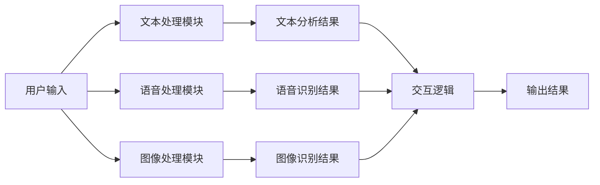
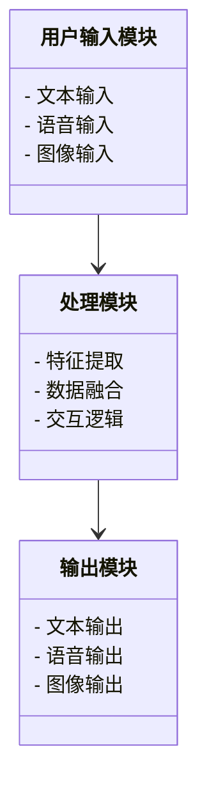
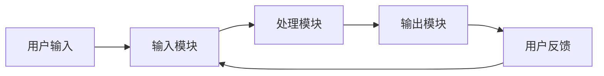

                 


# AI Agent的多模态交互界面设计与实现

## 关键词
- AI Agent
- 多模态交互
- 界面设计
- 算法实现
- 系统架构
- 项目实战

## 摘要
本文详细探讨了AI Agent的多模态交互界面设计与实现的核心问题，从背景、概念、算法、系统架构到项目实战，层层深入，为读者提供了全面的技术指导。文章结合理论与实践，通过丰富的图表和代码示例，帮助读者理解并掌握多模态交互界面设计的关键技术。

---

# 第1章: AI Agent的多模态交互界面设计背景与问题背景

## 1.1 多模态交互界面设计的背景
### 1.1.1 从单模态到多模态交互的演进
随着人工智能技术的快速发展，AI Agent（智能体）的应用场景越来越广泛。传统的单一模态交互方式（如仅文本或仅语音）逐渐暴露出局限性，用户需求的多样化和场景的复杂化推动了多模态交互的发展。

### 1.1.2 AI Agent的核心概念与定义
AI Agent是指能够感知环境、自主决策并执行任务的智能系统。它具备以下核心特征：
- **自主性**：能够自主决策。
- **反应性**：能够实时感知并响应环境变化。
- **目标导向**：具备明确的目标导向能力。

### 1.1.3 多模态交互在AI Agent中的重要性
多模态交互是指通过多种感官通道（如文本、语音、图像等）进行信息交换的过程。在AI Agent中，多模态交互能够提升用户体验、增强系统的智能性和适应性。

## 1.2 问题背景与问题描述
### 1.2.1 当前AI Agent交互界面的主要挑战
- **信息孤岛**：不同模态的数据难以有效融合。
- **用户体验差**：单一模态交互无法满足用户多样化的需求。
- **技术复杂性**：多模态数据的处理和融合需要复杂的技术支持。

### 1.2.2 多模态交互界面设计的目标与意义
目标：实现高效、自然、个性化的多模态交互界面。
意义：提升AI Agent的智能化水平，增强用户体验，扩展应用场景。

### 1.2.3 问题的边界与外延
- **边界**：聚焦于多模态交互界面的设计与实现，不涉及AI Agent的核心算法（如决策算法）。
- **外延**：涵盖文本、语音、图像等多种模态的交互设计。

## 1.3 问题解决与核心要素
### 1.3.1 多模态交互的核心要素分析
- **输入模态**：文本、语音、图像等。
- **输出模态**：文本、语音、图像、动作等。
- **交互逻辑**：根据输入模态生成对应的输出模态。

### 1.3.2 AI Agent与多模态交互的结合
AI Agent通过多模态交互界面与用户进行信息交换，实现任务理解和执行。

### 1.3.3 界面设计的关键问题与解决方案
- **问题**：多模态数据的融合与协调。
- **解决方案**：设计高效的多模态数据融合算法和协调机制。

## 1.4 本章小结
本章从背景、问题背景、核心要素等方面介绍了AI Agent的多模态交互界面设计的重要性与必要性。

---

# 第2章: 多模态交互的核心概念与联系

## 2.1 多模态交互的核心概念
### 2.1.1 多模态交互的定义与特点
多模态交互是指通过多种感官通道进行信息交换的过程。其特点包括：
- **多样性**：支持多种模态的输入和输出。
- **协调性**：不同模态之间能够协同工作。
- **适应性**：能够根据用户需求和环境变化调整交互方式。

### 2.1.2 AI Agent的多模态交互模型
AI Agent的多模态交互模型包括输入模块、处理模块和输出模块。

### 2.1.3 多模态数据的处理与融合
多模态数据的处理与融合是实现多模态交互的核心技术。

## 2.2 核心概念的原理与联系
### 2.2.1 多模态数据的处理流程
1. **数据采集**：获取多模态数据（如文本、语音、图像）。
2. **数据预处理**：对数据进行清洗和标准化处理。
3. **数据融合**：将不同模态的数据进行融合。

### 2.2.2 AI Agent的交互机制
AI Agent通过多模态交互界面与用户进行信息交换，实现任务理解和执行。

### 2.2.3 多模态数据的关联性分析
通过关联性分析，可以更好地理解不同模态数据之间的关系。

## 2.3 多模态交互的ER实体关系图


## 2.4 本章小结
本章从核心概念、原理与联系等方面详细介绍了多模态交互的基本理论与实现方法。

---

# 第3章: 多模态交互界面设计的算法原理

## 3.1 多模态数据融合算法
### 3.1.1 数据融合算法的分类
多模态数据融合算法可以分为以下几类：
- **基于特征的融合**：直接对特征进行融合。
- **基于模型的融合**：通过模型对特征进行融合。

### 3.1.2 多模态数据融合算法的实现流程
1. **数据预处理**：对数据进行清洗和标准化处理。
2. **特征提取**：提取数据的特征。
3. **特征融合**：将不同模态的特征进行融合。

### 3.1.3 多模态数据融合算法的数学模型
$$
y = f(x_1, x_2, \ldots, x_n)
$$
其中，$x_i$表示不同模态的输入特征，$y$表示融合后的输出结果。

## 3.2 多模态交互反馈机制
### 3.2.1 反馈机制的定义与作用
反馈机制是指系统根据用户的反馈调整交互策略的过程。

### 3.2.2 反馈机制的实现流程
1. **用户反馈采集**：获取用户的反馈信息。
2. **反馈分析**：分析用户的反馈信息。
3. **反馈应用**：根据反馈信息调整交互策略。

### 3.2.3 反馈机制的数学模型
$$
f(x) = \theta \cdot x + b
$$
其中，$\theta$表示模型参数，$x$表示输入特征，$b$表示偏置项。

## 3.3 本章小结
本章详细介绍了多模态数据融合算法和反馈机制的实现原理与数学模型。

---

# 第4章: 多模态交互界面设计的系统架构

## 4.1 系统架构设计
### 4.1.1 系统功能模块划分
- **输入模块**：负责接收用户的多模态输入。
- **处理模块**：对输入数据进行处理和融合。
- **输出模块**：生成多模态输出结果。

### 4.1.2 系统架构的ER类图


### 4.1.3 系统架构的流程图


## 4.2 系统接口设计
### 4.2.1 输入接口设计
- **文本输入接口**：支持多种文本格式。
- **语音输入接口**：支持多种音频格式。
- **图像输入接口**：支持多种图像格式。

### 4.2.2 输出接口设计
- **文本输出接口**：支持多种文本格式。
- **语音输出接口**：支持多种音频格式。
- **图像输出接口**：支持多种图像格式。

## 4.3 本章小结
本章从系统架构、功能模块划分、接口设计等方面详细介绍了多模态交互界面设计的系统实现方法。

---

# 第5章: 多模态交互界面设计的项目实战

## 5.1 项目环境与工具安装
### 5.1.1 开发环境搭建
- **操作系统**：Windows/Linux/Ubuntu
- **开发工具**：PyCharm/VSCode
- **依赖库安装**：numpy、pandas、scikit-learn、tensorflow

### 5.1.2 项目依赖管理
使用pip管理Python依赖库：
```bash
pip install numpy pandas scikit-learn tensorflow
```

## 5.2 项目核心功能实现
### 5.2.1 多模态数据融合实现
```python
import numpy as np
from sklearn import preprocessing

def data_fusion(x1, x2):
    x = np.concatenate((x1, x2), axis=1)
    x_normalized = preprocessing.normalize(x)
    return x_normalized
```

### 5.2.2 交互反馈机制实现
```python
def feedback_model(x):
    w = np.random.randn(x.shape[1], 1)
    b = 0
    y = np.dot(x, w) + b
    return y
```

## 5.3 项目案例分析
### 5.3.1 案例背景
设计一个多模态交互界面，支持文本、语音和图像输入。

### 5.3.2 案例实现
```python
import tensorflow as tf
from tensorflow.keras import layers

model = tf.keras.Sequential([
    layers.Dense(64, activation='relu'),
    layers.Dense(1, activation='sigmoid')
])
model.compile(optimizer='adam', loss='binary_crossentropy')
model.fit(x_train, y_train, epochs=10, batch_size=32)
```

## 5.4 本章小结
本章通过项目实战，详细介绍了多模态交互界面设计的具体实现过程。

---

# 第6章: 多模态交互界面设计的高级主题与最佳实践

## 6.1 高级主题
### 6.1.1 多模态交互的前沿技术
- **跨模态学习**：研究不同模态之间的相互作用。
- **实时交互技术**：提升交互的实时性。

### 6.1.2 多模态交互的优化方法
- **模型优化**：优化模型的训练效率和性能。
- **算法优化**：优化算法的计算效率。

## 6.2 最佳实践
### 6.2.1 项目开发中的注意事项
- **数据质量**：确保数据的多样性和质量。
- **算法选择**：根据需求选择合适的算法。

### 6.2.2 系统设计中的注意事项
- **模块化设计**：确保系统模块化设计，便于维护和扩展。

## 6.3 本章小结
本章从高级主题和最佳实践两个方面，为读者提供了多模态交互界面设计的深入指导。

---

# 第7章: 总结与展望

## 7.1 本章总结
本文详细探讨了AI Agent的多模态交互界面设计与实现的核心问题，从背景、概念、算法、系统架构到项目实战，层层深入，为读者提供了全面的技术指导。

## 7.2 未来展望
随着人工智能技术的不断发展，多模态交互界面设计将更加智能化和个性化，应用场景也将更加广泛。

---

# 作者：AI天才研究院/AI Genius Institute & 禅与计算机程序设计艺术 /Zen And The Art of Computer Programming

