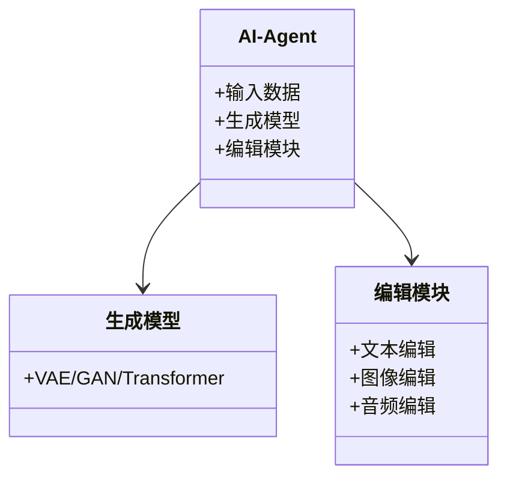
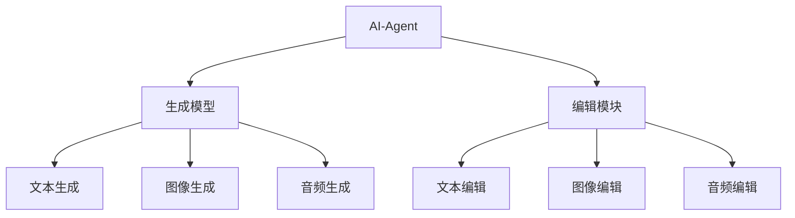

                 


---

# AI Agent的多模态内容生成与编辑

> 关键词：AI Agent，多模态生成，内容编辑，生成模型，系统架构，项目实战

> 摘要：本文系统地探讨了AI Agent在多模态内容生成与编辑中的应用，从基本概念到算法原理，再到系统架构和项目实战，深入分析了AI Agent如何通过多模态数据处理和生成模型实现高效的内容生成与编辑。文章结合理论与实践，为读者提供了全面的技术解析和应用指南。

---

## 第一部分: AI Agent的多模态内容生成与编辑基础

### 第1章: AI Agent与多模态内容生成概述

#### 1.1 AI Agent的基本概念

##### 1.1.1 AI Agent的定义与特点
- **定义**: AI Agent（人工智能代理）是指能够感知环境、自主决策并执行任务的智能实体。
- **特点**: 智能性、自主性、反应性、社会性、持续性。

##### 1.1.2 多模态内容生成的背景与意义
- **背景**: 随着AI技术的发展，单一模态的内容生成已不能满足复杂场景的需求。
- **意义**: 多模态生成能够提升内容的丰富性和交互性，为用户带来更优质的体验。

##### 1.1.3 AI Agent在多模态生成中的角色
- **数据整合者**: 统筹处理多种模态的数据。
- **决策者**: 根据上下文选择最优的生成策略。
- **执行者**: 执行生成和编辑任务。

#### 1.2 多模态内容生成的核心问题

##### 1.2.1 多模态数据的整合与处理
- **挑战**: 数据异构性、模态间关联性复杂。
- **解决方案**: 使用跨模态对齐和融合技术。

##### 1.2.2 内容生成的挑战与解决方案
- **挑战**: 生成内容的相关性和一致性。
- **解决方案**: 基于多模态的生成模型。

##### 1.2.3 AI Agent的优势
- **优势**: 自主决策、多模态处理能力强。

#### 1.3 本章小结
本章介绍了AI Agent的基本概念、多模态生成的背景与意义，以及AI Agent在生成中的角色。

---

### 第2章: 多模态数据的处理与分析

#### 2.1 多模态数据的类型与特点

##### 2.1.1 文本数据
- **特点**: 信息丰富、结构化程度高。

##### 2.1.2 图像数据
- **特点**: 高维、非结构化。

##### 2.1.3 音频数据
- **特点**: 时间序列特性明显。

##### 2.1.4 其他模态数据
- **特点**: 包括视频、3D数据等。

#### 2.2 多模态数据的预处理技术

##### 2.2.1 数据清洗与标准化
- **方法**: 去除噪声、归一化。

##### 2.2.2 数据增强方法
- **方法**: 数据扩充、随机裁剪等。

##### 2.2.3 数据融合策略
- **策略**: 并行融合、串行融合。

#### 2.3 多模态数据的分析与理解

##### 2.3.1 多模态特征提取
- **方法**: 使用深度学习模型提取特征。

##### 2.3.2 模态间关系分析
- **方法**: 对齐技术、注意力机制。

##### 2.3.3 数据表示与编码
- **方法**: 使用向量或图结构表示。

#### 2.4 本章小结
本章详细介绍了多模态数据的类型、预处理方法和分析技术。

---

### 第3章: AI Agent的多模态内容生成模型

#### 3.1 多模态生成模型的分类

##### 3.1.1 基于文本的生成模型
- **模型**: GPT系列。

##### 3.1.2 基于图像的生成模型
- **模型**: GAN、VAE。

##### 3.1.3 跨模态生成模型
- **模型**: 多模态GAN、Transformer-based模型。

#### 3.2 多模态生成模型的核心算法

##### 3.2.1 变量自编码器（VAE）
- **原理**: 使用均值和方差编码。
- **公式**: 
  - 隐变量z: $z \sim \mathcal{N}(0, I)$
  - 解码器: $x = Decoder(z)$

##### 3.2.2 生成对抗网络（GAN）
- **原理**: 对抗训练，生成器和判别器的博弈。
- **公式**: 
  - 判别器: $D(x) = \text{log}(D(x|y))$
  - 生成器: $G(z,y) = \text{min}_{G} \mathbb{E}_{x,y}[\text{log}(1 - D(G(z,y)))]$

##### 3.2.3 图灵模型（Transformer）
- **原理**: 基于自注意力机制和位置编码。

#### 3.3 AI Agent中的多模态生成流程

##### 3.3.1 数据输入与解析
- **步骤**: 接收输入数据并解析模态信息。

##### 3.3.2 模型推理与生成
- **步骤**: 通过生成模型生成候选内容。

##### 3.3.3 结果输出与反馈
- **步骤**: 输出生成内容并收集反馈。

#### 3.4 本章小结
本章介绍了多模态生成模型的分类及其核心算法。

---

## 第二部分: AI Agent的多模态内容生成与编辑技术

### 第4章: 多模态内容生成的编辑与优化

#### 4.1 内容编辑的基本方法

##### 4.1.1 文本编辑
- **方法**: 替换、插入、删除操作。

##### 4.1.2 图像编辑
- **方法**: 调整亮度、对比度，图像修复。

##### 4.1.3 音频编辑
- **方法**: 噪声去除、音频变速。

#### 4.2 编辑与优化的算法实现

##### 4.2.1 文本编辑的生成模型
- **模型**: 基于Transformer的文本编辑器。

##### 4.2.2 图像编辑的生成模型
- **模型**: 基于GAN的图像编辑器。

##### 4.2.3 音频编辑的生成模型
- **模型**: 基于Wavenet的音频编辑器。

#### 4.3 编辑与优化的系统实现

##### 4.3.1 系统设计
- **设计**: 分模块处理文本、图像、音频编辑。

##### 4.3.2 系统实现
- **实现**: 使用深度学习模型实现编辑功能。

#### 4.4 本章小结
本章介绍了多模态内容编辑的基本方法和系统实现。

---

### 第5章: 系统分析与架构设计方案

#### 5.1 问题场景介绍
- **场景**: 多模态内容生成与编辑系统。

#### 5.2 项目介绍
- **项目目标**: 实现多模态内容生成与编辑。

#### 5.3 系统功能设计

##### 5.3.1 领域模型


#### 5.4 系统架构设计



#### 5.5 系统接口设计
- **接口**: RESTful API。

#### 5.6 系统交互设计

```mermaid
sequenceDiagram
    participant 用户
    participant AI-Agent
    participant 生成模型
    participant 编辑模块
    用户->AI-Agent: 发起生成请求
    AI-Agent->生成模型: 调用生成API
    生成模型->AI-Agent: 返回生成内容
    AI-Agent->编辑模块: 发起编辑请求
    编辑模块->AI-Agent: 返回编辑后内容
    用户<-AI-Agent: 返回最终结果
```

#### 5.7 本章小结
本章详细介绍了系统的架构设计和交互流程。

---

### 第6章: 项目实战

#### 6.1 环境安装
- **工具**: Python 3.8+, PyTorch, Transformers库。

#### 6.2 核心代码实现

##### 6.2.1 多模态生成模型代码
```python
import torch
import torch.nn as nn

class VAEMultiModal(nn.Module):
    def __init__(self, latent_dim=20):
        super(VAEMultiModal, self).__init__()
        self.latent_dim = latent_dim
        self.encoder = nn.Linear(2*latent_dim, latent_dim)
        self.decoder = nn.Linear(latent_dim, 2*latent_dim)

    def encode(self, x, y):
        h = torch.cat([x, y], dim=-1)
        return self.encoder(h)

    def decode(self, z):
        return self.decoder(z)

    def forward(self, x, y):
        z = self.encode(x, y)
        return self.decode(z)
```

##### 6.2.2 编辑模块代码
```python
class TextEditor:
    def edit_text(self, text, edits):
        for edit in edits:
            text = edit.apply(text)
        return text
```

#### 6.3 代码解读与分析
- **解读**: 生成模型代码实现VAE，编辑模块实现文本编辑功能。
- **分析**: 代码结构清晰，模块化设计便于扩展。

#### 6.4 实际案例分析
- **案例**: 使用AI Agent生成一段多模态文本和图像，再进行编辑。

#### 6.5 项目小结
本章通过实际案例展示了AI Agent多模态生成与编辑的实现过程。

---

## 第三部分: 总结与展望

### 第7章: 总结与最佳实践

#### 7.1 小结
- **总结**: AI Agent在多模态生成与编辑中的应用前景广阔。

#### 7.2 注意事项
- **注意事项**: 数据安全、模型可解释性。

#### 7.3 拓展阅读
- **推荐**: 多模态学习、生成对抗网络。

---

## 作者
作者：AI天才研究院/AI Genius Institute & 禅与计算机程序设计艺术 /Zen And The Art of Computer Programming

