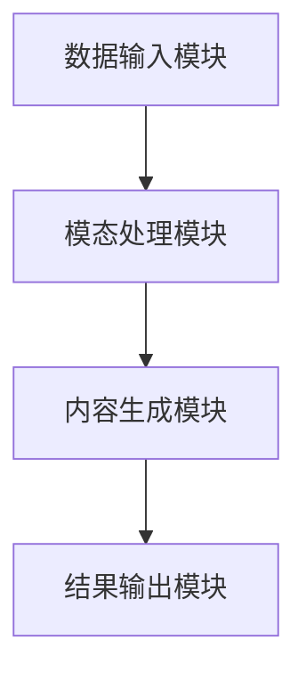
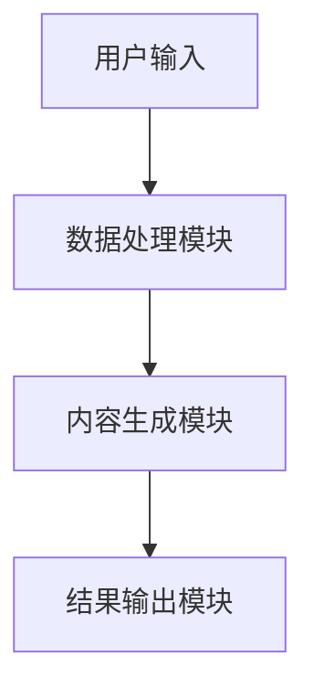

                 


---

# AI Agent的多模态内容生成与编辑系统

> 关键词：AI Agent, 多模态内容生成, 多模态数据, 内容编辑系统, 生成模型, 系统架构设计, 项目实战

> 摘要：本文详细探讨了AI Agent在多模态内容生成与编辑系统中的应用。从多模态数据的基本概念到生成模型的算法原理，再到系统架构设计与项目实战，系统性地分析了该领域的核心技术和实现方法。本文适合对AI Agent和多模态技术感兴趣的读者，帮助其深入了解相关内容生成的原理与实践。

---

## 第一部分: AI Agent与多模态内容生成的背景与概念

### 第1章: AI Agent的基本概念与多模态技术

#### 1.1 AI Agent的定义与特点

##### 1.1.1 AI Agent的基本概念
AI Agent（人工智能代理）是指能够感知环境、自主决策并执行任务的智能实体。它具备以下特点：
- **自主性**：能够独立决策和行动，无需外部干预。
- **反应性**：能够实时感知环境并做出反应。
- **目标导向**：基于目标驱动行为，追求最优结果。
- **学习能力**：通过数据和经验不断优化自身的性能。

##### 1.1.2 多模态技术的定义与特点
多模态技术是指同时处理多种数据形式（如文本、图像、音频、视频等）的技术。其特点包括：
- **多维性**：能够从多个维度获取和处理信息。
- **互补性**：不同模态的数据可以相互补充，提升信息的完整性。
- **复杂性**：处理多模态数据需要复杂的算法和模型。

##### 1.1.3 AI Agent与多模态技术的结合
AI Agent通过多模态技术能够更全面地感知和理解环境，从而做出更智能的决策和生成更丰富的输出内容。例如，在自然语言处理领域，AI Agent可以通过文本和语音两种模态进行交互，提供更自然的用户体验。

---

#### 1.2 多模态内容生成的背景与意义

##### 1.2.1 当前内容生成技术的发展现状
随着深度学习技术的发展，内容生成技术已经从单一模态（如文本生成）逐渐扩展到多模态领域。目前，多模态生成技术已经在图像生成、视频生成、对话系统等领域取得了显著成果。

##### 1.2.2 多模态技术在内容生成中的优势
多模态生成技术能够通过整合多种数据形式，提供更丰富、更自然的内容生成效果。例如，在图像生成任务中，结合文本描述可以生成更符合上下文的图像内容。

##### 1.2.3 AI Agent在多模态内容生成中的作用
AI Agent作为多模态内容生成的核心驱动力，负责整合多种模态数据、生成内容，并根据用户需求进行实时调整和优化。

---

### 第2章: 多模态内容生成的核心概念

#### 2.1 多模态数据的定义与分类

##### 2.1.1 文本数据
文本数据是多模态内容生成中最常见的数据形式之一。它包括自然语言文本、代码、数学公式等形式。

##### 2.1.2 图像数据
图像数据是视觉信息的主要载体，包括照片、插图、图表等形式。

##### 2.1.3 音频数据
音频数据包括语音、音乐、环境音等形式，能够提供丰富的听觉信息。

##### 2.1.4 其他模态数据（如视频、3D模型等）
除了文本、图像和音频，多模态数据还包括视频、3D模型等更高维的信息形式。

---

#### 2.2 多模态生成模型的原理

##### 2.2.1 单模态生成模型的局限性
单模态生成模型只能处理一种类型的数据，缺乏多模态信息的整合能力。例如，仅基于文本生成图像的模型可能无法准确捕捉图像中的细节信息。

##### 2.2.2 多模态生成模型的优势
多模态生成模型能够同时处理多种数据形式，生成更丰富、更准确的内容。例如，结合文本和图像的多模态生成模型可以生成更符合文本描述的图像内容。

##### 2.2.3 多模态生成模型的分类与对比
多模态生成模型可以分为以下几类：
- **基于Transformer的多模态生成模型**：如T2I（Text-to-Image）模型，能够通过文本描述生成图像。
- **基于CNN的多模态生成模型**：如VGG-based模型，用于图像生成任务。
- **基于Diffusion的多模态生成模型**：如Stable Diffusion，能够生成高质量的图像和文本。

---

#### 2.3 AI Agent在多模态内容生成中的角色

##### 2.3.1 AI Agent作为内容生成的驱动者
AI Agent通过整合多种模态数据，驱动生成模型的运行，生成符合用户需求的内容。

##### 2.3.2 AI Agent作为多模态数据的整合者
AI Agent负责将不同模态的数据进行预处理、融合和优化，确保生成内容的质量和一致性。

##### 2.3.3 AI Agent作为用户需求的响应者
AI Agent能够理解用户的输入需求，并通过多模态生成模型生成符合用户期望的内容。

---

## 第二部分: 多模态内容生成的数学模型与算法原理

### 第3章: 多模态内容生成的数学模型与算法原理

#### 3.1 多模态数据的表示方法

##### 3.1.1 文本表示（如词嵌入、句向量）
文本可以通过词嵌入（如Word2Vec）和句向量（如BERT）进行表示，将文本转化为高维向量形式。

##### 3.1.2 图像表示（如卷积神经网络特征）
图像可以通过卷积神经网络提取其特征向量，这些特征向量可以表示图像的内容和语义信息。

##### 3.1.3 音频表示（如MFCC、神经网络特征）
音频可以通过MFCC（梅尔频率倒谱系数）提取特征，或者通过神经网络提取高层次特征。

---

#### 3.2 多模态融合模型

##### 3.2.1 晚融合（Late Fusion）
晚融合是指在生成模型的后期阶段对不同模态的数据进行融合。例如，在生成图像时，先生成初步图像，再结合文本描述对图像进行优化。

##### 3.2.2 早融合（Early Fusion）
早融合是指在生成模型的早期阶段对不同模态的数据进行融合。例如，在生成图像时，同时考虑文本描述和图像特征。

##### 3.2.3 深度融合（Deep Fusion）
深度融合是指在生成模型的深度层对不同模态的数据进行融合。例如，在生成图像时，结合文本描述和图像特征进行深度融合。

---

#### 3.3 基于Transformer的多模态生成模型

##### 3.3.1 Transformer模型的基本原理
Transformer模型通过自注意力机制（Self-Attention）和前馈网络（FFN）实现对输入数据的建模。

##### 3.3.2 多模态Transformer的扩展
多模态Transformer在标准Transformer的基础上，增加了对其他模态数据的处理能力。例如，通过引入多模态注意力机制（Multi-Modal Attention）实现跨模态信息的交互。

##### 3.3.3 多模态生成模型的训练与优化
多模态生成模型的训练通常采用端到端的训练方法，通过交叉熵损失函数（Cross-Entropy Loss）优化模型的生成能力。

---

## 第三部分: 多模态内容生成的系统架构设计

### 第4章: 多模态内容生成的系统架构设计

#### 4.1 系统功能模块划分

##### 4.1.1 数据输入模块
数据输入模块负责接收多种模态的数据输入，例如文本、图像、音频等。

##### 4.1.2 模态处理模块
模态处理模块对输入的多模态数据进行预处理和特征提取，例如文本的词嵌入、图像的特征提取等。

##### 4.1.3 内容生成模块
内容生成模块基于预处理后的特征数据，通过生成模型生成目标内容，例如生成图像、文本或音频。

##### 4.1.4 结果输出模块
结果输出模块将生成的内容输出到目标格式，例如将生成的图像保存为JPEG格式，将生成的文本返回给用户。

---

#### 4.2 系统架构设计

##### 4.2.1 分层架构设计
系统采用分层架构设计，包括数据层、特征层、生成层和输出层。

##### 4.2.2 模块间的交互关系
模块间的交互关系可以通过Mermaid流程图表示，例如：



##### 4.2.3 系统的可扩展性设计
系统设计时需要考虑可扩展性，例如通过模块化设计实现对新模态数据的支持。

---

#### 4.3 系统接口设计

##### 4.3.1 输入接口设计
输入接口需要支持多种数据格式的输入，例如文本、图像、音频等。

##### 4.3.2 输出接口设计
输出接口需要支持多种格式的输出，例如生成的图像、文本或音频。

##### 4.3.3 API设计
系统可以通过API接口对外提供服务，例如提供RESTful API接口供其他系统调用。

---

## 第四部分: 项目实战

### 第5章: 多模态内容生成系统的项目实战

#### 5.1 项目环境安装

##### 5.1.1 安装Python环境
```bash
python --version
pip install --upgrade pip
```

##### 5.1.2 安装依赖库
```bash
pip install numpy matplotlib tensorflow
```

##### 5.1.3 安装深度学习框架
```bash
pip install tensorflow-gpu
```

---

#### 5.2 系统核心实现

##### 5.2.1 文本生成模块实现
```python
import tensorflow as tf
from tensorflow.keras.layers import Dense, InputLayer

# 文本生成模型
class TextGenerator:
    def __init__(self, vocab_size):
        self.model = tf.keras.Sequential([
            InputLayer(input_shape=(vocab_size,)),
            Dense(units=128, activation='relu'),
            Dense(units=vocab_size, activation='softmax')
        ])
```

##### 5.2.2 图像生成模块实现
```python
import tensorflow as tf
from tensorflow.keras.layers import Conv2D, InputLayer

# 图像生成模型
class ImageGenerator:
    def __init__(self, input_shape):
        self.model = tf.keras.Sequential([
            InputLayer(input_shape=input_shape),
            Conv2D(filters=64, kernel_size=3, activation='relu'),
            Conv2D(filters=128, kernel_size=3, activation='relu'),
            Conv2D(filters=256, kernel_size=3, activation='relu'),
            Conv2D(filters=1, kernel_size=1, activation='sigmoid')
        ])
```

##### 5.2.3 系统交互流程实现


---

#### 5.3 项目小结

##### 5.3.1 经验总结
- 多模态生成系统的实现需要综合考虑多种模态数据的特点。
- 系统设计时需要注重模块的独立性和可扩展性。

##### 5.3.2 注意事项
- 在实际应用中，需要根据具体需求选择合适的生成模型。
- 系统的性能优化需要结合实际场景进行调整。

---

## 第五部分: 总结

### 第6章: 多模态内容生成系统的总结与展望

#### 6.1 最佳实践
- 在实际应用中，建议结合具体场景选择合适的生成模型。
- 系统设计时需要注重模块的独立性和可扩展性。

#### 6.2 小结
本文详细探讨了AI Agent在多模态内容生成与编辑系统中的应用，从核心概念到系统实现，全面分析了相关内容生成的原理与实践。

#### 6.3 未来展望
随着深度学习技术的不断发展，多模态生成系统将更加智能化和多样化，未来的研究方向包括更高效的生成模型、更灵活的模态融合方式以及更强大的系统架构设计。

---

## 作者

作者：AI天才研究院/AI Genius Institute & 禅与计算机程序设计艺术 /Zen And The Art of Computer Programming

---

以上是《AI Agent的多模态内容生成与编辑系统》的完整文章大纲和内容框架，您可以根据实际需求进一步扩展和补充细节。

