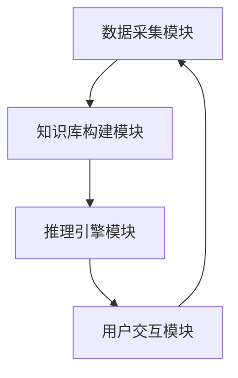

                 


# AI Agent的多模态常识推理与知识整合

## 关键词：AI Agent, 多模态推理, 常识推理, 知识整合, 知识图谱, 多模态数据融合

## 摘要：  
本文详细探讨了AI Agent在多模态常识推理与知识整合领域的核心概念、算法原理和系统实现。文章从多模态数据处理、知识图谱构建、多模态数据融合算法、系统架构设计到项目实战，全面分析了AI Agent在复杂场景中的应用。通过具体案例和代码实现，展示了如何通过多模态数据融合和知识整合提升AI Agent的智能水平。

---

# 第1章: AI Agent与多模态常识推理概述

## 1.1 AI Agent的基本概念

### 1.1.1 AI Agent的定义与分类
AI Agent（智能体）是指在计算机系统中具有感知环境和自主决策能力的实体。AI Agent可以分为简单反射型、基于模型的反应型、目标驱动型和效用驱动型。多模态AI Agent能够处理多种类型的数据，如文本、图像、语音等。

### 1.1.2 多模态数据的定义与特点
多模态数据是指多种数据类型（文本、图像、语音等）的结合。其特点包括：信息丰富性、互补性、复杂性和异构性。多模态数据能够提供更全面的语义信息，帮助AI Agent更好地理解复杂场景。

### 1.1.3 常识推理的定义与挑战
常识推理是指基于常识知识进行推理的能力。常识知识包括基本的事实、概念和规则。常识推理的挑战在于如何处理模糊性、不确定性以及知识的动态更新。

---

## 1.2 多模态常识推理的重要性

### 1.2.1 多模态数据在AI Agent中的作用
多模态数据能够提供更丰富的语义信息，帮助AI Agent更好地理解用户意图和环境信息。例如，在自然语言处理中，结合图像信息可以提高问答系统的准确性。

### 1.2.2 常识推理在智能系统中的地位
常识推理是实现高度智能系统的核心能力。它能够帮助AI Agent在复杂场景中做出合理决策，例如在医疗诊断中结合常识推理和专业知识进行辅助决策。

### 1.2.3 多模态与常识推理的结合意义
多模态数据与常识推理的结合能够提升AI Agent的智能水平。通过多模态数据融合，AI Agent能够更全面地理解问题，并利用常识推理进行更准确的推理。

---

## 1.3 本章小结

本章介绍了AI Agent的基本概念、多模态数据的定义与特点，以及常识推理的定义与挑战。强调了多模态常识推理在AI Agent中的重要性，并为后续章节奠定了基础。

---

# 第2章: 多模态数据处理与知识整合

## 2.1 多模态数据的处理方法

### 2.1.1 文本数据的处理
文本数据处理包括分词、词向量表示和语义分析。常用的文本处理方法包括TF-IDF、Word2Vec和BERT模型。

### 2.1.2 图像数据的处理
图像数据处理包括图像分割、目标检测和图像特征提取。常用的技术包括CNN和Fast R-CNN。

### 2.1.3 语音数据的处理
语音数据处理包括语音识别和语音特征提取。常用的技术包括Kaldi和深度学习模型如CTC和Transformer。

---

## 2.2 知识整合的原理

### 2.2.1 知识图谱的构建
知识图谱是通过实体和关系表示知识的结构。构建知识图谱需要进行数据抽取、实体识别和关系抽取。

### 2.2.2 知识表示的学习
知识表示学习通过将实体和关系映射到低维空间，提高知识推理的效率。常用的方法包括TransE、TransH和RotatE。

### 2.2.3 知识融合的技术
知识融合包括实体对齐和知识合并。常用技术包括基于规则的对齐和基于学习的对齐。

---

## 2.3 多模态数据与知识图谱的关联

### 2.3.1 多模态数据的语义对齐
语义对齐是将多模态数据与知识图谱中的实体和关系对齐。例如，将图像中的物体识别结果与知识图谱中的实体进行匹配。

### 2.3.2 知识图谱的多模态扩展
通过多模态数据扩展知识图谱，可以增加知识的丰富性。例如，将图像特征添加到知识图谱中，形成多模态知识图谱。

### 2.3.3 多模态数据驱动的知识推理
多模态数据可以为知识推理提供更多的语义信息。例如，结合文本和图像信息进行联合推理。

---

## 2.4 本章小结

本章详细介绍了多模态数据的处理方法和知识整合的原理，重点探讨了多模态数据与知识图谱的关联。通过多模态数据的融合，可以提升知识图谱的表达能力和推理能力。

---

# 第3章: 多模态数据融合算法

## 3.1 多模态数据融合的基本原理

### 3.1.1 多模态数据的表示方法
多模态数据的表示方法包括独立表示、联合表示和层次化表示。独立表示分别处理每种模态的数据，联合表示将多模态数据融合到一个统一的表示空间。

### 3.1.2 多模态数据的融合策略
融合策略包括特征级融合、决策级融合和混合融合。特征级融合在特征层进行融合，决策级融合在决策层进行融合，混合融合结合了两者的优势。

### 3.1.3 数据融合的评价指标
常用的评价指标包括准确率、召回率和F1值。通过这些指标可以评估数据融合的效果。

---

## 3.2 基于注意力机制的多模态融合

### 3.2.1 注意力机制的基本原理
注意力机制通过计算输入数据中不同部分的重要性，聚焦于关键信息。例如，在文本处理中，注意力机制可以帮助模型关注重要的词语。

### 3.2.2 多模态注意力模型的设计
多模态注意力模型设计包括多模态特征的提取、注意力权重的计算和融合。例如，可以将文本和图像特征分别提取后，计算注意力权重，进行融合。

### 3.2.3 基于Transformer的多模态融合
基于Transformer的多模态融合将多模态数据输入到Transformer模型中，通过自注意力机制进行特征交互。例如，在多模态问答系统中，结合文本和图像特征进行联合推理。

---

## 3.3 多模态数据融合的实现

### 3.3.1 模型输入的设计
模型输入设计需要考虑多模态数据的异构性。例如，文本数据可以通过词向量表示，图像数据可以通过卷积特征表示。

### 3.3.2 模型训练的策略
模型训练需要考虑多模态数据的平衡和对抗训练。例如，可以通过加权损失函数来平衡不同模态的损失。

### 3.3.3 模型评估的方法
模型评估可以通过交叉验证和对比实验进行。例如，可以与单模态模型进行对比，评估多模态融合的效果。

---

## 3.4 本章小结

本章详细介绍了多模态数据融合的基本原理和基于注意力机制的多模态融合方法。通过设计合理的模型输入和训练策略，可以实现有效的多模态数据融合。

---

# 第4章: 系统架构与实现

## 4.1 系统功能模块划分

### 4.1.1 数据采集与预处理模块
数据采集与预处理模块负责从多模态数据源中采集数据，并进行清洗和预处理。例如，文本数据需要进行分词和去停用词处理。

### 4.1.2 知识库构建模块
知识库构建模块负责构建和更新知识图谱。包括数据抽取、实体识别和关系抽取。

### 4.1.3 推理引擎模块
推理引擎模块负责基于知识图谱进行常识推理。例如，通过查询知识图谱中的实体和关系，进行路径推理。

### 4.1.4 用户交互模块
用户交互模块负责与用户进行交互，接收输入并输出结果。例如，用户可以通过自然语言输入问题，系统通过推理引擎进行推理并返回答案。

---

## 4.2 系统架构设计

### 4.2.1 系统功能设计
系统功能设计包括数据采集、知识库构建、推理引擎和用户交互。通过模块化设计，可以提高系统的可扩展性和维护性。

### 4.2.2 系统架构图
以下是系统架构的Mermaid图：



### 4.2.3 系统接口设计
系统接口设计包括数据接口、知识库接口和推理引擎接口。通过标准化接口，可以方便地进行模块间的交互。

---

## 4.3 本章小结

本章详细介绍了系统的功能模块划分和架构设计。通过模块化设计和标准化接口，可以实现系统的高效开发和维护。

---

# 第5章: 项目实战

## 5.1 环境安装

### 5.1.1 Python环境的安装
安装Python 3.8及以上版本。

### 5.1.2 依赖库的安装
安装必要的依赖库，例如：
- `numpy`
- `pandas`
- `scikit-learn`
- `tensorflow`

---

## 5.2 系统核心实现

### 5.2.1 数据预处理代码
以下是数据预处理的Python代码：

```python
import numpy as np
import pandas as pd

# 文本数据预处理
def preprocess_text(text):
    # 分词处理
    words = text.split()
    # 去除停用词
    stopwords = set(["的", "了", "是", "在", "于", "被"])
    filtered_words = [word for word in words if word not in stopwords]
    return " ".join(filtered_words)

# 图像数据预处理
def preprocess_image(image_path):
    # 加载图像
    image = load_image(image_path)
    # 转换为张量
    tensor = convert_to_tensor(image)
    return tensor

# 数据预处理
text_data = ["这是一个测试句子。", "图像分类任务。"]
image_data = ["image1.jpg", "image2.jpg"]

processed_text = [preprocess_text(text) for text in text_data]
processed_image = [preprocess_image(img) for img in image_data]
```

### 5.2.2 模型训练代码
以下是模型训练的Python代码：

```python
import tensorflow as tf
from tensorflow import keras

# 定义模型
model = keras.Sequential([
    layers.Dense(64, activation='relu'),
    layers.Dense(1, activation='sigmoid')
])

# 编译模型
model.compile(optimizer='adam', loss='binary_crossentropy', metrics=['accuracy'])

# 训练模型
model.fit(x_train, y_train, epochs=10, batch_size=32)
```

---

## 5.3 实际案例分析

### 5.3.1 案例背景
假设我们正在开发一个多模态问答系统，能够处理文本和图像输入。

### 5.3.2 数据处理
文本数据和图像数据分别进行预处理，然后进行数据融合。

### 5.3.3 模型训练
训练一个多模态融合模型，结合文本和图像特征进行问答推理。

### 5.3.4 系统实现
实现用户交互界面，用户输入问题和相关图像，系统进行推理并返回答案。

---

## 5.4 本章小结

本章通过实际项目案例，详细介绍了环境安装、数据预处理、模型训练和系统实现的过程。通过代码实现，帮助读者更好地理解多模态常识推理与知识整合的技术细节。

---

# 第6章: 总结与展望

## 6.1 最佳实践

### 6.1.1 数据预处理
确保数据的高质量，进行充分的清洗和标注。

### 6.1.2 模型选择
根据具体任务选择合适的模型和算法，避免过度复杂化。

### 6.1.3 系统优化
通过模块化设计和并行计算优化系统性能。

---

## 6.2 小结

本文系统地介绍了AI Agent的多模态常识推理与知识整合的核心概念、算法原理和系统实现。通过实际案例分析，展示了如何通过多模态数据融合和知识整合提升AI Agent的智能水平。

---

## 6.3 注意事项

- 数据安全：在处理多模态数据时，需要注意数据隐私和安全。
- 模型泛化能力：在设计模型时，需要考虑模型的泛化能力和鲁棒性。
- 系统可扩展性：在系统设计时，要充分考虑系统的可扩展性和可维护性。

---

## 6.4 拓展阅读

- 《Deep Learning》
- 《Knowledge Graphs and Reasoning》
- 《Multi-modal Machine Learning》

---

# 作者：AI天才研究院/AI Genius Institute & 禅与计算机程序设计艺术 /Zen And The Art of Computer Programming

---

以上是《AI Agent的多模态常识推理与知识整合》的完整目录和内容。

