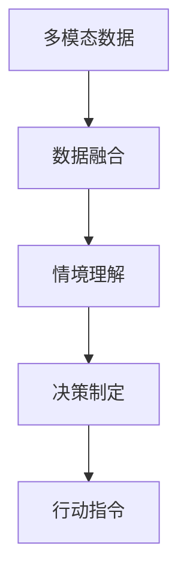
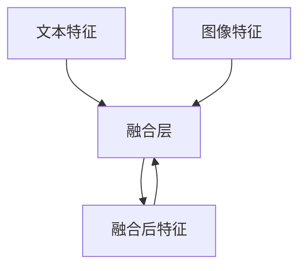
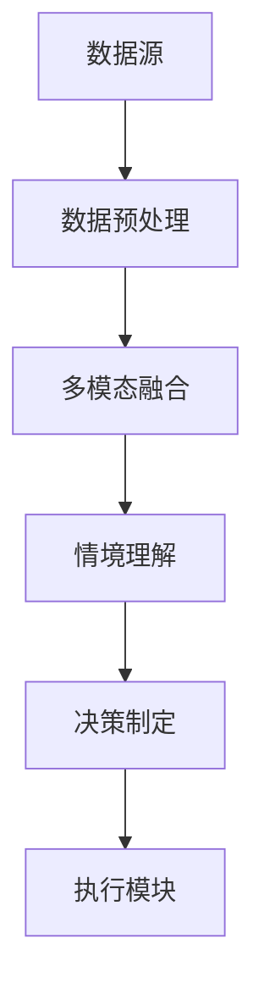

                 


# AI Agent的多模态情境感知与反应系统

**关键词：** AI Agent, 多模态, 情境感知, 反应系统, 人工智能, 多模态数据融合

**摘要：**  
本文详细探讨了AI Agent在多模态情境感知与反应系统中的核心原理与实现方法。通过分析多模态数据处理、情境理解、决策机制等关键环节，结合实际案例和算法实现，深入解析了AI Agent在复杂场景下的应用潜力与技术挑战。

---

# 第一部分: AI Agent的多模态情境感知与反应系统概述

## 第1章: 问题背景与核心概念

### 1.1 问题背景
#### 1.1.1 AI Agent的基本概念
- AI Agent的定义与特点
- 多模态数据处理的必要性
- 情境感知与反应系统的应用场景

#### 1.1.2 问题描述
- 多模态数据的复杂性
- 情境理解的不确定性
- 反应决策的实时性要求

#### 1.1.3 问题解决思路
- 数据融合、情境建模、决策优化
- 多模态数据的高效处理方法
- 情境感知与反应的协同设计

### 1.2 核心概念对比与分析
#### 1.2.1 多模态数据的类型与特点
| 数据类型 | 特征描述 | 示例场景 |
|----------|-----------|----------|
| 文本      | 结构化信息 | 语句理解 |
| 图像      | 视觉信息   | 图像识别 |
| 语音      | 声音信息   | 语音识别 |
| 视频      | 动态视觉    | 视频分析 |

#### 1.2.2 情境感知与目标检测的对比
| 对比维度 | 情境感知 | 目标检测 |
|----------|----------|----------|
| 目标     | 理解场景整体 | 检测特定目标 |
| 方法     | 多模态融合 | 单一模态分析 |
| 应用场景 | 智能助手、自动驾驶 | 物体识别、安防监控 |

#### 1.2.3 反应决策与行为规划的对比
| 对比维度 | 反应决策 | 行为规划 |
|----------|----------|----------|
| 目标     | 快速响应 | 长期规划 |
| 时间尺度 | 短时 | 长时 |
| 复杂度   | 高 | 中 |

### 1.3 概念结构与核心要素
#### 1.3.1 概念层次结构
- 数据层：多模态数据输入
- 理解层：情境分析与建模
- 决策层：反应策略制定
- 执行层：行动指令输出

#### 1.3.2 核心要素的特征分析
- 数据多样性：多模态数据的异构性
- 理解准确性：情境建模的精确性
- 决策实时性：反应策略的快速性

#### 1.3.3 概念关系图


---

# 第二部分: 核心概念与原理

## 第2章: 多模态数据处理

### 2.1 多模态数据的类型与特点
- 文本、图像、语音、视频等多模态数据的特征
- 数据异构性与互补性

### 2.2 数据融合方法
#### 2.2.1 数据融合的层次
- 特征级融合：低层特征的直接融合
- 决策级融合：高层语义的结合

#### 2.2.2 数据融合的实现


### 2.3 数据预处理技术
- 数据清洗、标准化、增强

## 第3章: 情境感知与理解

### 3.1 情境感知的基本原理
- 多模态数据的语义理解
- 场景建模与上下文推理

### 3.2 情境理解的关键技术
#### 3.2.1 基于深度学习的语义理解
- Transformer模型的应用
- 多模态注意力机制

#### 3.2.2 情境表示模型
- 情境向量的构建
- 情境图的构建与分析

## 第4章: 反应与决策机制

### 4.1 决策算法的选择与优化
- 基于规则的决策
- 基于强化学习的决策
- 基于多模态数据的联合决策

### 4.2 决策优化策略
- 短期决策与长期规划的结合
- 动态权重调整

---

# 第三部分: 算法原理与实现

## 第5章: 多模态融合算法

### 5.1 多模态融合的数学模型
$$ y = f(x_1, x_2, ..., x_n) $$
其中，$x_i$ 表示不同模态的输入特征，$y$ 表示融合后的输出。

### 5.2 注意力机制在多模态融合中的应用
$$ \alpha_i = \frac{e^{score(x_i)}}{\sum_{j} e^{score(x_j)}} $$
其中，$\alpha_i$ 表示第i个模态的注意力权重，$score(x_i)$ 表示该模态的得分。

### 5.3 实验结果与分析
- 实验设计与数据集
- 实验结果对比

---

# 第四部分: 系统分析与架构设计

## 第6章: 系统分析与架构设计

### 6.1 问题场景介绍
- 多模态情境感知系统的应用场景

### 6.2 系统功能设计
- 数据采集与预处理
- 多模态融合与情境理解
- 决策与反应执行

### 6.3 系统架构设计


---

# 第五部分: 项目实战

## 第7章: 项目实战

### 7.1 环境安装与配置
- 开发工具与依赖库安装

### 7.2 核心代码实现
```python
def multi_modal_fusion(text, image, voice):
    # 处理文本、图像、语音特征
    fusion_feature = text_feature + image_feature + voice_feature
    return fusion_feature
```

### 7.3 代码解读与分析
- 核心算法实现
- 系统模块协作

### 7.4 实际案例分析
- 案例背景
- 系统运行结果
- 性能分析与优化

---

# 第六部分: 总结与展望

## 第8章: 总结与展望

### 8.1 最佳实践
- 系统设计的注意事项
- 开发中的常见问题与解决方案

### 8.2 小结
- 本文的核心内容回顾
- 系统实现的关键点总结

### 8.3 注意事项
- 系统鲁棒性设计
- 数据安全与隐私保护

### 8.4 拓展阅读
- 多模态数据处理的前沿技术
- 情境感知的最新研究进展

---

**作者：AI天才研究院 & 禅与计算机程序设计艺术**

