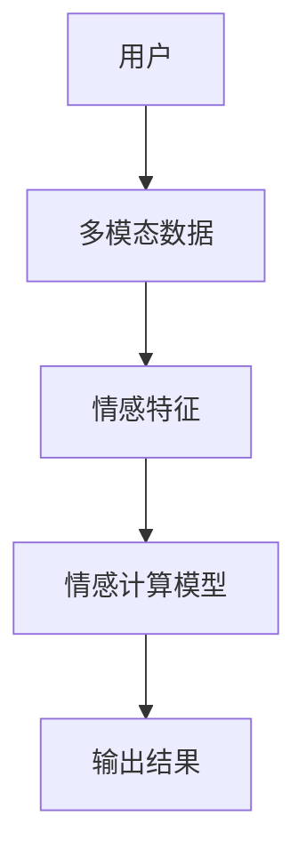
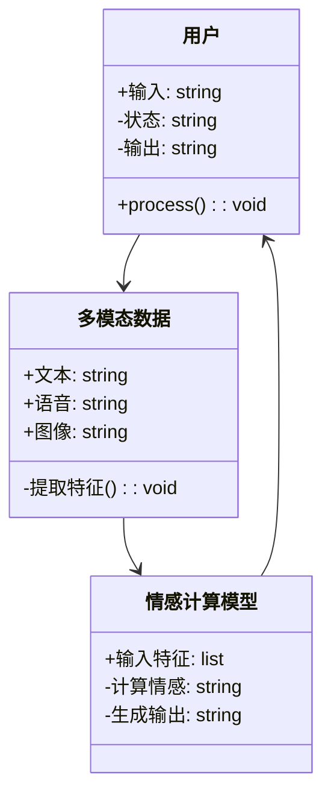
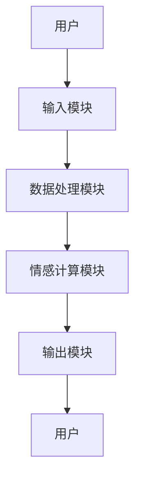
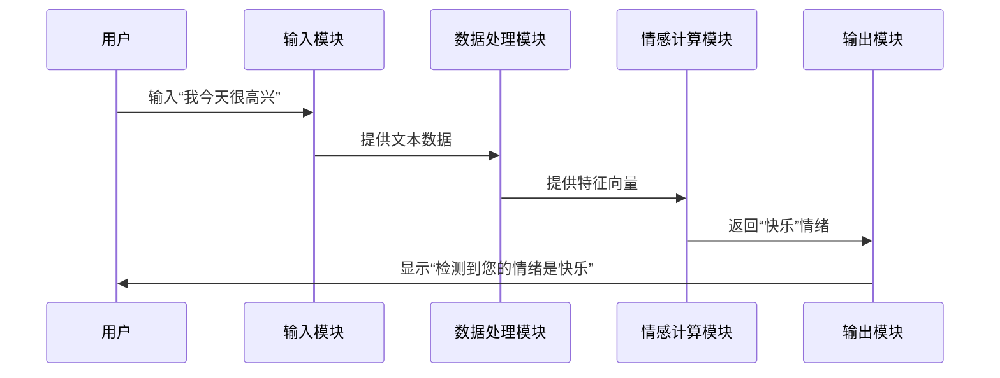

                 


# AI Agent的多模态情感计算与表达

**关键词**：AI Agent、多模态情感计算、情感分析、深度学习、系统架构

**摘要**：  
本文探讨了AI Agent在多模态情感计算与表达中的应用，分析了情感计算的核心概念、算法原理及系统架构。文章从背景介绍出发，逐步深入，结合实际案例，详细阐述了多模态情感计算的技术细节和实现方法，最后总结了最佳实践和未来研究方向。

---

# 第1章: AI Agent与多模态情感计算概述

## 1.1 AI Agent的基本概念  
### 1.1.1 AI Agent的定义与特点  
AI Agent（人工智能代理）是指能够感知环境、自主决策并采取行动以实现目标的智能实体。它具备自主性、反应性、目标导向性和社会性等核心特点。  

### 1.1.2 多模态情感计算的背景与意义  
情感计算（Affective Computing）是研究如何识别、理解、表达和模拟人类情感的交叉学科。多模态情感计算通过整合文本、语音、图像等多种模态信息，能够更全面地捕捉和表达情感，从而提升AI Agent的智能化水平。  

### 1.1.3 问题背景与应用现状  
在实际应用中，单一模态的情感计算存在局限性，例如文本情感分析可能忽视语调和语境，语音情感分析难以处理复杂语义。通过多模态数据的融合，可以显著提高情感计算的准确性和鲁棒性。目前，多模态情感计算已广泛应用于智能客服、虚拟助手、情感社交等领域。

---

## 1.2 情感计算的核心概念  
### 1.2.1 情感计算的定义与目标  
情感计算的目标是通过分析多模态数据，识别人类情感状态，并生成相应的情感表达。它不仅关注“是什么”（情感分类），还关注“为什么”（情感原因）。  

### 1.2.2 多模态数据的特征与挑战  
多模态数据具有异构性、时空依赖性和情感一致性等特征。例如，文本和语音数据的时间依赖性较强，而图像数据则更关注空间特征。多模态数据的融合需要解决数据模态差异性和计算复杂性的问题。  

### 1.2.3 情感计算的边界与外延  
情感计算的边界包括情感强度、情感类别和情感语境。其外延则涉及情感记忆、情感推理和情感生成等高级功能。

---

## 1.3 本章小结  
本章从AI Agent的基本概念出发，介绍了多模态情感计算的背景、核心概念和应用现状，为后续内容奠定了基础。

---

# 第2章: 多模态情感计算的核心概念与联系  

## 2.1 多模态数据的特征分析  
### 2.1.1 文本、语音、图像的特征对比  
文本数据具有语法结构和语义信息，语音数据包含语调、节奏和音量等特征，图像数据则包含颜色、纹理和形状等特征。  

### 2.1.2 情感特征的提取方法  
常用的情感特征提取方法包括基于统计的特征提取（如MFCC、纹理特征）和基于深度学习的特征提取（如CNN、RNN）。  

### 2.1.3 多模态数据融合的优势  
多模态数据融合可以互补信息，提高情感计算的准确性和鲁棒性。例如，结合文本和语音数据可以更好地识别人类情感状态。

---

## 2.2 情感计算的数学模型  
### 2.2.1 情感计算的数学表达式  
情感计算可以通过概率模型、深度学习模型或符号逻辑模型进行建模。例如，基于概率的贝叶斯模型表达式为：  
$$ P(y|x) = \frac{P(x|y)P(y)}{P(x)} $$  

### 2.2.2 多模态数据融合的公式推导  
多模态数据融合可以通过加权融合或联合学习的方式实现。例如，基于注意力机制的融合公式为：  
$$ f(x) = \sum_{i=1}^{n} \alpha_i x_i $$  
其中，$\alpha_i$是第$i$个模态的注意力权重。

### 2.2.3 情感计算的评价指标  
常用的评价指标包括准确率、精确率、召回率和F1值。  

---

## 2.3 系统架构的ER实体关系图  


---

## 2.4 本章小结  
本章从多模态数据的特征分析出发，结合数学模型和实体关系图，详细阐述了情感计算的核心概念与联系。

---

# 第3章: 多模态情感计算的算法原理  

## 3.1 情感分析算法  
### 3.1.1 传统情感分类算法  
传统算法包括基于规则的分类器（如朴素贝叶斯）和基于特征工程的分类器（如SVM）。  

### 3.1.2 基于深度学习的情感分析模型  
深度学习模型如LSTM、Transformer等在情感分析中表现出色。例如，BERT模型可以通过预训练任务捕获上下文信息，从而实现更准确的情感分类。  

### 3.1.3 情感分析的数学模型  
情感分析的深度学习模型通常采用以下公式：  
$$ h(x) = \text{softmax}(Wx + b) $$  

---

## 3.2 多模态数据融合算法  
### 3.2.1 基于注意力机制的多模态融合  
注意力机制可以有效捕捉多模态数据的相关性。例如，图像和文本的注意力权重可以通过以下公式计算：  
$$ \alpha_i = \frac{e^{q_i^T k_i}}{\sum_j e^{q_j^T k_j}} $$  

### 3.2.2 对比学习的多模态融合方法  
对比学习通过最大化跨模态相似性来实现数据融合。例如，基于对比学习的损失函数为：  
$$ \mathcal{L} = -\log \frac{\exp(s(x,y))}{\sum_z \exp(s(x,z))} $$  

### 3.2.3 多模态融合的数学公式  
多模态融合的最终结果可以通过以下公式表示：  
$$ f(x) = \sum_{i=1}^{n} \lambda_i g_i(x) $$  
其中，$\lambda_i$是第$i$个模态的权重，$g_i(x)$是第$i$个模态的特征函数。

---

## 3.3 本章小结  
本章详细介绍了情感分析和多模态数据融合的核心算法，结合数学公式和算法流程图，为后续实现奠定了基础。

---

# 第4章: 多模态情感计算的系统架构设计  

## 4.1 问题场景介绍  
本章以一个AI Agent为例，设计一个多模态情感计算系统，实现对用户输入的情感识别和表达。

---

## 4.2 系统功能设计  
### 4.2.1 领域模型（类图）  


---

## 4.3 系统架构设计  
### 4.3.1 系统架构图  


### 4.3.2 系统接口设计  
系统接口包括输入接口（如文本框、麦克风）和输出接口（如文本、语音、图像）。  

### 4.3.3 系统交互（序列图）  


---

## 4.4 本章小结  
本章通过领域模型和系统架构图，详细设计了AI Agent的多模态情感计算系统，并通过序列图展示了系统交互流程。

---

# 第5章: 多模态情感计算的项目实战  

## 5.1 环境配置  
### 5.1.1 安装依赖  
安装Python、TensorFlow、Keras等工具。  

```bash
pip install numpy tensorflow pandas matplotlib
```

---

## 5.2 核心代码实现  
### 5.2.1 数据预处理  
```python
import numpy as np
import pandas as pd

# 加载数据
data = pd.read_csv('multi_modal_data.csv')

# 文本特征提取
from tensorflow.keras.preprocessing.text import Tokenizer
tokenizer = Tokenizer()
tokenizer.fit_on_texts(data['text'])
text_features = tokenizer.texts_to_sequences(data['text'])
```

### 5.2.2 模型训练  
```python
from tensorflow.keras.models import Model
from tensorflow.keras.layers import Input, LSTM, Dense, concatenate

# 文本特征输入
text_input = Input(shape=(max_length,))
text_lstm = LSTM(64)(text_input)

# 语音特征输入
audio_input = Input(shape=(16,))  # 假设语音特征维度为16
audio_dense = Dense(64, activation='relu')(audio_input)

# 图像特征输入
image_input = Input(shape=(64, 64, 3))
image_lstm = LSTM(64)(image_input)

# 多模态融合
merged = concatenate([text_lstm, audio_dense, image_lstm])
output = Dense(1, activation='sigmoid')(merged)

model = Model(inputs=[text_input, audio_input, image_input], outputs=output)
model.compile(loss='binary_crossentropy', optimizer='adam', metrics=['accuracy'])
model.fit([text_features, audio_features, image_features], labels, epochs=10, batch_size=32)
```

---

## 5.3 实际案例分析  
以一段多模态输入为例，展示模型的情感识别和生成过程。例如，用户输入“我今天很高兴”，系统通过文本、语音和图像数据，识别出“快乐”情绪，并生成相应的反馈。

---

## 5.4 本章小结  
本章通过具体项目实战，详细展示了AI Agent的多模态情感计算系统的实现过程，包括环境配置、数据处理和模型训练。

---

# 第6章: 多模态情感计算的最佳实践与总结  

## 6.1 最佳实践 tips  
### 6.1.1 数据处理注意事项  
确保多模态数据的同步性和一致性。  

### 6.1.2 模型优化技巧  
使用预训练模型、数据增强和模型集成等方法提升性能。  

---

## 6.2 小结  
本文从AI Agent的基本概念出发，逐步深入，结合数学模型、系统架构和项目实战，全面探讨了多模态情感计算的技术细节和实现方法。

---

## 6.3 注意事项  
在实际应用中，需注意数据隐私、模型泛化能力和实时性问题。  

---

## 6.4 拓展阅读  
推荐阅读《Deep Learning》（Ian Goodfellow等著）和《Affective Computing》（R. A. Picard著）。

---

# 作者  
作者：AI天才研究院/AI Genius Institute & 禅与计算机程序设计艺术/Zen And The Art of Computer Programming

