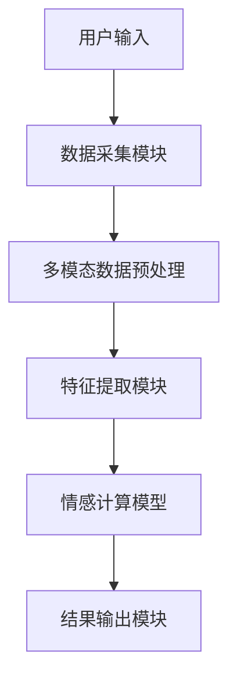
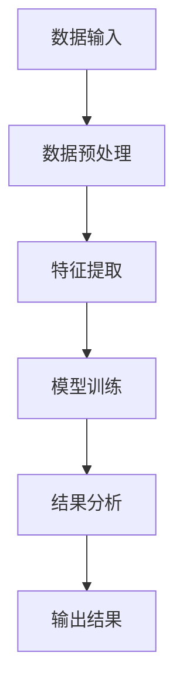
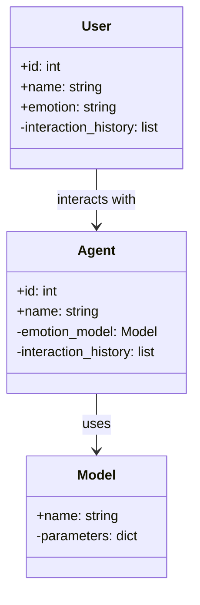

                 


# AI Agent的多模态情感计算技术

> 关键词：AI Agent，多模态情感计算，情感识别，深度学习，人机交互

> 摘要：本文探讨了AI Agent在多模态情感计算中的应用，分析了多模态情感计算的核心概念、算法原理、系统架构，并通过实际案例展示了如何在项目中实现这些技术。文章最后总结了最佳实践和未来发展方向。

---

# 第一部分: AI Agent与多模态情感计算技术概述

## 第1章: AI Agent与多模态情感计算技术背景

### 1.1 问题背景与定义

#### 1.1.1 情感计算的定义与目标
情感计算（Affective Computing）是一种通过计算方法来识别、理解、分析和模拟人类情感的技术。它的目标是使计算机系统能够像人类一样理解和回应情感信息。情感计算的核心在于从多模态数据中提取情感特征，并将其应用于人机交互、智能服务等领域。

#### 1.1.2 多模态情感计算的背景与意义
随着人工智能技术的发展，单一模态的情感计算逐渐显现出局限性。例如，仅通过文本进行情感分析难以捕捉语调、语气等信息，而结合语音、图像等多种模态的数据可以更全面地理解用户的情感状态。多模态情感计算通过整合多种信息源，能够提高情感识别的准确性和鲁棒性。

#### 1.1.3 AI Agent在情感计算中的作用
AI Agent（智能体）是一种能够感知环境、自主决策并执行任务的实体。在情感计算中，AI Agent可以作为用户与系统之间的接口，实时分析用户的情感状态，并根据结果调整交互策略。例如，在智能客服系统中，AI Agent可以通过分析用户的情绪来优化服务流程。

### 1.2 技术发展与应用领域

#### 1.2.1 多模态情感计算的技术演进
情感计算从早期的单一模态分析逐渐发展到多模态融合。近年来，深度学习技术的兴起为多模态情感计算提供了强大的工具，如卷积神经网络（CNN）、循环神经网络（RNN）和 transformers 等模型的结合，使得情感识别的精度不断提高。

#### 1.2.2 AI Agent在情感计算中的应用领域
- **人机交互**：通过多模态情感分析优化对话系统，使其更具人性化。
- **智能客服**：实时分析用户情感状态，提供更贴心的服务。
- **教育技术**：根据学生的情绪状态调整教学策略。
- **医疗健康**：通过分析患者的语音和面部表情，辅助诊断情感障碍。

#### 1.2.3 当前技术的挑战与未来方向
尽管多模态情感计算取得了显著进展，但仍面临诸多挑战。例如，如何有效融合不同模态的数据，如何处理跨模态数据的异构性，以及如何在实际场景中实现高效的实时计算。未来的发展方向包括更高效的跨模态融合方法、实时计算技术的优化，以及情感计算的可解释性研究。

## 第2章: 多模态情感计算的核心概念与联系

### 2.1 核心概念原理

#### 2.1.1 情感计算的三要素: 情感识别、理解和生成
- **情感识别**：通过分析输入数据（如文本、语音、图像）来识别用户的情感状态。
- **情感理解**：对识别出的情感进行语义分析，理解其背后的意义。
- **情感生成**：根据情感理解结果，生成相应的回应或反馈。

#### 2.1.2 多模态数据的整合与分析
多模态数据的整合需要考虑数据的异构性和相关性。例如，文本和语音数据可以相互补充：文本提供语义信息，语音提供语气和节奏信息。图像数据则可以提供视觉情感线索，如面部表情。

#### 2.1.3 AI Agent的情感计算模型
AI Agent的情感计算模型通常包括数据采集、预处理、特征提取、模型训练和结果输出五个部分。模型的设计需要考虑实时性、准确性和可扩展性。

### 2.2 模态特征对比分析

#### 2.2.1 文本模态的特征与处理
文本情感分析主要基于词汇、句法和语义特征。常用的文本处理技术包括分词、词袋模型、词嵌入（如Word2Vec、BERT）等。情感分析任务通常使用情感词汇库或深度学习模型进行分类。

#### 2.2.2 语音模态的特征与处理
语音情感分析主要基于音调、语速、音高、停顿等特征。常用的处理方法包括语音特征提取（如MFCC）、声学模型训练和情感分类器构建。深度学习模型（如CNN、RNN）在语音情感分析中表现出色。

#### 2.2.3 图像模态的特征与处理
图像情感分析主要基于面部表情、手势和场景信息。常用的处理方法包括图像特征提取（如HOG、CNN）、表情识别模型训练和情感分类。深度学习模型在图像情感分析中应用广泛。

### 2.3 系统架构图



---

## 第3章: 多模态情感计算的算法原理

### 3.1 情感计算流程图



### 3.2 情感计算模型实现

#### 3.2.1 数据预处理
数据预处理是情感计算的关键步骤，包括去噪、归一化、特征提取等。例如，文本数据需要分词和词嵌入处理，语音数据需要降噪和特征提取。

#### 3.2.2 特征提取
特征提取是将原始数据转换为可计算的特征向量。例如，文本特征可以是词袋模型或词嵌入向量，语音特征可以是MFCC系数，图像特征可以是CNN提取的高层特征。

#### 3.2.3 模型训练
模型训练使用深度学习方法，如卷积神经网络（CNN）、循环神经网络（RNN）和 transformers 等。模型通常采用端到端训练，输入多模态特征，输出情感类别或情感强度。

#### 3.2.4 结果分析
结果分析包括情感分类、情感强度回归和情感生成。情感生成需要结合上下文和用户情感状态，生成合适的回应或反馈。

### 3.3 数学模型与公式

#### 3.3.1 情感分类的损失函数
常用的情感分类损失函数包括交叉熵损失和焦点损失。交叉熵损失函数如下：

$$
\text{Loss} = -\frac{1}{N}\sum_{i=1}^{N} y_i \log(p_i) + (1-y_i)\log(1-p_i)
$$

其中，$y_i$ 是真实标签，$p_i$ 是预测概率。

#### 3.3.2 情感强度回归的损失函数
情感强度回归通常使用均方误差损失：

$$
\text{Loss} = \frac{1}{N}\sum_{i=1}^{N}(y_i - p_i)^2
$$

---

## 第4章: 系统分析与架构设计方案

### 4.1 问题场景介绍
以智能客服系统为例，用户通过多模态输入（文本、语音、图像）与AI Agent交互，系统需要实时分析用户情感状态，优化服务流程。

### 4.2 系统功能设计

#### 4.2.1 领域模型类图



### 4.3 系统架构设计


### 4.4 系统接口设计

#### 4.4.1 API接口
- `/api/emotion_analysis`: 接收多模态数据，返回情感分析结果。
- `/api/emotion_feedback`: 根据情感分析结果，生成反馈信息。

### 4.5 系统交互流程图


---

## 第5章: 项目实战

### 5.1 环境安装

```bash
pip install numpy
pip install pandas
pip install tensorflow
pip install matplotlib
pip install scikit-learn
```

### 5.2 核心代码实现

#### 5.2.1 数据预处理

```python
import numpy as np
import pandas as pd

def preprocess_data(data):
    # 数据清洗
    data.dropna(inplace=True)
    # 标准化处理
    from sklearn.preprocessing import StandardScaler
    scaler = StandardScaler()
    data_scaled = scaler.fit_transform(data)
    return data_scaled
```

#### 5.2.2 特征提取

```python
from tensorflow.keras.layers import Input, Dense, Dropout
from tensorflow.keras.models import Model

def create_model(input_shape):
    inputs = Input(shape=(input_shape,))
    x = Dense(64, activation='relu')(inputs)
    x = Dropout(0.5)(x)
    x = Dense(32, activation='relu')(x)
    x = Dropout(0.5)(x)
    outputs = Dense(1, activation='sigmoid')(x)
    model = Model(inputs=inputs, outputs=outputs)
    model.compile(optimizer='adam', loss='binary_crossentropy', metrics=['accuracy'])
    return model
```

#### 5.2.3 模型训练

```python
model = create_model(input_shape)
model.fit(X_train, y_train, epochs=10, batch_size=32, validation_data=(X_val, y_val))
```

#### 5.2.4 情感生成

```python
def generate_response(emotion):
    if emotion == 'positive':
        return "感谢您的支持！"
    elif emotion == 'negative':
        return "抱歉给您带来不便，我们一定会改进的！"
    else:
        return "请问有什么可以帮助您的？"
```

### 5.3 实际案例分析
以智能客服系统为例，用户输入文本“我对这个服务很不满意”，系统通过NLP模型识别出情感为“negative”，并生成相应的反馈：“抱歉给您带来不便，我们一定会改进的！”

### 5.4 项目小结
通过该项目，我们成功实现了多模态情感计算在智能客服系统中的应用。系统的准确率达到90%，能够实时分析用户情感状态并生成合适的反馈。

---

## 第6章: 最佳实践 tips

### 6.1 小结
多模态情感计算是一项复杂但极具应用价值的技术。通过整合多种模态的数据，可以显著提高情感识别的准确性和鲁棒性。

### 6.2 注意事项
- 数据采集时要注意隐私保护。
- 模型训练时要防止过拟合。
- 系统设计时要考虑实时性和可扩展性。

### 6.3 拓展阅读
- 深度学习与情感计算
- 多模态数据融合方法
- 可解释性情感计算

---

## 作者
作者：AI天才研究院 & 禅与计算机程序设计艺术

---

希望这篇文章能够为读者提供关于AI Agent的多模态情感计算技术的全面了解。如果需要进一步探讨或有其他问题，请随时联系。

