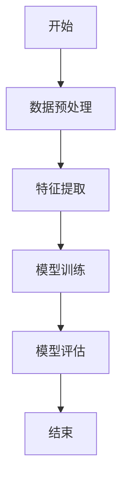
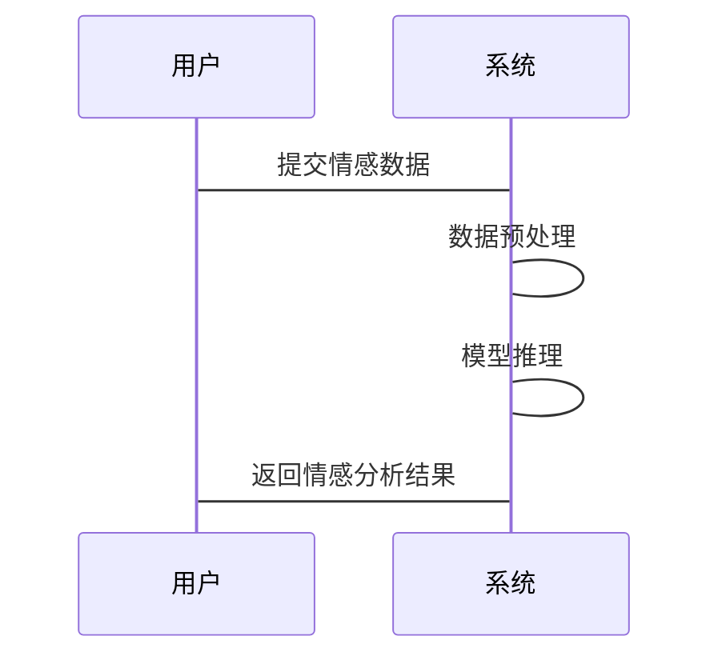

                 


```markdown
# 《AI Agent的多模态情感识别与生成》

---

## 关键词：
- AI Agent
- 多模态情感识别
- 情感生成
- 情感分类
- 多模态数据

---

## 摘要：
本文系统地探讨了AI Agent在多模态情感识别与生成领域的核心理论、算法原理、系统架构及实际应用。通过详细分析多模态数据的整合与处理、情感识别与生成的算法模型，结合实际案例，深入阐述了AI Agent在复杂情感交互中的潜力与挑战。本文旨在为技术开发者、研究人员及AI领域爱好者提供一份全面的指南，帮助他们理解并应用多模态情感识别与生成技术。

---

# 目录大纲

## 第1章: 多模态情感识别与生成的背景与概念

### 1.1 多模态情感识别与生成的背景
- 1.1.1 从单模态到多模态的情感分析演进
- 1.1.2 情感识别与生成的现实需求
- 1.1.3 AI Agent在多模态情感处理中的角色

### 1.2 多模态情感识别与生成的核心概念
- 1.2.1 多模态数据的定义与特征
- 1.2.2 情感识别与生成的定义与目标
- 1.2.3 AI Agent在多模态情感处理中的能力边界

### 1.3 多模态情感识别与生成的边界与外延
- 1.3.1 情感识别的边界：从简单到复杂
- 1.3.2 情感生成的外延：从文本到多模态
- 1.3.3 AI Agent在多模态情感处理中的应用场景

### 1.4 多模态情感识别与生成的核心要素
- 1.4.1 多模态数据的整合与处理
- 1.4.2 情感分析与生成的算法模型
- 1.4.3 AI Agent的交互与反馈机制

## 第2章: 多模态情感识别与生成的核心概念与联系

### 2.1 多模态情感识别与生成的核心概念
- 2.1.1 多模态数据的整合与分析
- 2.1.2 情感识别的算法原理
- 2.1.3 情感生成的模型框架

### 2.2 多模态情感识别与生成的概念属性对比
- 2.2.1 情感识别与生成的主要区别
- 2.2.2 多模态与单模态情感处理的对比
- 2.2.3 AI Agent在多模态情感处理中的独特性

### 2.3 多模态情感识别与生成的ER实体关系图
```mermaid
erDiagram
    user ||--|{ profile }
    profile ||--|{ emotion }
    emotion ||--|{ modality }
    modality ||--|{ agent }
    agent -->{ interaction }
```

## 第3章: 多模态情感识别与生成的算法原理

### 3.1 多模态情感识别的算法原理
- 3.1.1 多模态数据的预处理与融合
- 3.1.2 情感识别的特征提取
- 3.1.3 情感分类的模型选择

### 3.2 多模态情感生成的算法原理
- 3.2.1 情感生成的文本生成模型
- 3.2.2 多模态生成的算法框架
- 3.2.3 情感生成的优化策略

### 3.3 多模态情感识别与生成的算法流程图


### 3.4 多模态情感识别与生成的数学模型
- 3.4.1 情感分类的损失函数
$$ L = -\sum_{i=1}^{n} y_i \log p(y_i) + (1 - y_i) \log (1 - p(y_i)) $$

### 3.5 实际案例分析：使用Python进行多模态情感分类
```python
import tensorflow as tf
from tensorflow.keras.layers import Input, Dense, Dropout
from tensorflow.keras.models import Model

# 输入层
input_layer = Input(shape=(input_dim,))
dense_layer = Dense(64, activation='relu')(input_layer)
dropout_layer = Dropout(0.5)(dense_layer)
output_layer = Dense(num_classes, activation='softmax')(dropout_layer)

# 定义模型
model = Model(inputs=input_layer, outputs=output_layer)
model.compile(optimizer='adam', loss='categorical_crossentropy', metrics=['accuracy'])
```

## 第4章: 多模态情感识别与生成的系统架构设计

### 4.1 系统应用场景
- 4.1.1 情感客服系统
- 4.1.2 情感教育辅助系统
- 4.1.3 情感社交网络分析

### 4.2 系统功能设计
- 4.2.1 数据采集与整合
- 4.2.2 情感识别与分类
- 4.2.3 情感生成与反馈

### 4.3 系统架构图


### 4.4 系统接口设计
- 4.4.1 API接口定义
- 4.4.2 数据格式规范
- 4.4.3 接口调用流程

### 4.5 系统交互序列图


## 第5章: 多模态情感识别与生成的项目实战

### 5.1 环境安装与配置
- 5.1.1 安装Python与必要的库
- 5.1.2 安装TensorFlow或PyTorch框架
- 5.1.3 数据集准备与预处理

### 5.2 核心功能实现
- 5.2.1 数据融合与特征提取代码
- 5.2.2 情感分类模型训练代码
- 5.2.3 情感生成模型实现代码

### 5.3 实际案例分析
- 5.3.1 情感客服系统的实现
- 5.3.2 情感教育辅助系统的应用
- 5.3.3 情感社交网络分析的实践

### 5.4 项目总结与优化建议

## 第6章: 多模态情感识别与生成的数学模型与优化

### 6.1 情感分类的数学模型
- 6.1.1 交叉熵损失函数的推导
- 6.1.2 模型参数的优化方法
- 6.1.3 正则化技术的应用

### 6.2 多模态生成模型的优化策略
- 6.2.1 使用预训练模型进行迁移学习
- 6.2.2 数据增强技术的运用
- 6.2.3 模型压缩与轻量化设计

### 6.3 最佳实践与优化技巧
- 6.3.1 数据清洗与特征工程
- 6.3.2 模型调参与超参数优化
- 6.3.3 并行计算与分布式训练

## 第7章: 多模态情感识别与生成的实际应用与挑战

### 7.1 实际应用中的挑战
- 7.1.1 数据质量与多样性问题
- 7.1.2 模型泛化能力的限制
- 7.1.3 计算资源的需求

### 7.2 解决策略与优化方法
- 7.2.1 数据预处理与清洗技术
- 7.2.2 模型调优与优化算法
- 7.2.3 计算资源的优化配置

### 7.3 未来研究方向
- 7.3.1 更高效的情感识别算法
- 7.3.2 多模态数据的更深层次融合
- 7.3.3 情感生成的创造性与可控性研究

## 第8章: 结论与展望

### 8.1 全文总结
- 8.1.1 多模态情感识别与生成的核心内容回顾
- 8.1.2 AI Agent在情感交互中的重要性

### 8.2 未来研究方向
- 8.2.1 新的算法与模型探索
- 8.2.2 多模态数据的创新应用
- 8.2.3 情感生成的智能化与个性化发展

---

## 作者：AI天才研究院/AI Genius Institute & 禅与计算机程序设计艺术/Zen And The Art of Computer Programming
```

