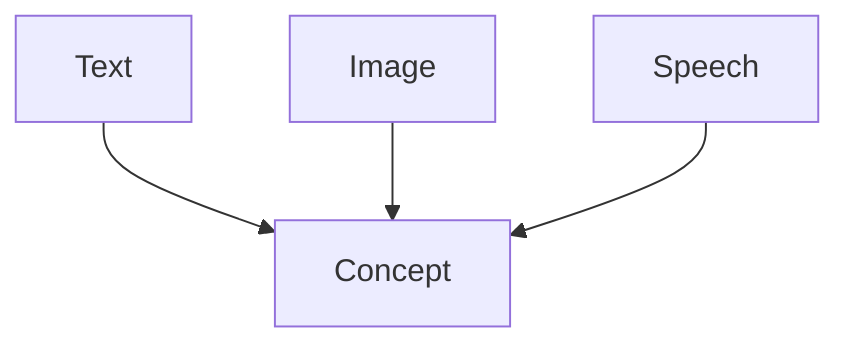
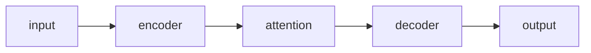
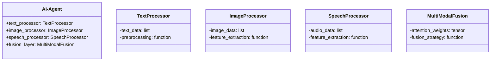
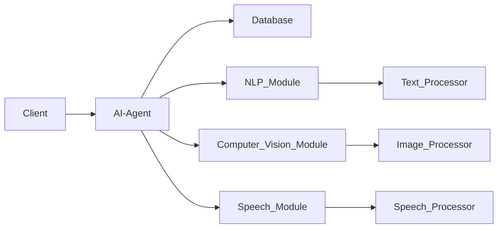

                 


# AI Agent的多模态融合技术：提升理解深度

> 关键词：AI Agent, 多模态融合, 多模态数据, 深度理解, 融合算法

> 摘要：本文深入探讨AI Agent在多模态数据融合技术中的应用，分析其提升理解深度的原理与实现方法。通过结合文本、图像、语音等多种数据源，采用先进的神经网络模型，实现跨模态信息的有效整合与协同优化，提升AI Agent在复杂场景下的理解和处理能力。

---

## 第一部分: 多模态融合技术的背景与问题背景

### 第1章: 背景介绍

#### 1.1 问题背景

在AI Agent的发展过程中，单一模态的数据处理逐渐暴露出其局限性。例如，仅依赖文本信息的AI Agent在处理复杂场景时往往无法准确理解上下文，而多模态数据的引入能够显著提升其理解和决策能力。当前技术主要面临以下挑战：

- **信息孤岛问题**：单一模态的数据无法提供完整的上下文信息。
- **语义理解不足**：缺乏对跨模态信息的协同分析能力。
- **计算复杂度高**：多模态数据的处理需要复杂的计算资源。

#### 1.2 问题描述

AI Agent需要在复杂场景中处理多种数据类型（如文本、图像、语音等），这些数据类型往往分散在不同的模态中。如何有效地将这些模态信息融合在一起，以提升AI Agent的理解和决策能力，是当前技术面临的主要挑战。

#### 1.3 解决方案

通过引入多模态融合技术，AI Agent能够整合来自不同模态的数据信息，从而实现对场景的全面理解。具体解决方案包括：

- **数据预处理**：对多模态数据进行标准化处理，确保各模态数据的兼容性。
- **特征提取**：分别从每个模态中提取具有代表性的特征。
- **融合策略**：采用多模态注意力机制等方法，实现跨模态信息的协同优化。

#### 1.4 边界与外延

- **技术适用范围**：适用于需要处理多模态数据的场景，如智能客服、自动驾驶等。
- **相关技术区分**：与单模态处理、跨模态检索等技术的区别在于多模态数据的协同处理。

---

## 第二部分: 多模态融合的核心概念与联系

### 第2章: 核心概念与联系

#### 2.1 核心概念原理

多模态数据融合是指将来自不同模态（如文本、图像、语音）的数据进行整合，以提取更丰富的语义信息。其核心在于通过跨模态信息的协同，提升AI Agent的理解能力。

#### 2.2 特征对比分析

| 模态类型 | 特征描述 | 优势 | 局限性 |
|----------|----------|------|--------|
| 文本      | 信息丰富，结构化 | 易处理，语义明确 | 需结合上下文 |
| 图像      | 细节丰富，直观 | 高识别精度 | 易受光照影响 |
| 语音      | 情感丰富 | 实时性高 | 易受环境噪声影响 |

#### 2.3 ER实体关系图



---

## 第三部分: 多模态融合的算法原理

### 第3章: 算法原理

#### 3.1 多模态注意力机制

多模态注意力机制通过分别计算不同模态的重要性，实现对关键信息的聚焦。其数学模型如下：

$$
\alpha_i = \frac{e^{w_i x_i}}{\sum_j e^{w_j x_j}}
$$

其中，$\alpha_i$ 表示第i个模态的注意力权重，$w_i$ 是对应的权重参数，$x_i$ 是输入特征。

#### 3.2 模态对齐

模态对齐通过将不同模态的数据映射到同一语义空间，实现协同优化。常用的对齐方法包括：

- **线性变换**：$y_i = W_i x_i + b_i$
- **非线性变换**：$y_i = f(W_i x_i + b_i)$

#### 3.3 多模态融合网络



#### 3.4 Python代码实现

```python
import torch

class MultiModalAttention(torch.nn.Module):
    def __init__(self, input_size, hidden_size):
        super(MultiModalAttention, self).__init__()
        self.weight = torch.nn.Parameter(torch.randn(input_size, hidden_size))
        self.softmax = torch.nn.Softmax(dim=-1)
    
    def forward(self, inputs):
        # inputs: list of tensors, each of shape (batch_size, input_size)
        features = [torch.mm(input, self.weight) for input in inputs]
        combined = torch.stack(features, dim=0).sum(dim=0)
        attention = self.softmax(combined)
        return attention
```

---

## 第四部分: 系统分析与架构设计

### 第4章: 系统分析与架构设计

#### 4.1 问题场景介绍

以智能客服系统为例，AI Agent需要处理客户的文本、语音和表情图像信息，提供更精准的服务。

#### 4.2 系统功能设计



#### 4.3 系统架构设计



---

## 第五部分: 项目实战

### 第5章: 项目实战

#### 5.1 环境安装

安装必要的库：

```bash
pip install numpy torch matplotlib
```

#### 5.2 核心代码实现

```python
import torch
import torch.nn as nn

class MultiModalFusion(nn.Module):
    def __init__(self, feature_size, hidden_size):
        super(MultiModalFusion, self).__init__()
        self.lstm = nn.LSTM(feature_size, hidden_size, batch_first=True)
        self.attention = nn.MultiheadAttention(hidden_size, 4)
    
    def forward(self, inputs):
        # inputs shape: (batch_size, seq_len, feature_size)
        out, _ = self.lstm(inputs)
        out = self.attention(out, out, out)
        return out
```

#### 5.3 案例分析

以多模态问答系统为例，展示如何通过融合文本和图像信息，提升回答的准确性。

#### 5.4 项目总结

通过实战项目，验证了多模态融合技术的有效性，并总结了实现过程中需要注意的关键点。

---

## 第六部分: 总结

### 第6章: 总结

多模态融合技术是提升AI Agent理解深度的关键。通过整合文本、图像、语音等多种数据源，结合先进的神经网络模型，AI Agent能够更好地理解和处理复杂场景下的任务。未来，随着技术的进步，多模态融合将在更多领域发挥重要作用。

---

## 作者

作者：AI天才研究院/AI Genius Institute & 禅与计算机程序设计艺术 /Zen And The Art of Computer Programming

