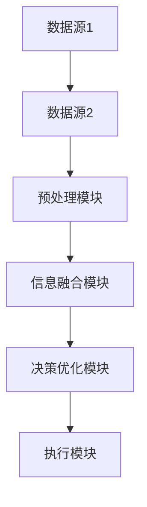

                 


# AI Agent的多源信息融合与决策技术

> 关键词：AI Agent、多源信息融合、决策技术、概率论、深度学习、强化学习、系统架构

> 摘要：本文将深入探讨AI Agent的多源信息融合与决策技术，从基本概念到系统架构，从算法原理到项目实战，全面解析这一领域的核心技术和应用实践。

---

## 第1章: AI Agent的基本概念与背景

### 1.1 AI Agent的定义与特点

#### 1.1.1 AI Agent的定义
AI Agent（人工智能代理）是指能够感知环境、自主决策并执行任务的智能体。它可以是一个软件程序、机器人或其他智能系统，其核心目标是通过与环境交互，完成特定的目标或任务。

#### 1.1.2 AI Agent的核心特点
- **自主性**：AI Agent能够在没有外部干预的情况下自主运行。
- **反应性**：能够实时感知环境变化并做出响应。
- **目标导向性**：基于目标驱动决策和行动。
- **学习能力**：能够通过经验改进性能。

#### 1.1.3 AI Agent与传统智能系统的区别
传统智能系统通常依赖于预定义的规则和流程，而AI Agent具备更强的自主性和适应性，能够处理不确定性和复杂性。

### 1.2 多源信息融合的背景与意义

#### 1.2.1 信息融合的定义与作用
信息融合是指将来自不同来源的数据进行处理、分析和综合，以提高信息的准确性和完整性。在AI Agent中，信息融合能够帮助代理更好地理解环境，做出更可靠的决策。

#### 1.2.2 多源信息融合的必要性
在实际应用中，单一来源的信息往往不足以支持决策，因此需要将多个来源的信息进行融合，以提高决策的可靠性和准确性。

#### 1.2.3 多源信息融合在AI Agent中的应用
- **环境感知**：通过多种传感器融合数据，提高感知的准确性。
- **任务规划**：结合任务需求和环境信息，制定最优行动方案。
- **动态决策**：根据实时信息调整决策策略。

---

## 第2章: 多源信息融合的核心概念

### 2.1 多源信息融合的原理

#### 2.1.1 数据预处理
数据预处理是信息融合的第一步，主要包括数据清洗、标准化和去噪等操作。

#### 2.1.2 特征提取
特征提取是从原始数据中提取有用特征的过程，能够降低数据维度，提高后续处理的效率。

#### 2.1.3 信息融合的数学模型
信息融合的数学模型是将多个信息源的数据进行综合的数学表达。常见的模型包括概率论模型、证据理论模型和深度学习模型。

### 2.2 多源信息融合的方法

#### 2.2.1 基于概率的融合方法
基于概率的融合方法利用概率论来表示和处理不确定性信息。常用的方法包括贝叶斯网络和D-S证据理论。

#### 2.2.2 基于规则的融合方法
基于规则的融合方法通过预定义的规则来融合信息，适用于规则明确的场景。

#### 2.2.3 基于深度学习的融合方法
基于深度学习的融合方法通过训练深度神经网络来自动学习信息的特征和权重，适用于复杂场景。

### 2.3 多源信息融合的优缺点对比

#### 2.3.1 各种融合方法的优缺点
| 方法                | 优点                              | 缺点                              |
|---------------------|-----------------------------------|-----------------------------------|
| 基于概率的方法      | 能够处理不确定性信息              | 计算复杂度较高                    |
| 基于规则的方法      | 实现简单，易于解释                | 适应性较差                      |
| 基于深度学习的方法  | 学习能力强，适应性好              | 需要大量数据，计算资源消耗大      |

#### 2.3.2 融合方法的选择依据
- 数据类型和特征
- 信息的不确定性
- 计算资源的限制

### 2.4 实体关系图

```mermaid
graph TD
    A[信息源1] --> C[融合模块]
    B[信息源2] --> C
    D[融合结果] <-- C
```

---

## 第3章: AI Agent的决策技术

### 3.1 决策的基本概念

#### 3.1.1 决策的定义与作用
决策是指在多个选项中选择一个最优或满意的选择，以实现目标的过程。在AI Agent中，决策是其行动的核心驱动力。

#### 3.1.2 决策的过程与模型
决策过程通常包括感知环境、分析信息、制定策略和执行行动等步骤。决策模型可以是基于规则的模型、概率模型或强化学习模型。

### 3.2 基于多源信息的决策方法

#### 3.2.1 基于概率的决策方法
基于概率的决策方法利用概率论来计算各个选项的概率，选择概率最大的选项作为决策。

#### 3.2.2 基于规则的决策方法
基于规则的决策方法通过预定义的规则来判断决策条件，适用于规则明确的场景。

#### 3.2.3 基于深度学习的决策方法
基于深度学习的决策方法通过训练深度神经网络来学习决策策略，适用于复杂场景。

### 3.3 决策优化与强化学习

#### 3.3.1 强化学习的基本概念
强化学习是一种通过试错机制来优化决策的机器学习方法。学习剂通过与环境交互，获得奖励或惩罚，从而优化决策策略。

#### 3.3.2 强化学习在决策优化中的应用
强化学习广泛应用于游戏、机器人控制、自动驾驶等领域，能够帮助AI Agent在动态环境中做出最优决策。

#### 3.3.3 基于多源信息的强化学习模型
基于多源信息的强化学习模型能够整合多种信息源的数据，提高决策的准确性和可靠性。

### 3.4 决策优化的数学模型

#### 3.4.1 基于概率的决策模型
$$ P(a|e) = \frac{P(e|a)P(a)}{P(e)} $$
其中，$P(a|e)$ 表示在环境 $e$ 下选择动作 $a$ 的概率。

#### 3.4.2 基于强化学习的决策模型
强化学习的目标函数可以表示为：
$$ J = E[\sum_{t=0}^{\infty} \gamma^t r_t] $$
其中，$r_t$ 是第 $t$ 步的奖励，$\gamma$ 是折扣因子。

---

## 第4章: 系统架构与设计

### 4.1 系统架构设计

#### 4.1.1 系统分层架构
AI Agent的系统架构通常分为感知层、融合层和决策层。感知层负责数据采集，融合层负责信息综合，决策层负责制定行动方案。

#### 4.1.2 各层的功能与接口设计
- 感知层：负责与环境交互，采集数据。
- 融合层：对数据进行预处理、特征提取和信息融合。
- 决策层：基于融合后的信息，制定决策策略。

### 4.2 系统功能设计

#### 4.2.1 数据采集与预处理模块
数据采集模块负责从多种信息源采集数据，预处理模块对数据进行清洗和标准化。

#### 4.2.2 信息融合模块
信息融合模块负责将预处理后的数据进行融合，得到更准确的信息。

#### 4.2.3 决策优化模块
决策优化模块基于融合后的信息，制定最优决策策略。

### 4.3 系统实现的流程图



---

## 第5章: 项目实战

### 5.1 环境安装

#### 5.1.1 安装Python
安装Python 3.x版本，推荐使用Anaconda或Miniconda。

#### 5.1.2 安装依赖库
安装必要的依赖库，如NumPy、Pandas、Matplotlib、Scikit-learn等。

### 5.2 系统核心实现源代码

#### 5.2.1 数据预处理代码

```python
import numpy as np
import pandas as pd

def preprocess_data(data):
    # 数据清洗
    data = data.dropna()
    # 标准化处理
    from sklearn.preprocessing import StandardScaler
    scaler = StandardScaler()
    data_scaled = scaler.fit_transform(data)
    return data_scaled
```

#### 5.2.2 信息融合代码

```python
from sklearn.ensemble import VotingClassifier

def fuse_info(data_sources):
    # 假设每个数据源是一个分类器
    classifiers = []
    for source in data_sources:
        clf = VotingClassifier(...)
        classifiers.append(clf)
    # 融合结果
    fused_result = ...
    return fused_result
```

#### 5.2.3 决策优化代码

```python
import tensorflow as tf
from tensorflow.keras import layers

def build_decision_model():
    model = tf.keras.Sequential()
    model.add(layers.Dense(64, activation='relu'))
    model.add(layers.Dense(1, activation='sigmoid'))
    model.compile(optimizer='adam', loss='binary_crossentropy')
    return model
```

### 5.3 实际案例分析

#### 5.3.1 案例背景
假设我们开发一个智能客服AI Agent，需要融合来自文本、语音和用户行为的数据，实现客户意图识别和决策。

#### 5.3.2 数据采集与预处理
从文本、语音和行为日志中采集数据，并进行清洗和标准化。

#### 5.3.3 信息融合
使用多种方法对数据进行融合，得到更准确的客户意图表示。

#### 5.3.4 决策优化
基于融合后的数据，训练一个深度学习模型，实现客户意图分类和决策优化。

### 5.4 项目小结

---

## 第6章: 最佳实践与总结

### 6.1 小结
本文从AI Agent的基本概念出发，详细探讨了多源信息融合与决策技术的核心概念、算法原理和系统架构，并通过项目实战展示了技术的具体应用。

### 6.2 注意事项
- 数据预处理是信息融合的基础，需要仔细处理。
- 选择合适的融合方法，根据实际场景和数据特征进行调整。
- 决策优化需要结合具体任务需求，合理设计奖励函数和策略。

### 6.3 拓展阅读
- 《Probabilistic Graphical Models》
- 《Deep Learning for Decision Making》
- 《Reinforcement Learning: Theory and Practice》

---

## 作者：AI天才研究院/AI Genius Institute & 禅与计算机程序设计艺术 /Zen And The Art of Computer Programming

---

通过以上思考，我们已经系统地探讨了AI Agent的多源信息融合与决策技术的各个方面，从理论到实践，为读者提供了一个全面的学习和参考框架。

