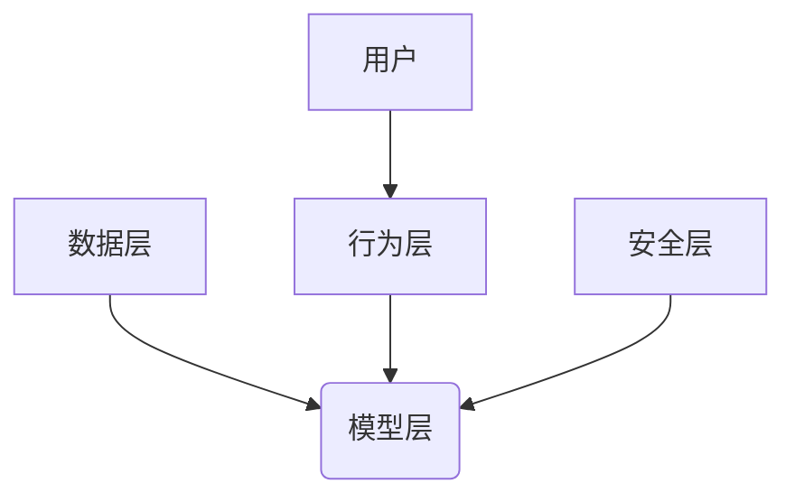
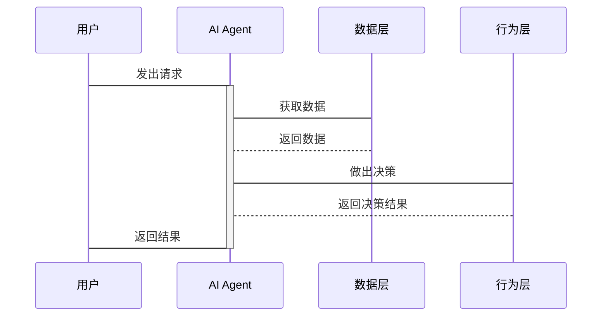

                 


# AI Agent的安全性设计：防范潜在风险

---

## 关键词

- AI Agent
- 安全性设计
- 对抗攻击
- 数据隐私
- 系统架构
- 智能安全

---

## 摘要

随着人工智能技术的快速发展，AI Agent（智能体）在各个领域的应用越来越广泛。然而，AI Agent的安全性问题也随之浮现，如数据泄露、模型攻击、行为失控等。本文从AI Agent的基本概念出发，深入分析其潜在风险，并探讨如何通过安全性设计原则、算法原理、系统架构设计以及项目实战来防范这些风险。文章结合理论与实践，为读者提供全面的安全性设计指导，帮助企业在实际应用中构建安全可靠的AI Agent系统。

---

## 第一部分：AI Agent的安全性设计背景

### 第1章：AI Agent的基本概念与应用场景

#### 1.1 AI Agent的定义与核心概念

AI Agent（人工智能智能体）是一种能够感知环境并采取行动以实现目标的智能系统。与传统AI系统相比，AI Agent具有更强的自主性和适应性，能够在动态环境中做出决策。

- **基本定义**：AI Agent通过传感器感知环境，利用推理引擎进行决策，并通过执行器与环境交互。
- **核心特征**：
  - 自主性：无需外部干预，自主决策。
  - 反应性：实时感知环境并做出反应。
  - 目标导向：所有行为均以实现特定目标为导向。
  - 学习能力：通过经验改进自身性能。

- **与传统AI的区别**：
  - 传统AI：专注于特定任务，如图像识别、语音识别。
  - AI Agent：具备自主性和目标导向性，能够主动与环境交互。

#### 1.2 AI Agent的应用场景

AI Agent的应用场景广泛，涵盖多个领域：

- **智能助手与个人服务**：
  - 个人助手（如Siri、Alexa）：帮助用户完成日程管理、信息查询等任务。
  - 健康管理：监测用户的健康数据，提供个性化建议。

- **企业级AI Agent的应用**：
  - 智能客服：处理客户咨询，解决客户问题。
  - 供应链管理：优化库存，协调物流。

- **AI Agent在智能系统中的集成**：
  - 智能家居：控制家中的设备，提供舒适的生活环境。
  - 智能交通：协调车辆，优化交通流量。

#### 1.3 AI Agent的安全性问题背景

AI Agent的安全性问题不容忽视，潜在风险包括：

- **数据泄露**：AI Agent处理大量敏感数据，可能成为黑客攻击目标。
- **模型攻击**：攻击者可能通过对抗样本攻击模型，导致决策错误。
- **行为失控**：在复杂环境中，AI Agent可能因错误决策引发安全问题。

- **安全需求**：
  - 数据安全：保护用户数据不被泄露或篡改。
  - 模型安全：防止模型被攻击或滥用。
  - 行为安全：确保AI Agent的行为符合预期。

---

## 第二部分：AI Agent的安全性设计核心概念

### 第2章：AI Agent的安全性设计原则

#### 2.1 AI Agent的安全性设计框架

AI Agent的安全性设计需遵循以下原则：

- **数据安全与隐私保护**：
  - 数据加密：对敏感数据进行加密处理，防止未经授权的访问。
  - 数据匿名化：在数据处理过程中，去除或脱敏个人身份信息。

- **模型安全与对抗训练**：
  - 对抗训练：通过引入对抗样本，增强模型的鲁棒性。
  - 模型监控：实时监测模型状态，及时发现并应对异常情况。

- **行为安全与权限控制**：
  - 权限管理：根据用户身份和角色，分配相应的操作权限。
  - 行为监控：实时监控AI Agent的行为，识别潜在的安全威胁。

#### 2.2 AI Agent的安全性设计属性

- **数据完整性**：确保数据在传输和存储过程中不被篡改。
- **系统可用性**：保证AI Agent在面对攻击时仍能正常运行。
- **用户隐私保护**：防止用户数据被未经授权的第三方获取。

---

## 第三部分：AI Agent的安全性设计算法原理

### 第4章：AI Agent的风险评估与对抗训练

#### 4.1 AI Agent的风险评估模型

风险评估模型用于识别和量化AI Agent面临的安全风险。模型基于概率论，计算每个风险的发生概率及其影响程度。

- **数学模型**：
  - 风险评估公式：
  $$ R = P \times I $$
  其中，R为风险值，P为风险发生概率，I为风险影响程度。
  
- **风险评估流程**：
  1. 确定潜在风险。
  2. 评估每个风险的发生概率和影响程度。
  3. 计算风险值，优先处理高风险问题。

#### 4.2 AI Agent的对抗训练方法

对抗训练是增强AI Agent模型鲁棒性的有效方法。通过生成对抗网络（GANs）生成对抗样本，训练模型识别并抵御这些样本。

- **对抗训练过程**：
  1. 构建生成器和判别器。
  2. 训练生成器生成对抗样本。
  3. 训练判别器识别正常样本和对抗样本。
  4. 循环迭代，优化模型参数。

- **数学模型**：
  - 生成器目标函数：
  $$ \min_{G} \max_{D} \mathbb{E}_{x}[log D(x)] + \mathbb{E}_{z}[log (1 - D(G(z)))] $$
  - 判别器目标函数：
  $$ \min_{D} \mathbb{E}_{x}[log D(x)] + \mathbb{E}_{z}[log (1 - D(G(z)))] $$

---

## 第四部分：AI Agent的安全性设计系统架构

### 第5章：AI Agent的安全性设计系统架构

#### 5.1 系统架构设计

AI Agent的安全性设计系统架构包括以下几个部分：

- **数据层**：负责数据的采集、存储和处理。
- **模型层**：包含AI Agent的核心算法和模型。
- **行为层**：负责AI Agent的行为决策和执行。
- **安全层**：实现数据加密、模型保护和行为监控。

- **系统架构图**：


#### 5.2 接口设计

- **数据接口**：
  - 输入接口：接收传感器数据。
  - 输出接口：发送处理结果。
- **模型接口**：
  - 输入接口：接收输入数据。
  - 输出接口：返回模型预测结果。
- **行为接口**：
  - 输入接口：接收决策指令。
  - 输出接口：执行操作并返回状态。

#### 5.3 交互设计

- **用户与AI Agent交互流程**：
  1. 用户发出请求。
  2. AI Agent接收请求，分析需求。
  3. AI Agent做出决策，执行操作。
  4. AI Agent返回结果，完成交互。

- **系统交互图**：


---

## 第五部分：AI Agent的安全性设计项目实战

### 第6章：AI Agent的安全性设计项目实战

#### 6.1 项目背景

以电商推荐系统为例，设计一个安全的AI Agent。该系统需要根据用户行为推荐商品，同时保护用户隐私。

#### 6.2 系统设计

- **数据层**：收集用户点击、浏览、购买数据。
- **模型层**：使用协同过滤算法推荐商品。
- **行为层**：根据推荐结果发送个性化优惠券。
- **安全层**：加密用户数据，防止数据泄露。

#### 6.3 代码实现

以下是推荐系统的核心代码：

```python
import numpy as np

def collaborative_filtering(user_matrix):
    # 假设user_matrix是用户-物品矩阵
    # 使用SVD分解
    U, S, V = np.linalg.svd(user_matrix, full_matrices=False)
    # 重建矩阵
    rank = 5  # 矩阵的秩
    S_rank = np.diag(S[:rank])
    U_rank = U[:, :rank]
    V_rank = V[:rank, :]
    # 预测评分
    predicted_matrix = np.dot(U_rank, S_rank.dot(V_rank))
    return predicted_matrix

# 示例数据
user_matrix = np.array([[5, 3, 0], [0, 1, 4]])
predicted_matrix = collaborative_filtering(user_matrix)
print(predicted_matrix)
```

#### 6.4 案例分析

- **数据加密**：用户数据在传输和存储过程中进行加密，防止未经授权的访问。
- **模型保护**：使用对抗训练增强推荐模型的鲁棒性，防止攻击者干扰推荐结果。
- **行为监控**：实时监控AI Agent的行为，识别异常操作，防止恶意行为。

---

## 第六部分：总结与展望

### 第7章：总结与展望

#### 7.1 总结

本文全面探讨了AI Agent的安全性设计，从核心概念、设计原则、算法原理到系统架构和项目实战，为读者提供了系统的指导。通过本文的讲解，读者可以深入了解AI Agent的安全性问题，并掌握防范潜在风险的方法。

#### 7.2 展望

未来，AI Agent的安全性设计将面临更多挑战，如量子计算的安全威胁、AI Agent的自主决策能力提升等。研究者需要不断探索新的安全技术，如同态加密、可解释AI等，以应对日益复杂的网络安全威胁。

---

## 作者

**作者：AI天才研究院/AI Genius Institute & 禅与计算机程序设计艺术 /Zen And The Art of Computer Programming**

---

这篇文章详细讲解了AI Agent的安全性设计，从理论到实践，为读者提供了全面的指导。希望对您在设计和实现安全的AI Agent系统时有所帮助。

