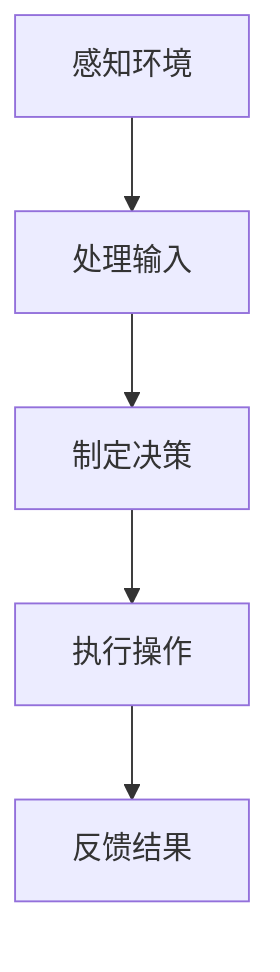
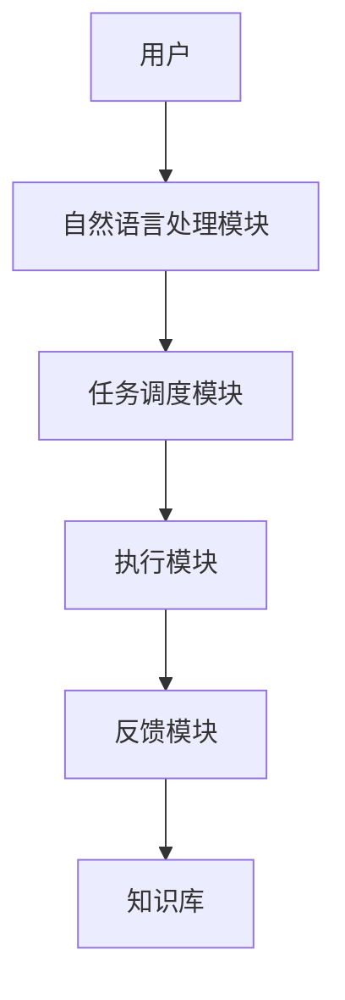

                 


# AI Agent的定义与特性：智能助手的核心要素

## 关键词
AI Agent, 智能助手, 核心特性, 系统架构, 算法原理

## 摘要
AI Agent作为人工智能领域的核心组件，近年来在智能助手、自动化系统和智能决策系统中得到了广泛应用。本文从AI Agent的基本概念出发，详细探讨其定义、核心特性、算法原理、系统架构设计以及实际项目中的应用。通过理论分析和实践案例，揭示AI Agent在智能助手领域的关键要素，帮助读者全面理解其工作原理和实际应用。

---

## 第1章: AI Agent的基本概念

### 1.1 AI Agent的背景与问题背景
#### 1.1.1 从传统AI到AI Agent的演进
人工智能（AI）技术的快速发展催生了AI Agent这一概念。从传统的基于规则的AI系统到现代的智能代理系统，AI Agent作为能够感知环境、自主决策、执行任务的实体，逐渐成为智能系统的核心组件。

#### 1.1.2 当前AI Agent的应用场景
AI Agent广泛应用于智能助手、推荐系统、自动化控制、机器人、自动驾驶等领域。例如，智能助手（如Siri、Alexa）通过AI Agent技术实现自然语言处理、任务调度和执行。

#### 1.1.3 问题背景与问题描述
随着智能系统的复杂化，传统的基于规则的AI系统难以应对动态环境和复杂任务。AI Agent需要具备感知、决策、执行和自适应能力，以解决动态环境中的任务调度和优化问题。

---

### 1.2 AI Agent的核心概念
#### 1.2.1 AI Agent的定义与问题解决
AI Agent是一种智能实体，能够感知环境、理解需求、自主决策并执行任务，以实现目标。AI Agent的核心问题在于如何在动态和不确定的环境中实现高效的决策和任务执行。

#### 1.2.2 AI Agent的边界与外延
AI Agent的边界包括感知能力、决策模型和执行机制。外延则涉及多智能体系统、分布式计算和人机交互等领域。

#### 1.2.3 核心要素组成与概念结构
AI Agent的核心要素包括感知模块、决策模块、执行模块和学习模块。通过模块化设计，AI Agent能够实现感知环境、制定策略、执行任务和自适应优化。

---

## 第2章: AI Agent的核心概念与联系

### 2.1 AI Agent的原理与核心概念
#### 2.1.1 AI Agent的基本原理
AI Agent通过感知环境获取信息，利用决策模型制定策略，并通过执行模块实现任务。感知模块包括传感器和数据处理，决策模块基于推理和优化算法，执行模块负责任务的物理或逻辑执行。

#### 2.1.2 核心概念的详细解析
AI Agent的核心概念包括智能性、自主性、反应性和社会性。智能性指问题解决和学习能力；自主性指独立运行和决策能力；反应性指对环境变化的实时响应；社会性指与人和其他系统的交互能力。

### 2.2 AI Agent的属性特征对比
#### 2.2.1 属性特征对比表格
| 属性 | 描述 |
|------|------|
| 智能性 | 问题解决和学习能力 |
| 自主性 | 独立运行和决策能力 |
| 反应性 | 对环境变化的实时响应 |
| 社会性 | 与人和其他系统的交互能力 |

#### 2.2.2 ER实体关系图架构
```mermaid
erd
actor(Agent, "智能实体") 
actor(User, "用户") 
actor(Task, "任务") 
actor(Environment, "环境") 
relation(Agent, User, "提供服务") 
relation(Agent, Task, "执行任务") 
relation(Agent, Environment, "感知环境")
```

---

## 第3章: AI Agent的算法原理

### 3.1 算法原理概述
#### 3.1.1 算法流程图


#### 3.1.2 算法原理的详细讲解
AI Agent的算法通常包括感知、推理和优化。感知阶段通过传感器或数据接口获取环境信息；推理阶段基于知识库和推理规则生成候选决策；优化阶段通过强化学习或遗传算法优化决策策略。

### 3.2 算法实现
#### 3.2.1 Python源代码实现
```python
class AI_Agent:
    def __init__(self):
        self.sensors = []
        self.decoders = []
        self.reasoners = []
        self.executors = []
    
    def perceive(self, input_data):
        for sensor in self.sensors:
            sensor.decode(input_data)
    
    def decide(self, goal):
        for reasoner in self.reasoners:
            reasoner.infer(goal)
    
    def execute(self, action):
        for executor in self.executors:
            executor.perform(action)
```

#### 3.2.2 代码应用解读与分析
上述代码定义了一个AI Agent类，包含感知、推理和执行模块。感知模块通过传感器解码输入数据，推理模块基于知识库生成候选决策，执行模块负责任务的物理或逻辑执行。

---

## 第4章: AI Agent的系统分析与架构设计

### 4.1 系统分析
#### 4.1.1 问题场景介绍
AI Agent需要在动态环境中实时感知、决策和执行任务。例如，在智能助手场景中，AI Agent需要理解用户的请求、调用相应的服务并反馈结果。

#### 4.1.2 系统功能设计
AI Agent的功能模块包括感知模块、推理模块、决策模块、执行模块和反馈模块。

### 4.2 系统架构设计
#### 4.2.1 系统架构图


#### 4.2.2 系统接口设计
AI Agent需要与传感器、执行器、知识库和用户接口进行交互。主要接口包括感知接口、决策接口和执行接口。

---

## 第5章: AI Agent的项目实战

### 5.1 环境安装与配置
#### 5.1.1 开发环境搭建
建议使用Python 3.8及以上版本，安装必要的库如numpy、pandas、scikit-learn。

#### 5.1.2 工具链安装
安装必要的开发工具，如Jupyter Notebook、IDE和版本控制系统。

### 5.2 核心功能实现
#### 5.2.1 核心代码实现
```python
class PerceptionModule:
    def __init__(self):
        self.sensors = []
    
    def perceive(self, input_data):
        for sensor in self.sensors:
            sensor.trigger(input_data)
```

#### 5.2.2 代码解读与分析
上述代码定义了一个感知模块类，包含多个传感器。每个传感器在接收到输入数据时触发相应的处理逻辑。

### 5.3 实际案例分析
以智能助手为例，AI Agent需要通过自然语言处理模块理解用户请求，调用相应的服务并反馈结果。例如，用户请求“打开灯”，AI Agent需要通过传感器获取灯的状态，推理出需要执行的操作，并通过执行模块调用相应的API。

---

## 第6章: 最佳实践与小结

### 6.1 最佳实践与注意事项
- 在开发AI Agent时，建议模块化设计，便于功能扩展和维护。
- 使用强化学习优化决策模型，提高系统的自适应能力。
- 注意数据安全和隐私保护，确保系统的合规性。

### 6.2 小结与拓展阅读
AI Agent作为智能系统的核心组件，其定义与特性是实现智能助手的关键。通过理论分析和实践案例，本文揭示了AI Agent的核心要素和实际应用。未来，AI Agent将在更多领域发挥重要作用。

---

## 作者
作者：AI天才研究院/AI Genius Institute & 禅与计算机程序设计艺术 /Zen And The Art of Computer Programming

