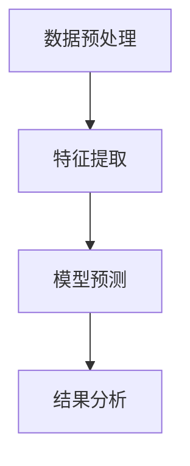

                 


# AI Agent的实时多模态情感分析

## 关键词：AI Agent, 多模态情感分析, 实时处理, 深度学习, 情感计算

## 摘要

AI Agent的实时多模态情感分析是一项结合了人工智能、自然语言处理和多模态数据处理的复杂任务。随着技术的进步，AI Agent需要能够理解并处理来自不同模态的数据，如文本、语音和图像，以进行实时的情感分析。本文将详细探讨这一领域的核心概念、算法原理和系统设计，通过实际案例展示如何实现一个高效的实时多模态情感分析系统。

---

## 第一部分: AI Agent与情感分析概述

### 第1章: AI Agent的基本概念

#### 1.1 AI Agent的定义与类型

AI Agent，即人工智能代理，是指能够感知环境并采取行动以实现目标的智能实体。根据其智能水平，AI Agent可以分为反应式、基于模型的、学习型和社交型代理。AI Agent在情感分析中的应用主要集中在实时理解用户情感并做出相应反馈。

#### 1.2 情感分析的定义与应用

情感分析是对文本、语音或图像等数据进行分析，以识别和分类其中的情感倾向。其应用广泛，包括社交媒体分析、客户反馈分析、语音助手交互等。

#### 1.3 AI Agent在情感分析中的作用

AI Agent通过实时处理多模态数据，能够快速理解用户情感并提供个性化服务，从而提升用户体验和效率。

---

### 第2章: 多模态数据的定义与特点

#### 2.1 多模态数据的定义

多模态数据指来自不同感官渠道的数据，如文本、语音、图像和视频。这些数据能够提供更全面的信息，帮助AI Agent更准确地理解用户情感。

#### 2.2 文本、语音、图像等模态的特征

- 文本：包含情感词汇和语调。
- 语音：包含语调、语速和音量等信息。
- 图像：包含面部表情和肢体语言。

#### 2.3 多模态数据的挑战与优势

- 挑战：数据异构性和融合难度。
- 优势：提供更丰富的情感信息，提高分析准确性。

---

## 第二部分: 多模态情感分析的核心概念

### 第3章: 多模态数据融合的原理

#### 3.1 数据融合的定义与方法

数据融合指将来自不同模态的数据进行整合，以获得更准确的结果。常见的方法包括特征级融合、决策级融合和模型级融合。

#### 3.2 多模态数据融合的优势

通过融合多模态数据，AI Agent可以更全面地理解用户情感，减少单模态分析的局限性。

#### 3.3 数据融合的常见技术

- 特征级融合：将不同模态的特征向量进行合并。
- 决策级融合：将不同模态的分类结果进行加权融合。
- 模型级融合：在深度学习模型中同时处理多模态数据。

---

### 第4章: 多模态情感分析的算法原理

#### 4.1 基础模型介绍

- 词袋模型：基于单词频率的文本表示方法。
- TF-IDF：基于词频和逆文档频率的加权方法。
- 朴素贝叶斯分类器：基于概率的分类算法。

#### 4.2 深度学习模型的应用

- RNN：处理序列数据的循环神经网络。
- LSTM：长短期记忆网络，适合处理长序列数据。
- BERT：基于变换器的预训练模型，用于上下文理解。

#### 4.3 模型的优缺点对比

| 模型 | 优点 | 缺点 |
|------|------|------|
| 词袋模型 | 简单易实现 | 无法捕捉语义信息 |
| TF-IDF | 能处理文档重要性 | 无法处理复杂语义 |
| RNN | 处理序列数据 | 易发梯度消失问题 |
| LSTM | 长期依赖处理 | 训练复杂度高 |
| BERT | 上下文理解能力强 | 需大量计算资源 |

---

## 第三部分: 多模态情感分析的系统架构设计

### 第5章: 系统功能设计

#### 5.1 数据预处理模块

- 文本清洗：去除停用词、标点符号等。
- 语音信号处理：降噪、特征提取。
- 图像处理：标准化、特征提取。

#### 5.2 特征提取模块

- 文本：词嵌入、句向量。
- 语音：MFCC特征提取。
- 图像：面部表情识别。

#### 5.3 模型预测模块

- 多模态融合：将不同模态的特征进行融合。
- 情感预测：基于融合特征进行情感分类。

#### 5.4 结果分析模块

- 反馈机制：根据用户反馈调整模型参数。
- 实时监控：监控系统性能并优化。

### 第6章: 系统架构图



---

## 第四部分: 项目实战

### 第7章: 环境安装与代码实现

#### 7.1 环境安装

- 安装Python、TensorFlow、Keras等依赖库。

#### 7.2 代码实现

```python
import tensorflow as tf
from tensorflow.keras import layers

model = tf.keras.Sequential([
    layers.Dense(128, activation='relu'),
    layers.Dense(2, activation='softmax')
])

model.compile(optimizer='adam', loss='sparse_categorical_crossentropy', metrics=['accuracy'])
```

---

## 第五部分: 总结与展望

### 第8章: 总结

AI Agent的实时多模态情感分析是一项具有挑战性的任务，需要结合多模态数据处理和深度学习技术。通过合理的系统设计和算法优化，可以显著提高情感分析的准确性和实时性。

### 第9章: 未来展望

未来的研究方向可能包括更高效的多模态融合方法、轻量化模型设计以及边缘计算环境下的实时处理。

---

## 作者：AI天才研究院/AI Genius Institute & 禅与计算机程序设计艺术 /Zen And The Art of Computer Programming

