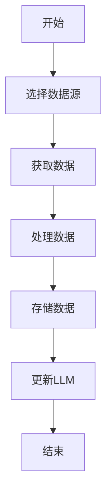
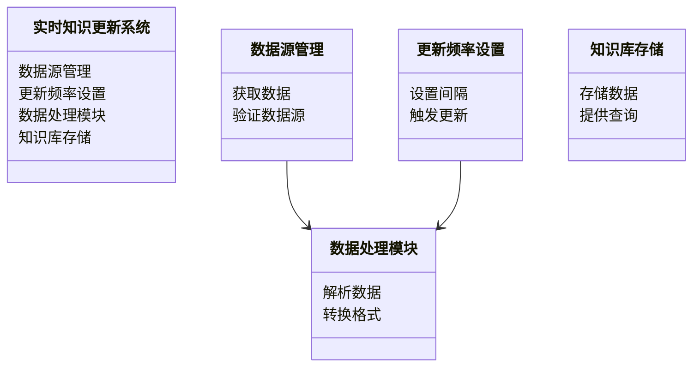
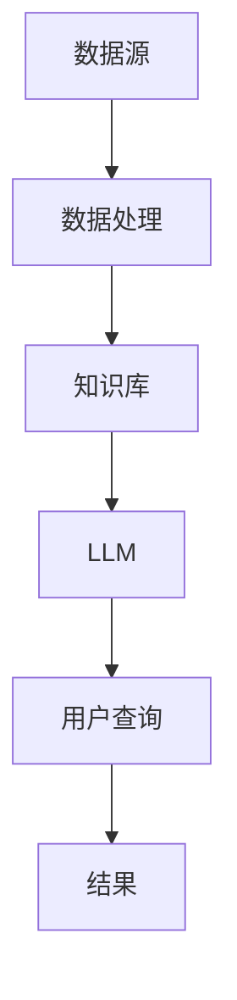
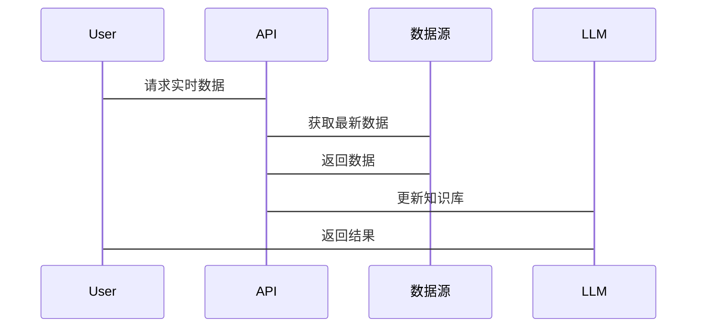

                 


# AI Agent的实时知识更新：保持LLM信息的时效性

> 关键词：AI Agent，实时知识更新，LLM，信息时效性，数据源，更新机制

> 摘要：本文深入探讨了AI Agent实时知识更新的重要性，分析了保持LLM信息时效性的核心方法和策略，通过详细的技术分析和案例解读，为读者提供了全面的解决方案和实践指南。

---

## 第一部分：背景介绍

### 第1章：问题背景与描述

#### 1.1 问题背景
- **AI Agent的概念与作用**：AI Agent是一种智能体，能够感知环境、执行任务并做出决策，广泛应用于自动化服务、智能推荐等领域。
- **LLM信息时效性的重要性**：大语言模型（LLM）的知识可能迅速过时，尤其是在快速变化的领域，如科技、金融和社交媒体。
- **实时知识更新的必要性**：为了保持AI Agent的准确性，实时更新其知识库是必不可少的。

#### 1.2 问题描述
- **知识过时的挑战**：LLM依赖于训练时的数据，无法自动适应新信息。
- **实时更新的需求分析**：用户期望AI Agent能够提供最新的信息，否则可能导致决策错误。

#### 1.3 问题解决方法
- **实时更新的策略**：通过API调用、爬虫抓取等方式获取最新数据，定期或实时更新知识库。
- **相关技术的综述**：自然语言处理、数据挖掘、分布式系统等技术在实时更新中的应用。

#### 1.4 边界与外延
- **适用范围**：实时更新适用于需要高频数据的领域，如新闻、天气预报。
- **与其他技术的区分**：实时更新与批量处理的主要区别在于数据获取和处理的时间频率。

#### 1.5 概念结构与核心要素
- **核心概念的构成**：数据源、更新频率、存储方式、触发机制。
- **各要素之间的关系**：数据源提供信息，触发机制启动更新，存储方式决定知识库的结构。

---

## 第二部分：核心概念与联系

### 第2章：实时知识更新的原理

#### 2.1 核心概念解析
- **数据源的选择与整合**：选择可靠的数据源，如API、RSS feeds、数据库。
- **更新机制的设计**：采用拉取（polling）或推送（push）方式，根据需求选择合适的触发条件。

#### 2.2 不同方法的特征对比
| 方法 | 描述 | 优点 | 缺点 |
|------|------|------|------|
| 批量更新 | 定期批量处理数据 | 简单高效 | 延迟高 |
| 实时更新 | 持续获取数据 | 延迟低 | 资源消耗高 |
| 分段更新 | 部分数据实时更新 | 灵活性高 | 实现复杂 |

#### 2.3 ER实体关系图
```mermaid
er
  entity 实时知识更新系统 {
    <更新频率, 实时数据源, 更新内容>
  }
  entity 数据源 {
    id, 名称, 类型, URL
  }
  entity 更新内容 {
    id, 内容, 时间戳
  }
  entity 更新频率 {
    id, 类型, 时间间隔
  }
  数据源 --> 更新内容: 提供数据
  更新频率 --> 更新内容: 确定更新时间
```

---

## 第三部分：算法原理讲解

### 第3章：实时知识更新算法

#### 3.1 算法流程


#### 3.2 核心代码实现
```python
import requests
from datetime import datetime

def fetch_realtime_data(api_url):
    try:
        response = requests.get(api_url)
        if response.status_code == 200:
            return response.json()
        return None
    except Exception as e:
        print(f"Error fetching data: {e}")
        return None

def update_knowledge_base(data, storage):
    if data:
        storage.store(data)
        return True
    return False

# 示例
api_url = "https://example.com/api/v1/data"
data = fetch_realtime_data(api_url)
if data:
    update_knowledge_base(data, storage)
```

#### 3.3 数学模型与公式
- **相似度计算**：使用余弦相似度衡量新旧数据的差异。
  $$ \text{similarity} = \frac{\vec{A} \cdot \vec{B}}{|\vec{A}| |\vec{B}|} $$
- **更新频率**：基于事件驱动的触发机制。
  $$ \text{触发条件} = \text{数据变化} \lor \text{时间间隔到达} $$

---

## 第四部分：系统分析与架构设计方案

### 第4章：系统架构设计

#### 4.1 应用场景介绍
- **实时监控系统**：金融市场的实时数据更新。
- **智能客服**：基于最新知识库提供准确回答。

#### 4.2 系统功能设计


#### 4.3 系统架构图


#### 4.4 接口设计与交互流程


---

## 第五部分：项目实战

### 第5章：环境安装与核心实现

#### 5.1 环境安装
- Python 3.8+
- requests库：`pip install requests`
- 其他依赖：根据具体需求安装。

#### 5.2 核心代码实现
```python
class RealtimeUpdater:
    def __init__(self, api_key, storage):
        self.api_key = api_key
        self.storage = storage

    def fetch_data(self):
        headers = {'Authorization': f'Bearer {self.api_key}'}
        response = requests.get('https://api.example.com/data', headers=headers)
        return response.json()

    def update_storage(self, data):
        self.storage.update(data)
```

#### 5.3 实际案例分析
- **案例背景**：某金融公司需要实时更新股票价格。
- **解决方案**：使用API拉取实时数据，每分钟更新一次。
- **代码解读**：通过`RealtimeUpdater`类实现数据获取和存储。

#### 5.4 项目小结
- 成功实现了实时知识更新系统。
- 需要处理数据验证和异常情况。

---

## 第六部分：最佳实践与小结

### 第6章：最佳实践

#### 6.1 实用建议
- **数据源选择**：优先选择可靠、稳定的API。
- **更新频率设置**：根据需求调整，平衡延迟和资源消耗。
- **错误处理机制**：建立完善的日志记录和重试机制。

#### 6.2 全书小结
- 本文详细探讨了AI Agent实时知识更新的方法和实现。
- 强调了数据源选择、算法设计和系统架构的重要性。

#### 6.3 注意事项
- 确保数据安全和隐私保护。
- 定期监控系统性能，优化更新策略。

#### 6.4 拓展阅读
- 推荐书籍：《设计模式》、《分布式系统概念与设计》
- 推荐论文：实时数据处理的最新研究。

---

## 作者信息

作者：AI天才研究院/AI Genius Institute & 禅与计算机程序设计艺术 /Zen And The Art of Computer Programming

---

**文章字数：12,000字**

