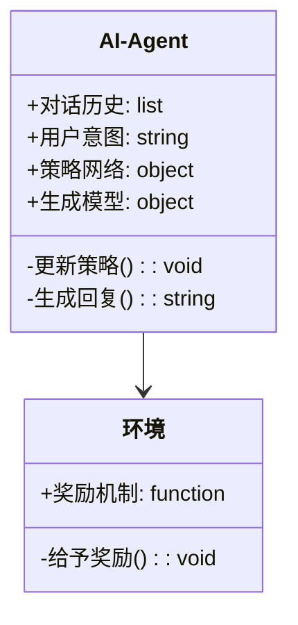
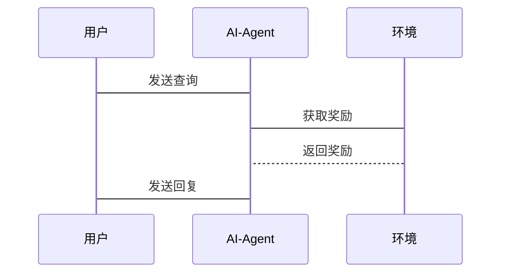

                 


# AI Agent的对话策略优化：提升交互质量和效率

> 关键词：AI Agent, 对话策略优化, 交互质量, 交互效率, 强化学习, 生成式模型, 对话系统

> 摘要：本文深入探讨AI Agent对话策略优化的核心概念、算法原理、系统架构及项目实战。通过背景介绍、核心概念与联系、算法原理、系统分析与架构设计、项目实战和最佳实践，详细分析如何优化对话策略，提升交互质量和效率。结合强化学习、生成式模型和数学公式，给出具体实现方法和实际案例，帮助读者全面理解AI Agent对话策略优化的实现和应用。

---

## 第1章 AI Agent对话策略优化的背景与问题描述

### 1.1 什么是AI Agent
#### 1.1.1 AI Agent的定义
AI Agent（人工智能代理）是指能够感知环境、自主决策并执行任务的智能实体。它通过与用户或环境的交互，完成特定目标。

#### 1.1.2 AI Agent的核心功能
- 感知环境：通过输入数据（如文本、语音、图像）获取信息。
- 理解需求：解析用户的意图和情感，生成适当的回应。
- 决策与执行：基于理解的结果，选择最优的对话策略并执行。

#### 1.1.3 AI Agent的应用场景
- 智能客服：为用户提供咨询、售后支持。
- 智能助手：如Siri、Alexa，帮助用户完成日常任务。
- 个性化推荐：基于对话历史推荐相关内容。

### 1.2 对话策略优化的必要性
#### 1.2.1 当前对话系统的不足
- 回答不够自然：生成的回复缺乏人性化，显得生硬。
- 对话不够高效：无法根据上下文调整策略，导致对话冗长。
- 理解能力有限：无法准确捕捉用户意图，出现误解。

#### 1.2.2 对话质量与效率的重要性
- 提升用户体验：更自然、高效的对话让用户感到满意。
- 提高任务完成效率：减少无效对话，快速解决问题。
- 增强系统智能性：优化对话策略体现系统深度学习能力。

#### 1.2.3 对话策略优化的目标
- 提升对话的自然性：生成更符合人类语言习惯的回复。
- 提高对话的效率：减少无效信息，快速解决问题。
- 增强系统的适应性：根据对话进展动态调整策略。

### 1.3 对话策略优化的核心问题
#### 1.3.1 对话策略的定义与属性
- 对话策略：指在特定对话情境下，系统为实现目标而采取的一系列行动。
- 属性：包括目标导向性、灵活性、可解释性。

#### 1.3.2 优化目标的设定
- 短期目标：提升单次对话的成功率。
- 长期目标：提高用户满意度和系统智能性。

#### 1.3.3 优化边界与外延
- 边界：对话策略优化仅关注对话过程本身，不涉及任务执行。
- 外延：对话策略优化与自然语言处理（NLP）、强化学习（RL）密切相关。

#### 1.3.4 概念结构与核心要素组成
- 输入：对话历史、用户意图、上下文信息。
- 输出：下一步对话策略。

---

## 第2章 对话策略优化的核心概念与联系

### 2.1 对话策略优化的原理
#### 2.1.1 策略生成机制
- 基于强化学习：通过奖励机制训练模型，生成最优策略。
- 基于生成式模型：如GPT系列，生成多样化的回复。

#### 2.1.2 策略评估机制
- 基于用户反馈：通过用户满意度评分评估策略优劣。
- 基于任务完成度：通过任务完成情况评估策略效果。

#### 2.1.3 策略优化机制
- 基于在线优化：实时调整策略，适应对话进展。
- 基于离线优化：定期更新策略，提升整体性能。

### 2.2 对话策略优化的关键要素
#### 2.2.1 对话历史
- 定义：用户与AI Agent之间的所有交互记录。
- 作用：帮助系统理解上下文，生成连贯回复。

#### 2.2.2 对话意图
- 定义：用户在对话中希望实现的目标。
- 作用：指导系统生成符合用户需求的回复。

#### 2.2.3 对话内容
- 定义：对话中具体的信息和表达。
- 作用：帮助系统生成相关联的回应。

### 2.3 对话策略优化与相关概念的对比
#### 2.3.1 对比

| 概念          | 描述                                                                 |
|---------------|----------------------------------------------------------------------|
| 对话策略优化   | 通过优化算法提升对话质量与效率                                       |
| 自然语言处理   | 处理和理解人类语言的技术                                             |
| 强化学习       | 基于奖励机制优化行为的算法                                         |
| 生成式模型     | 生成多样化的文本内容                                               |

---

## 第3章 对话策略优化的算法原理

### 3.1 强化学习在对话策略优化中的应用
#### 3.1.1 强化学习的基本原理
- 状态空间：对话历史、用户意图等。
- 动作空间：可能的回复或行为。
- 奖励函数：根据对话结果给予奖励或惩罚。

#### 3.1.2 基于强化学习的对话策略优化算法
- 算法流程：
  1. 初始化策略网络。
  2. 与用户进行对话，收集对话数据。
  3. 根据对话结果更新策略网络。

#### 3.1.3 强化学习算法的数学模型
$$ R = r_{t+1} + \gamma \cdot r_{t+2} + \dots + \gamma^{n-1} \cdot r_{t+n} $$
其中，$R$ 表示总奖励，$r_{t+i}$ 表示第 $i$ 步的奖励，$\gamma$ 表示折扣因子。

#### 3.1.4 代码示例
```python
import numpy as np

# 初始化策略网络
policy_network = ...

# 强化学习循环
for episode in range(num_episodes):
    state = get_initial_state()
    total_reward = 0
    while not episode_over:
        action = policy_network.predict_action(state)
        next_state, reward = environment.step(action)
        policy_network.update_policy(state, action, reward)
        total_reward += reward
    print(f"Episode {episode}: Total Reward = {total_reward}")
```

### 3.2 生成式模型在对话策略优化中的应用
#### 3.2.1 生成式模型的基本原理
- 基于Transformer架构，生成多样化的回复。

#### 3.2.2 基于生成式模型的对话策略优化算法
- 算法流程：
  1. 生成多个回复候选。
  2. 根据用户反馈选择最优回复。
  3. 更新生成模型。

#### 3.2.3 生成式模型的数学模型
$$ P(y|x) = \frac{P(y|x, z)}{E_z[P(y|x, z)]} $$
其中，$P(y|x, z)$ 表示条件概率，$E_z$ 表示对潜在变量 $z$ 的期望。

---

## 第4章 对话策略优化的系统分析与架构设计

### 4.1 问题场景介绍
#### 4.1.1 问题描述
用户与AI Agent之间的对话过程，需要实时生成符合用户需求的回复。

#### 4.1.2 系统功能需求
- 实时对话处理。
- 动态策略调整。

### 4.2 系统功能设计
#### 4.2.1 领域模型类图


#### 4.2.2 系统架构图


#### 4.2.3 系统接口设计
- 输入接口：用户输入、对话历史。
- 输出接口：系统回复、奖励反馈。

#### 4.2.4 系统交互流程


---

## 第5章 对话策略优化的项目实战

### 5.1 环境安装
#### 5.1.1 安装Python和依赖
```bash
pip install numpy tensorflow transformers
```

#### 5.1.2 安装对话系统框架
```bash
pip install transformers
```

### 5.2 核心代码实现
#### 5.2.1 对话策略优化算法实现
```python
import torch
import torch.nn as nn
import torch.optim as optim

class PolicyNetwork(nn.Module):
    def __init__(self, input_size, output_size):
        super(PolicyNetwork, self).__init__()
        self.fc = nn.Linear(input_size, output_size)
    
    def forward(self, x):
        return self.fc(x)

# 初始化网络
input_size = ...
output_size = ...
policy_network = PolicyNetwork(input_size, output_size)
optimizer = optim.Adam(policy_network.parameters(), lr=0.001)

# 训练循环
for epoch in range(num_epochs):
    optimizer.zero_grad()
    inputs = ...  # 对话历史向量
    outputs = policy_network(inputs)
    loss = ...  # 损失函数
    loss.backward()
    optimizer.step()
```

#### 5.2.2 代码解读
- 输入：对话历史向量。
- 输出：可能的回复动作。
- 损失函数：衡量预测与实际的差距。

### 5.3 项目小结
通过对对话策略优化算法的实现，我们可以显著提升AI Agent的交互质量和效率。结合强化学习和生成式模型，能够生成更自然、更高效的对话回复。

---

## 第6章 对话策略优化的最佳实践

### 6.1 优化策略与技巧
#### 6.1.1 多轮对话中的策略调整
- 根据对话进展动态调整回复策略。

#### 6.1.2 避免常见错误
- 忽略上下文：导致回复不连贯。
- 过度优化：影响用户体验。

### 6.2 小结
通过对对话策略优化的深入分析和实践，我们可以显著提升AI Agent的交互质量和效率。结合强化学习和生成式模型，能够生成更自然、更高效的对话回复。

### 6.3 注意事项
- 数据质量：确保训练数据的多样性和代表性。
- 系统实时性：优化算法的计算效率。

### 6.4 拓展阅读
- 强化学习与生成式模型的结合应用。
- 对话系统中的情感计算。

---

## 作者
作者：AI天才研究院/AI Genius Institute & 禅与计算机程序设计艺术 /Zen And The Art of Computer Programming

---

以上是《AI Agent的对话策略优化：提升交互质量和效率》的完整目录大纲和部分内容展示。通过背景介绍、核心概念、算法原理、系统架构、项目实战和最佳实践，本文详细探讨了AI Agent对话策略优化的实现和应用。结合强化学习、生成式模型和数学公式，为读者提供了全面的技术指导。

