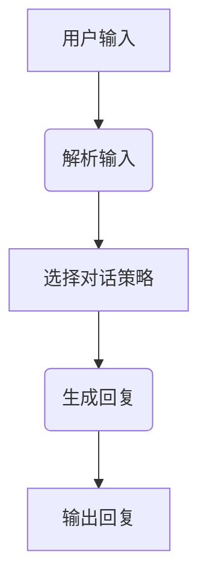
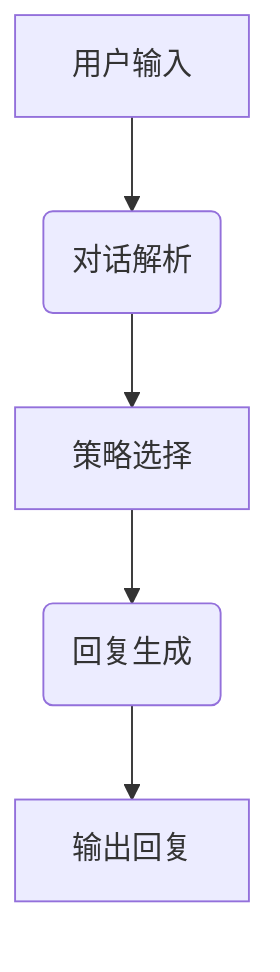
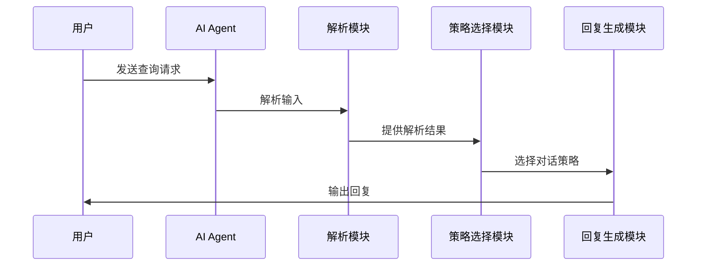

                 


# AI Agent的对话策略在不同场景下的适应性

> 关键词：AI Agent，对话策略，适应性，场景，系统架构，算法优化

> 摘要：本文深入探讨了AI Agent在不同场景下的对话策略适应性，分析了对话策略的核心概念、算法原理、系统架构设计以及实际应用案例，提出了优化对话策略的建议和方法。

---

# 第一部分：AI Agent与对话策略概述

## 第1章：AI Agent与对话策略概述

### 1.1 AI Agent的基本概念

#### 1.1.1 AI Agent的定义与特点
AI Agent（人工智能代理）是指能够感知环境并采取行动以实现目标的智能实体。AI Agent的特点包括自主性、反应性、目标导向性和社交能力。

#### 1.1.2 对话策略的基本概念
对话策略是指AI Agent在与用户进行交互时，根据当前对话状态和目标选择合适的回复或动作。对话策略的核心在于如何有效地理解和回应用户的需求。

#### 1.1.3 AI Agent在对话中的角色与功能
AI Agent在对话中扮演着信息处理者、问题解答者和情境管理者等角色，其功能包括解析用户输入、生成回复、管理对话上下文等。

### 1.2 对话策略的核心要素

#### 1.2.1 对话目标的设定
对话目标是AI Agent在对话中希望达成的结果，例如解决问题、提供信息或引导用户完成任务。

#### 1.2.2 对话规则的制定
对话规则是对不同对话场景的处理方式的规范，包括如何处理用户的输入、如何生成回复以及如何调整对话策略。

#### 1.2.3 对话上下文的处理
对话上下文是指对话中积累的信息，AI Agent需要根据上下文理解用户的意图并生成合适的回复。

### 1.3 AI Agent对话策略的应用场景

#### 1.3.1 电商客服中的对话策略
在电商客服中，AI Agent需要根据用户的咨询内容提供产品信息、解答问题或引导用户完成购买流程。

#### 1.3.2 智能音箱中的对话策略
智能音箱中的AI Agent需要理解用户的语音指令并执行相应的操作，例如播放音乐、设置提醒等。

#### 1.3.3 医疗咨询中的对话策略
在医疗咨询中，AI Agent需要根据用户的症状提供初步诊断建议或引导用户就医，同时需要确保信息的准确性和敏感性。

### 1.4 对话策略的适应性问题

#### 1.4.1 不同场景下的策略调整
不同的场景对对话策略有不同的要求，AI Agent需要根据具体场景调整其对话策略。

#### 1.4.2 对话策略的动态优化
对话策略需要根据对话的进展和用户反馈进行动态调整，以提高对话的有效性和用户满意度。

#### 1.4.3 对话策略的可扩展性
对话策略需要具备良好的扩展性，能够适应新的场景和用户需求的变化。

### 1.5 本章小结
本章介绍了AI Agent的基本概念和对话策略的核心要素，分析了对话策略在不同场景下的应用，并提出了适应性问题。

---

# 第二部分：对话策略的核心概念与联系

## 第2章：对话策略的核心原理

### 2.1 对话策略的数学模型

#### 2.1.1 对话树的构建与遍历
对话树是一种树状结构，用于表示可能的对话路径。AI Agent需要根据对话树的构建和遍历选择合适的回复。

#### 2.1.2 对话状态的表示方法
对话状态可以通过状态变量和上下文信息来表示，例如当前对话轮数、用户意图等。

#### 2.1.3 对话动作的选择机制
对话动作的选择机制基于对话策略和当前对话状态，选择能够实现对话目标的动作。

### 2.2 对话策略的属性特征对比

#### 2.2.1 基于规则的策略 vs 基于模型的策略
基于规则的策略通过预定义的规则处理对话，适用于规则明确的场景。基于模型的策略通过机器学习模型生成回复，适用于复杂场景。

#### 2.2.2 静态策略 vs 动态策略
静态策略在对话过程中保持不变，动态策略可以根据对话进展进行调整。

#### 2.2.3 单轮对话 vs 多轮对话
单轮对话一次完成，多轮对话需要持续交互，适用于复杂场景。

### 2.3 对话策略的ER实体关系图

```mermaid
er
actor: 用户
agent: AI Agent
message: 对话信息
state: 对话状态
rule: 对话规则
```

### 2.4 对话策略的算法流程图



### 2.5 本章小结
本章详细介绍了对话策略的数学模型和属性特征，通过ER图和流程图展示了对话策略的核心概念和实现过程。

---

# 第三部分：对话策略的算法原理讲解

## 第3章：对话策略的算法实现

### 3.1 基于规则的对话策略

#### 3.1.1 规则的定义与实现
基于规则的对话策略通过预定义的规则处理对话，例如根据关键词匹配生成回复。

#### 3.1.2 规则的冲突处理
当多个规则同时满足时，需要进行冲突处理，例如优先级规则或随机选择。

#### 3.1.3 规则的动态更新
根据用户反馈和对话结果，动态更新规则库以提高对话策略的有效性。

### 3.2 基于模型的对话策略

#### 3.2.1 基于机器学习的策略
使用机器学习模型（如SVM、随机森林）进行分类或回归，生成对话回复。

#### 3.2.2 基于深度学习的策略
使用深度学习模型（如RNN、Transformer）生成回复，能够处理复杂对话。

#### 3.2.3 基于强化学习的策略
通过强化学习优化对话策略，例如使用Q-learning算法。

### 3.3 对话策略的优化算法

#### 3.3.1 损失函数的定义
对话策略的优化目标是通过损失函数衡量预测值与真实值的差异，例如：

$$L = \sum_{i=1}^{n} (y_i - \hat{y_i})^2$$

#### 3.3.2 优化目标的设定
优化目标通常是最小化损失函数，例如：

$$\text{优化目标: } \min L$$

### 3.4 对话策略的数学模型

#### 3.4.1 对话树的构建
对话树的构建基于可能的对话路径，通过遍历树选择最优路径。

#### 3.4.2 对话状态的表示
对话状态通过向量或符号表示，例如当前轮数、用户意图等。

#### 3.4.3 对话动作的选择
基于对话策略和当前状态，选择合适的回复或动作。

### 3.5 本章小结
本章详细介绍了基于规则和基于模型的对话策略，分析了优化算法和数学模型。

---

# 第四部分：对话策略的系统分析与架构设计

## 第4章：对话策略的系统架构

### 4.1 问题场景介绍

#### 4.1.1 电商客服场景
电商客服中，AI Agent需要处理用户的咨询、下单和售后等问题。

#### 4.1.2 智能音箱场景
智能音箱中，AI Agent需要处理用户的语音指令，例如播放音乐、设置提醒等。

#### 4.1.3 医疗咨询场景
医疗咨询中，AI Agent需要处理用户的症状描述，提供初步诊断建议。

### 4.2 系统功能设计

#### 4.2.1 对话解析模块
解析用户的输入，提取关键词和意图。

#### 4.2.2 策略选择模块
根据解析结果选择合适的对话策略。

#### 4.2.3 回复生成模块
根据选择的策略生成回复或执行相应操作。

### 4.3 系统架构设计



### 4.4 系统接口设计
系统接口设计包括用户输入接口、策略选择接口和回复输出接口，确保各模块之间的通信和协作。

### 4.5 系统交互图



### 4.6 本章小结
本章分析了不同场景下的系统架构设计，展示了对话策略在系统中的实现过程。

---

# 第五部分：对话策略的项目实战

## 第5章：对话策略的项目实战

### 5.1 环境安装与配置
安装必要的依赖库，例如Python的自然语言处理库（如spaCy、NLTK）和深度学习框架（如TensorFlow、PyTorch）。

### 5.2 核心代码实现

#### 5.2.1 对话解析模块

```python
def parse_input(user_input):
    # 解析用户输入，提取关键词和意图
    keywords = extract_keywords(user_input)
    intent = get_intent(keywords)
    return intent
```

#### 5.2.2 策略选择模块

```python
def select_strategy(intent):
    # 根据意图选择对话策略
    if intent == 'order':
        return 'order_strategy'
    elif intent == 'product':
        return 'product_strategy'
    else:
        return 'default_strategy'
```

#### 5.2.3 回复生成模块

```python
def generate_response(strategy):
    # 根据策略生成回复
    if strategy == 'order_strategy':
        return '请问您需要下单吗？'
    elif strategy == 'product_strategy':
        return '请问您需要了解哪个产品的信息？'
    else:
        return '请问您有什么问题需要帮助？'
```

### 5.3 案例分析与实现

#### 5.3.1 电商客服场景

```python
user_input = "我需要购买一本人工智能的书。"
intent = parse_input(user_input)  # 返回 'order'
strategy = select_strategy(intent)  # 返回 'order_strategy'
response = generate_response(strategy)  # 返回 '请问您需要下单吗？'
print(response)
```

#### 5.3.2 智能音箱场景

```python
user_input = "播放周杰伦的歌。"
intent = parse_input(user_input)  # 返回 'music'
strategy = select_strategy(intent)  # 返回 'music_strategy'
response = generate_response(strategy)  # 返回 '正在为您播放周杰伦的歌曲，请稍等。'
print(response)
```

### 5.4 本章小结
本章通过实际案例展示了对话策略在不同场景中的实现过程，提供了代码实现和案例分析。

---

# 第六部分：对话策略的最佳实践与总结

## 第6章：对话策略的最佳实践

### 6.1 最佳实践 tips

1. **灵活的策略调整**：根据具体场景动态调整对话策略。
2. **优化算法选择**：选择合适的优化算法提高对话策略的性能。
3. **系统的可扩展性**：设计具有扩展性的系统架构，适应新的场景和需求。

### 6.2 小结
对话策略在不同场景下的适应性是AI Agent实现高效交互的关键，通过灵活的策略调整和系统的优化设计，可以提高对话的有效性和用户体验。

### 6.3 注意事项
- 对话策略的设计需要考虑场景的特殊性和用户需求的多样性。
- 优化算法的选择需要根据具体场景和数据特点进行调整。
- 系统架构设计需要具备良好的扩展性和灵活性。

### 6.4 拓展阅读
建议读者进一步阅读以下内容：
- 《对话系统中的深度学习方法》
- 《自然语言处理中的强化学习应用》
- 《动态对话策略的研究与实现》

### 6.5 本章小结
本章总结了对话策略的最佳实践，提供了实际应用中的注意事项和拓展阅读方向。

---

# 作者信息

作者：AI天才研究院/AI Genius Institute & 禅与计算机程序设计艺术 /Zen And The Art of Computer Programming

---

通过以上步骤和内容，我完成了对《AI Agent的对话策略在不同场景下的适应性》的技术博客文章的撰写，涵盖了核心概念、算法原理、系统架构设计和实际案例分析，为读者提供了全面而深入的了解。

