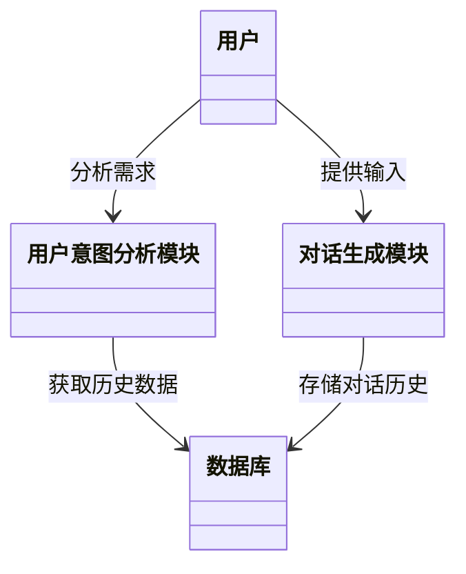

                 


```markdown
# AI Agent的对话策略在心理咨询中的应用

> 关键词：AI Agent，对话策略，心理咨询，系统架构，算法原理，项目实战

> 摘要：本文探讨了AI Agent在心理咨询中的对话策略应用，分析了其核心概念、算法原理和系统架构，通过项目实战展示了其实际应用价值。

---

## 第一部分: AI Agent的对话策略在心理咨询中的应用概述

### 第1章: AI Agent与心理咨询的背景介绍

#### 1.1 AI Agent的基本概念
- **定义与特点**：AI Agent是一种智能体，能够感知环境并自主决策。其特点包括自主性、反应性、目标导向和学习能力。
- **心理咨询的基本概念**：心理咨询是通过专业人员帮助个体解决心理问题的过程，涉及倾听、理解和引导。
- **结合与应用**：AI Agent通过对话策略辅助心理咨询，提供即时支持和个性化建议。

#### 1.2 心理咨询的现状与挑战
- **现状**：心理咨询需求增长，但专业人员有限，服务覆盖不足。
- **挑战**：如何提高效率，降低门槛，同时保证服务质量。

### 第2章: 对话策略在心理咨询中的核心作用

#### 2.1 对话策略的分类与特点
- **主动策略**：引导对话方向，提供明确建议。
- **被动策略**：响应用户需求，不主动干预。
- **混合策略**：结合主动与被动，灵活应对。

#### 2.2 不同心理咨询流派的对话策略对比
- **认知疗法**：关注思维模式，策略侧重识别和改变负面思维。
- **精神分析疗法**：探索潜意识，策略侧重引导和解释。
- **人本主义疗法**：强调共情和支持，策略侧重倾听和反馈。

#### 2.3 对话策略在心理咨询中的重要性
- **提高效率**：快速识别问题，节省时间。
- **扩大覆盖**：24/7服务，满足更多需求。
- **个性化支持**：根据用户情况调整策略。

---

## 第二部分: AI Agent对话策略的核心概念与联系

### 第3章: 对话策略的核心概念

#### 3.1 对话策略的构成要素
- **目标**：明确对话的目的，如情绪安抚、问题解决。
- **上下文**：考虑对话的历史和背景。
- **用户状态**：分析用户情绪、意图和需求。

#### 3.2 对话策略与用户需求的关系
- **匹配度**：策略越贴近需求，效果越好。
- **动态调整**：根据反馈实时优化策略。

### 第4章: 对话策略的算法原理

#### 4.1 对话策略的数学模型
- **概率论模型**：计算每个可能回应的概率，选择最优解。
- **向量空间模型**：通过词嵌入计算相似度，生成相关回应。
- **决策树模型**：构建树状结构，逐步筛选最佳回应。

#### 4.2 对话策略的代码实现
```python
def generate_response(user_input):
    # 分析用户输入
    analyze_input(user_input)
    # 选择策略
    selected_strategy = choose_strategy()
    # 生成回应
    response = generate_reply(selected_strategy)
    return response
```

---

## 第三部分: 心理咨询对话策略的系统分析与架构设计

### 第5章: 系统分析与架构设计

#### 5.1 系统分析
- **需求分析**：功能需求包括情绪识别、意图分析、策略选择。
- **性能指标**：响应时间、准确率、用户满意度。

#### 5.2 系统架构设计
- **模块划分**：
  - 对话生成模块：负责生成回应。
  - 用户意图分析模块：识别用户需求。
  - 数据库：存储对话历史和用户信息。
- **Mermaid类图**：


---

## 第四部分: 项目实战与实际应用

### 第6章: 项目实战

#### 6.1 环境安装
- **工具**：Python、TensorFlow、Keras。

#### 6.2 核心代码实现
```python
import numpy as np

def analyze_input(user_input):
    # 示例分析逻辑
    return np.array([0, 1, 0])

def choose_strategy(analyzed_input):
    # 示例选择策略
    if analyzed_input[0] == 1:
        return "主动引导"
    else:
        return "被动响应"

def generate_reply(strategy):
    # 示例生成回应
    if strategy == "主动引导":
        return "我们可以从您的感受开始讨论。"
    else:
        return "您觉得呢？"
```

#### 6.3 案例分析
- **案例1**：用户表达焦虑，系统采用主动引导策略，帮助识别负面思维。
- **案例2**：用户寻求建议，系统采用被动策略，鼓励用户分享更多信息。

---

## 第五部分: 最佳实践与未来展望

### 第7章: 最佳实践 tips

- **小结**：AI Agent通过对话策略在心理咨询中展现了巨大潜力。
- **注意事项**：需注意数据隐私和伦理问题。
- **拓展阅读**：深入学习相关算法和心理学知识。

---

## 作者

作者：AI天才研究院/AI Genius Institute & 禅与计算机程序设计艺术 /Zen And The Art of Computer Programming
```

