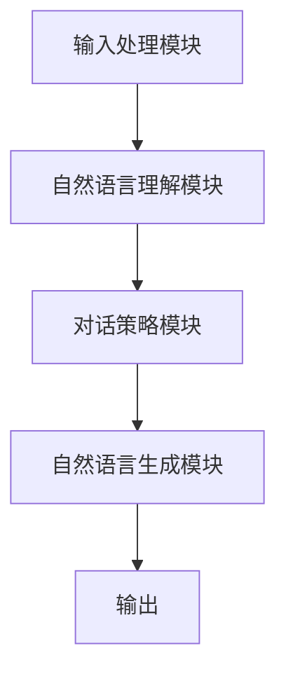
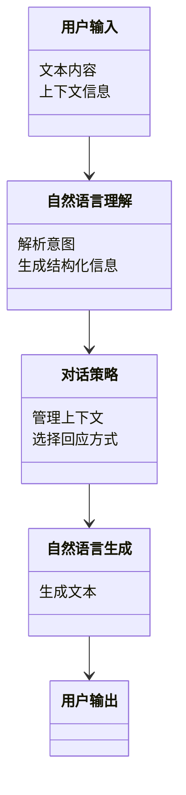

                 


# AI Agent的对话策略：提高交互质量

> 关键词：AI Agent, 对话策略, 自然语言处理, 强化学习, 交互质量

> 摘要：本文深入探讨了AI Agent对话策略的设计与优化方法，通过分析对话系统的组成部分、策略类型及其算法原理，结合实际案例，提出了提高交互质量的系统性解决方案。文章从背景、核心概念、算法实现、系统架构到项目实战，层层递进，为读者提供了全面的理论与实践指导。

---

# 第一部分: AI Agent对话策略的背景与基础

## 第1章: 对话系统的基本概念与背景

### 1.1 对话系统的定义与作用

#### 1.1.1 对话系统的定义
对话系统是一种能够理解和生成自然语言的交互系统，通过模拟人类对话过程，实现与用户之间的有效沟通。对话系统的核心在于理解和生成符合语境的自然语言文本。

#### 1.1.2 对话系统的核心作用
对话系统的主要作用包括：
1. 提供信息查询服务
2. 协助用户完成特定任务
3. 提供情感支持与互动
4. 支持多轮对话，保持上下文连贯性

#### 1.1.3 对话系统的发展趋势
随着自然语言处理（NLP）和人工智能技术的进步，对话系统正在向以下几个方向发展：
- **多轮对话**：支持更复杂的上下文理解和对话连贯性。
- **个性化交互**：根据用户的性格、偏好定制对话策略。
- **跨语言支持**：支持多种语言的对话交互。
- **情感智能**：增强对用户情感的理解和响应能力。

### 1.2 对话系统的组成部分

#### 1.2.1 自然语言理解（NLU）
自然语言理解是对话系统的关键部分，负责将用户的输入文本转换为系统可理解的结构化信息。主要技术包括：
- 词袋模型（Bag-of-Words）
- 词嵌入（Word Embedding）
- 情感分析

#### 1.2.2 对话策略
对话策略决定了系统在对话过程中的行为选择，包括如何理解和生成响应，以及如何管理对话的上下文。对话策略的核心在于平衡准确性和自然流畅性。

#### 1.2.3 自然语言生成（NLG）
自然语言生成负责将系统内部的结构化信息转换为自然语言文本，输出给用户。常用技术包括：
- 基于模板的生成
- 基于统计模型的生成
- 基于生成模型的生成（如GPT）

### 1.3 当前对话系统的挑战与发展趋势

#### 1.3.1 当前对话系统的挑战
1. **上下文理解**：复杂对话中的多轮上下文管理难度较大。
2. **领域适应性**：对话系统在特定领域的适应性不足。
3. **个性化交互**：如何根据用户个性化需求调整对话策略是难点。
4. **情感理解**：准确捕捉和回应用户情感是当前的技术瓶颈。

#### 1.3.2 对话系统的发展趋势
1. **强化学习**：通过强化学习优化对话策略，提升对话质量。
2. **多模态交互**：结合视觉、听觉等多模态信息，提升对话体验。
3. **人机协作**：人机协作的对话模式将更加普及。
4. **实时反馈**：系统能够实时调整对话策略，适应用户反馈。

## 1.4 本章小结

---

## 第2章: 对话策略的核心概念与分类

### 2.1 对话策略的基本概念

#### 2.1.1 对话策略的定义
对话策略是指系统在对话过程中选择如何响应用户输入的一系列规则或模型。它决定了系统的回答方式、内容和语气。

#### 2.1.2 对话策略的核心要素
1. **上下文管理**：对话的上下文信息是对话策略的基础。
2. **用户意图识别**：准确识别用户的意图是制定对话策略的前提。
3. **知识库支持**：系统需要依赖知识库提供准确的信息。
4. **对话状态跟踪**：跟踪对话的状态，确保对话的连贯性。

#### 2.1.3 对话策略的目标
对话策略的目标包括：
- **准确理解用户意图**
- **生成自然流畅的回应**
- **保持对话连贯性**
- **提升用户满意度**

### 2.2 对话策略的分类

#### 2.2.1 基于规则的对话策略
基于规则的对话策略通过预定义的规则和模板生成回应。优点是简单易懂，适用于特定场景，但灵活性较低。

#### 2.2.2 基于检索的对话策略
基于检索的对话策略通过从预定义的语料库中检索最相关的响应。这种方法依赖高质量的语料库，能够生成多样化的回应，但可能缺乏个性化。

#### 2.2.3 基于生成的对话策略
基于生成的对话策略利用生成模型（如GPT）生成回应，能够生成多样且自然的对话内容。但生成的内容可能缺乏准确性。

### 2.3 对话策略的选择与优化

#### 2.3.1 对话策略选择的影响因素
1. **应用场景**：不同场景需要不同的对话策略。
2. **用户需求**：用户的需求决定了对话策略的选择。
3. **系统能力**：系统的资源和技术能力影响策略的选择。

#### 2.3.2 对话策略优化的方法
1. **数据增强**：通过增加多样化的训练数据提升策略的泛化能力。
2. **模型调优**：通过参数调整和模型优化提升对话质量。
3. **用户反馈**：利用用户反馈实时优化对话策略。

#### 2.3.3 对话策略的评估指标
1. **准确率**：系统回答的准确性。
2. **响应时间**：系统的响应速度。
3. **用户满意度**：用户的主观满意度。

## 2.4 本章小结

---

## 第3章: 对话策略的数学模型与算法原理

### 3.1 对话策略的数学模型

#### 3.1.1 基于规则的策略模型
基于规则的策略模型通过预定义的规则生成回应。例如：
$$ \text{如果用户输入包含“天气”，则返回天气信息} $$

#### 3.1.2 基于检索的策略模型
基于检索的策略模型通过计算输入文本与语料库中句子的相关性，选择最相关的句子作为回应。常用相似度计算公式为：
$$ \text{余弦相似度} = \frac{\vec{u} \cdot \vec{v}}{|\vec{u}| |\vec{v}|} $$

#### 3.1.3 基于生成的策略模型
基于生成的策略模型利用生成模型（如GPT）生成回应。生成过程涉及概率计算和语言模型的训练。

### 3.2 对话策略的算法实现

#### 3.2.1 基于规则的策略实现
```python
def rule_based_response(user_input):
    if "天气" in user_input:
        return get_weather_info()
    elif "时间" in user_input:
        return get_current_time()
    else:
        return default_response()
```

#### 3.2.2 基于检索的策略实现
```python
import numpy as np

def retrieve_based_response(user_input, corpus):
    max_similarity = -1
    best_response = ""
    for response in corpus:
        similarity = np.dot(user_input_vector, response_vector)
        if similarity > max_similarity:
            max_similarity = similarity
            best_response = response
    return best_response
```

#### 3.2.3 基于生成的策略实现
```python
import torch
from model import GPT

def generate_response(user_input):
    model = GPT()
    response = model.generate(user_input)
    return response
```

### 3.3 对话策略的优化算法

#### 3.3.1 基于梯度下降的优化
使用梯度下降优化生成模型的参数，以最小化损失函数：
$$ \text{损失函数} = \sum_{i=1}^{n} (\text{预测值} - \text{真实值})^2 $$

#### 3.3.2 基于强化学习的优化
通过强化学习优化对话策略，使用奖励机制调整模型参数：
$$ \text{奖励} = r(s, a) $$

#### 3.3.3 基于元学习的优化
元学习通过学习如何学习，快速适应不同对话场景。

### 3.4 本章小结

---

## 第4章: 对话策略的系统架构与设计

### 4.1 对话系统的整体架构

#### 4.1.1 系统功能模块划分
- **输入处理模块**：接收用户输入并进行预处理。
- **自然语言理解模块**：解析用户意图。
- **对话策略模块**：根据用户意图生成回应。
- **自然语言生成模块**：将系统生成的内容转换为自然语言。

#### 4.1.2 系统流程图


### 4.2 系统架构设计

#### 4.2.1 领域模型设计


#### 4.2.2 系统架构图


### 4.3 本章小结

---

## 第5章: 对话策略的项目实战

### 5.1 环境安装

#### 5.1.1 安装Python环境
```bash
python --version
pip install --upgrade pip
```

#### 5.1.2 安装依赖库
```bash
pip install numpy torch transformers
```

### 5.2 代码实现

#### 5.2.1 环境搭建
```python
import numpy as np
import torch
from transformers import GPT2Tokenizer, GPT2Model
```

#### 5.2.2 对话系统实现
```python
class DialogueSystem:
    def __init__(self):
        self.tokenizer = GPT2Tokenizer.from_pretrained('gpt2')
        self.model = GPT2Model.from_pretrained('gpt2')
    
    def generate_response(self, user_input):
        inputs = self.tokenizer(user_input, return_tensors='np')
        outputs = self.model.generate(**inputs, max_length=50)
        response = self.tokenizer.decode(outputs[0], skip_special_tokens=True)
        return response
```

#### 5.2.3 系统交互
```python
def main():
    system = DialogueSystem()
    while True:
        user_input = input("用户：")
        response = system.generate_response(user_input)
        print("系统：" + response)
```

### 5.3 案例分析

#### 5.3.1 简单对话
用户输入：“今天天气怎么样？”  
系统响应：“今天天气晴朗，适合外出。”

#### 5.3.2 多轮对话
用户输入1：“你是谁？”  
系统响应1：“我是你的AI助手。”  
用户输入2：“你能做什么？”  
系统响应2：“我可以帮助你回答问题、提供建议和完成任务。”

### 5.4 本章小结

---

## 第6章: 高级主题与最佳实践

### 6.1 高级对话策略

#### 6.1.1 多轮对话管理
通过记录对话历史，管理对话的上下文，确保多轮对话的连贯性。

#### 6.1.2 上下文理解
利用上下文信息，增强对话的理解能力，提升对话质量。

#### 6.1.3 个性化策略
根据用户的历史行为和偏好，定制个性化的对话策略。

### 6.2 最佳实践

#### 6.2.1 数据质量管理
确保训练数据的多样性和高质量，避免偏见和错误。

#### 6.2.2 系统调优
通过参数调优和模型优化，提升对话系统的性能和响应速度。

#### 6.2.3 用户反馈机制
建立有效的用户反馈机制，实时优化对话策略。

### 6.3 小结

---

# 作者

作者：AI天才研究院/AI Genius Institute & 禅与计算机程序设计艺术 /Zen And The Art of Computer Programming

