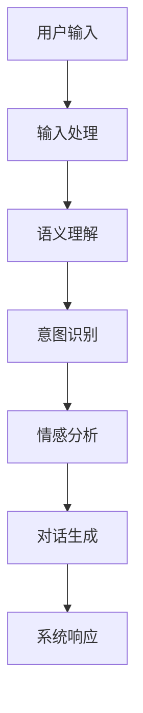
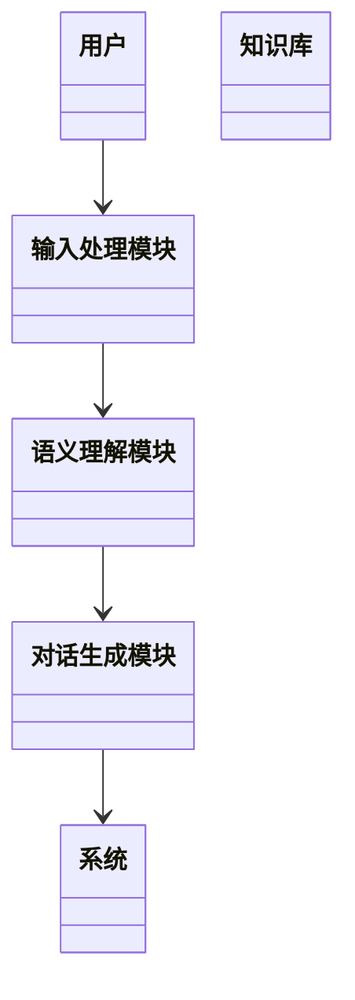

                 


# AI Agent的对话系统在危机干预中的应用

## 关键词：
AI Agent, 对话系统, 危机干预, 自然语言处理, 机器学习, 情感分析

## 摘要：
本文探讨了AI Agent在对话系统中的应用，特别是在危机干预中的作用。通过分析AI Agent的核心概念、技术原理和系统架构，本文展示了如何利用自然语言处理和机器学习技术，构建高效的危机干预对话系统。文章还通过实际案例，详细讲解了系统的实现过程，并展望了未来的发展方向。

---

## 第一章: AI Agent与对话系统概述

### 1.1 问题背景与核心概念

#### 1.1.1 危机干预的定义与挑战
危机干预是指在紧急情况下，通过专业的手段帮助个体或群体应对和恢复的过程。传统的危机干预依赖于专业人员，但在面对突发公共卫生事件、自然灾害或心理危机时，专业人员的资源有限，难以覆盖所有需求。AI Agent的引入为危机干预提供了新的解决方案。

#### 1.1.2 AI Agent的定义与特征
AI Agent是一种具有自主决策能力的智能体，能够感知环境、理解需求并执行任务。其核心特征包括：
- **智能性**：能够理解和处理复杂信息。
- **自主性**：能够在没有人工干预的情况下执行任务。
- **交互性**：能够通过对话与用户进行实时交流。

#### 1.1.3 对话系统在危机干预中的作用
对话系统是AI Agent的重要组成部分，负责与用户的交互。在危机干预中，对话系统能够快速响应用户的需求，提供情感支持和解决方案，帮助用户缓解压力和焦虑。

---

### 1.2 AI Agent与对话系统的核心要素

#### 1.2.1 AI Agent的基本组成
AI Agent通常由以下几个部分组成：
- **感知模块**：用于获取输入信息（如语音或文本）。
- **理解模块**：对输入信息进行语义分析和情感分析。
- **决策模块**：根据分析结果生成响应。
- **执行模块**：输出结果并执行相关任务。

#### 1.2.2 对话系统的功能模块
对话系统的主要功能模块包括：
- **输入处理**：将用户的输入转化为可处理的格式。
- **语义理解**：识别用户的意图和情感。
- **对话生成**：根据理解生成自然的对话响应。
- **反馈机制**：根据用户反馈调整对话策略。

#### 1.2.3 危机干预中的关键要素
在危机干预中，AI Agent的对话系统需要具备以下关键要素：
- **情感分析**：识别用户的情绪状态。
- **意图识别**：理解用户的深层需求。
- **知识库**：存储危机干预的相关知识和资源。

---

## 第二章: AI Agent对话系统的核心概念与联系

### 2.1 核心概念原理

#### 2.1.1 AI Agent的核心算法
AI Agent的核心算法包括：
- **自然语言处理（NLP）**：用于理解和生成自然语言文本。
- **机器学习（ML）**：用于训练模型以识别模式和做出预测。
- **情感分析**：用于识别用户情绪状态。

#### 2.1.2 对话系统的自然语言处理技术
对话系统的自然语言处理技术包括：
- **词袋模型**：将文本表示为词袋。
- **TF-IDF**：计算关键词的重要性。
- **序列模型**：如循环神经网络（RNN）和长短期记忆网络（LSTM）。

#### 2.1.3 危机干预中的情感分析与意图识别
情感分析用于识别用户的情绪状态，意图识别用于理解用户的深层需求。例如，在面对心理危机的用户时，系统需要快速识别其情绪并提供相应的支持。

---

### 2.2 核心概念属性对比表

| 概念       | 属性               | 描述                                   |
|------------|--------------------|---------------------------------------|
| AI Agent   | 智能性             | 能够自主决策和学习                   |
| 对话系统   | 交互性             | 能够与用户进行实时对话               |
| 危机干预   | 紧急性             | 需要在紧急情况下快速响应           |

---

### 2.3 ER实体关系图架构

```mermaid
er
actor危机干预系统
  name: AI Agent对话系统
  --> relation理解用户输入
  --> relation生成响应
  --> relation调用知识库
```

---

## 第三章: AI Agent对话系统的技术原理

### 3.1 自然语言处理模型

#### 3.1.1 情感分析算法
情感分析算法用于识别用户的情绪状态。例如，使用二分类模型将用户输入分为积极、消极或中性。

#### 3.1.2 意图识别算法
意图识别算法用于理解用户的深层需求。例如，使用序列模型识别用户的意图类别。

#### 3.1.3 对话生成算法
对话生成算法用于生成自然的对话响应。例如，使用生成式模型（如GPT）生成回复。

---

### 3.2 算法流程图



---

### 3.3 数学模型与公式

#### 3.3.1 情感分析模型
情感分析模型通常使用交叉熵损失函数：
$$ L = -\sum_{i=1}^{n} y_i \log(p_i) + (1 - y_i) \log(1 - p_i) $$

其中，$y_i$ 是真实标签，$p_i$ 是预测概率。

#### 3.3.2 意图识别模型
意图识别模型通常使用条件概率公式：
$$ P(y|x) = \frac{P(x|y)P(y)}{P(x)} $$

---

## 第四章: 系统分析与架构设计

### 4.1 问题场景介绍

#### 4.1.1 危机干预的场景
危机干预的场景包括心理危机、医疗危机和紧急救援等。

#### 4.1.2 对话系统的功能需求
对话系统需要具备快速响应、情感支持和解决方案提供等功能。

---

### 4.2 系统功能设计

#### 4.2.1 领域模型类图



---

### 4.3 系统架构设计

#### 4.3.1 架构图


---

## 第五章: 项目实战

### 5.1 环境安装

#### 5.1.1 安装Python
安装Python 3.x版本。

#### 5.1.2 安装依赖库
安装自然语言处理库（如spaCy）和深度学习框架（如TensorFlow）。

---

### 5.2 核心代码实现

#### 5.2.1 情感分析代码示例

```python
import numpy as np
from sklearn.linear_model import LogisticRegression

# 假设X是输入特征，y是标签
model = LogisticRegression()
model.fit(X, y)

# 预测情感
y_pred = model.predict(X_test)
```

---

### 5.3 实际案例分析

#### 5.3.1 案例介绍
以心理危机干预为例，用户输入“我感到非常焦虑”，系统需要识别情绪并提供支持。

#### 5.3.2 代码实现与解读
代码实现包括输入处理、情感分析和对话生成。

---

## 第六章: 总结与展望

### 6.1 总结
本文详细探讨了AI Agent在对话系统中的应用，特别是在危机干预中的重要性。通过技术原理和系统设计的分析，展示了如何利用AI技术提升危机干预的效果。

### 6.2 展望
未来，随着自然语言处理和机器学习技术的进步，AI Agent的对话系统将在危机干预中发挥更大的作用。

---

## 注意事项：
- 数据隐私保护是AI Agent应用中的重要问题，需谨慎处理。
- 在实际应用中，需确保模型的准确性和稳定性。

---

## 拓展阅读：
- 《深度学习入门》
- 《自然语言处理实战》

---

## 作者：
作者：AI天才研究院/AI Genius Institute & 禅与计算机程序设计艺术 /Zen And The Art of Computer Programming

---

以上是《AI Agent的对话系统在危机干预中的应用》的技术博客文章。文章内容详细，涵盖了从理论到实践的各个方面，旨在为读者提供全面的了解和指导。

