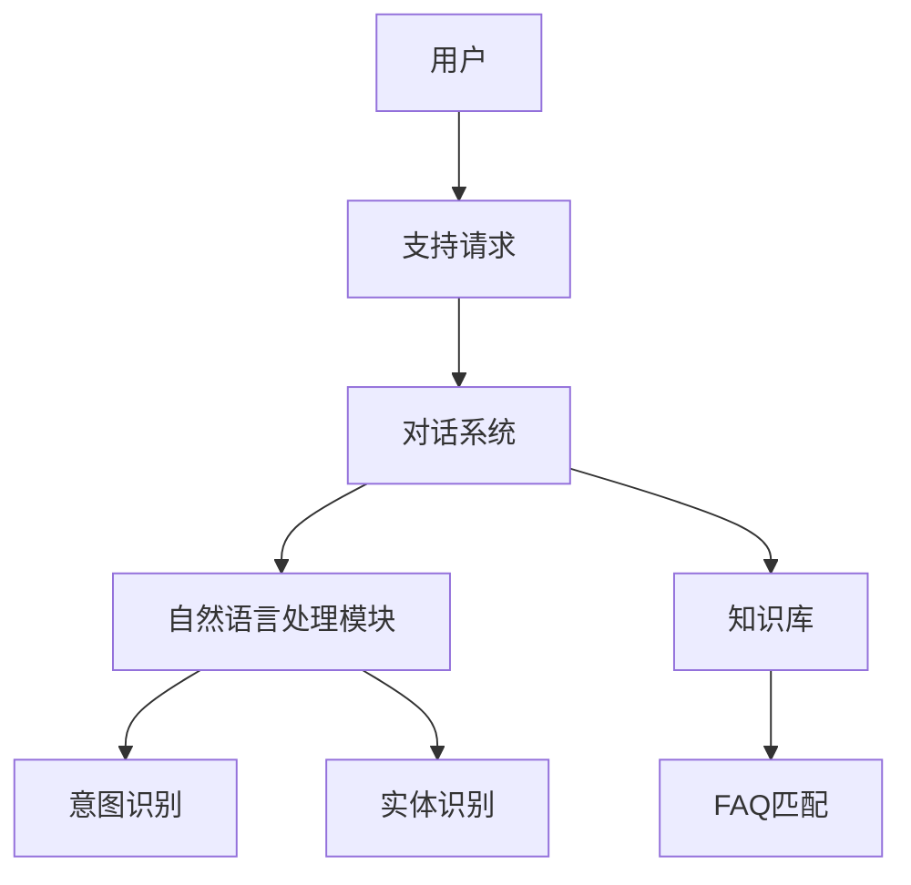
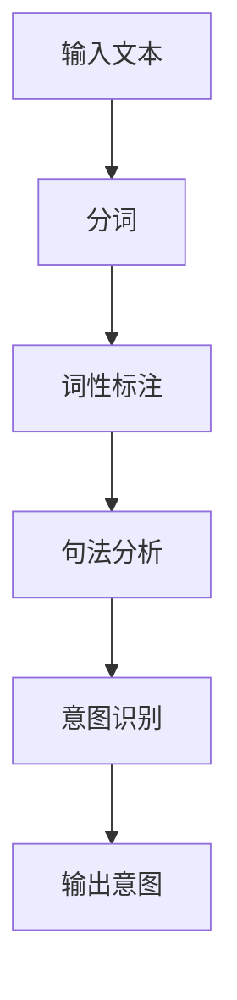
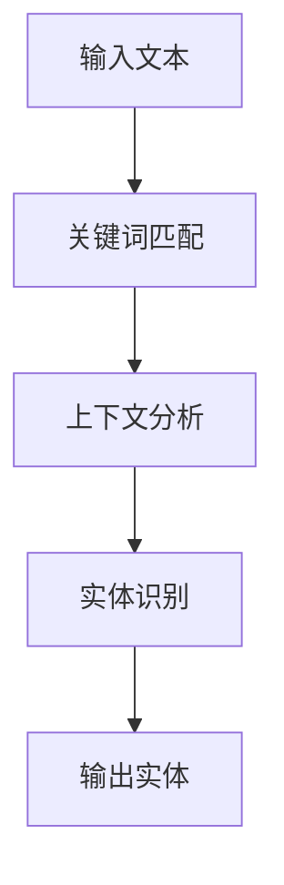

                 


# AI Agent的对话系统在客户支持中的优化

> 关键词：AI Agent，对话系统，客户支持，自然语言处理，意图识别，实体识别

> 摘要：本文将详细探讨AI Agent在客户支持中的对话系统优化。通过分析AI Agent的核心原理、对话系统的实现机制、算法原理、系统架构设计以及实际项目案例，揭示如何利用先进的自然语言处理技术提升客户支持的效率和满意度。

---

## 第一部分: AI Agent的对话系统在客户支持中的优化背景介绍

### 第1章: AI Agent与对话系统的概念背景

#### 1.1 AI Agent的基本概念

- **AI Agent的定义与特点**
  - AI Agent（人工智能代理）是指能够感知环境并采取行动以实现目标的智能实体。
  - 特点包括自主性、反应性、目标导向性和社会性。

- **对话系统的定义与分类**
  - 对话系统是一种通过自然语言与用户交互的系统，分为文本对话系统和语音对话系统。
  - 分类包括基于规则的系统、基于统计模型的系统和基于深度学习的系统。

- **客户支持中的对话系统应用背景**
  - 客户支持中的对话系统用于处理用户的咨询、解决问题和提供信息。
  - 随着技术的发展，AI Agent在客户支持中的应用越来越广泛。

### 第2章: 问题背景与描述

#### 2.1 客户支持中的常见问题

- **客户支持的主要挑战**
  - 人工客服成本高，效率低。
  - 用户需求多样化，难以覆盖所有场景。
  - 用户体验不一致，服务质量参差不齐。

- **对话系统在客户支持中的作用**
  - 提供24/7的实时支持。
  - 快速响应用户需求，提高效率。
  - 降低人工成本，优化资源配置。

- **当前客户支持中的痛点分析**
  - 用户等待时间长，满意度低。
  - 人工错误率高，影响用户体验。
  - 缺乏个性化服务，难以满足多样化需求。

### 第3章: AI Agent对话系统的优化目标

#### 3.1 优化目标的设定

- **提高客户满意度**
  - 提供更准确、更及时的响应。
  - 提供个性化的服务体验。

- **提升支持效率**
  - 自动化处理常见问题，减少人工干预。
  - 快速识别用户需求，提高响应速度。

- **降低运营成本**
  - 减少人工客服数量，降低人力成本。
  - 提高系统自动化程度，降低维护成本。

### 第4章: AI Agent对话系统的边界与外延

#### 4.1 系统边界

- **输入边界**
  - 用户输入的文本或语音请求。
  - 系统处理的请求类型和范围。

- **输出边界**
  - 系统生成的响应内容。
  - 响应的格式和渠道。

- **交互边界**
  - 系统与用户之间的交互流程。
  - 系统与其他系统的接口和交互。

### 第5章: 核心概念与联系

#### 5.1 核心概念原理

- **AI Agent的核心原理**
  - 感知环境，理解用户需求。
  - 基于目标生成行动，提供解决方案。

- **对话系统的实现机制**
  - 通过自然语言处理技术理解用户输入。
  - 基于知识库或预设规则生成响应。

- **客户支持中的对话系统优化原理**
  - 利用AI技术提高对话系统的智能性和准确性。
  - 通过数据驱动优化系统性能和用户体验。

#### 5.2 核心概念对比分析

- **对话系统与传统客服系统的对比**
  | 对比维度 | 对话系统 | 传统客服系统 |
  |----------|----------|---------------|
  | 响应速度 | 实时响应 | 受限于人工处理 |
  | 覆盖范围 | 可覆盖多种场景 | 有限的覆盖范围 |
  | 成本 | 降低人工成本 | 高人工成本 |

- **AI Agent与传统规则引擎的对比**
  | 对比维度 | AI Agent | 传统规则引擎 |
  |----------|----------|----------------|
  | 智能性 | 高度智能，能理解上下文 | 基于规则，缺乏灵活性 |
  | 可扩展性 | 高，适应新需求 | 低，需要手动调整规则 |
  | 学习能力 | 能通过数据学习优化 | 无学习能力 |

- **对话系统中的实体关系分析**
  - 用户：发起请求的主体。
  - 支持请求：用户的需求或问题。
  - 对话系统：处理请求的系统。
  - 自然语言处理模块：解析用户输入的模块。
  - 知识库：系统存储的信息库。

### 5.3 ER实体关系图



---

## 第二部分: AI Agent对话系统的算法原理

### 第6章: 算法原理讲解

#### 6.1 对话系统的核心算法

- **意图识别算法**
  - 用于理解用户输入的意图。
  - 常用算法包括基于规则的意图识别和深度学习模型（如LSTM、BERT）。

- **实体识别算法**
  - 用于从用户输入中提取关键信息。
  - 常用技术包括正向最大匹配法和基于上下文的实体识别。

- **响应生成算法**
  - 根据识别的意图和实体生成合适的响应。
  - 基于模板生成和生成式模型（如GPT）。

#### 6.2 意图识别算法流程



#### 6.3 实体识别算法流程



#### 6.4 意图识别的数学模型

- 概率模型：计算每个意图的概率，选择概率最高的意图。
  $$ P(\text{intent} | x) = \frac{P(x | \text{intent}) \cdot P(\text{intent})}{P(x)} $$
  
- 深度学习模型：如BERT的意图分类任务。
  $$ \text{BERT}(\text{input}) \rightarrow \text{intent} $$

---

## 第三部分: AI Agent对话系统的系统分析与架构设计

### 第7章: 系统分析与架构设计

#### 7.1 问题场景介绍

- 客户支持中的常见问题场景：
  - 用户咨询产品信息。
  - 用户报告技术问题。
  - 用户反馈服务问题。

#### 7.2 系统功能设计

- **领域模型**
  ```mermaid
  classDiagram
  class 用户 {
    id
    名称
  }
  class 支持请求 {
    id
    描述
    时间
  }
  class 对话系统 {
    输入
    输出
    状态
  }
  用户 --> 支持请求
  支持请求 --> 对话系统
  ```

- **系统架构设计**
  ```mermaid
  graph TD
  A[用户] --> B[对话系统]
  B --> C[自然语言处理模块]
  C --> D[意图识别]
  C --> E[实体识别]
  C --> F[知识库]
  C --> G[响应生成]
  G --> H[输出]
  ```

- **系统接口设计**
  - 输入接口：接收用户输入的文本或语音。
  - 输出接口：生成并返回系统响应。

- **系统交互设计**
  ```mermaid
  sequenceDiagram
  participant 用户
  participant 对话系统
  participant 知识库
  用户->对话系统: 发起请求
  对话系统->知识库: 查询相关信息
  知识库->对话系统: 返回结果
  对话系统->用户: 发送响应
  ```

---

## 第四部分: AI Agent对话系统的项目实战

### 第8章: 项目实战

#### 8.1 环境安装

- 安装Python和相关库：
  ```bash
  pip install numpy pandas scikit-learn transformers
  ```

#### 8.2 核心代码实现

- 意图识别示例代码：
  ```python
  from sklearn.feature_extraction.text import TfidfVectorizer
  from sklearn.naive_bayes import MultinomialNB

  # 数据预处理
  texts = [...]  # 用户输入文本
  labels = [...]  # 对应意图标签

  vectorizer = TfidfVectorizer()
  X = vectorizer.fit_transform(texts)
  model = MultinomialNB()
  model.fit(X, labels)

  # 预测意图
  new_text = "我需要帮助..."
  X_new = vectorizer.transform([new_text])
  predicted_intent = model.predict(X_new)[0]
  ```

- 实体识别示例代码：
  ```python
  from transformers import pipeline

  nlp = pipeline("ner")
  result = nlp("我的订单号是12345")
  entities = [(ent.text, ent.label_) for ent in result[0]]
  ```

#### 8.3 案例分析与优化

- 案例分析：用户咨询订单信息。
- 优化建议：结合意图识别和实体识别，提高准确率和响应速度。

---

## 第五部分: AI Agent对话系统的最佳实践与小结

### 第9章: 最佳实践 tips

- **模型选择**
  - 根据需求选择合适的模型，如预训练模型或自定义模型。

- **数据处理**
  - 确保数据质量，进行数据清洗和特征工程。

- **性能优化**
  - 优化算法效率，减少计算成本。

- **用户体验**
  - 提供清晰的错误提示和多轮对话支持。

### 第10章: 小结

- 通过AI Agent的对话系统，客户支持的效率和用户体验得到了显著提升。
- 结合自然语言处理技术和系统架构设计，优化了对话系统的性能和准确性。
- 未来的优化方向包括模型的可解释性、多模态交互和个性化服务。

---

## 作者：AI天才研究院/AI Genius Institute & 禅与计算机程序设计艺术 /Zen And The Art of Computer Programming

---

通过以上步骤，我们系统地分析了AI Agent对话系统在客户支持中的优化过程，从理论到实践，从算法到架构，为读者提供了全面而深入的技术指导。希望这篇文章能够为读者在实际应用中提供有价值的参考和启示。

