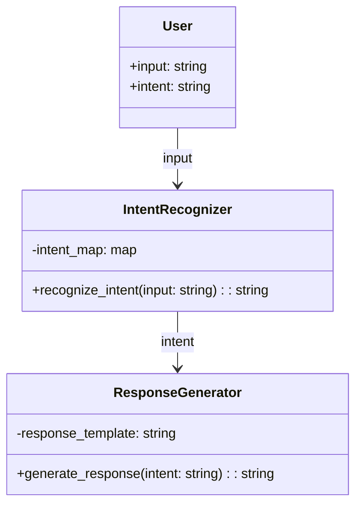
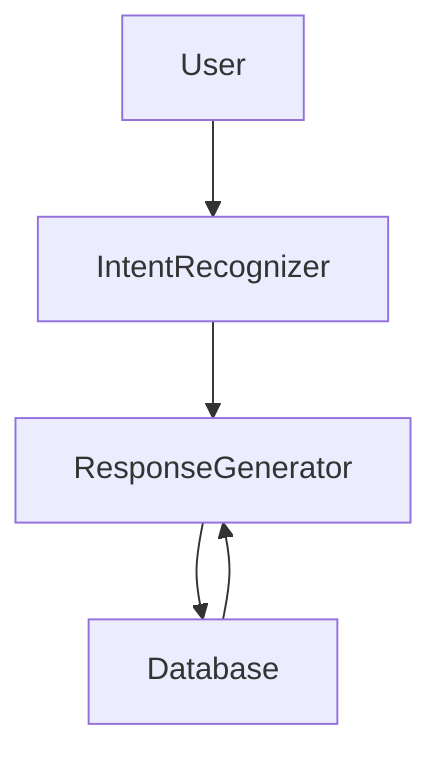

                 


# AI Agent的对话系统在虚拟助手中的进阶应用

## 关键词：AI Agent、对话系统、自然语言处理、虚拟助手、深度学习

## 摘要：本文系统地探讨了AI Agent在对话系统中的应用，特别是其在虚拟助手中的进阶应用。文章首先介绍了AI Agent的基本概念和对话系统的演变，然后深入分析了对话系统的核心技术，包括自然语言处理和机器学习。接着，详细讲解了基于Transformer的算法原理和训练策略，并通过系统架构设计和项目实战展示了AI Agent在虚拟助手中的具体应用。最后，总结了AI Agent对话系统的关键技术和未来发展方向。

---

## 第一章: AI Agent与对话系统概述

### 1.1 AI Agent的基本概念

#### 1.1.1 什么是AI Agent
AI Agent（人工智能代理）是一种能够感知环境、执行任务并做出决策的智能体。它通过与用户交互或环境交互，完成特定目标。AI Agent的核心特征包括自主性、反应性、目标导向性和社会性。

#### 1.1.2 AI Agent的核心特征
- **自主性**：AI Agent能够独立运作，无需外部干预。
- **反应性**：能够实时感知环境并做出响应。
- **目标导向性**：通过设定目标来指导行为。
- **社会性**：能够与其他Agent或用户进行交互和协作。

#### 1.1.3 AI Agent的应用场景
AI Agent广泛应用于智能助手、自动驾驶、智能客服、机器人控制等领域。本文重点关注其在虚拟助手中的应用。

---

### 1.2 对话系统的演变

#### 1.2.1 从规则驱动到数据驱动的对话系统
早期的对话系统基于规则，通过预设的规则和关键词匹配来实现交互。随着技术的发展，数据驱动的方法（如深度学习）逐渐取代了规则驱动方法，使得对话系统更加智能和灵活。

#### 1.2.2 当前主流的对话系统类型
- **规则驱动对话系统**：通过预设规则实现简单的交互。
- **数据驱动对话系统**：基于大量训练数据，使用深度学习模型（如Transformer）实现复杂的对话任务。
- **混合驱动对话系统**：结合规则和数据驱动的优势，实现更智能的对话体验。

#### 1.2.3 对话系统的评估指标
- **准确率**：系统回答的正确性。
- **响应时间**：系统对用户输入的响应速度。
- **用户满意度**：用户对对话系统的主观评价。

---

### 1.3 虚拟助手中的AI Agent

#### 1.3.1 虚拟助手的定义与分类
虚拟助手是一种通过对话系统为用户提供服务的AI Agent。常见的虚拟助手包括Siri、Alexa、Google Assistant等。虚拟助手可以分为基于文本和基于语音两类。

#### 1.3.2 AI Agent在虚拟助手中的作用
AI Agent负责处理用户的输入，理解用户的意图，并通过调用相关服务或数据库来生成响应。AI Agent在虚拟助手中充当了“大脑”的角色。

#### 1.3.3 虚拟助手的典型应用案例
- **日历管理**：帮助用户安排和管理日程。
- **信息查询**：回答用户的问题，如天气、新闻等。
- **任务执行**：如设置提醒、发送消息等。

---

## 第二章: 对话系统的核心技术

### 2.1 自然语言处理基础

#### 2.1.1 NLP的核心任务
自然语言处理（NLP）的核心任务包括文本分割、词性标注、句法分析、语义理解等。

#### 2.1.2 词法分析、句法分析与语义理解
- **词法分析**：将文本分割成单词或符号，并标注词性。
- **句法分析**：分析句子的语法结构。
- **语义理解**：理解文本的含义和意图。

#### 2.1.3 常见的NLP工具与库
- ** spaCy**：用于词法分析和句法分析。
- ** NLTK**：提供多种NLP工具和库。
- ** Gensim**：用于主题建模和文档相似性计算。

---

### 2.2 机器学习在对话系统中的应用

#### 2.2.1 监督学习与无监督学习
- **监督学习**：基于标注数据进行训练，如分类任务。
- **无监督学习**：基于未标注数据进行训练，如聚类任务。

#### 2.2.2 基于深度学习的对话模型
- **循环神经网络（RNN）**：用于序列建模。
- **Transformer架构**：在对话系统中表现出色。

#### 2.2.3 知识图谱与对话系统的结合
知识图谱为对话系统提供了丰富的知识库，使得系统能够更好地理解和回答用户的问题。

---

### 2.3 对话系统的训练与优化

#### 2.3.1 数据预处理与特征提取
- **数据清洗**：去除噪声数据。
- **特征提取**：提取有用的特征，如词向量。

#### 2.3.2 基于深度学习的对话模型
- **生成式模型**：如GPT，用于生成对话内容。
- **检索式模型**：基于预定义的响应库，选择最合适的响应。

#### 2.3.3 对话系统的优化策略
- **多任务学习**：同时优化多个任务，如对话生成和意图识别。
- **模型蒸馏**：将大模型的知识迁移到小模型中。

---

## 第三章: 基于Transformer的对话系统算法原理

### 3.1 Transformer模型概述

#### 3.1.1 Transformer的结构
- **编码器**：将输入序列映射为高维向量。
- **解码器**：根据编码器输出生成目标序列。

#### 3.1.2 Transformer的关键组件
- **自注意力机制**：捕捉输入序列中的长距离依赖。
- **前馈神经网络**：用于非线性变换。

#### 3.1.3 自注意力机制的计算公式
$$\text{Attention}(Q, K, V) = \text{softmax}\left(\frac{QK^T}{\sqrt{d_k}}\right)V$$

---

### 3.2 对话系统的训练策略

#### 3.2.1 基于Transformer的对话模型训练
- **数据准备**：将对话数据对齐为输入-输出格式。
- **模型训练**：使用交叉熵损失函数优化模型参数。

#### 3.2.2 模型的调参与优化
- **学习率调整**：使用学习率衰减策略。
- **批量训练**：提高训练效率。

#### 3.2.3 模型的评估与验证
- **验证集评估**：使用验证集评估模型性能。
- **早停策略**：防止过拟合。

---

## 第四章: 对话系统的系统架构设计

### 4.1 系统功能设计

#### 4.1.1 领域模型设计
- **用户意图识别**：识别用户的意图，如查询天气、预订酒店等。
- **对话状态管理**：跟踪对话的上下文信息。

#### 4.1.2 系统功能模块
- **输入处理模块**：接收用户的输入并进行预处理。
- **意图识别模块**：识别用户的意图。
- **响应生成模块**：生成对话的响应。

#### 4.1.3 领域模型的Mermaid类图



---

### 4.2 系统架构设计

#### 4.2.1 系统架构的Mermaid图



#### 4.2.2 系统交互流程
- 用户输入查询。
- Intent Recognizer识别用户的意图。
- Response Generator根据意图生成响应。
- 系统调用数据库或API获取信息。

---

## 第五章: 对话系统的项目实战

### 5.1 环境安装与配置

```bash
pip install transformers
pip install torch
pip install numpy
```

---

### 5.2 系统核心实现源代码

#### 5.2.1 Intent Recognizer的实现

```python
import torch
import torch.nn as nn
import torch.optim as optim

class IntentRecognizer(nn.Module):
    def __init__(self, input_size, hidden_size, output_size):
        super(IntentRecognizer, self).__init__()
        self.embedding = nn.Embedding(input_size, hidden_size)
        self.classifier = nn.Linear(hidden_size, output_size)
    
    def forward(self, input):
        embedded = self.embedding(input)
        output = self.classifier(embedded)
        return output
```

#### 5.2.2 Response Generator的实现

```python
class ResponseGenerator:
    def __init__(self, model):
        self.model = model
    
    def generate_response(self, intent):
        # 假设intent对应预定义的响应模板
        response_templates = {
            'weather': '今天天气不错，您想了解哪个城市的天气呢？',
            'book': '请问您想预订什么类型的书籍？'
        }
        return response_templates.get(intent, '抱歉，我还不知道如何回答这个问题。')
```

---

### 5.3 代码应用解读与分析

#### 5.3.1 Intent Recognizer的训练

```python
def train_intentRecognizer(model, optimizer, criterion, train_loader):
    for epoch in range(num_epochs):
        for inputs, labels in train_loader:
            outputs = model(inputs)
            loss = criterion(outputs, labels)
            optimizer.zero_grad()
            loss.backward()
            optimizer.step()
```

#### 5.3.2 Response Generator的调用

```python
generator = ResponseGenerator(ResponseGenerator())
response = generator.generate_response('weather')
print(response)  # 输出：今天天气不错，您想了解哪个城市的天气呢？
```

---

## 第六章: 对话系统的最佳实践与总结

### 6.1 最佳实践

#### 6.1.1 数据质量的重要性
高质量的数据是对话系统性能的基础。

#### 6.1.2 模型的可解释性
确保模型的决策过程是可解释的，有助于 debugging 和优化。

#### 6.1.3 安全与隐私保护
保护用户数据的安全和隐私是对话系统设计中的重要考虑因素。

---

### 6.2 小结

本文系统地探讨了AI Agent在对话系统中的应用，特别是其在虚拟助手中的进阶应用。从基础概念到算法原理，再到系统架构和项目实战，为读者提供了一个全面的视角。

---

## 附录: 工具与API参考

### 附录A: 常用NLP工具

- **spaCy**：https://spacy.io/
- **NLTK**：https://www.nltk.org/

### 附录B: 深度学习框架

- **PyTorch**：https://pytorch.org/
- **TensorFlow**：https://tensorflow.org/

---

## 作者：AI天才研究院 & 禅与计算机程序设计艺术

---

通过以上思考步骤，我整理并撰写了这篇关于AI Agent对话系统在虚拟助手中进阶应用的技术博客文章。希望这篇文章能够为读者提供清晰的思路和深入的技术见解。

