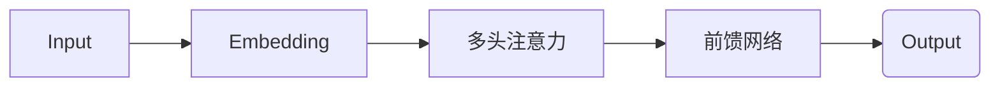

                 


# AI Agent的对话系统在远程医疗中的应用

> **关键词**：AI Agent, 对话系统, 远程医疗, 自然语言处理, 医疗知识库, 多轮对话

> **摘要**：  
本文深入探讨了AI Agent在远程医疗中的对话系统应用，从基础概念到实际应用进行了全面分析。文章首先介绍了AI Agent和对话系统的基本原理，然后分析了远程医疗中的具体应用场景，包括远程问诊、医疗信息查询等。接着，详细讲解了系统架构设计、算法实现与优化策略，并通过具体案例展示了AI Agent在远程医疗中的实际应用效果。最后，总结了当前技术的优缺点，并展望了未来的发展方向。

---

## 第1章: AI Agent与对话系统概述

### 1.1 AI Agent的基本概念
AI Agent（人工智能代理）是指能够感知环境、自主决策并执行任务的智能体。在对话系统中，AI Agent通常扮演“智能助手”的角色，通过自然语言处理技术与用户进行交互。

#### 1.1.1 AI Agent的定义与特点
- **定义**：AI Agent是一种能够理解用户需求、提供个性化服务的智能系统。
- **特点**：
  1. **自主性**：能够在没有人工干预的情况下完成任务。
  2. **反应性**：能够实时感知环境并做出响应。
  3. **学习能力**：通过数据不断优化自身的对话策略。

#### 1.1.2 对话系统的基本原理
对话系统是AI Agent的核心组成部分，其基本原理包括：
- **输入处理**：接收用户的自然语言输入。
- **理解与解析**：通过自然语言处理技术（如分词、句法分析）理解用户意图。
- **生成与响应**：基于理解生成自然语言的回复。

#### 1.1.3 AI Agent在远程医疗中的角色
在远程医疗中，AI Agent可以作为患者的虚拟医生，提供以下服务：
- **症状咨询**：帮助用户描述症状，初步判断可能的疾病。
- **医疗建议**：提供用药建议、预约挂号等服务。
- **健康监测**：跟踪用户的健康数据，提醒定期检查。

### 1.2 远程医疗的背景与需求
#### 1.2.1 远程医疗的发展现状
远程医疗是指通过通信技术实现患者与医生之间的远程诊疗。随着互联网和人工智能技术的发展，远程医疗逐渐成为医疗领域的重要组成部分。

#### 1.2.2 远程医疗中的对话需求
在远程医疗中，患者通常需要与AI Agent进行对话，完成以下任务：
- **信息采集**：获取患者的病史、症状等信息。
- **诊断支持**：基于患者描述提供初步诊断建议。
- **健康教育**：提供疾病预防、用药指导等信息。

#### 1.2.3 AI Agent在远程医疗中的应用潜力
AI Agent可以通过对话系统实现以下功能：
- **快速响应**：实时回答患者的健康问题。
- **个性化服务**：根据患者的具体情况提供定制化的医疗建议。
- **数据整合**：整合患者的电子健康记录，提供更精准的服务。

---

## 第2章: AI Agent对话系统的原理与技术

### 2.1 自然语言处理基础
自然语言处理（NLP）是实现AI Agent对话系统的核心技术。

#### 2.1.1 语言模型的基本原理
语言模型通过概率分布预测下一个词，常见的模型包括马尔可夫链和循环神经网络（RNN）。

##### 示例：马尔可夫链模型
$$ P(\text{句子}) = \prod_{i=1}^{n} P(w_i | w_{i-1}) $$

#### 2.1.2 注意力机制与Transformer模型
注意力机制通过计算词与词之间的相关性，帮助模型聚焦于重要的信息。

##### Transformer模型结构


#### 2.1.3 对话生成的挑战与解决方案
对话生成的挑战包括：
- **上下文理解**：如何处理多轮对话中的上下文信息。
- **生成多样性**：如何生成多种可能的回复。

### 2.2 对话系统的核心算法
对话系统的实现依赖于多种算法，包括基于规则、统计和深度学习的方法。

#### 2.2.1 基于规则的对话系统
基于规则的系统通过预定义的规则生成回复，适用于简单的对话场景。

#### 2.2.2 基于统计的对话系统
基于统计的系统通过学习数据中的模式生成回复，常见的方法包括马尔可夫链和n-gram模型。

#### 2.2.3 基于深度学习的对话系统
基于深度学习的系统利用神经网络模型生成回复，常见的模型包括Seq2Seq和Transformer。

---

## 第3章: AI Agent在远程医疗中的应用场景

### 3.1 远程问诊与诊断支持
#### 3.1.1 病史采集与症状分析
AI Agent通过对话系统采集患者的病史和症状信息，帮助医生进行初步诊断。

#### 3.1.2 医疗建议生成
基于患者的症状描述，AI Agent可以生成初步的医疗建议，例如推荐药物或就医方向。

#### 3.1.3 病例分析与诊断支持
AI Agent可以通过分析大量的病例数据，辅助医生进行诊断。

### 3.2 医疗信息查询与知识库构建
#### 3.2.1 医疗知识库的构建方法
医疗知识库通常包括疾病症状、治疗方法、药物信息等内容。

#### 3.2.2 基于知识库的对话生成
AI Agent可以通过查询知识库生成准确的医疗信息。

#### 3.2.3 知识库的更新与维护
医疗知识库需要定期更新，以保证信息的准确性和时效性。

---

## 第4章: AI Agent对话系统的系统架构设计

### 4.1 系统功能模块划分
#### 4.1.1 用户输入处理模块
负责接收用户的自然语言输入，并进行预处理。

#### 4.1.2 对话生成模块
基于预处理后的输入生成回复。

#### 4.1.3 知识库查询模块
负责查询医疗知识库，提供准确的医疗信息。

#### 4.1.4 系统反馈模块
将生成的回复返回给用户，并根据用户的反馈优化对话策略。

### 4.2 系统架构设计
#### 4.2.1 分层架构设计


#### 4.2.2 微服务架构设计


---

## 第5章: 对话系统算法实现与优化

### 5.1 对话生成算法
#### 5.1.1 基于Transformer的对话生成模型
基于Transformer的模型在对话生成中表现出色，具有并行处理能力强的特点。

#### 5.1.2 对话生成的损失函数与优化方法
常用的损失函数包括交叉熵损失和KL散度损失。

#### 5.1.3 模型训练与调优
模型训练需要大量的对话数据，并通过交叉验证进行优化。

### 5.2 对话系统的优化策略
#### 5.2.1 基于反馈的对话优化
通过用户的反馈不断优化对话生成策略。

#### 5.2.2 多轮对话的记忆机制
通过记忆机制保留多轮对话中的上下文信息，提高对话的连贯性。

#### 5.2.3 对话生成的可解释性增强
通过可视化技术提高对话生成的可解释性。

---

## 第6章: 项目实战与案例分析

### 6.1 项目环境搭建
#### 6.1.1 开发工具安装
安装Python、TensorFlow、Keras等开发工具。

#### 6.1.2 数据集准备
收集医疗相关的对话数据，进行标注和清洗。

#### 6.1.3 模型训练环境配置
配置GPU环境，选择合适的训练参数。

### 6.2 核心代码实现
#### 6.2.1 对话生成模块代码
```python
def generate_response(input_text):
    # 输入处理
    input_ids = tokenizer.encode(input_text, add_special_tokens=True)
    # 模型推理
    outputs = model.generate(input_ids, max_length=50)
    response = tokenizer.decode(outputs[0], skip_special_tokens=True)
    return response
```

#### 6.2.2 知识库查询模块代码
```python
def query_knowledge_base(query):
    results = knowledge_base.search(query, top_k=3)
    return results
```

#### 6.2.3 系统交互界面代码
```python
def main():
    while True:
        input_text = input("请输入您的问题：")
        response = generate_response(input_text)
        print("AI Agent:", response)
```

### 6.3 案例分析与效果评估
#### 6.3.1 典型案例分析
分析一个具体的案例，例如用户描述症状，AI Agent生成医疗建议。

#### 6.3.2 对话系统的性能评估
通过准确率、召回率等指标评估系统的性能。

#### 6.3.3 用户反馈与系统优化
收集用户的反馈，不断优化对话系统的性能。

---

## 第7章: 最佳实践与未来发展

### 7.1 最佳实践总结
#### 7.1.1 系统设计中的注意事项
- 确保系统的可扩展性。
- 保护患者的隐私数据。

#### 7.1.2 开发中的常见问题与解决方案
- 数据不足：通过数据增强技术解决。
- 对话不连贯：通过记忆机制优化。

#### 7.1.3 系统维护与更新策略
定期更新知识库，优化模型参数。

### 7.2 未来发展方向
#### 7.2.1 对话系统的智能化提升
通过强化学习进一步提升对话系统的智能化水平。

#### 7.2.2 多模态对话系统的探索
结合视觉、听觉等多种模态信息，提升对话的丰富性。

#### 7.2.3 医疗知识库的深度学习
通过深度学习技术进一步优化医疗知识库的构建和应用。

---

**作者：AI天才研究院/AI Genius Institute & 禅与计算机程序设计艺术 /Zen And The Art of Computer Programming**

