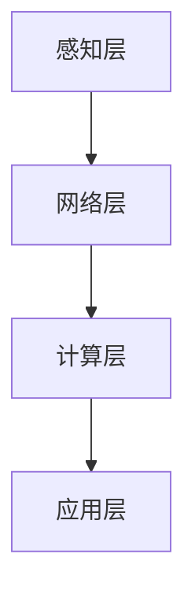
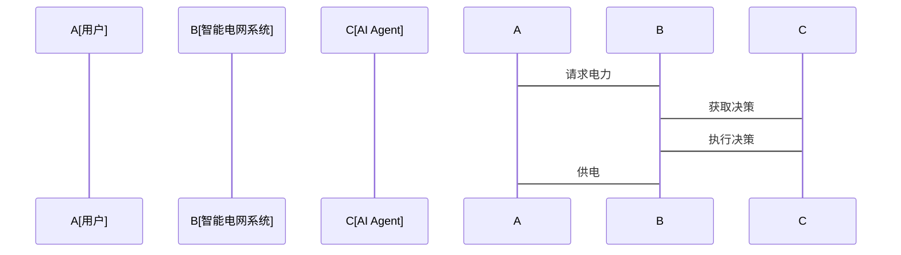

                 


# AI Agent的强化学习在智能电网管理中的应用

> 关键词：AI Agent, 强化学习, 智能电网, 能源管理, 自动化控制

> 摘要：本文探讨AI Agent如何通过强化学习技术优化智能电网的管理。从AI Agent的基本概念、强化学习的算法原理，到智能电网管理系统的架构设计、项目实战与最佳实践，全面解析AI Agent在智能电网中的应用潜力，揭示其在能源优化配置、电力调度和需求侧管理中的重要作用。

---

## 第一部分: AI Agent与强化学习基础

### 第1章: AI Agent的概述

#### 1.1 AI Agent的基本概念

AI Agent（人工智能代理）是指能够感知环境、做出决策并执行动作的智能体。它具备以下核心特征：
- **自主性**：无需外部干预，自主完成任务。
- **反应性**：能实时感知环境变化并做出响应。
- **目标导向性**：基于目标进行决策和行动。
- **学习能力**：通过经验优化自身行为。

AI Agent的应用场景广泛，从自动驾驶到智能助手，再到智能电网管理，其灵活性和适应性使其成为许多复杂系统的核心组件。

#### 1.2 强化学习的基本原理

强化学习（Reinforcement Learning, RL）是一种机器学习范式，通过智能体与环境的交互，学习最优策略以最大化累积奖励。其核心要素包括：
- **状态（State）**：环境当前的状况。
- **动作（Action）**：智能体采取的行动。
- **奖励（Reward）**：环境对智能体行为的反馈。
- **策略（Policy）**：决定智能体在不同状态下采取何种动作的规则。
- **值函数（Value Function）**：评估某状态下采取某动作的价值。

与监督学习不同，强化学习无需标记数据，而是通过试错机制优化行为。

### 第2章: 智能电网管理的背景与需求

#### 2.1 智能电网的基本概念

智能电网是以现代信息通信技术为基础，实现电力系统各环节智能化管理的新型电力系统。它涵盖发电、输电、配电、用电等环节，具有以下特点：
- **智能化**：通过传感器和数据采集系统实时监控电网状态。
- **自动化**：利用自动化控制技术实现电网的自动调节。
- **互动性**：用户与电网之间能够实现双向互动，优化电力使用。

智能电网的目标是实现能源的高效利用、降低碳排放、提高供电可靠性。

#### 2.2 智能电网管理中的挑战

智能电网管理面临诸多挑战，包括：
- **复杂性**：涉及大量设备和数据，管理难度大。
- **不确定性**：能源需求波动大，天气变化影响发电能力。
- **优化目标**：需要在多种目标（如成本最小化、可靠性最大化）之间找到平衡。

### 第3章: AI Agent在智能电网管理中的应用背景

#### 3.1 AI Agent在智能电网管理中的优势

AI Agent在智能电网中的优势体现在以下几个方面：
- **自主决策**：能够在复杂环境中自主决策，无需人工干预。
- **实时响应**：能够快速响应电网状态变化，确保电力供应的稳定性。
- **自我优化**：通过强化学习不断优化自身行为，提高管理效率。

#### 3.2 强化学习在智能电网管理中的应用潜力

强化学习在智能电网中的应用潜力主要体现在以下几个方面：
- **电力调度优化**：通过强化学习优化电力调度策略，提高能源利用效率。
- **需求侧管理**：通过强化学习优化用户的用电行为，降低 peak load。
- **故障诊断与恢复**：通过强化学习实现电网故障的快速诊断和自愈。

---

## 第二部分: AI Agent的强化学习原理

### 第4章: AI Agent与强化学习的核心概念

#### 4.1 AI Agent的强化学习框架

在智能电网管理中，AI Agent通常采用基于强化学习的框架。其基本流程如下：
1. **状态感知**：AI Agent通过传感器获取电网的实时状态。
2. **决策制定**：基于当前状态，AI Agent根据强化学习算法生成决策。
3. **执行动作**：AI Agent执行决策，影响电网状态。
4. **奖励反馈**：根据决策结果，AI Agent获得奖励或惩罚。
5. **策略优化**：根据奖励反馈优化策略，提升决策能力。

#### 4.2 强化学习的核心算法

强化学习的核心算法包括Q-learning、Deep Q-Network（DQN）等。以下以Q-learning为例，介绍其基本原理。

##### 4.2.1 Q-learning算法

Q-learning是一种基于值函数的强化学习算法，其核心思想是通过学习Q值表来优化决策。Q值表示在某状态下采取某动作的价值。

**算法流程**：
1. 初始化Q值表为零。
2. 进入循环：
   - 选择当前状态下的动作（探索与利用）。
   - 执行动作，获得奖励和新的状态。
   - 更新Q值表：Q(s, a) = Q(s, a) + α(r + γ * max Q(s', a'))，其中α是学习率，γ是折扣因子。

**公式**：
$$ Q(s, a) = Q(s, a) + \alpha \cdot (r + \gamma \cdot \max Q(s', a')) $$

##### 4.2.2 Deep Q-Network（DQN）

DQN通过深度神经网络近似Q值函数，适用于高维状态空间的问题。

**网络结构**：
- 输入层：接收状态向量。
- 隐藏层：进行特征提取。
- 输出层：输出每个动作的Q值。

**算法流程**：
1. 环境提供状态s。
2. 神经网络输出Q(s, a)。
3. 选择动作a（基于ε-greedy策略）。
4. 执行动作，获得奖励r和新状态s'。
5. 将（s, a, r, s'）存储在经验回放池中。
6. 采样回放池中的经验，更新神经网络权重。

---

### 第5章: 智能电网管理系统的架构设计

#### 5.1 问题场景介绍

智能电网管理系统需要协调发电、输电、配电和用电四个环节，确保电力供应的稳定性和经济性。

#### 5.2 系统功能设计

系统功能设计包括以下几个模块：
- **数据采集与监控（SCADA）**：实时采集电网数据。
- **电力调度优化**：优化电力调度策略。
- **需求侧管理**：优化用户用电行为。
- **故障诊断与恢复**：实现电网故障的快速诊断和恢复。

#### 5.3 系统架构设计

系统架构采用分层设计，包括：
- **感知层**：传感器和采集设备。
- **网络层**：通信网络，实现数据传输。
- **计算层**：AI Agent和强化学习算法。
- **应用层**：用户界面和管理模块。

**架构图**（使用Mermaid）：



#### 5.4 系统交互设计

系统交互设计包括：
- **数据采集**：传感器采集电网数据。
- **决策制定**：AI Agent根据数据制定决策。
- **执行反馈**：执行决策后，系统获得反馈并更新状态。

**交互图**（使用Mermaid）：



---

### 第6章: 项目实战

#### 6.1 环境安装

需要安装以下工具：
- Python 3.8+
- TensorFlow 2.0+
- OpenAI Gym
- Mermaid

安装命令：
```bash
pip install tensorflow gym mermaid
```

#### 6.2 核心实现

以下代码实现一个简单的Q-learning算法，用于电力调度优化。

```python
import gym
import numpy as np

class AI_Agent:
    def __init__(self, env, alpha=0.1, gamma=0.9):
        self.env = env
        self.alpha = alpha
        self.gamma = gamma
        self.q_table = np.zeros(env.observation_space.shape)

    def choose_action(self, state):
        if np.random.random() < 0.1:
            return self.env.action_space.sample()
        else:
            return np.argmax(self.q_table[state])

    def learn(self, state, action, reward, next_state):
        q = self.q_table[state][action]
        next_q = np.max(self.q_table[next_state])
        self.q_table[state][action] = q + self.alpha * (reward + self.gamma * next_q)

# 初始化环境
env = gym.make('Grid-World-v0')
agent = AI_Agent(env)

# 训练过程
for episode in range(1000):
    state = env.reset()
    total_reward = 0
    while True:
        action = agent.choose_action(state)
        next_state, reward, done, info = env.step(action)
        agent.learn(state, action, reward, next_state)
        total_reward += reward
        state = next_state
        if done:
            break
    print(f"Episode {episode}: Total Reward = {total_reward}")
```

#### 6.3 案例分析

通过上述代码，AI Agent能够学习优化电力调度策略，提高能源利用效率。训练完成后，AI Agent能够在复杂电网环境中做出最优决策。

---

### 第7章: 最佳实践

#### 7.1 小结

本文详细探讨了AI Agent在智能电网管理中的应用，从理论基础到实际案例，全面解析了强化学习在智能电网中的潜力。

#### 7.2 注意事项

- **数据质量**：确保数据的准确性和实时性。
- **算法选择**：根据具体场景选择合适的强化学习算法。
- **系统稳定性**：确保系统的可靠性和安全性。

#### 7.3 拓展阅读

- Russell, S., & Norvig, P. (2010). Artificial Intelligence: A Modern Approach.
- Sutton, R. S., & Barto, A. G. (2018). Reinforcement Learning: An Introduction.

---

作者：AI天才研究院 & 禅与计算机程序设计艺术

---

以上是文章的完整内容，希望对您有所帮助！

