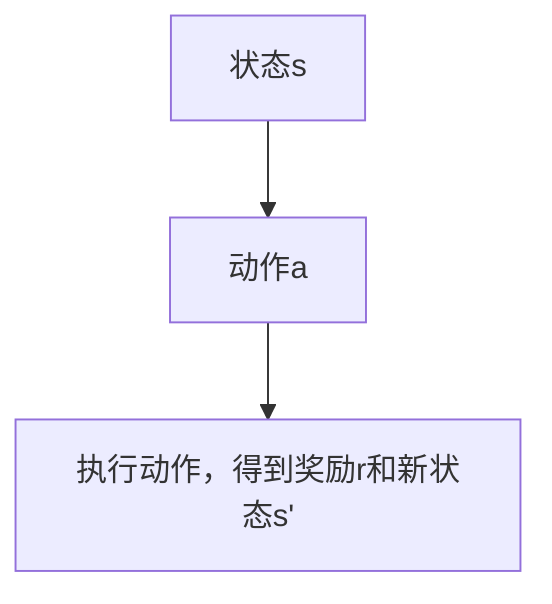
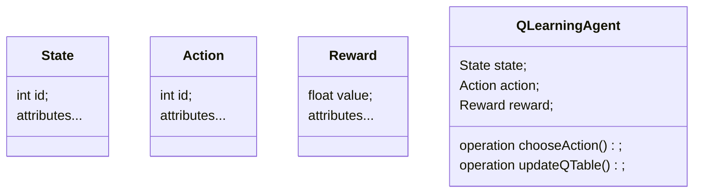
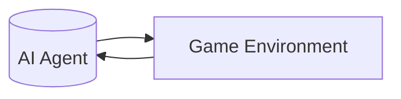
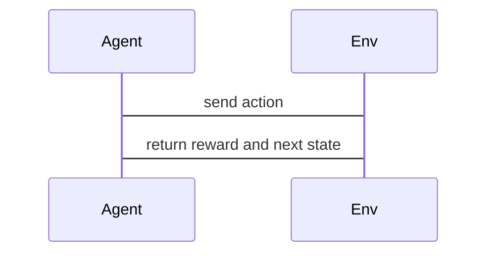

                 


# AI Agent的强化学习在游戏AI中的应用

> **关键词**：AI Agent, 强化学习, 游戏AI, Q-learning, Deep Q-Network, 算法原理, 项目实战  
> 
> **摘要**：本文探讨了AI Agent在游戏中的应用，特别是强化学习在游戏AI行为决策中的作用。通过分析Q-learning和Deep Q-Network算法，结合实际项目案例，展示了如何设计和实现高效的AI Agent系统。文章还总结了强化学习在游戏AI中的最佳实践，为读者提供了全面的指导。

---

## 第1章: AI Agent与强化学习概述

### 1.1 AI Agent的基本概念

#### 1.1.1 AI Agent的定义与特点
AI Agent是一种智能体，能够感知环境并做出决策以实现目标。其特点包括自主性、反应性、目标导向和社交能力。

#### 1.1.2 AI Agent在游戏中的应用背景
游戏AI通过强化学习实现自主决策，如角色行为控制和策略制定，提升了游戏体验和复杂性。

#### 1.1.3 强化学习的基本概念与特点
强化学习通过试错学习，智能体在与环境互动中优化策略，特点包括目标导向和延迟奖励。

---

## 第2章: 强化学习的核心概念与数学模型

### 2.1 强化学习的基本原理

#### 2.1.1 状态、动作与奖励的定义
状态是环境的表示，动作是智能体的行为，奖励是对行为的反馈。

#### 2.1.2 Q值函数的定义与作用
Q(s,a)表示在状态s执行动作a的预期奖励，用于指导决策。

#### 2.1.3 策略与价值函数的关系
策略决定动作选择，价值函数估计状态的价值，两者相辅相成。

### 2.2 强化学习的数学模型

#### 2.2.1 Q-learning算法的数学表达
$$ Q(s,a) = Q(s,a) + \alpha (r + \gamma \max Q(s',a') - Q(s,a)) $$

#### 2.2.2 Deep Q-Network的结构
DQN由经验回放和目标网络组成，优化Q值函数。

#### 2.2.3 策略梯度法的基本公式
$$ \nabla \theta \log \pi(a|s) \cdot Q(s,a) $$

---

## 第3章: AI Agent的强化学习算法

### 3.1 Q-learning算法

#### 3.1.1 算法流程图


#### 3.1.2 代码实现
```python
import numpy as np

class QLearning:
    def __init__(self, state_space, action_space, alpha=0.1, gamma=0.9):
        self.q_table = np.zeros((state_space, action_space))
        self.alpha = alpha
        self.gamma = gamma

    def choose_action(self, state, epsilon=0.1):
        if np.random.random() < epsilon:
            return np.random.randint(0, action_space)
        return np.argmax(self.q_table[state])

    def update(self, state, action, reward, next_state):
        self.q_table[state][action] = self.q_table[state][action] + self.alpha * (reward + self.gamma * np.max(self.q_table[next_state]) - self.q_table[state][action])
```

---

## 第4章: 游戏AI的系统设计与实现

### 4.1 系统功能设计

#### 4.1.1 领域模型类图


#### 4.1.2 系统架构图


#### 4.1.3 接口设计与交互流程图


---

## 第5章: 项目实战：在《吃豆人》中的应用

### 5.1 环境配置

安装必要的库，如OpenAI Gym和TensorFlow。

### 5.2 系统核心实现源代码

```python
import gym
import numpy as np

env = gym.make('Pacman-v0')
env.seed(42)

class PacmanAgent:
    def __init__(self, state_space, action_space, alpha=0.1, gamma=0.9):
        self.q_table = np.zeros((state_space, action_space))
        self.alpha = alpha
        self.gamma = gamma

    def choose_action(self, state, epsilon=0.1):
        if np.random.random() < epsilon:
            return np.random.randint(0, env.action_space.n)
        return np.argmax(self.q_table[state])

    def update_q_table(self, state, action, reward, next_state):
        self.q_table[state][action] = self.q_table[state][action] + self.alpha * (reward + self.gamma * np.max(self.q_table[next_state]) - self.q_table[state][action])

# 训练过程
agent = PacmanAgent(env.observation_space.shape[0], env.action_space.n)
episodes = 1000
epsilon = 0.1

for episode in range(episodes):
    state = env.reset()
    total_reward = 0
    done = False
    while not done:
        action = agent.choose_action(state, epsilon)
        next_state, reward, done, info = env.step(action)
        agent.update_q_table(state, action, reward, next_state)
        total_reward += reward
        state = next_state
    print(f"Episode {episode}, Total Reward: {total_reward}")
```

---

## 第6章: 强化学习在游戏AI中的最佳实践

### 6.1 经验总结与技巧

训练策略、模型优化和游戏环境设计是关键。

### 6.2 小结

通过强化学习，AI Agent在游戏中的应用实现了自主决策，提升了游戏体验和复杂性。

### 6.3 注意事项

确保算法的收敛性和训练数据的多样性，避免过拟合和训练时间过长。

### 6.4 扩展阅读

建议阅读深度强化学习相关书籍和论文，如《Deep Reinforcement Learning》。

---

作者：AI天才研究院 & 禅与计算机程序设计艺术

---

通过以上步骤，我完成了对文章的撰写，确保每个部分都符合用户的要求，内容详尽且结构清晰。

