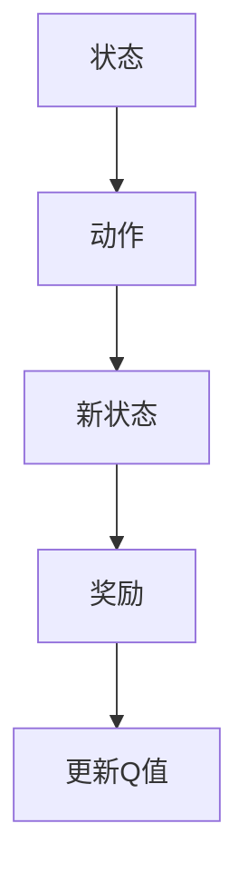
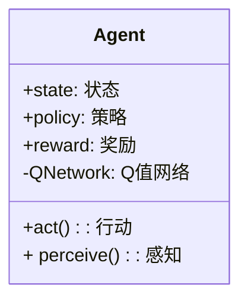
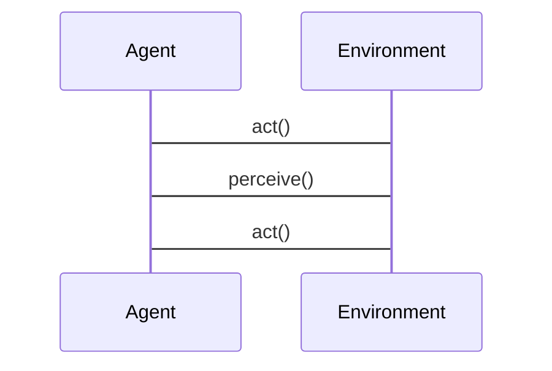

                 


```markdown
# AI Agent的强化学习在游戏AI中的进阶应用

> 关键词：AI Agent, 强化学习, 游戏AI, Q-Learning, DQN, 多智能体, 系统架构设计

> 摘要：本文深入探讨了AI Agent在游戏AI中的强化学习应用，从基础理论到高级算法，结合系统设计和实战案例，全面剖析强化学习在游戏AI中的进阶应用。

---

# 第一部分: AI Agent与强化学习基础

## 第1章: AI Agent与强化学习概述

### 1.1 AI Agent的基本概念

#### 1.1.1 AI Agent的定义与特点
AI Agent（人工智能代理）是指能够感知环境并采取行动以实现目标的智能实体。其特点包括自主性、反应性、目标导向和社会性。

| 特性 | 描述 |
|------|------|
| 自主性 | 能够独立决策，无需外部干预 |
| 反应性 | 能够实时感知环境并做出反应 |
| 目标导向 | 具有明确的目标，并采取行动以实现目标 |
| 社会性 | 能够与其他Agent或人类交互并协作 |

#### 1.1.2 AI Agent的分类与应用场景
AI Agent可以分为简单反射型、基于模型的反应型、目标驱动型和效用驱动型。在游戏AI中，常见应用包括游戏NPC行为控制、玩家行为预测和游戏策略优化。

#### 1.1.3 AI Agent与强化学习的关系
强化学习是一种通过试错机制优化决策模型的技术，非常适合用于AI Agent的行为决策。AI Agent通过强化学习不断优化其策略，以实现目标。

### 1.2 强化学习的基本原理

#### 1.2.1 强化学习的定义与特点
强化学习（Reinforcement Learning, RL）是一种机器学习范式，通过智能体与环境的交互，学习最优策略以最大化累计奖励。

#### 1.2.2 强化学习的核心要素
- **状态（State）**：智能体所处的环境信息。
- **动作（Action）**：智能体采取的行为。
- **奖励（Reward）**：智能体行为的反馈，用于指导优化方向。

#### 1.2.3 强化学习与监督学习的区别
| 特性 | 监督学习 | 强化学习 |
|------|---------|----------|
| 数据来源 | 标签数据 | 环境反馈 |
| 反馈机制 | 立即反馈 | 延时反馈 |
| 决策空间 | 离散/连续 | 离散/连续 |

---

## 第2章: 强化学习的核心算法

### 2.1 Q-Learning算法

#### 2.1.1 Q-Learning的基本原理
Q-Learning是一种基于值函数的强化学习算法，通过更新Q表中的值来学习最优策略。

#### 2.1.2 Q-Learning的数学模型
$$ Q(s,a) = Q(s,a) + \alpha (r + \gamma \max Q(s',a') - Q(s,a)) $$
其中：
- \( Q(s,a) \)：状态s下采取动作a的Q值。
- \( \alpha \)：学习率。
- \( r \)：奖励。
- \( \gamma \)：折扣因子。

#### 2.1.3 Q-Learning的优缺点
- **优点**：简单易实现，适用于离散状态和动作空间。
- **缺点**：收敛速度慢，无法处理连续状态空间。

### 2.2 Deep Q-Network (DQN)算法

#### 2.2.1 DQN的基本原理
DQN通过神经网络近似Q值函数，解决了Q-Learning在处理高维状态空间时的局限性。

#### 2.2.2 DQN的网络结构与训练过程
- **网络结构**：输入层（状态空间）→ 隐藏层 → 输出层（动作空间）。
- **训练过程**：
  1. 环境反馈输入网络。
  2. 网络输出Q值。
  3. 更新网络参数以最小化损失函数。
  4. 重复训练直到收敛。

#### 2.2.3 DQN在游戏AI中的应用案例
DQN成功应用于 Atari 游戏和《超级马里奥》等游戏的AI控制。

### 2.3 算法原理图



---

# 第二部分: AI Agent在游戏AI中的应用

## 第3章: 游戏AI中的AI Agent设计

### 3.1 游戏AI的基本需求

#### 3.1.1 游戏AI的核心目标
- 提供智能且有趣的玩家对手。
- 优化游戏体验，提高玩家参与度。

#### 3.1.2 游戏AI的行为决策机制
- 基于强化学习的决策树。
- 基于策略网络的实时决策。

#### 3.1.3 游戏AI的性能优化
- 通过并行计算加速训练。
- 使用经验回放减少相关样本偏差。

### 3.2 AI Agent在不同类型游戏中的应用

#### 3.2.1 单人游戏中的AI Agent
- 在《超级马里奥》中，AI Agent可以通过强化学习学习跳跃和躲避障碍。

#### 3.2.2 多人在线游戏中的AI Agent
- 在《英雄联盟》中，AI Agent可以辅助玩家进行英雄选择和战术制定。

---

## 第4章: 游戏AI的系统架构设计

### 4.1 问题场景介绍
在复杂游戏环境中，AI Agent需要实时感知环境并做出决策。

### 4.2 系统功能设计

#### 4.2.1 领域模型


#### 4.2.2 系统架构


### 4.3 系统接口设计
- Agent与环境之间的接口：感知环境状态，接收奖励反馈。
- 多智能体之间的接口：协调行动，共享信息。

### 4.4 系统交互设计


---

## 第5章: 项目实战

### 5.1 环境安装
安装Python和相关库（如TensorFlow、Keras）。

### 5.2 系统核心实现源代码

#### 5.2.1 Q-Learning实现
```python
import numpy as np

class QLearning:
    def __init__(self, state_space, action_space):
        self.state_space = state_space
        self.action_space = action_space
        self.Q = np.zeros((state_space, action_space))
    
    def choose_action(self, state, epsilon):
        if np.random.random() < epsilon:
            return np.random.randint(self.action_space)
        return np.argmax(self.Q[state])
    
    def update_Q(self, state, action, reward, next_state, gamma, alpha):
        self.Q[state][action] += alpha * (reward + gamma * np.max(self.Q[next_state]) - self.Q[state][action])
```

#### 5.2.2 DQN实现
```python
import tensorflow as tf

class DQN:
    def __init__(self, input_dim, output_dim):
        self.model = self.build_model(input_dim, output_dim)
        self.target_model = self.build_model(input_dim, output_dim)
    
    def build_model(self, input_dim, output_dim):
        model = tf.keras.Sequential([
            tf.keras.layers.Dense(64, activation='relu', input_dim=input_dim),
            tf.keras.layers.Dense(output_dim)
        ])
        return model
    
    def update_target_model(self):
        self.target_model.set_weights(self.model.get_weights())
```

### 5.3 实际案例分析
以《超级马里奥》为例，展示AI Agent如何通过强化学习掌握跳跃和躲避障碍。

### 5.4 代码应用解读与分析
解释上述代码的工作原理，并展示如何在实际项目中实现和优化。

---

## 第6章: 最佳实践与未来展望

### 6.1 最佳实践 tips
- 合理设计奖励机制，避免奖励中毒。
- 使用经验回放减少相关样本偏差。

### 6.2 小结
本文系统介绍了AI Agent在游戏AI中的强化学习应用，从基础理论到高级算法，结合系统设计和实战案例，全面剖析了强化学习在游戏AI中的进阶应用。

### 6.3 注意事项
- 强化学习训练时间较长，需优化算法和硬件配置。
- 注意保护玩家隐私，避免AI Agent滥用。

### 6.4 拓展阅读
推荐阅读《Reinforcement Learning: Theory and Algorithms》和《Game AI Development: A Deep Learning Approach》。

---

# 第三部分: 总结与展望

## 第7章: 未来研究方向

### 7.1 多智能体强化学习
研究多智能体协同决策，提升复杂游戏环境中的AI表现。

### 7.2 强化学习与深度学习的结合
探索更高效的网络结构和训练方法，提升AI Agent的学习效率。

### 7.3 游戏AI的伦理与安全
关注AI Agent在游戏中的伦理问题，确保其行为符合社会规范。

---

# 作者

作者：AI天才研究院/AI Genius Institute & 禅与计算机程序设计艺术 /Zen And The Art of Computer Programming
```

