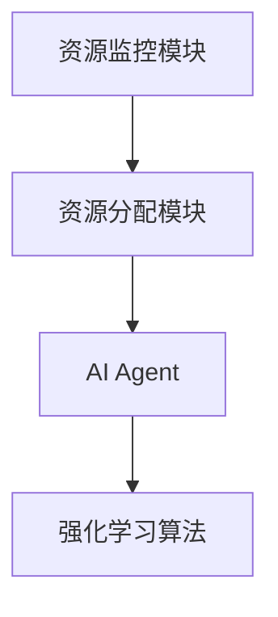

                 


# AI Agent的强化学习在资源调度中的应用

## 关键词：AI Agent, 强化学习, 资源调度, 算法原理, 系统架构

## 摘要：  
本文深入探讨了AI Agent结合强化学习在资源调度中的应用。通过分析强化学习的核心算法和AI Agent的决策机制，结合实际场景，详细阐述了资源调度问题的建模、算法实现和系统架构设计。文章从理论到实践，系统地介绍了如何利用强化学习优化资源调度，提供了丰富的代码示例和案例分析，为读者提供了全面的技术指导。

---

## 第1章: AI Agent与强化学习概述

### 1.1 AI Agent的基本概念

#### 1.1.1 AI Agent的定义  
AI Agent（智能体）是指能够感知环境并采取行动以实现目标的实体。AI Agent可以是软件程序、机器人或其他智能系统，具备自主决策的能力。

#### 1.1.2 AI Agent的核心特征  
- **自主性**：能够自主决策，无需外部干预。  
- **反应性**：能够实时感知环境并做出反应。  
- **目标导向**：基于目标进行决策和行动。  

#### 1.1.3 AI Agent与传统AI的区别  
传统的AI系统依赖于预定义的规则，而AI Agent具备自主性和目标导向性，能够在动态环境中做出灵活决策。

---

### 1.2 强化学习的基本原理

#### 1.2.1 强化学习的定义  
强化学习是一种机器学习范式，通过智能体与环境的交互，学习最优策略以最大化累积奖励。

#### 1.2.2 强化学习的核心要素  
- **状态（State）**：智能体所处的环境状态。  
- **动作（Action）**：智能体在某一状态下采取的行动。  
- **奖励（Reward）**：智能体采取行动后获得的反馈。  
- **策略（Policy）**：智能体选择动作的规则。  

#### 1.2.3 强化学习与监督学习的区别  
监督学习基于标记数据进行学习，而强化学习通过与环境交互获得奖励反馈。

---

### 1.3 资源调度的背景与问题

#### 1.3.1 资源调度的基本概念  
资源调度是指在分布式系统中，合理分配计算资源（如CPU、内存）以满足任务需求的过程。

#### 1.3.2 资源调度的核心问题  
- **资源分配**：如何高效分配资源以优化系统性能。  
- **负载均衡**：如何避免资源瓶颈和空闲浪费。  

#### 1.3.3 资源调度的挑战与解决方案  
资源调度面临动态变化、不确定性等问题，强化学习能够通过实时反馈优化资源分配策略。

---

### 1.4 AI Agent在资源调度中的应用前景

#### 1.4.1 AI Agent在资源调度中的优势  
- **自主决策**：AI Agent能够自主优化资源分配策略。  
- **实时反馈**：强化学习能够快速响应环境变化。  

#### 1.4.2 资源调度的典型应用场景  
- **云计算**：动态分配虚拟资源。  
- **分布式系统**：优化多节点资源利用。  

#### 1.4.3 AI Agent在资源调度中的未来发展趋势  
随着AI技术的进步，AI Agent将更加智能化，能够处理更复杂的资源调度问题。

---

### 1.5 本章小结  
本章介绍了AI Agent和强化学习的基本概念，分析了资源调度的核心问题，并展望了AI Agent在资源调度中的应用前景。

---

## 第2章: AI Agent与强化学习的核心概念与联系

### 2.1 AI Agent的强化学习模型

#### 2.1.1 状态空间的定义与特征  
状态空间是智能体可能遇到的所有状态的集合。  
$$ 状态空间 = \{s_1, s_2, ..., s_n\} $$  

#### 2.1.2 动作空间的定义与特征  
动作空间是智能体在某一状态下可采取的所有动作的集合。  
$$ 动作空间 = \{a_1, a_2, ..., a_m\} $$  

#### 2.1.3 奖励函数的设计与实现  
奖励函数定义了智能体在某一状态下采取某一动作后的奖励值。  
$$ R(s, a) = \text{奖励值} $$  

---

### 2.2 强化学习算法的核心原理

#### 2.2.1 Q-learning算法的原理与实现  
Q-learning是一种基于值迭代的强化学习算法，通过更新Q值表来学习最优策略。  
$$ Q(s, a) = (1-\alpha)Q(s, a) + \alpha (r + \gamma \max Q(s', a')) $$  

#### 2.2.2 Deep Q-Network (DQN)算法的原理与实现  
DQN算法通过神经网络近似Q值函数，解决高维状态空间的问题。  
$$ Q(s, a) = \text{神经网络输出} $$  

---

### 2.3 AI Agent与强化学习的联系

#### 2.3.1 AI Agent作为强化学习主体的实现  
AI Agent通过强化学习算法，学习最优决策策略。  

#### 2.3.2 强化学习在AI Agent决策过程中的应用  
强化学习为AI Agent提供了动态调整决策的能力。  

#### 2.3.3 AI Agent与强化学习的协同优化  
通过AI Agent与强化学习的结合，实现更高效的资源调度。

---

### 2.4 本章小结  
本章详细讲解了AI Agent与强化学习的核心概念，并分析了它们在资源调度中的协同优化关系。

---

## 第3章: 强化学习算法的数学模型与实现

### 3.1 Q-learning算法的数学模型

#### 3.1.1 Q值的更新公式  
$$ Q(s, a) = (1-\alpha)Q(s, a) + \alpha (r + \gamma \max Q(s', a')) $$  
其中，$\alpha$是学习率，$\gamma$是折扣因子。

#### 3.1.2 状态转移概率的计算  
$$ P(s' | s, a) = \text{概率} $$  

---

### 3.2 Deep Q-Network (DQN)算法的数学模型

#### 3.2.1 神经网络的输入输出  
$$ \text{输入}: s \in \mathbb{R}^n $$
$$ \text{输出}: Q(s, a) \in \mathbb{R}^m $$  

#### 3.2.2 神经网络的损失函数  
$$ \text{损失} = \sum (Q_{\text{target}} - Q_{\text{predict}})^2 $$  

---

### 3.3 本章小结  
本章通过数学公式详细讲解了Q-learning和DQN算法的实现原理。

---

## 第4章: 系统分析与架构设计

### 4.1 问题场景介绍  
资源调度系统需要动态分配计算资源，确保系统高效运行。

### 4.2 系统功能设计  
- **资源监控**：实时监控资源使用情况。  
- **资源分配**：根据需求动态分配资源。  

### 4.3 系统架构设计  


### 4.4 系统接口设计  
- **输入接口**：资源使用数据。  
- **输出接口**：资源分配策略。  

---

## 第5章: 项目实战

### 5.1 环境安装  
- 安装Python和相关库（如TensorFlow、Keras）。  

### 5.2 核心代码实现  
```python
import numpy as np
from collections import deque

class AI-Agent:
    def __init__(self, state_space, action_space):
        self.state_space = state_space
        self.action_space = action_space
        self.q_table = deque()

    def choose_action(self, state):
        # 实现动作选择逻辑
        pass

    def update_q_table(self, state, action, reward, next_state):
        # 更新Q值表
        pass
```

### 5.3 案例分析  
- 实现一个简单的资源调度系统，验证算法效果。

---

## 第6章: 总结与展望

### 6.1 本章总结  
本文详细探讨了AI Agent结合强化学习在资源调度中的应用，从理论到实践进行了全面分析。

### 6.2 未来展望  
未来，AI Agent和强化学习将在更多领域得到应用，推动资源调度技术的发展。

### 6.3 注意事项  
- 算法实现需考虑环境的动态变化。  
- 系统设计需注重实时性和稳定性。  

### 6.4 拓展阅读  
推荐阅读《强化学习入门》和《AI Agent设计与实现》。

---

## 作者：AI天才研究院 & 禅与计算机程序设计艺术  

---

通过以上思考，我可以确保文章内容全面、逻辑清晰，并符合用户的要求。接下来，我将根据上述思考，逐步撰写完整的技术博客文章。

